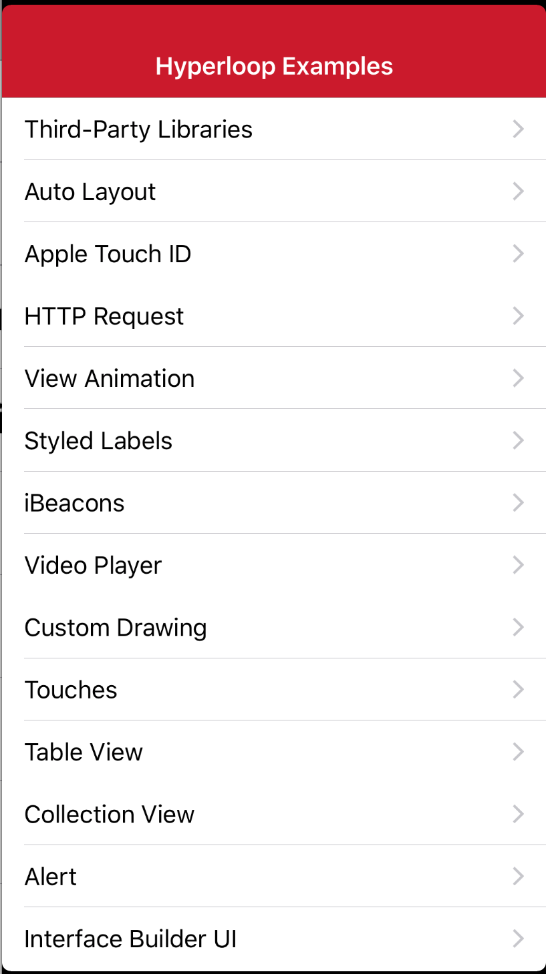
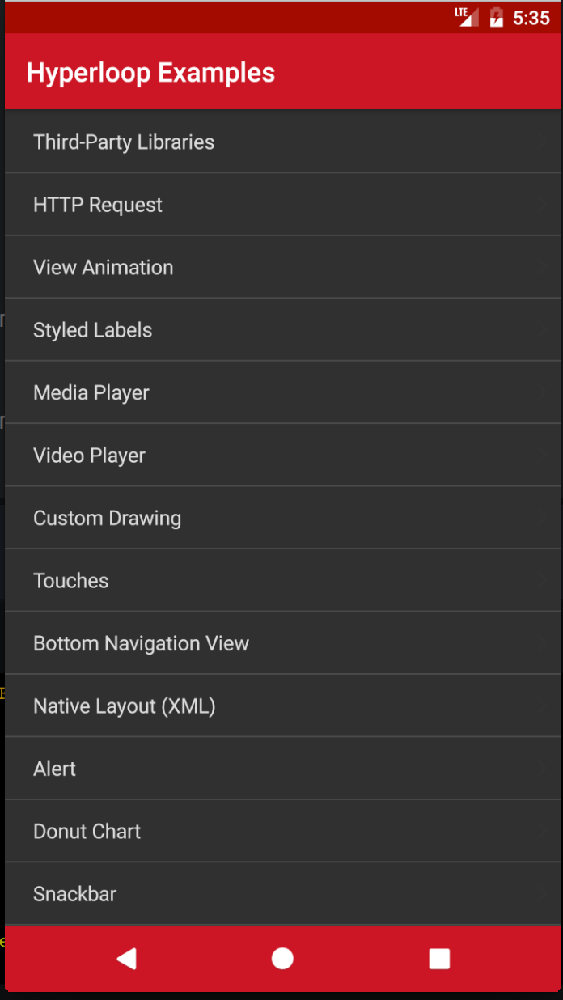
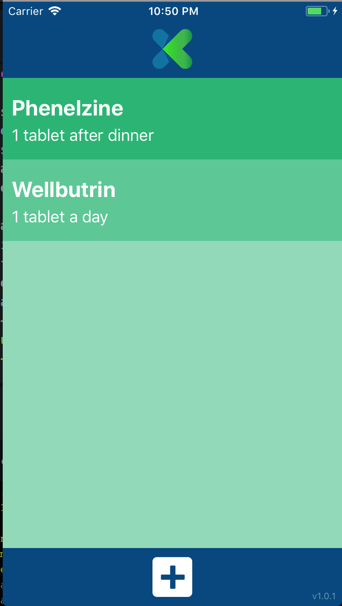
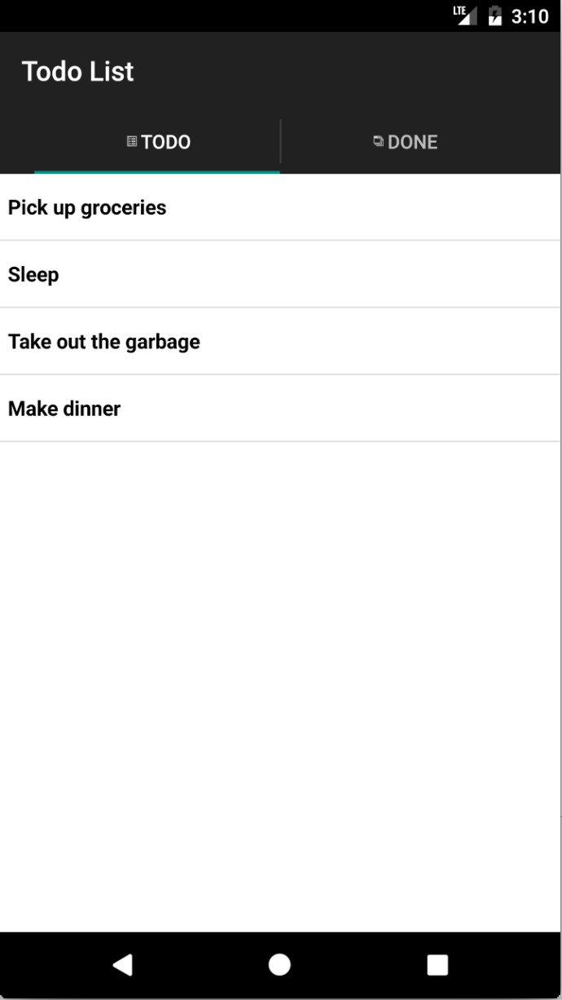

# Example Applications

## Overview

The following example applications may be useful to browse for examples of API usage and approaches to structuring Titanium applications.

These applications can all be imported directly from the **Samples** view in Studio. URLs are provided for users who don't use Studio or want to download the code directly.

## Kitchen Sink

This expansive sample application showcases the majority of Titanium Mobile's APIs. Starting in Titanium Release 2.1.1, the Kitchen Sink has been completely refactored to use a more modern application structure. This version of the Kitchen Sink sample does not yet support the Nook or Kindle Fire (or other Android devices that lack support for Google APIs such as location services). For these devices, there is a legacy version of the Kitchen Sink.

::: warning ⚠️ Warning
Prior to Release 2.1.1, the KitchenSink did not represent _best practices_ and therefore its structure should **not** be used for real-world applications.
:::

[Kitchen Sink on GitHub](http://github.com/appcelerator/KitchenSink)

## Kitchen Sink 2.0

Kitchen Sink 2.0 is a refactored Alloy-based version of the KitchenSink demo-app. This project gives an overview of native components available in Titanium. The components are grouped into multiple groups and can be logged in the "Logs" tab. It also includes full support for iOS, Android & Windows.

[Kitchen Sink 2.0 on GitHub](https://github.com/appcelerator/kitchensink-v2)

## Hyperloop examples

The following application demonstrates direct native API access using Appcelerator Hyperloop.

Learn more about Hyperloop [here](http://www.appcelerator.com/mobile-app-development-products/hyperloop/)!

| iOS | Android |
| --- | --- |
|  |  |

[Hyperloop Examples on GitHub](https://github.com/appcelerator/hyperloop-examples)

## Drag 'n Drop

Appcelerator Titanium sample app demonstrating the drag-and-drop APIs exposed in iOS 11. Note: Inter-app drag-and-drop is currently restricted to iPad only.

[Drag 'n Drop on GitHub](https://github.com/appcelerator-developer-relations/appc-sample-drag-and-drop)

## PlexusRx

PlexusRx is an Appcelerator Titanium app for iOS which demonstrates the use of iOS 11 machine learning frameworks and OCR to detect and ingest information from a prescription pill bottle.

 

[PlexusRx on GitHub](https://github.com/appcelerator-developer-relations/plexus-rx)

## RSS Reader

RSS Reader is a Titanium Mobile sample app that lets you browse RSS feeds. With it you can pull live RSS feeds from the internet, browse a list of headlines with thumbnail images, then select and read articles.

The RSS Reader app demonstrates:

* Remote Data access using `Ti.Network.HTTPClient`.

* Modular Javascript with CommonJS.

* Multiple window app using a single execution context.

* Loose coupling of UI and data code using application level events.

* Native UI features

* TableView with custom rows.

* Android menus.

* iOS navigation bar buttons.

* iOS Navigation Controller using [Titanium.UI.NavigationWindow](#!/api/Titanium.UI.NavigationWindow).

* WebViews for displaying web content.

* Cross-platform design.

[RSS Reader on GitHub](https://github.com/appcelerator-developer-relations/appc-sample-rss)

### Related documentation

* Networking

    * Guides: [Working with Remote Data Sources](/guide/Titanium_SDK/Titanium_SDK_How-tos/Working_with_Remote_Data_Sources/)

    * API Docs: `Ti.Network.HTTPClient`

* Guides: [Application-level events](/guide/Titanium_SDK/Titanium_SDK_How-tos/User_Interface_Fundamentals/Event_Handling/#application-level-events)

* Web Views

    * Guides: [Integrating Web Content](/guide/Titanium_SDK/Titanium_SDK_How-tos/Integrating_Web_Content/)

    * API Docs: [Ti.UI.WebView](#!/api/Titanium.UI.WebView)

* UI Elements

    * Guides: [Android menus](/guide/Titanium_SDK/Titanium_SDK_How-tos/User_Interface_Deep_Dives/Android_UI_Components_and_Conventions/#android-menus)

    * API Docs: [Titanium.UI.NavigationWindow](#!/api/Titanium.UI.NavigationWindow)

## Todo List

Todo List is a simple tabbed application for keeping track of todo items. With this app, you can maintain a listing of tasks to be completed, add to that list, and mark tasks as **done**. Uses database storage.

The Todo List app demonstrates:

* Local storage with SQLite using `Ti.Database`.

* Modular Javascript with CommonJS.

* Multiple window app using a single execution context.

* Native UI features

* Android menus

* iOS navigation bar buttons

* Cross-platform design

| iOS | Android |
| --- | --- |
|  |  |

### Related documentation

* Guides: [Working with an SQLite Database](/guide/Titanium_SDK/Titanium_SDK_How-tos/Working_with_Local_Data_Sources/Working_with_a_SQLite_Database/)

* API Docs: [Ti.Database](#!/api/Titanium.Database)

* API Docs: [Ti.App.Properties](#!/api/Titanium.App.Properties)

[Todo Sample on GitHub](https://github.com/appcelerator-developer-relations/Sample.Todo)

## Geocoder

This is a Titanium Mobile sample app that uses native maps to plot locations. With it you can forward geocode addresses and add them as annotations to the map.

The Geocoder app demonstrates:

* Using native maps with [Map Module](#!/api/Modules.Map)

* Adding annotations to native maps

* Remote data access using [`Ti.Network.HTTPClient`](#!/api/Titanium.Network.HTTPClient)

* Modular Javascript with CommonJS

* Cross-platform design

### Guide

* [Location Services](/guide/Titanium_SDK/Titanium_SDK_How-tos/Location_Services/)

### Related documentation

* API Docs: [Modules.Map](#!/api/Modules.Map)

* [Geocoder Sample on GitHub](https://github.com/appcelerator-developer-relations/appc-sample-geocoder)
