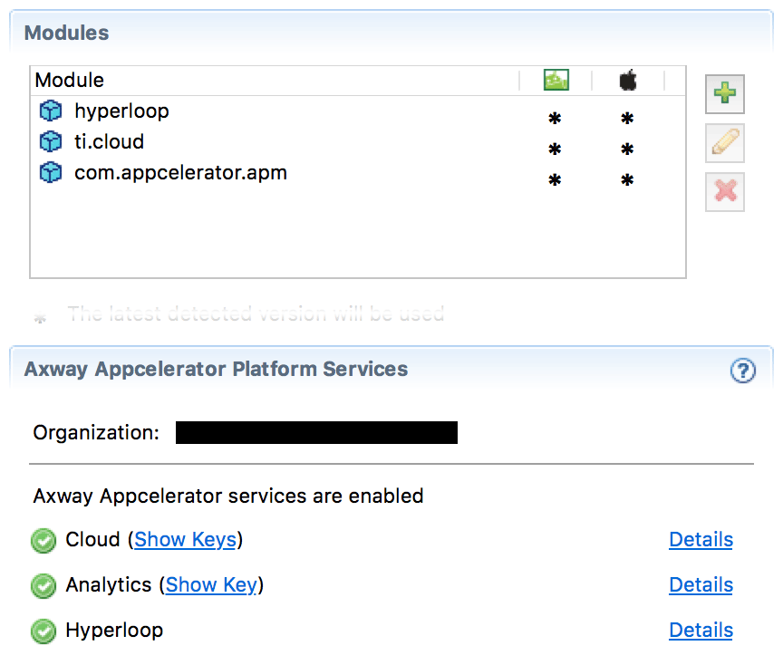

# Enabling Hyperloop

## Introduction

This page lists information on how to use Hyperloop with new and existing projects. Hyperloop works as a native module and is pre-packaged with the SDK 7.0.0 and later.

Each Titanium project that wants to use Hyperloop requires the Hyperloop service to be enabled. By default, Hyperloop is disabled and you can enable it for your projects via the CLI or within Studio.

### Requirements

Refer to [Hyperloop Requirements](/guide/Titanium_SDK/Titanium_SDK_Guide/Hyperloop/Hyperloop_Guides/Hyperloop_Requirements/) for instructions on what and how to install the necessary requirements for Hyperloop.

**Please note:**

* If you attempt to create an app that is called "Hyperloop" (the app-name in the **tiapp.xml**) you may experience failures in the build process, because it is a reserved word. Please use a different project name for this case.

* Hyperloop expects Xcode to be in **/Applications/Xcode.app** to reference system-libraries, so please ensure that Xcode is located at the this location.

## Using Hyperloop on existing projects

If you’d like to use Hyperloop in a new or existing Titanium project, add the following code to your tiapp.xml to configure the module:

```xml
<modules>
  <module>hyperloop</module>
</modules>
```

### On SDKs older than 7.0.0

You need to change some additional values in your `tiapp.xml` file to get Hyperloop working. Note that these changes are unnecessary in SDK 7.0.0 as the defaults will work.

For iOS, you’ll need to ensure that the `<use-jscore-framework>` flag is enabled (This is enabled by default in Titanium SDK 7.0.0 and later, only will only be disabled if explicitly set to false here):

```xml
<ios>
  <use-jscore-framework>true</use-jscore-framework>
</ios>
```

_A_lso ensure to have the "run-on-main-thread" property set in the top-level of your tiapp.xml (It is enabled by default in Titanium SDK 7.0.0 and later, only will only be disabled if explicitly set to false here):

```xml
<property name="run-on-main-thread" type="bool">true</property>
```

## Enabling via CLI

When creating a new project, the CLI will check if you are entitled to use Hyperloop. If you are, the CLI will prompt you with the following message: "Would you like to enable Hyperloop for this app (This may take a while...)". If you enable Hyperloop, it may take some time to retrieve the module and set up your project. Newer SDK versions ship the module and will not need to download it.

**Note:** If you have any issue enabling Hyperloop from the CLI, or, you are not asked if you want to enable Hyperloop, ensure you are logged into the platform with the appropriate subscription, use the `ti login` command to confirm you are logged in.

### Enabling via Studio

### Creating new Hyperloop-enabled project

With Appcelerator Studio open and logged in, follow these steps to create a new Hyperloop-enabled project:

1. Open **New Mobile App** **Project** wizard.

    
2. In the **Enable AMPLIFY Appcelerator Platform Services** section, you will see Hyperloop listed along with Cloud and Analytics (if you are entitled to use it). **Check the Enable AMPLIFY Appcelerator Services** toggle.

3. Click **Finish**.

4. During the project creation, Studio will prompt you with a **confirmation to enable Hyperloop**. The prompt should say something like this: "Would you like to enable Hyperloop for this app (This may take a while...)". Click **Yes** to confirm. You may also see the same confirmation request for Appcelerator Test in which case you can click No and continue on.

To confirm that Hyperloop was set up, you can open the `tiapp.xml` file in the Service section.



After enabling Hyperloop, the following tags should have been added to the `tiapp.xml` file, you can validate them here:

```xml
<modules>
  <module platform="android">hyperloop</module>
  <module platform="iphone">hyperloop</module>
  ...
</modules>
```

### Enabling Hyperloop on non-Hyperloop projects

If Hyperloop was disabled or not available when the project was created, you can enable Hyperloop from the `tiapp.xml` editor service section by clicking on **Enable Services** and selecting **Hyperloop**. Please note that this may also require the other changes mentioned above in **[Using Hyperloop on existing projects](#Usingonexistingprojects)**.

### Getting Started

Make sure to follow the [Hyperloop Guides](/guide/Titanium_SDK/Titanium_SDK_Guide/Hyperloop/Hyperloop_Guides/) section for deep-dives on how to use the native platforms in Titanium.
