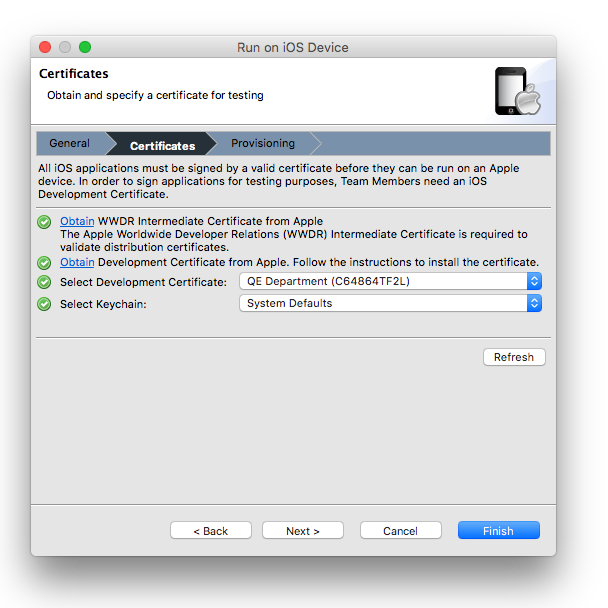
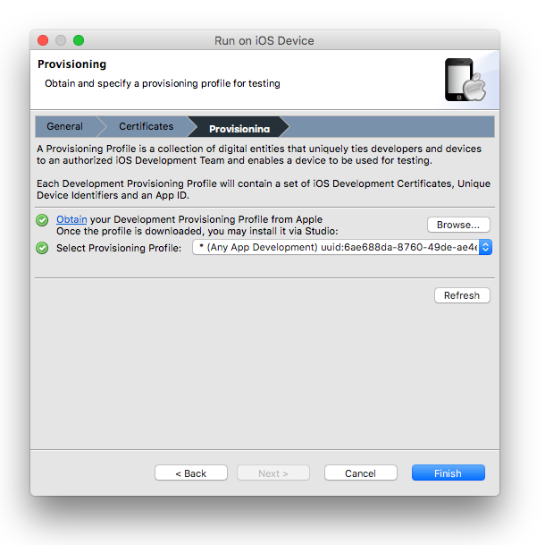

# Deploying to iOS devices

## Objective

In this chapter, you will learn the steps necessary to deploy an app to an iOS device for testing.

## Contents

In order to install your app to an iOS device for testing, you need to complete quite a few steps:

1. Register with Apple's Developer program

2. Obtain a developer's certificate

3. Register your test devices

4. Create an App ID

5. Create and install a development provisioning profile

6. Build your app, embedding the profile within the app's bundle. This step takes care of installing to a locally-connected device as well. We will cover distributing your app to remote testers below as well.

### Apple's Developer program

You can download the iOS SDK and development tools from Apple by simply registering for the program: no payment is required. But once it comes time to install your app onto a device, you need to pay their subscription fees. At the time of this writing, the individual and company plan costs $99/year. Enterprise and University programs are also available. See the [Apple Developer's site](http://developer.apple.com) for more information.

Apple verifies your identity before admitting you to the program. For individuals, the process is relatively simple and conducted online in hours or a few days. Companies are required to submit articles of incorporation or other proof of identity. Approval for companies typically takes a few days to a week, depending on how quickly you provide the required paperwork. Additional requirements are placed on Enterprise customers (you must have a DUNS number) and universities (proof of accreditation is typically required).

### Obtain a development certificate

Once you have been approved by Apple, you can log in to the [Apple Developer Member Center](https://developer.apple.com/membercenter/) and begin the deployment process. The initial user account is designated the Team Agent account. The Team Agent is the person at your organization who oversees development and final distribution of your app. For a one-person company, the Team Agent, developer, and final publisher of the app are all one person. In a corporate or team environment, there will be a single Team Agent and one or more developers.

The Team Agent can invite members to his or her team. Doing so creates developer-specific accounts within your overall account. Such developers can create requests for certificates, which the Team Agent can approve or reject.

A development certificate attests to the identity of the developer building the app. Each developer on your team could have their own certificate, enabling each of them to build a test version of your app. When you publish, the Team Agent will create the final certificate and other requirements.

To create a developer's certificate:

1. Log in to the [Apple Developer Member Center](https://developer.apple.com/membercenter/).

2. Click the link under **Certificates, Identifiers & Profiles**.

3. Click **Certificates**, then click the plus sign (+) button near the top-right corner.

4. Select **iOS App Development**, click the **Worldwide Developer Relations Certificate Authority** link to download the WWDR certificate, then click **Continue****.**

5. Follow the directions to create a Certificate Signing Request (CSR). Click **Continue****.**

6. Upload your CSR and click **Generate**.

7. If you are the Team Agent, you will be returned to the Certificates page with the status listed as Pending. Wait a moment then refresh the page in your browser. You should get a Download link at that point. If you are a developer on the team, the Team Agent will receive notification to approve or reject your request. When he or she approves your request, continue with the steps that follow.

8. Download the development certificate (.cer) file to your computer.

9. Double-click the file to install it to your keychain.

In addition to your developer certificate, you will need to download and install the WWDR Intermediate Certificate, provided by Apple. You can download this file from the iOS Certificates, Identifiers & Profiles page during the first step when you created a certificate. Double-click the resulting file to install it to your keychain.

::: warning ⚠️ Warning
###### Back up your private key

It is critical that you save your private key somewhere safe in the event that you need to develop on multiple computers or decide to reinstall your system OS. Without your private key, you will be unable to sign binaries and test your application on any Apple device. The private key was generated by the Keychain application when you created the Certificate Signing Request (CSR). It has the same name as the **Common Name** field when you generated the CSR.

1. To export your private key, open up the Keychain Access Application and select **login** under Keychains and **Keys** under Category.

2. Highlight the private key associated with your iOS Development Certificate.

3. From the menu bar, select **File** \> **Export Items...**. Save your key in the Personal Information Exchange (`.p12`) file format.

4. You will be prompted to create a password which will be used when you attempt to import this key on another computer.

5. You can now transfer this .p12 file between systems. Double-click on the .p12 file to install it on a system. You will be prompted for the password you entered above.
:::

### Register your test devices

Apple limits you to testing your app on up to 100 devices per year. You must register each of those devices in the iOS Certificates, Identifiers & Profiles page. You cannot remove a device once it's been defined (such as to replace it with someone else's device). So, use care when registering your devices so that you do not run out of permitted devices.

At the time of this writing, you must identify devices by their UDID (Unique Device ID). Apple has announced that the UDID is deprecated as of iOS 5. It is unclear at this time how they will identify devices on the iOS Certificates, Identifiers & Profiles page once that change is widely implemented. For now, you must obtain the UDID using either iTunes or Xcode.

Using iTunes to determine the UDID:

1. Connect the device to your computer.

2. Open iTunes, if it doesn't open automatically.

3. Select the device in the left pane.

4. In the middle pane, click on the Serial Number. This changes to show the Identifier (UDID). Press Command-C to copy the UDID. (You don't need to drag to select first.)

5. You might want to paste that someplace, such as a text file or email message to save it for later.

Using Xcode 6 and later to determine the UDID:

1. Connect the device to your computer.

2. Launch Xcode.

3. Open the **Devices** window. From the menu bar, select **Window** \> **Devices**.

4. Select your device from the left bar.

5. Select the value in the **Identifier** field, right-click and choose **Copy**.

6. You might want to paste that someplace, such as a text file or email message to save it for later.

To register your device:

1. Log in to the [Apple Developer Member Center](https://developer.apple.com/membercenter/) as the Team Admin or Agent.

2. Click the link under **Certificates, Identifiers & Profiles**.

3. Click **Devices**, then click the plus sign (+) button near the top-right corner.

4. Give your device a name (this is for your convenience) and paste in the UDID you copied from iTunes or Xcode.

5. Click **Continue**.

### Create an App ID

An App ID is a unique identifier for your app. It is composed of two parts: the App ID Prefix and the App ID Suffix. The App ID Prefix is a 10-character hexadecimal string generated by the iOS Certificates, Identifiers & Profiles page. It is unique to you and your developer account. The App ID Suffix is a name you enter called the Bundle Identifier.

The Bundle Identifier can be explicit, meaning you enter a name on the iOS Certificates, Identifiers & Profiles page and enter that exact same identifier as the App ID of your application. You can also create a wildcard Bundle Identifier. Wildcard Bundle IDs are great for quick development – you do not have to create a new ID for each and every app you test. However, you cannot use some iOS features with a wildcard ID. You must create an explicit Bundle ID if you plan to use push notifications, iAd, or Game Center features.

To create an App ID:

1. Log in to the [Apple Developer Member Center](https://developer.apple.com/membercenter/) as the Team Agent or Admin.

2. Click the link under **Certificates, Identifiers & Profiles**.

3. Click **Identifiers**, then click the plus sign (+) button near the top-right corner.

4. Enter a description, which cannot include special characters (including most punctuation).

5. Select the services you want to enable for this application. Note that you cannot use a wildcard ID if you enable certain services as previously mentioned.

6. Select the App ID Prefix to use.

7. Select the App ID Suffix. Be sure to use a reverse-domain style:

    1. Choose **Explicit App ID** and enter the App ID in your tiapp.xml file as the Bundle ID (or set your App ID to this Bundle ID). Use this options if you enabled the previously mentioned services.

    2. Choose **Wildcard App ID** to use a single ID to match multiple applications. Enter an asterisk (\*) as the last digit of the Bundle ID.

8. Click **Continue**.

### Create and install a development provisioning profile

You are now ready to create the provisioning profile file, which gathers together your certificates, the list of permitted devices, and the App ID.

1. Log in to the [Apple Developer Member Center](https://developer.apple.com/membercenter/) as the Team Agent or Admin.

2. Click the link under **Certificates, Identifiers & Profiles**.

3. Click **Provisioning Profiles**, then click the plus sign (+) button near the top-right corner.

4. Select **iOS App Development**, then click **Continue**.

5. Select the App ID from the drop-down list, then click **Continue**.

6. Select the development certificates to include, then click **Continue**.

7. Select the devices you want to be able to run the app on, then click **Continue** .

8. Enter a name for your provisioning profile, then click **Generate**.

9. Click **Download** to save your provisioning profile file (.mobileprovision) to your computer, then click **Done**.

10. If you are the Team Agent creating this provisioning profile for a team member, email or distribute it to him or her.

You have two options to install the provisioning profile file onto your development computer. You can drag the file and drop it on the Xcode icon, or you can install it from Studio by following the steps in the following section. Either way, installing the provisioning profile is a one-time operation (on each computer, until it expires).

### Build your app, embedding the profile within the app's bundle

Once you are done with the preceding steps, Studio makes it easy to build and install your app to a locally connected device.


To launch a project in run mode, first select the project in the **Project Explorer** view, then in the global tool bar, select **Run** from the **Launch Mode** drop-down list. In the **Target** drop-down list, select **iOS Device**, then select a device to directly install your application to it. If the **Launch Automatically** option is enabled under the **Target** drop-down list, the application will be automatically launched after the device is selected. If not, you need to click the **Launch** button to start the build process.

If you have not previously installed your app to a local device, you will see the following wizard dialog box. The wizard walks you through the necessary steps to build and install your app.

On the **General** page, ensure the requirements have been satisfied and select the desired SDK version, then click **Next**.


On the **Certificates** page, choose your developer certificate and keychain, then click **Next**.


On the last page, provisioning profiles are specified. To install the provisioning profile, click the **Browse...** button, locate your .mobileprovision file, and click **Open** to install that profile into Xcode. If you have installed more than one provisioning profile, make sure to choose the one that corresponds to your app and your developer certificate. Make sure your device is connected via USB and click **Finish**.



If you get errors, the most likely source of trouble is that you did not select the correct developer certificate or provisioning profile.

The next time you execute the run on iOS device action, you will not see a wizard where you specify the certificate, provisioning profile, and iOS SDK. Instead the build will run with the previous configuration automatically.

If you need to modify your run configuration, you can select **Run Configurations** from the **Run** drop down button.

You can navigate to the iOS Platform preference page to view and modify current iOS platform settings using the **Manage settings** link

 

### Building your app with the CLI

To build your application using the Titanium CLI, run the following command:

```bash
appc run -p ios -T device  -C <DEVICE_UDID> [-V "<DEVELOPER_CERTIFICATE_NAME>"  -P <PROVISIONING_PROFILE_UUID>]
```

If you omit any of the optional parameters, the CLI will prompt you for the information and provide you with available options. You can also retrieve the information from Xcode's Devices and Simulators window or using the following CLI command:

```bash
appc ti info -t ios
```

### Installing apps to remote devices

You have various options for installing apps on remote devices. Of course, you will need to have gathered the UUIDs for each of those devices and used them when creating the provisioning profile. Your options include:

* Email the .mobileprovision and IPA files to the user. He or she can drag & drop those files into iTunes and then sync their device.

* Post those files on a web or FTP site accessible to your testing users. Because the files can be installed only onto devices whose UUIDs you have registered, you don't need to worry about unauthorized people accessing your app.

* Use an "over the air" distribution system, such as TestFlight App, DIAWI, AppSendr, or HockeyKit. The first three are services you can subscribe to. The last is an open-source system that you can install on your own web server.

You upload the .mobileprovision and IPA files to the OTA system. Your registered users receive a notification by email (in some cases, users install a small app published by the OTA provider and receive notifications via that app). They're provided a download link, which installs the app onto their device. When you publish updates, users receive new notifications to download the new version.

Some of these systems enable you to gather user feedback, crash logs, and similar data from testers. There are free modules that help you integrate TestFlight App's data collection routines into your app.

### Adding iTunes artwork

Adding iTunes artwork to your project gives your app a polished look when you are testing or deploying to test users. In order to get your application's icon to appear in iTunes, follow these steps:

1. Create a 512x512px and 1024x1024px (Retina) version of your applications icon in PNG format.

2. Save the PNG file to your application Resources/iphone (Alloy: app/assets/iphone) folder as iTunesArtwork.png and [iTunesArtwork@2x.png](#!/guide/mailto:iTunesArtwork@2x.png)

3. Right-click the file in Studio and choose **rename**. Remove the **.png** extension from the filename, make it simply iTunesArtwork and iTunesArtwork.

4. Do a clean build of your project for device.

Your application icon should now appear in iTunes.

If the _iTunesArtwork_ files are missing from your project, they will be automatically generated from the _DefaultIcon-ios.png_ file in your project's root folder.

### References

* [Apple's Developer Center](http://developer.apple.com)

## Summary

In this chapter, you learned that Apple's policies and procedures are involved but not impossible. You have to work with the iOS Developers program's systems to install apps onto your own device, and those of your testers. Studio automates the steps of the program that it can. The rest you must perform at the iOS Certificates, Identifiers & Profiles page.
