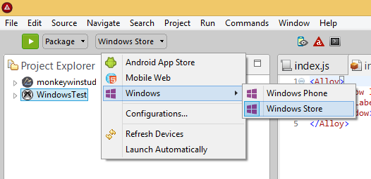
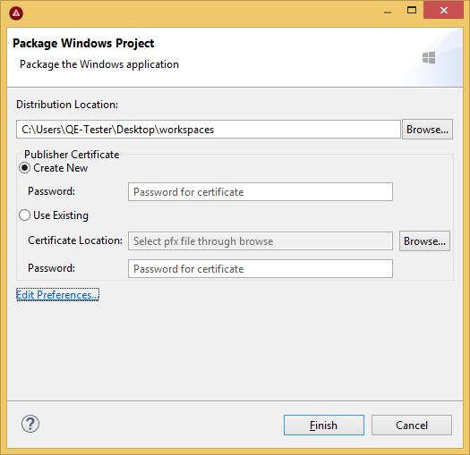

# Distributing Windows Applications

::: danger ❗️ Warning
As of Titanium 9.0.0, building Windows apps is no longer supported.
:::
::: danger ❗️ Warning
Support for Windows 8.1 and Windows Phone SDKs has been deprecated as of SDK 6.3.0.GA and has be removed in SDK 7.0.0.GA.
:::

## Introduction

To distribute an application on the Windows Store (for x86-based applications) and Windows Phone Store (for ARM-based applications), you need to:

1. Create an application in the Windows Dev Center.

2. Update information in your `tiapp.xml` file based on the IDs and fields from the Windows Dev Center.

3. Generate APPX file(s) of your Titanium projects.

4. Start an application submission and upload your APPX file(s) with the submission.

## Create an Application

To submit an application to the Windows Store or Windows Phone Store, you need to create an application project in the Windows Dev Center.

If you have not created an application yet:

1. Log into [https://dev.windows.com](https://dev.windows.com/).

2. Click **Dashboard** in the top-right corner.

3. Click **Create a new app** in the left navigation.

4. Enter a name for your application and click **Reserve app name**.

The Windows Dev Center will create a new application in your dashboard. The process will generate IDs and other fields that will need to be updated in the `tiapp.xml` file.

## Update the tiapp.xml File

Titanium uses the settings in the `tiapp.xml` file to package your project. Some of these settings must match the settings generated by the Windows Dev Center. Specifically, the `<name/>`, `<id/>,``<publisher/>` and the `ti.windows.publishername` app property elements.

1. Open the project's `tiapp.xml` file.

2. Locate the `<name>` element. The node text of the element must match the name of the application in the Windows Dev Center.

3. Locate the `<publisher>` element. The node text of the element must match the _Publisher display name_ of your Microsoft Developer account.

4. Locate the `<property name="ti.windows.publishername">` element. If you do not have the element in your `tiapp.xml` file, add it. The node text for the element must match the _Windows publisher ID_ of your Microsoft Developer account (or the Package/Identity/Publisher of the application) .

5. Add the `<id>` element to the `<windows>` element. The node text of the element must match the `Package/Identity/Name` of the application, which was generated when you created the application in the Windows Dev Center Dashboard.

::: warning ⚠️ Prior to Release 5.1.0
Prior to Release 5.1.0, set the `Package/Identity/Name` of the application to the `<id>` element under the `<ti:app>` element rather than the `<windows>` element.
:::

**To retrieve your Windows publisher ID and Publisher display name:**

1. Log into [https://dev.windows.com](https://dev.windows.com/).

2. Click **Dashboard** in the top-right corner.

3. Click **Account settings** in the left navigation.

The publisher ID will be under the **Account details** section as the **Windows publisher ID** field, and the publisher display name will be under the **Contact info** section as the **Publisher display name** field.

**To retrieve the `Package/Identity/Name` and `Package/Identity/Publisher` fields:**

1. Log into [https://dev.windows.com](https://dev.windows.com/).

2. Click **Dashboard** in the top-right corner.

3. Click the application project in the left navigation.

4. Expand **App management** and click **App identity**.

**tiapp.xml**

```xml
<ti:app>
  <name>FooApp</name>
  <!-- Prior to Release 5.1.0, set the Package/Identity/Name of the application to the top-level id element -->
  <!-- <id>12345FooInc.FooApp</id> -->
  <publisher>FooInc</publisher>
  <property name="ti.windows.publishername">CN=11111111-2222-3333-4444-555555555555</property>
  <windows>
    <!-- Since Release 5.1.0, set the Package/Identity/Name of the application to the windows id element -->
    <id>12345FooInc.FooApp</id>
  </windows>
</ti:app>
```

## Package for Windows Phone Store

Before creating an APPX file for the Windows Phone Store, you need to set your publisher ID in either the CLI or Studio.

### Set the Publisher ID

### Package for Windows Phone Store with Studio

To package with Studio:

1. Select the project in the **Project Explorer** view.

2. In the global tool bar, select **Package** from the **Launch Mode** drop-down list.

3. Select **Windows > Windows Phone** from the **Target** drop-down list.

4. If the **Launch Automatically** option is enabled under the **Target** drop-down list, the application will be automatically launched after the device is selected. If not, you need to click the **Launch** button to start the build process.

Studio will prompt you to enter a location to copy the generated APPX file to.


### Package for Windows Phone Store with the CLI

To package an APPX file for the Windows Phone Store, run:

```bash
appc run -p windows -T dist-phonestore -O <OUTPUT_DIRECTORY>
```

## Package for Windows Store

Before creating an APPX file for Windows Store, you need to create a signing certificate in PFX format. The CLI will prompt you to create one if you do not specify one in the command options. Studio will prompt you to either create or select a PFX file.

### Package for Windows Store with Studio

To package with Studio:

1. Select the project in the **Project Explorer** view.

2. In the global tool bar, select **Package** from the **Launch Mode** drop-down list.

3. Select **Windows > Windows Store** from the **Target** drop-down list.

4. If the **Launch Automatically** option is enabled under the **Target** drop-down list, the build process will automatically start. If not, you need to click the **Launch** button to start the build process.



Studio will prompt you to enter a location to copy the generated APPX file to and to either create or specify a PFX file for signing the package.

To create a new certificate, select **Create New** and enter a password for the certificate. During the certificate creation process, the Certificate Import wizard will be launched. You will be prompted to enter the same password in subsequent dialogs. Click **OK** or **Next** when prompted.

To specify a certificate to use, select **Use Existing**, enter the location of the certificate and enter the password used to create the certificate.



### Package for Windows Store with the CLI

If you need to generate a certificate, run the following CLI command:

```bash
C:\Users\JoeUser\Documents\Appcelerator_Studio_Workspace\WindowsApp> appc run -p windows -T dist-winstore -O dist
Appcelerator Command-Line Interface, version 4.1.0
Copyright (c) 2014-2015, Appcelerator, Inc.  All Rights Reserved.
Where is the pfx file used to sign the app? (leave blank to generate):
What is (or will be) your PFX password?: ****
```

The CLI will launch the Windows certificate tools in the background and prompt you to create a password for the certificate.

You will be prompted to enter the same password in subsequent dialogs and to generate some files. Click **OK** or **Next** when prompted. The CLI will generate three files in the project directory:

* `generated.cer`: public certificate

* `generated.pfx:`PFX file for signing the package

* `generated.pkv`: private key

After the certificate is generated, the CLI will automatically create and sign the APPX file.

To package an APPX file for the Windows Store after you have generated the certificate, run:

```bash
appc run -p windows -T dist-winstore -R <PFX_CERTIFICATE_FILE> -P <PFX_PASSWORD> -O <OUTPUT_DIRECTORY>
```

## Submit an Application

Once you have created your APPX file(s), start the application submission process.

In the Windows Dev Center Dashboard:

1. Click your application.

2. Click **Submission** in the left navigation.

3. Click **Start your Submission**.

Complete the following fields in each category, then click **Submit to the Store** to start the certification process.

For more information about the submission and certification process, see [Windows Dev Center: App submissions](https://msdn.microsoft.com/en-us/library/windows/apps/hh694062.aspx).

### Pricing and availability

The only required field is to select the price of your application.

You may optionally select or change the default values for which countries your application are available in, the application visibility in the store and when the application can be available in the store.

### App properties

You are required to select a category and subcategory.

You may optionally select or change the defaults for the age range, game ratings, hardware requirements and app declaration.

### Packages

Upload your APPX file(s). The APPX file(s) will be validated. If you receive any validation errors, you may need to update the settings in your `tiapp.xml` file.

For Windows Store app, you have the option of setting minimum system requirements

### Description

You are required to enter a description and upload one screenshot of your application. All other fields are optional.

The following table describes the image assets you may upload with your application. Only the screenshots are required for application submission.

| Type | Dimensions (pixels) | File Type | File Size | Notes |
| --- | --- | --- | --- | --- |
| Desktop screenshot | * 1366 x 768 or larger<br />    <br />* 768 x 1366 or larger | PNG | < 2MB | May submit up to 9 |
| Mobile screenshot | * 768 x 1280<br />    <br />* 720 x 1280<br />    <br />* 480 x 800<br />    <br />* 1280 x 768<br />    <br />* 1280 x 720<br />    <br />* 800 x 480 | PNG | < 2 MB | May submit up to 8 |
| App tile icon | 300 x 300 | PNG |  | For Windows Phone and earlier |
| Promotional artwork | * 358 x 173 (wide icon)<br />    <br />* 358 x 358 (square icon)<br />    <br />* 1000 x 800 (background image)<br />    <br />* 414 x 180<br />    <br />* 414 x 468<br />    <br />* 558 x 558<br />    <br />* 558 x 756<br />    <br />* 846 x 468<br />    <br />* 2400 x 1200 (recommended) |  |  | Used to showcase your application in the store.<br /><br />May submit only one image per file size.<br /><br />It is highly recommended to submit a 2400 x 1200 image, which the Microsoft team will resize and crop for promotional layouts. |

For more information about screenshot and app icons, see also [App screenshots, images, and trailers](https://docs.microsoft.com/en-us/windows/uwp/publish/app-screenshots-and-images).

Notes for certification

This category is optional.
