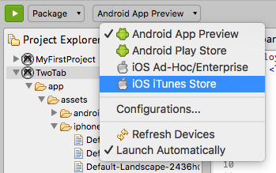
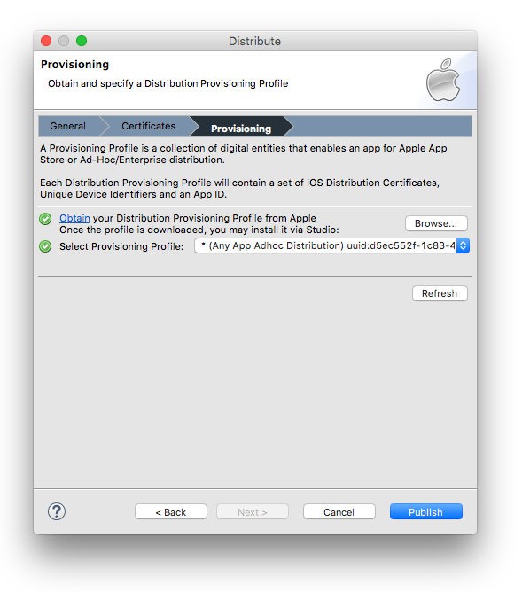

# Distributing iOS apps

## Introduction

In this section, you will learn how to distribute your iOS application. Apple provides three ways to distribute your application based on which developer program you are a member of:

* **App Store or iTunes Store**: Publish your application to the iTunes Store.

* **In House**: Publish your application in house for your company's employees. Members of the Apple Developer Enterprise program see this option instead of the App Store option.

* **Ad Hoc**: Publish your application as a package that can be distributed on a limited number of devices for testing.

Both work flows are similar except ad hoc distribution requires you to specify a list of devices when creating your provisioning profile and you need to specify two extra options (file format and location) when packaging your application with Studio.

## Contents

Publishing your iOS application involves a few, somewhat involved steps. Fortunately, you have done two of these steps already if you have deployed your app to a device for testing. The steps are:

1. Register with the iOS Developer Center

2. Create an App ID in the iOS Certificates, Identifiers & Profiles page

3. Create and install the distribution certificate

4. Create and install a distribution provisioning profile

5. Build your app, embedding the distribution provisioning profile

6. Upload the app to iTunes Connect and kick-off the Apple review process **OR** distribute your application package.

### Registering and creating the App ID

By now, you should have registered for the [iOS developer program](http://developer.apple.com). And you should have tested your app on a device, which means you've created an App ID on the iOS Certificates, Identifiers & Profiles page. If you plan to sell your app, rather than distribute it for free, you need to register on the iTunes Connect site and supply legal and banking information to Apple. They must verify your legal status and banking info. That process can take as much as a week or more.

An App ID is a unique identifier for your app. It is composed of two parts: the App ID Prefix and the App ID Suffix. The App ID Prefix is a 10-character hexadecimal string generated by the iOS Certificates, Identifiers & Profiles page. It is unique to you and your developer account. The App ID Suffix is a name you enter called the Bundle Identifier.

The Bundle Identifier can be explicit, meaning you enter a name on the iOS Certificates, Identifiers & Profiles page and enter that exact same identifier as the App ID of your application. You can also create a wildcard Bundle Identifier. Wildcard Bundle IDs are great for quick development – you do not have to create a new ID for each and every app you test. However, you cannot use some iOS features with a wildcard ID. You must create an explicit Bundle ID if you plan to use push notifications, iAd, or Game Center features.

See [Deploying to iOS devies: Create an App ID](/guide/Titanium_SDK/Titanium_SDK_Guide/Preparing_for_Distribution/Deploying_to_iOS_devices/#create-an-app-id) for step-by-step instructions on creating an App ID.

### Create and install the distribution certificate

The distribution certificate attests to the identity of the entity publishing the app. According to Apple: "Only Team Agents are authorized to prepare and submit applications for distribution." The Team Agent is the person at your organization who oversees development and final distribution of your app. While each developer on your team could have their own developer certificate, you or your company will have a single distribution certificate. This arrangement enables you to add or remove people from your development team, while not giving those folks the means to publish your final app. That will be controlled by you.

The Team Agent will be the user account associated with creation and first-logon to your provisioning portal account.

To create a distribution certificate:

1. Log in to the [Apple Developer Member Center](https://developer.apple.com/membercenter/) as the Team Agent or Admin.

2. Click the link under **Certificates, Identifiers & Profiles**.

3. Click **Certificates**, then click the plus sign (+) button near the top-right corner.

4. Select **App Store and Ad Hoc**, then click **Continue****.**

5. Follow the directions to create a Certificate Signing Request (CSR). Click **Continue****.**

6. Upload your CSR and click **Generate**.

7. You will be returned to the Certificates page with the status listed as Pending. Wait a moment then refresh the page in your browser.

8. Even though you are logged in as the Team Agent or Admin, you will need to approve your certificate. Click **Approve**.

9. Download the distribution certificate (.cer) file to your computer.

10. Double-click the file to install it into your keychain.

::: warning ⚠️ Warning
###### Back Up Your Private Key

It is critical that you save your private key somewhere safe in the event that you need to develop on multiple computers or decide to reinstall your system OS. Without your private key, you will be unable to sign binaries and test your application on any Apple device. The private key was generated by the Keychain application when you created the Certificate Signing Request (CSR). It has the same name as the **Common Name** field when you generated the CSR.

1. To export your private key, open up the Keychain Access Application and select **login** under Keychains and **Keys** under Category.

2. Highlight the private key associated with your iOS Distribution Certificate.

3. From the menu bar, select **File >** **Export Items...**. Save your key in the Personal Information Exchange (.p12) file format.

4. You will be prompted to create a password which will be used when you attempt to import this key on another computer.

5. You can now transfer this .p12 file between systems. Double-click on the .p12 file to install it on a system. You will be prompted for the password you entered above.
:::

### Create and install the distribution provisioning profile

As with deploying an app for testing, you need to create a provisioning profile file. The distribution provisioning profile gathers together your distribution certificate and App ID. If this is an Ad Hoc provision profile, you also need to specify your devices.

1. Log in to the [Apple Developer Member Center](https://developer.apple.com/membercenter/) as the Team Agent or Admin.

2. Click the link under **Certificates, Identifiers & Profiles**.

3. Click **Provisioning Profiles**, then click the plus sign (+) button near the top-right corner.

4. Select either **App Store** to distribute to the App Store, **In House** to distribute in house to your company's employees or **Ad Hoc** to distribute to a limited number of devices, then click **Continue**.

5. Select the App ID from the drop-down list, then click **Continue** .

6. Select the distribution certificate(s) to include, then click **Continue**.

7. **For ad hoc distributions** , select the devices you want to be able to run the app on, then click **Continue** .

8. Enter a name for your provisioning profile. You should use a word like "distribution" or "ad hoc" in the name so that it is clear later that this profile is for final distribution or ad hoc distribution, respectively. Click **Generate**.

9. Click **Download** to save your provisioning profile file (.mobileprovision) to your computer, then click **Done**.

You have two options to install the provisioning profile file onto your development computer. You can drag the file and drop it on the Xcode icon, or you can install it from Studio by following the steps in the following section. Either way, installing the provisioning profile is a one-time operation (on each computer, until it expires).

### Build your app, embedding the profile within the app's bundle

::: warning ⚠️ Warning
If you are using Mac OS X 10.9 (Mavericks), make sure you grant Studio access to the computer as described in [Installing the iOS SDK: Running on Mavericks](/guide/Titanium_SDK/Titanium_SDK_Getting_Started/Installation_and_Configuration/Installing_Platform_SDKs/Installing_the_iOS_SDK/#note-for-mavericks-and-later).
:::

Once you are done with the preceding steps, use Studio to build your app for final distribution. To package your application for distribution, first select the project in the **Project Explorer** view, then in the global tool bar, select **Package** from the **Launch Mode** drop-down list. From the **Target** drop-down list, choose **iOS iTunes Store** to distribute to the App Store or **iOS** **Ad Hoc/Enterprise** to distribute to a limited number of devices (ad hoc) or for in-house distribution. If the **Launch Automatically** option is enabled under the **Target** drop-down list, the application will be automatically launched after the target is selected. If not, you need to click the **Launch** button to start the build process.

If you have not previously distributed your app using Studio, you will see the following wizard dialog box. The wizard walks you through the necessary steps to build and distribute your app.

On the **General** page, ensure the requirements have been satisfied and select the desired SDK version. **For ad hoc and in-house distribution,** specify the package format as **ipa** and a path to copy the package to. Click **Next**.

On the **Certificates** page, select your distribution certificate and keychain. Click **Next** to proceed.

Provisioning profiles are specified on the last page. To install the provisioning profile, click the **Browse...** button, locate your .mobileprovision file, and click **Open** to install that profile into Xcode. If you have installed more than one provisioning profile, make sure to choose the one that corresponds to your app and your distribution certificate. Select a Provisioning Profile and click **Finish**.

Studio packages your iOS application. For App Store distributions, the final signed IPA file is installed into the **Archives** tab of the Xcode Organizer and should be automatically lauched after building the package. For Ad Hoc distributions, the file is copied to the specified path.

If you get errors, most likely source of trouble is that the app ID you entered in the tiapp.xml file doesn't match your distribution certificate and your provisioning file. Check each carefully to be sure that you're selecting the right requirements.

The next time you execute the Distribute action, you will see a more simplified wizard where you specify the certificate, provisioning profile, and iOS SDK. You can navigate to the iOS Platform preference page to view and modify current iOS platform settings using the **Manage settings** link

 

### Distribute and install your ad hoc application

For Ad Hoc builds, you need to give the provision profile (.mobileprovision) and package to your testers to install it to their device. Their device needs to be included in the provisioning profile for them to use it.

1. Launch Xcode.

2. Click on the device you will install the app on.

3. Under the **Installed Apps** section, click the **+** button.

4. Select your app's IPA file and click **Open**.

Your app will be installed on your device. See [Deploying to iOS devices: Installing apps to remote devices](/guide/Titanium_SDK/Titanium_SDK_Guide/Preparing_for_Distribution/Deploying_to_iOS_devices/#installing-apps-to-remote-devices) for additional methods of distributing the provision profile and package.

### Creating the App ID on iTunes Connect

The iTunes Connect site is your app distribution management portal for App Store builds. You can get to iTunes Connect from the Apple Developer Member Center site. If you have not done so yet, make sure to set up your iTunes Connect profile and supply the legal and banking information required by Apple. They verify all the documents you supply, a process that can take more than a week in some cases. You will not be able to publish your app until that process is complete.

From the iTunes Connect site, click **Manage Your Apps** then click **Add New App**. You need to supply:

* Your app's name (by which it will be listed in the App Store).

* A SKU number, which is a unique ID for your app. You can use letters, numbers, hyphens, periods, and underscores. The SKU cannot start with a hyphen, period, or underscore.

* Select the Bundle ID, which you created in the iOS Certificates, Identifiers & Profiles page.

* If the Bundle ID is a Wildcard Bundle Identifier, you need to enter a Bundle ID Suffix, which you entered in the `tiapp.xml`file as the name portion of the app ID.

Through a series of pages, you then define the following information about your app:

* The date on which it should be available (defaults to the current date).

* The price tier. You do not set a specific price, but instead set a tier. Each tier specifies a selling price in a selection of countries around the world. Optionally, you select specific locales in which your app will be sold.

* App metadata:

    * Version Number

    * Description (4000 characters max.)

    * Primary Category

    * Keywords (100 characters max.)

    * Copyright

    * Contact Email Address

    * Support URL

* Rating info – you must specify the frequency of certain app characteristics by which Apple judges the age-appropriateness of your app

* One (1) high resolution app icon: A large version of your app icon that will be used on the App Store. It must be at least 72 DPI, in the RGB color space, and 1024 x 1024 pixels (it cannot be scaled up). The file type must be .jpeg, .jpg, .tif, .tiff, or .png. It must be flat artwork without rounded corners.

* One (1) screenshot of your app:

    * Screenshots for 3.5-inch iPhone and iPod touch Retina display must be 960x640, 960x600, 640x960 or 640x920 pixels, at least 72 DPI, in the RGB color space, and in the JPG or PNG format.

    * Screenshots for 4-inch iPhone 5 and iPod touch (5th generation) Retina display must be 1136x640, 1136x600, 640x1136 or 640x1096 pixels, at least 72 DPI, in the RGB color space, and in the JPG or PNG format.

    * iPad Screenshots must be .jpeg, .jpg, .tif, .tiff, or .png file that is 1024x768, 1024x748, 768x1024, 768x1004, 2048x1536, 2048x1496, 1536x2048 or 1536x2008 pixels, at least 72 DPI, and in the RGB color space.

As a final step, make sure to click the **Ready to Upload Binary** button. You should see the status of your app change to Waiting for Upload.

### Uploading your app to iTunes Connect

If you built your app with Studio, it should be stored in the **Archives** tab of the Xcode Organizer. Open that window now and select your app. Click **Verify**. You will be prompted for your iTunes Connect user name and password. At this point, Xcode will check for an app definition on iTunes Connect and make sure it matches the app you have created. Both sides of that app need matching names, bundle IDs, and so forth.

Assuming you have passed the verification step, click the **Submit** button. Again, you will be prompted for your iTunes Connect credentials (unless you specified to save them). Xcode makes sure your iTunes Connect app is in the Waiting for Upload state and if so, it will upload your app. This switches your app to the Waiting for Review state. This is the point where your app is submitted to Apple for their review and final approval.

### App Store requirements

Apple publishes many guidelines that describe what they look for when deciding to approve an app. We encourage you to [read their guidelines](http://developer.apple.com/appstore/resources/approval/guidelines.html) carefully. A few of the requirements include:

* Apps must be useful, well-designed, and run without errors

* Apps cannot download and execute code

* You must own all copyrights and trademarks used within the app and its promotional resources

* Apps cannot contain hidden features or use non-public APIs

### References

* [iTune Connect Developer Guide](http://developer.apple.com/library/mac/#documentation/LanguagesUtilities/Conceptual/iTunesConnect_Guide/)

* [iOS Simulator Cropper](http://www.curioustimes.de/iphonesimulatorcropper/), an optional, though helpful tool for capturing iOS simulator screenshots

* [Unretiner](http://itunes.apple.com/us/app/unretiner/id411277085?mt=12), a tool for automatically creating non-retina images from retina-resolution (@2x) files.

## Summary

In this section, you learned how to publish your iOS app. You learned how to generate distribution certificate and provisioning required to sign your app. You saw how to build and sign your distribution-ready IPA file. You learned how to create an app ID on iTunes Connect and upload your app for Apple's review. And finally, you examined the App Store and Apple's requirements for acceptance.
