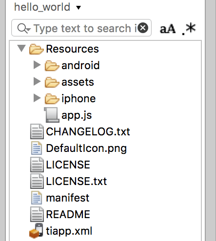

# Hello World

## Objective

In this document, we will take a focused look at creating mobile app using Studio and Titanium SDK.

Before we can build our first app, we need to create a mobile project in Studio. During this process, we'll discuss the following critical aspects of mobile projects:

* The meta-information necessary for project creation

* The default project structure

* Launching projects in the simulator/emulator

## Creating a New Mobile Project

You can create a new project in Studio one fo two ways:

* From the menu, select **File** \> **New** \> **Mobile App Project**

* Project Explorer, right-click in a open area and select **New** \> **Mobile App Project**

The **New Mobile Project** wizard appears. The first step is to select a project template (in the **Project Template** window). You can choose between:

* **Alloy** - create a project utilizing the Titanium MVC framework called Alloy

* **Classic** - create a classic Titanium project with no defined framework

In the **Project Location** window, you'll need to fill in the following fields:

* **Project name**: Your app's name as seen by users.

* **App Id**: Titanium SDK's version of the Android Application Package Name or CF Bundle Identifier. [See below](#app-id-naming-guidelines) for guidelines and rules for App ID names.

* **Company/Personal URL**: URL of any website you wish to associate with the app.

* **Titanium SDK Version**: select the Titanium SDK to use for your project.

* **Deployment Targets**: you can create a single project to target.

* **Enable Axway Appcelerator Platform Services**: Toggle to enable or disable app features such as [Cloud](/guide/AMPLIFY_Appcelerator_Services/), [Analytics](/guide/AMPLIFY_Appcelerator_Services/AMPLIFY_Appcelerator_Services_Guide/AMPLIFY_Appcelerator_Analytics/), and [Hyperloop](/guide/Titanium_SDK/Titanium_SDK_Guide/Hyperloop/).

Once filling in these fields, Studio will create a default project structure for you based on the given meta-information.

* **Resources** folder: your project's code files and graphics are stored in this folder

* **app.js**: your project's bootstrap file. Every project has one; it's the file loaded first when your app is launched

* **tiapp.xml**: The details you enter in the new project wizard are used to populate the `tiapp.xml` file and the manifest file.

Those are basically the only required files, but you can augment the project with others. For example, you don't have to put all of your code into `app.js`. You could put all your graphics in the `Resources/assets/images` folder, or you could put them into subfolders. We'll dig more deeply into cross-platform development later, but the `android` and `iphone` directories within Resources are locations for your platform-specific assets.

### App ID Naming Guidelines

An App ID must be unique across all apps installed on a device. For published apps, the name must be unique across the entire App Store/Market. Therefore, we recommend you use the Java Package Name style when assigning your App ID. Following this format, you enter a name in reverse domain name format with your app's name at the end (i.e., com.yourdomain.yourappname). While technically valid, a one-word App ID (such as "testapp") will cause build errors.

Some additional points:

* You cannot include spaces or special characters in your App ID.

* Use all lowercase, as uppercase or mixed case could cause errors on Android.

* You cannot use any Java keywords in the App ID – words like 'case' or 'package' will cause an error that will prevent Titanium from building your app.

* You cannot change the App ID once you publish an app because the App Store/Market would consider the change to mean you're publishing a new app, not an upgrade.

* The App ID is related to the Bundle Identifier you define in the iOS Provisioning Portal or iTunes Connect, see [Distributing iOS apps](/guide/Titanium_SDK/Titanium_SDK_Guide/Preparing_for_Distribution/Distributing_iOS_apps/) for more info.

(On Android, the App ID is technically an Application Package Name, not a Java Package Name. See [http://blog.javia.org/android-package-name/](http://blog.javia.org/android-package-name/) for further info on the distinction.)

## Running Your App

To build and run your app, select an iOS simulator or Android emulator of your choice and click the green Run button.

## Simulator/Emulator

It's more than simple semantics, but with iOS the desktop software that runs your app is called a simulator; on Android, it's an emulator. Whether writing a native Objective-C app or a Mobile app, your iPhone/iPad code is cross-compiled and turned into an OS X executable. It's then run by OS X, simulating the environment within an iOS device. With Android, the emulator provides a virtual hardware environment that runs the actual Android operating system, platform components, and your app's code.

With both platforms, the test environment isn't a perfect representation of the actual mobile device. Some subtle (and not-so-subtle) differences will present themselves. You should always test your app on a physical device before publishing it.

We'll try to be generic in this guide by saying simulator/emulator when referring to the virtual software device thingie. But, forgive us if we say simulator or emulator alone.

## Under the Covers

Let's take a high-level look at how your source code is turned into a native app. Titanium's tools include a pre-compiler, front-end compiler, and a set of Node.js build scripts that interact with the native SDK tools.

To start, Titanium precompiles your JavaScript to minify it. Titanium's pre-compiler statically analyzes your code and builds a dependency hierarchy of all the Titanium APIs used by your application. The front-end compiler's job is to create native stub files. These stubs include appropriate platform-specific native code, a native project file (if necessary), and any specific code that is necessary to compile Titanium code for a given platform compiler. Finally, Titanium calls out to the platform-specific compiler tools (for example, xcodebuild for iOS) to compile the final native application.

Your JavaScript code will be encrypted when you build your app for "production" (a.k.a.: release version) or for device. Your original code is not retrievable in any sort of human-readable form.

## Hands-on Practice

**Goal**: create a default project and examine the resulting files.

1. In Studio, use the **New Mobile Project** wizard to create a new **Classic** project. For this exercise, we'll fill in the following:

    * Project name: hello\_world

    * App Id: com.test.helloworld

    * Titanium SDK Version: Select the latest version installed

    * Deployment Targets: have at least one target enabled

    * Enable Axway Appcelerator Platform Services: disable this option

2. If the App Explore view isn't open, go to **Window** > **Show View** > **App Explorer**.

3. Once the project is created, close the tiapp.xml file.

4. Examine the code of the app.js file. The default project creates a simple two-tab application. Each tab contains a window. Each window contains a label (`tabGroup.addTab`).

5. **Update the label** on "`Tab 1`" to read "`Hello World!`" and save your changes.

6. Select an iOS **simulator** or Android **emulator** and click the green **Run** button.

7. **Test the application** in the simulator/emulator. Close the simulator when you're done.

8. Using Project or app Explorer, examine the project files created by Studio.

## Summary

In this chapter, you took a brief look at creating Mobile applications. In the remainder of this course, we'll dig deep into the various aspects of creating mobile applications with the Titanium SDK, such as user interface construction, networking, localization, and much more.
