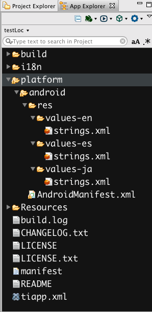
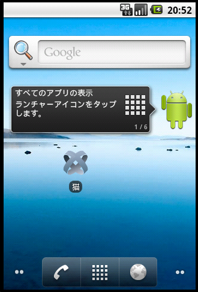
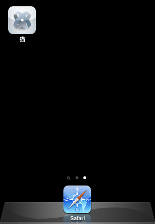

# Internationalization

## Objective

In this section, you will learn how you can seamlessly internationalize your Titanium apps. We'll look specifically at how you can use external language files to display text in the user's preferred language.

## Contents

Titanium provides a number of JavaScript functions in the `Titanium.Locale` namespace for use in localization. It also provides `String` formatting functions to handle dates, times, currencies, and more. You can even internationalize the name of your app itself. We'll look at those features, as well as how to test your language settings in this section.

### Language strings

Rather than hard-coding strings into your project, you can use localized strings. Localized strings are replaced at runtime with values appropriate to the user's language. Titanium relies on resources files and string placeholders to accomplish this task.

In your Alloy project create a directory called `i18n`. Inside the `i18n` folder, create folders for each language your application will support. Name the folder according to the [ISO 639-1](http://en.wikipedia.org/wiki/ISO_639-1) standard. For example, use `en` for English, `es` for Spanish, `fr` for French, etc.

You can also add a suffix to the language directories for variants of languages. However, if you don't plan on adding multiple suffix-ed directories omit the suffix completely. Suffix the folder name with a dash followed by the country's [ISO 3166-1](https://en.wikipedia.org/?title=ISO_3166-1) Alpha-2 code. For example, use `en-US` for American English, `en-CA` for Canadian English, `en-GB` for British English, etc. Note that the OS may not support all regional languages.

```
app
├── controllers
├── i18n
│   ├── en-AU
│   │   └── strings.xml
│   ├── en-CA
│   │   └── strings.xml
│   ├── en-GB
│   │   └── strings.xml
│   ├── en-US
│   │   └── strings.xml
│   └── fr
│       └── strings.xml
├── styles
└── views
```

::: warning ⚠️ Warning
**Titanium Classic Project Note**

For Titanium classic projects you should put the `i18n` directory inside the root of your project (which is the same level as `tiapp.xml` file), not in the `app` directory.
:::

#### Resource file structure

The string resource file closely mirrors the format of Android localization files, which have an XML-based format. The `name` attribute represents the key for the string, and the text inside the XML node represents the value. A typical `strings.xml` file would look like the following:

**strings.xml**

```xml
<resources>
    <string name="welcome_message">Welcome to Kitchen Sink for Titanium</string>
    <string name="user_agent_message">user agent set to</string>
    <string name="format_test">Your name is %s</string>
    <string name="base_ui_title">Base UI</string>
    <string name="controls_win_title">Controls</string>
    <string name="phone_win_title">Phone</string>
    <string name="platform_win_title">Platform</string>
    <string name="mashups_win_title">Mashups</string>
    <string name="ordered">Hi %1$s, my name is %2$s</string>
</resources>
```

Resource files are processed and included with your application at build time by our Titanium build scripts. This means that these strings won't be processed if you use Xcode or Eclipse to build your project natively.

::: warning ⚠️ Warning
**Android Platform Notes**

1. If you have XML files in both the `i18n` and `platform/android` folders, the Titanium build scripts will try to merge the files together in the `build` folder. If there are any conflicts, the build fails. Currently, if modules contain any files in the `platform/android` folder, these files overwrite the build files.

2. If you have strings using multiple substitutions, as demonstrated in the "ordered" string in the previous example, you may need to add the `formatted="false"` attribute to these string elements if the localized string is not created correctly when running the application.

3. When editing the strings.xml file, be sure to clean your project before building it again.
:::

String resource names (the "keys") must begin with a letter and can contain digits, English characters, and the underscore. The contents (values) of each string resource must be [UTF-8](http://en.wikipedia.org/wiki/UTF-8) compatible strings. While a given platform may not crash or throw an exception if you don't follow these rules, there's a good chance you will encounter some unexpected behavior.

#### Getting a localized string

Titanium provides two functions for obtaining a localized string from your resource files. Both take the key of the string requested as their first parameter. The `L()` macro is a short form for [Ti.Locale.getString()](http://developer.appcelerator.com/apidoc/mobile/latest/Titanium.Locale.getString-method.html):

```javascript
var str1 = L('welcome_message');
var str2 = Ti.Locale.getString('welcome_message');
// str1 === str2
```

To handle situations where no key exists in the `strings.xml` file, the [L() macro](http://developer.appcelerator.com/apidoc/mobile/latest/Titanium.Locale.getString-method.html) accepts a second argument to provide default `hint` text:

```javascript
var str1 = L('missingKey', 'No translation available');
```

Additionally, you can use the `titleid` property of Titanium UI objects, such as labels or buttons, to directly reference a string resource without using the `L()` macro. For example:

```javascript
var label = Ti.UI.createLabel({
  titleid: 'welcome_message'
});
/*
* is equivalent to
*   var label = Ti.UI.createLabel({
*   text: L('welcome_message')
* });
*/
```

#### Replacing values in a localized string

You probably noticed the %1 and %2 placeholders in the sample `strings.xml` file above. The `String` object in Titanium contains a `format` function which formats strings according to the [IEEE printf specification](http://www.opengroup.org/onlinepubs/009695399/functions/printf.html). If your localization string contains replacement keys, as `format_test` does in our example file above, you can replace values into your localized string like so:

```javascript
var formatted = String.format(L('format_test'),'Kevin'); // contains 'Your name is Kevin'
```

Using the other replacement values from the printf spec, you can also do ordered values:

```javascript
var formatted = String.format(L('ordered'), 'Jeff', 'Kevin'); // contains 'Hi Jeff, my name is Kevin'
```

#### iOS-specific localizations

On iOS applications, you can localize the names of system buttons, such as "Save" and "Cancel", and the values of pList keys. You also need to modify the plist section of the `tiapp.xml` file in order to submit your application to international App Stores.

##### Localize system buttons and submit to international App Stores

To localize system buttons or submit your application to international iTunes App Stores, add the `CFBundleLocalizations` key to the iOS plist section of the project's `tiapp.xml` file. Assign the `CFBundleLocalizations` key an array of strings. Each string is the ISO 639-1 standard name of the language you want the application to support. For example, to support English, Spanish and French, add the following to the application's `tiapp.xml` file:

**tiapp.xml**

```xml
<ti:app>
    <ios>
        <plist>
            <dict>
                <key>CFBundleLocalizations</key>
                <array>
                    <string>en</string>
                    <string>fr</string>
                    <string>es</string>
                </array>
            </dict>
        </plist>
    </ios>
</ti:app>
```

##### Localize property list keys

To localize property list key values (Info.plist keys), add `string` elements to the `app.xml` file with the name attribute set to the property list key and the node text to the localized string to display. For example, the following file provides French versions of several dialog messages displayed to the user when asking for permission to use their location, contacts or calendar.

**i18n/fr/app.xml**

```xml
<?xml version="1.0" encoding="UTF-8"?>
<resources>
    <string name="NSLocationAlwaysUsageDescription">Où allez-vous?</string>
    <string name="NSContactsUsageDescription">Avez-vous des amis?</string>
    <string name="NSCalendarsUsageDescription">Bon voyage.</string>
</resources>
```

##### Set default language

The following key allows you to set the default language and region of your app which is very useful for the management of localization:

**CFBundleDevelopmentRegion**

```xml
<ios>
  <plist>
    <dict>
      <key>CFBundleDevelopmentRegion</key>
      <string>it_IT</string>
    </dict>
  </plist>
</ios>
```

For more information about CFBundleDevelopmentRegion, please review [iOS Developer Library - Core Foundation Keys](https://developer.apple.com/library/ios/documentation/General/Reference/InfoPlistKeyReference/Articles/CoreFoundationKeys.html) and [iOS Developer Library - Language IDs](https://developer.apple.com/library/ios/documentation/MacOSX/Conceptual/BPInternational/LanguageandLocaleIDs/LanguageandLocaleIDs.html#//apple_ref/doc/uid/10000171i-CH15-SW6).

#### Internationalizing the app's name

One thing that has been a little tricky for some developers, is changing the application name based on locale.

For example, say you had an application named **"Cat"**, but you wanted it to be **"Gato"** in Spanish locales, **"猫"** in Japanese, and so on. Let 's see how you would prepare your application to display its name appropriately for both iOS and Android distributions.

##### Changing locale for testing

Before learning to configure your apps to use localized strings for application names, let's first see how we can change locales manually for testing. Below you can find short videos for both iOS and Android that show you exactly how to do that.

[Change Locale on iPhone](http://vimeo.com/36991188) from [Appcelerator Video Channel](http://vimeo.com/appcelerator) on [Vimeo](https://vimeo.com).

##### App name localization

For iOS applications and if you are using Titanium SDK 3.2.0 and greater to build your Android applications, it's pretty simple. Use the standard method for creating localization paths, which means creating and using the `i18n` directory like this:


In each of your language directories under `i18n`, you'll include an `app.xml` file that includes the necessary XML structure for defining the localized name of your app. That structure will look like this for each file:

**i18n/en/app.xml**

```xml
<resources>
  <string name="appname">Cat</string>
</resources>
```

**i18n/es/app.xml**

```xml
<resources>
  <string name="appname">Gato</string>
</resources>
```

**i18n/ja/app.xml**

```xml
<resources>
  <string name="appname">猫</string>
</resources>
```

And that's it. The next time you build your application, these localized strings will be used for your application name. If everything was configured correctly, you'll see the app name has changed based on the selected locale.

##### Android app name localization with Titanium SDK 3.1.x and older

If you are using Titanium SDK 3.1.x and older to build your Android apps, the name localization is a little more involved. First, we need to create language-specific resource folders explicitly for Android. To do so, we will create the `platform/android/res/values-(language code)` directory structure, like this:



You'll notice in this case we are creating the Android native `strings.xml` files, rather than the `app.xml` files used by iOS. While the file names are different, the contents will be identical to those in the iOS files [seen above](#appxml).

Aside from the `strings.xml` files, there's one more thing we need to add. To make your app use these localized strings, you need to modify the existing `AndroidManifest.xml`. In order to do that, we need to add that custom manifest file, seen in the picture above at `platform/android/AndroidManifest.xml`. The `AndroidManifest.xml` file placed here should be a copy of the generated `AndroidManifest.xml` file found in your project's `build/android` directory. For more details on custom `AndroidManifest.xml` files, check out [this wiki entry](/guide/Titanium_SDK/Titanium_SDK_Guide/Appendices/Maintaining_a_Custom_AndroidManifest.xml/) on the topic.

Now open up `platform/android/AndroidManifest.xml` and change the `android:label` attributes of the `<application>` and `<activity>` elements from the defined value of your app name to the value `@string/app_name`. Yeah, that was a lot of instructions all in one sentence, so here's an example to show you what I mean:

**AndroidManifest.xml**

```xml
<!-- ... -->

<!-- TI_MANIFEST -->
<application android:icon="@drawable/appicon"
  android:label="@string/app_name" android:name="TestlocApplication"
  android:debuggable="false">

  <!-- TI_APPLICATION -->
  <activity android:name=".TestlocActivity"
    android:label="@string/app_name" android:theme="@style/Theme.Titanium"
    android:configChanges="keyboardHidden|orientation">
    <intent-filter>
      <action android:name="android.intent.action.MAIN" />
              category android:name="android.intent.category.LAUNCHER" />
    </intent-filter>
  </activity>

<!-- The rest of your AndroidManifest.xml -->
```

With these changes in place, you can now rebuild your app (probably best to give it a clean first) and you'll have a successfully localized application name.

##### Reference

This is how your home screens might look on Android and iOS when Japanese is the selected language.

<table><tbody><tr><td><p></p></td><td><p></p></td></tr></tbody></table>

And just in case my description was clear as mud, check out a Titanium project with these localizations set up first hand. Just go to the [AppNameLocalization project repository](https://github.com/appcelerator-developer-relations/AppNameLocalization) on Github. It contains the _very_ basic project discussed here. With all this, you should be well-equipped to distribute your apps in as many languages as you wish to support.

##### Links

* [AppNameLocalization project](https://github.com/appcelerator-developer-relations/AppNameLocalization) on Github

* Appcelerator Wiki: [Maintaining a Custom AndroidManifest.xml](/guide/Titanium_SDK/Titanium_SDK_Guide/Appendices/Maintaining_a_Custom_AndroidManifest.xml/)

#### Internationalizing image and file resources

Titanium does not provide built-in functions for internationalizing image and file resources. But you can easily accomplish this yourself. There are a couple of techniques you can employ:

* Put the path and file name of each resource in the `strings.xml` file, then use that string in the `image`property, like this:

    ```javascript
    var img = Ti.UI.createImageView({
      image: L('my_image')
    });
    ```

* Put your images into a set of folders that match the 2-letter ISO codes, and include that directory in the path with `Ti.Locale.currentCountry`, like this:

    ```javascript
    var img = Ti.UI.createImageView({
      image: 'images/'+Ti.Locale.currentCountry+'/my_image.png'
    });
    ```

::: warning ⚠️ Warning
This technique won't work for the splash screen graphics. You should ideally avoid text that would need translation in your splash screen.

See [Localized splash screens](/guide/Titanium_SDK/Titanium_SDK_How-tos/User_Interface_Fundamentals/Icons_and_Splash_Screens/#localized-splash-screens) [](/guide/Titanium_SDK/Titanium_SDK_How-tos/User_Interface_Fundamentals/Icons_and_Splash_Screens/#LocalizedSplashScreens) for more information.
:::

### Date and time formatting

Titanium provides [string formatting functions](http://developer.appcelerator.com/apidoc/mobile/latest/Titanium-module#string_formatting) that you can use to create formatted dates and times. These include `String.formatDate()` and `String.formatTime()`. You can use these methods to format a JavaScript Date object to locale-specific strings.

At the time of this writing, natively, Android does not format dates in accordance with the official [DateFormat](http://developer.android.com/reference/java/text/DateFormat.html) documentation. Consequently, this will affect the corresponding `short`, `medium` and `long` formats of Titanium String Formatting. Furthermore, when the device settings are set to certain languages, the translations can be wrong or fields in the incorrect order. For example, the following code is run on a device to demonstrate the issue:

**app.js**

```javascript
Ti.API.info("Ti.Locale.currentLanguage = " + Ti.Locale.currentLanguage);
Ti.API.info("Ti.Locale.currentLocale = " + Ti.Locale.currentLocale);
Ti.API.info("thisDate = " + thisDate);
Ti.API.info("thisDate short = " + String.formatDate(thisDate,"short"));
Ti.API.info("thisDate medium = " + String.formatDate(thisDate,"medium"));
Ti.API.info("thisDate long = " + String.formatDate(thisDate,"long"));
```

This results in the following when the device is set to display in Polish:

**Log output (info)**

```
TiAPI  I  (kroll$1: app://app.js) [4,603] Ti.Locale.currentLanguage = pl
TiAPI  I  (kroll$1: app://app.js) [3,606] Ti.Locale.currentLocale = pl-PL
TiAPI  I  (kroll$1: app://app.js) [7,613] thisDate = Mon May 23 2011 13:38:33 GMT-0000 (GMT+00:00)
TiAPI  I  (kroll$1: app://app.js) [6,619] thisDate short = 23-05-2011
TiAPI  I  (kroll$1: app://app.js) [6,625] thisDate medium = 23-05-2011
TiAPI  I  (kroll$1: app://app.js) [4,629] thisDate long = 23 maja 2011
```

Here, `maja` is output for the month of May, whereas the Polish for May is actually _Maj_.

Similarly, when the device is set to _English (United Kingdom)_, the month fields are incorrectly displayed before the dates:

**Log output (info)**

```
TiAPI  I  (kroll$3: app://app.js) [2,1056] Ti.Locale.currentLanguage = en
TiAPI  I  (kroll$3: app://app.js) [1,1057] Ti.Locale.currentLocale = en-GB
TiAPI  I  (kroll$3: app://app.js) [9,1066] thisDate = Mon May 23 2011 14:09:28 GMT-0000 (GMT+00:00)
TiAPI  I  (kroll$3: app://app.js) [258,1324] thisDate short = 5/23/11
TiAPI  I  (kroll$3: app://app.js) [4,1328] thisDate medium = May 23, 2011
TiAPI  I  (kroll$3: app://app.js) [13,1341] thisDate long = May 23, 2011
```

This issue may well be fixed by the time you read this but, nevertheless, it gives us an opportunity to employ some of Titanium's tools to provide a workaround that gives you full control over the date format and translations.

We can use JavaScipt's [Date](https://developer.mozilla.org/en/JavaScript/Reference/Global_Objects/Date) object to return the date, which provides methods such as `getDate()` and `getFullYear()` to individually retrieve some of the information that we need. Although it does not specifically provide a method for returning the name of the month, we can derive it, in English, from the space-separated string output from `Date.` To do so, we'll use the JavaScipt [String.split()](https://developer.mozilla.org/en/JavaScript/Reference/Global_Objects/String/split) function. This will give us a key to lookup in the `string.xml` files.

**app.js**

```javascript
var thisDate = new Date(); // will always return date in English

Ti.API.info("Ti.Locale.currentLanguage = " + Ti.Locale.currentLanguage);
Ti.API.info("Ti.Locale.currentLocale = " + Ti.Locale.currentLocale);
Ti.API.info("thisDate = " + thisDate);

var thisMonth = thisDate.toString().split(' ',2)[1];
Ti.API.info("The month contained in thisDate is: " + thisMonth);
Ti.API.info("Note: as thisMonth is always in the default language, English, it can be used to look up the localized string.");
Ti.API.info("Hence, the localized string, headingDate, in the language of " + Ti.Locale.currentLanguage + " is:");
Ti.API.info(String.format(L('headingDate'),thisDate.getDate(),L(thisMonth),thisDate.getFullYear()));
```

Using string substitution placeholders, dynamic values can be passed to the `headingDate` string. This enables each locale to display the fields in a different order. In the following `string.xml` files, Polish and English translations will return the date in the default order, whereas Spanish will result in a modified order.

**i18n/pl/strings.xml**

```xml
<resources>
  <string name="headingDate">%d %s %d</string>
  <string name="January">Stycze?</string>
  <string name="February">Luty</string>
  <string name="March">Marzec</string>
  <string name="April">Kwiecie?</string>
  <string name="May">Maj</string>
  <string name="June">Czerwiec</string>
  <string name="July">Lipiec</string>
  <string name="August">Sierpie?</string>
  <string name="September">Wrzesie?</string>
  <string name="October">Pa?dziernik</string>
  <string name="November">Listopad</string>
  <string name="December">Grudzie?</string>
</resources>
```

**i18n/en/strings.xml**

```xml
<resources>
  <string name="headingDate">%d %s %d</string> // Note: reordered keys not working on Android. Issue under investigation
  <string name="January">January</string>
  <string name="February">February</string>
  <string name="March">March</string>
  <string name="April">April</string>
  <string name="May">May</string>
  <string name="June">June</string>
  <string name="July">July</string>
  <string name="August">August</string>
  <string name="September">September</string>
  <string name="October">October</string>
  <string name="November">November</string>
  <string name="December">December</string>
</resources>
```

**i18n/es/strings.xml**

```xml
<resources>
  <string name="headingDate">%2$s %1$d, %3$d</string>
  <string name="January">enero</string>
  <string name="February">febrero</string>
  <string name="March">marzo</string>
  <string name="April">abril</string>
  <string name="May">mayo</string>
  <string name="June">junio</string>
  <string name="July">julio</string>
  <string name="August">agosto</string>
  <string name="September">septiembre</string>
  <string name="October">octubre</string>
  <string name="November">noviembre</string>
  <string name="December">diciembre</string>
</resources>
```

Using this code, the date in Polish is translated correctly:

**Log output (info)**

```
TiAPI  I  (kroll$3: app://app.js) [1,1366]    Ti.Locale.currentLanguage = pl
TiAPI  I  (kroll$3: app://app.js) [1,1367]    Ti.Locale.currentLocale = pl-PL
TiAPI  I  (kroll$3: app://app.js) [33,1400]   thisDate = Mon May 23 2011 15:05:21 GMT-0000 (GMT+00:00)

TiAPI  I  (kroll$3: app://app.js) [38,1479]   The month contained in thisDate is: May
TiAPI  I  (kroll$3: app://app.js) [1,1480]    Note: as thisMonth is always in the default language, English, it can be used to look up the localized string.
TiAPI  I  (kroll$3: app://app.js) [12,1492]   Hence, the localized string, headingDate, in the language of pl is:
TiAPI  I  (kroll$3: app://app.js) [18,1510]   23 Maj 2011
```

In addition, the recognized date format for the UK is produced:

**Log output (info)**

```
TiAPI  I  (kroll$1: app://app.js) [2,577]     Ti.Locale.currentLanguage = en
TiAPI  I  (kroll$1: app://app.js) [2,579]     Ti.Locale.currentLocale = en-GB
TiAPI  I  (kroll$1: app://app.js) [2094,2673] thisDate = Mon May 23 2011 14:56:42 GMT-0000 (GMT+00:00)

TiAPI  I  (kroll$1: app://app.js) [20,2707]   The month contained in thisDate is: May
TiAPI  I  (kroll$1: app://app.js) [1,2708]    Note: as thisMonth is always in the default language, English, it can be used to look up the localized string.
TiAPI  I  (kroll$1: app://app.js) [1,2709]    Hence, the localized string, headingDate, in the language of en is:
TiAPI  I  (kroll$1: app://app.js) [13,2722]   23 May 2011
```

Lastly, the date in Spanish has been reordered:

**Log output (info)**

```
TiAPI  I  (kroll$5: app://app.js) [2,1066]    Ti.Locale.currentLanguage = es
TiAPI  I  (kroll$5: app://app.js) [6,1072]    Ti.Locale.currentLocale = es-US
TiAPI  I  (kroll$5: app://app.js) [169,1241]  thisDate = Mon May 23 2011 16:23:17 GMT-0000 (GMT+00:00)

TiAPI  I  (kroll$5: app://app.js) [32,1440]   The month contained in thisDate is: May
TiAPI  I  (kroll$5: app://app.js) [2,1442]    Note: as thisMonth is always in the default language, English, it can be used to look up the localized string.
TiAPI  I  (kroll$5: app://app.js) [14,1456]   Hence, the localized string, headingDate, in the language of es is:
TiAPI  I  (kroll$5: app://app.js) [14,1470]   mayo 23, 2011
```

### Other formatting and locale functions

Titanium also provides string formatting functions that you can use to create formatted currency and decimal numbers. These functions are `String.formatCurrency()` and `String.formatDecimal()`, respectively. The [Ti.Locale module](http://developer.appcelerator.com/apidoc/mobile/latest/Titanium.Locale-module) provides the `Ti.Locale.formatTelephoneNumber()` method for getting a locale-formatted phone number. That module also includes functions for retrieving the correct currency symbol and currency code for the user's locale.

### Testing languages

When building internationalized apps, you'll need to test each of the supported languages. You can do so either on-device or in the simulator/emulator. In each case, you configure the device's language settings to change locales.

To set the language on iOS:,

1. Open **Settings**.

2. Tap **General**, then **Language & Region**.

3. Under **iPhone Language**, select the language to use, then tap **Done**.

4. iOS will ask you to confirm your changes. Tap **Change to...**.

Optionally, in Settings, tap General, Language & Region, Region Format to specify your locale format for dates and times.

::: warning ⚠️ Warning
Localization is broken on the iOS 8.1 simulator.
:::

To set the language on Android:

1. Open **Settings**.

2. Tap **Language & input**.

3. Tap **Language** and select the language to use.

## Hands-on practice

### Goal

In this activity, you will create an internationalized app that outputs language-specific strings and test that in the simulator/emulator.

### Steps

1. Create a new Titanium SDK project named "Language Test" with an app ID of your choice.

2. Using your computer's file management tools, create an `i18n` directory at the `/app` directory of your project. In that directory, create two directories: `en` and `es`.

3. Within the `en` directory, create a `strings.xml`file following the format shown above. Add three key/value pairs:

    * language = Language

    * test = Test

    * tab = Tab

4. In the `es` directory, create a matching copy of `strings.xml`except that the values should be as follows:

    * language = Lengua

    * test = Prueba

    * tab = Lengüeta

5. In the `es` directory, create an `app.xml` file following the format shown above. Add the necessary key and value to specify "Lengua Prueba" as the translated version of the app's name. (This won't have any effect if you're building for Android.)

6. In app.js, on tab 1, add the necessary code to output the internationalized "Language Test" string as the text of `label1`.

7. On tab 2, change the text of `label2` to output today's date using the `String.formatDate()` method.

8. For both tab 1 and tab 2, update the text to use the internationalized "tab" key plus the tab's number.

9. Build the app for the simulator/emulator. The label and tab text should output in English (unless your emulator is already set to output text in Spanish). Close the app.

10. Change the simulator/emulator's settings to display text in Spanish. Open the app. Label and tab text should now be in Spanish. On iOS, the app's icon should be labeled in Spanish as well.

## Summary

In this chapter, you learned how to internationalize your app, including using language strings, internationalizing the app name, and formatting strings, dates, and currency values.

## References and further reading

* [Ti.Locale module](http://developer.appcelerator.com/apidoc/mobile/latest/Titanium.Locale-module)
