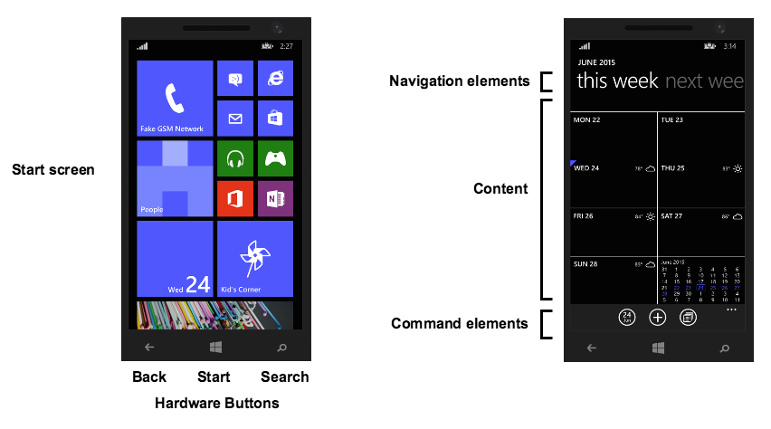

# Windows Platform Overview

::: danger ❗️ Warning
As of Titanium 9.0.0, building Windows apps is no longer supported.
:::
::: danger ❗️ Warning
Support for Windows 8.1 and Windows Phone SDKs has been deprecated as of SDK 6.3.0.GA and has be removed in SDK 7.0.0.GA
:::

## Introduction

The Titanium SDK allows you to develop ARM-based or x86-based applications for Windows, which will be referred to as Windows Phone and Windows Store apps, respectively. Windows Phone applications run on Windows Phone devices, while Windows Store apps run on tablets.

Both Windows Phone and Store apps share common APIs, UI elements and design. The main difference between the two platforms are the device's form factor. The table below provides some generalized specifications.

| Form Factor | Phone | Tablet |
| --- | --- | --- |
| Display type/Resolution | 1080p, 720p, WXGA, WVGA | 1024 x 768 and larger |
| Screen Size | 4" - 6" | \> 10" |
| Default Orientation | Portrait | Landscape |

More details about each platform are provided in the sections below.

## Windows Phone

Windows Phone is a mobile operating system developed by Microsoft. The Windows Phone OS contains many features common in most modern mobile operating systems, such as a virtual keyboard, multimedia capabilities, web browsing, voice search, email, contacts, multitasking, and so forth.

The OS is based on Microsoft's Metro design language, which relies more heavily on typography rather than graphics. The Start screen is a collection of live tiles that link to applications or other functionality. The tiles are updated regularly to show the user current application information and are customizable by the user. Swiping left on the right edge of the screen reveals the **All apps** screen. Use the **All apps** screen to launch an application not in the Start screen.

### Hardware buttons

Windows Phone devices may have three hardware buttons for navigation:

* **Start**: Returns the user to the Start screen.

* **Back**: Allows the user to go to the previous screen.

* **Search**: Allows the user to search for content.

### User interface

A Windows Phone application is divided into three parts:

* **Navigation elements**: Commonly located at the top of the application, the navigation elements help the user find the content they want to display. For example, the pivot control (similar to a tab bar) is located here and guides the user through the application's content.

* **Content**: Information or controls to present to the user.

* **Command elements**: Commonly located at the bottom of the application, the command elements provide the user alternative ways to interact with your application. For example, the command bar can be used to provide additional functionality.

If the phone is in landscape mode, the navigation and command elements will appear on the sides.

## Windows Store

To support tablet form factors, build and deploy Windows Store apps. Windows Store apps are applications that run on the Windows OS as opposed to the Windows Phone OS. Windows Store and Windows Phone apps share similar APIs, design and user interface elements, such as the Start screen, navigation elements and command elements. The list below notes some of the differences between the two types of applications:

* The content of Windows Store apps use the entire screen. To display some command and navigation elements, such as the command bar, you need to click the More icon (**`[...]`**) located in one of the corners of the application.

* The only hardware button a Windows tablet provides is the Start button. You will need to build the back navigation into your application if you need to use that feature.

* To get to the **All apps** screen, from the bottom edge of the screen, swipe up.

## Further reading

* [Windows Dev Center: Design basics](https://dev.windows.com/en-us/design/design-basics)
