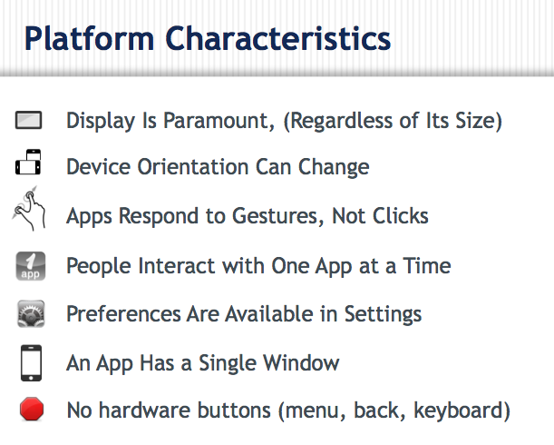

# iOS Platform Overview

## Objective

In this chapter, you will examine the concepts, features, and components that uniquely identify iOS apps. You'll look at user interface conventions, application components, and device features.

## Contents

iOS stands apart from most other mobile operating systems in that both its software and hardware are controlled by Apple. For this reason, it has a tight integration of front end and back end components that is arguably unmatched. We'll look at Apple's design considerations, the Cocoa Touch framework, and various UI components that are specific to iOS. Some of the key features of the iOS platform include:

* Crafted and consistent user interface conventions

* Minimalist hardware design

* Apple's Human Interface Guidelines

* Cocoa Touch

* Curated and closely controlled app distribution system

### User interface conventions

iOS is a carefully crafted and well-designed mobile operating system. Apple has carefully considered both usability and design throughout every aspect of its design. iOS is also remarkably consistent across devices, with only a couple of minor UI differences between iPhones, iPods, and iPads, as hardware capabilities differ across those devices.

The following screen illustrates some of the common user interface components offered by iOS:

Programmers adopt one of two general approaches when creating iOS apps: adopt the conventions completely or establish their own. Game makers tend to dispense entirely with stock controls (buttons and so forth) and create custom UI controls for all aspects of their app. Programmers of business or information-oriented apps tend to adopt the standard conventions. Through the power of Titanium you are free to adopt either approach, allowing you to use the methodology that best suits the app you are creating.

### Minimalist hardware design

iOS devices are famous for their one-button design. Other than a power button, volume rocker, and camera button (on some devices), iOS devices offer a single button with a consistent function – to return the user to the Springboard, or main screen. What this single-button design means to you is that your app's UI will need to include buttons and controls for every operation your app could perform. You can't rely on a hardware menu button, back button, etc. like you can on Android.

### Apple's Human Interface Guidelines

In Apple's words, the [Human Interface Guidelines](http://developer.apple.com/library/ios/#documentation/UserExperience/Conceptual/MobileHIG/Introduction/Introduction.html) will help you build "a superlative user interface and user experience for your iOS app." Some of the key design principles from that guide are summarized in the following image: 

### Cocoa Touch

Cocoa Touch is an abstraction of iOS operating system functions that is designed to help developers easily implement sophisticated app features. It is part of a layered set of APIs, as illustrated in this figure: 
Cocoa Touch provides the key frameworks for developing applications on devices running iOS. Some of these key frameworks are:

* Foundation Kit Framework

* UIKit Framework (based on Application Kit)

* Game Kit Framework

* iAd Framework

* Map Kit Framework

Titanium enables easy access to each of those functions. For example, Titanium enables access to the rich set of UI controls defined in UIKit.

### Curated app distribution

We won't spend much time on it here, as there's a whole chapter on distribution later, but Apple's curated distribution model is also part of the iOS experience. By examining and approving every app in the App Store, Apple helps ensure that only useful, high quality apps are presented to users. They also carefully screen out "spam", malware, and other dangerous apps. Check out the Deployment and Distribution module for more details.

A key consideration is that you will need an [iOS Developer Center](http://developer.apple.com/devcenter/ios/index.action) account to test or publish iOS apps you create with Titanium. A basic membership is free, which gives you access to the developer tools and documentation. To test on a device or publish your app, though, you will need to upgrade to a paid membership level, which at the time of this writing is $99/year USD for individuals and businesses.

### References and Further Reading

* [iOS Human Interface Guidelines](http://developer.apple.com/library/ios/#documentation/UserExperience/Conceptual/MobileHIG/Introduction/Introduction.html)

* [Cocoa Touch](http://developer.apple.com/technologies/ios/cocoa-touch.html)

* [Apple's iOS Developer Center](http://developer.apple.com/devcenter/ios/index.action)

## Summary

In this chapter, you examined the concepts, features, and components that make iOS apps – those for iPhone, iPod, and iPad – what they are. You looked at user interface conventions, application components, and device features. next we'll discuss some basic coding strategies for creating high quality, maintainable Titanium apps.
