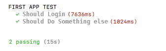
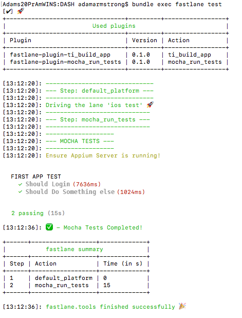

# Build Test and Deploy a Titanium Cross-Platform App with Fastlane

Developing a mobile app is just the beginning. What follows – signing, packaging, managing app meta data, testing, and deploying to the App Stores, can arguably be just as tedious and challenging.This document will demonstrate one way to configure your environment to manage several build, test, and deployment tasks when developing apps with Titanium using Appium and Fastlane.We'll use [Appium (Local Server)](http://appium.io/) and [mocha](https://www.npmjs.com/package/mocha) (npm package) for testing and [fastlane](https://fastlane.tools/) for automation.

## Testing

### Set up Appium Server

[Appium](https://appium.io/) is an open source test automation framework for use with native, hybrid, and mobile web apps. There are several options here that range from cloud-based, to local node package, and even a simple ‘Appium Desktop’ GUI app for Mac. For this document, we are going to use the simple GUI-based app, as it does everything we need it to do.

1. Download the free [Appium Desktop App](https://github.com/appium/appium-desktop/releases/tag/v1.5.0).

2. Validate all required Appium dependencies.

3. Install and run `Appium Doctor`. This wizard will validate and advise of any additional steps or dependencies that may be needed for your environment. More info can be found [here](https://appium.io/docs/en/about-appium/getting-started/?lang=en).
    `npm install -g appium-doctor``appium-doctor`

    1. Follow any steps to install any packages that your environment may be missing.

4. Launch the Appium (Server) app and start the “Simple” Server using the defaults.

### Install Mocha

Since most developers manage multiple mobile applications, you should chose to manage tests for each app in a single JavaScript file and all app JavaScript files within a single folder outside of the Appcelerator Project directory. There are numerous ways you can manage this and there is no right or wrong just more of a preference. One example structure may look like this:

* Documents

* Appium\_Tests

* firstapp\_test.js

* anotherapp\_test.js

* ...

Depending on your preference, install mocha either globally or locally in your tests directory (‘Appium\_Tests’ in this example):

`npm install --global mocha`

### Create Mocha Test File for Your App

This file will use an “appium client” to connect to your Appium Server to run the automated tests. There are several clients to use and each have their own pros and cons. The general consensus is that `webdriver io` is the preferred client. If you’d like to see the other options and/or see more complex examples, check out [this repo of examples](https://github.com/appium/sample-code/tree/master/sample-code/examples/node).

First, create a test file and name it `firstapp_test.js`.

Next, copy the following block of code into your file:

* port# must match your Appium Server Port.

* Simulator can be customized to match your needs, but the same choice will need to be used when we build from fastlane (set up later in this document).

* Update the path to your built app. **Note**: In this document, we are pointing to the app built for the simulator. You can also test against physical devices, but we aren’t covering that here.

```javascript
"use strict";

const opts = {
  port: 4723,
  desiredCapabilities: {
      "platformName": "iOS",
      "platformVersion": "11.2",
      "deviceName": "iPad Pro (12.9-inch) (2nd generation)",
      "app": "/Users/{USERDIR}/Documents/Appcelerator_Studio_Workspace/DASH/build/iphone/build/Products/Debug-iphonesimulator/MyAppName.app",
      "automationName": "XCUITest",
        "noReset": true
  }
};

var wd = require("webdriverio");

describe("FIRST APP TEST", function () {
  this.timeout(300000);
  var driver;
  var allPassed = true;

  before(function () {
    driver = wd.remote(opts);
    return driver.init();
  });

  after(function () {
    return driver
      .end()
  });

  afterEach(function () {
    allPassed = allPassed && this.currentTest.state === 'passed';
  });

   it("Should Login", function () {
      return driver
      .element("~Enter Username").setValue("testusername")
      .element("~Enter Password").setValue("testpassword")
      .click("~Attempting to Log In")
  });

  it("Should Do Something else", function () {
      return driver
      //Do another test here
  });

});
```

While it is possible to write these tests using node without mocha, the structure that mocha uses may be a matter of personal preference. using mocha and the sample script (above), you should see these results:



Write test commands for your app. This is where `webdriver io` stands apart form the rest. Their syntax is shorter and more streamlined than other clients. The `webdriver io` API doc can be found [here](http://webdriver.io/api/action/setValue.html).

> Note: The ~ is a unique Appium character that gets attributed to the AccessibilityId used within your Appcelerator app. This one line will find the UI component with AccessibilityId = “Enter Username” and sets its value:
> .element("~Enter Username").setValue("testusername")
>
> You can refer to the Appium commands [here](http://appium.io/docs/en/commands/element/find-element/) if you want more info.

Update your Appcelerator UI components with Accessibility Features (in this example, this would be the TextField used for the username). See [Appcelerator and Accessibility](/guide/Titanium_SDK/Titanium_SDK_How-tos/User_Interface_Deep_Dives/Accessibility/) for more information.

```xml
<TextField accessibilityLabel="Enter Username" />
```

Now, you should have mocha configured and a sample test script using `webdriver io` as the client to interface with your Titanium App (keying off of the `AccessibilityId`). Before continuing to the final piece (automation) you should ensure your test runs successfully on its own: `mocha firstapp_test.js`

## Automation

### Install Fastlane

Review Fastlane’s [Getting Started Guide](https://docs.fastlane.tools/) to install and init.

For each mobile app, you will have a `fastlane` folder in the root with a few config files.

```
-  fastlane (folder)
  - Pluginfile (this gets created automatically for you)
  - Fastfile (this file you create and define the required steps)
```

As a way to jump start the process, copy the following into your `Fastfile` file of your app:

```bash
default_platform :ios

platform :ios do

    before_all do
    end

    desc "Build App for Simulator Tests"
    lane :buildapp do
      ti_build_app(
    appc_cli: "appc run build --platform ios --target dist-adhoc --distribution-name 'implicitli, LLC. (G52GS5PAND)' --pp-uuid c6ea530d-70ea-5661-b013-beb4d25b2a7b --output-dir /dist"
  )
    end

    desc "Runs the tests of the iOS App"
    lane :test do
      ti_build_app(
          appc_cli: "appc run -f -T simulator -p ipad -i 11.2 --device-id 6945AC80-7F29-4A5A-8256-49467E9D1A7D --build-only"
        )
      mocha_run_tests(
        mocha_js_file_name: '/Users/{USERDIR}/Appium_Tests/dash_test.js'
      )
    end

end
```

::: warning ⚠️ Warning
The Fastfile file doesn't use file extensions.
:::

### Configure Fastlane

Fastlane runs on what they call ‘lanes’. These lanes allow you to break out building, testing, deploying, and so on. Each lane can be run by itself or all together in succession. This is a rather hefty topic and this document only touches on a portion of it. To read more about it, visit [https://docs.fastlane.tools/advanced/](https://docs.fastlane.tools/advanced/).

In your Titanium project, run this from terminal: `fastlane add_plugin ti_build_app`

This plugin leverages the full Appcelerator CLI.

To add simple runs to your mocha test JavaScript file: `fastlane add_plugin mocha_run_tests`

### Customize Your Fastfile

In the first lane, `buildapp`, does just that: It only builds. This defines the distribution type (adhoc) and what cert and provisioning profile to use.

One could even go a step further and install the plugin `ftp` to automate the upload process. Visit [https://docs.fastlane.tools/plugins/available-plugins/](https://docs.fastlane.tools/plugins/available-plugins/) for a list of available plugins.

The second lane, `test` has 2 actions:

1. Build the app to simulator,

2. test the app.

In this example, it uses different Appcelerator CLI commands so that the app is built to a specific simulator and `--build-only` prevents it from launching (mocha will launch the simulator and attach to the correct session on its own). Then, the next step executes the mocha test file.

::: warning ⚠️ Warning
The simulator defined in Fastlane MUST match the simulator defined in my mocha test file.
:::

### Execute Fastlane

To run the `test` lane, all one has to do is execute this command: `bundle exec fastlane test`

You will see Appcelerator CLI commands flash across the screen as it builds the app to simulator, then mocha executes, simulator opens, and webdriver io performs all your UI interactions.

Example fastlane output:


