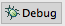
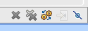
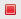

# Debugging in Studio

## Objective

In this section, you will learn how to debug your mobile applications using the tools provided by Studio. You'll learn how to use the Debug perspective, how to set breakpoints, run a project in debug mode, and how to step into, over, and return from functions.

## Contents

So far in this chapter, we've looked at print tracing (logging) and crash log analysis. Studio supports breakpoint testing, which lets you evaluate the state and values of variables during the execution of your program.You can set breakpoints at specific locations in your code. Or, you can use an exception breakpoint to pause your program when a specified exception is raised.

To see how this works, we'll need to look at these topics:

* Running a program in debug mode

* Studio's Debug perspective

* Setting breakpoints

* Stepping into, through, and over breakpoints and examining the stack trace

### Running a program in debug mode

To use Studio's debugging tools, you'll need to run your app in Debug mode. You can do so in the iOS Simulator or Android emulator. You can debug on a physical device as well.

To launch a project in debug mode, first select the project in the **Project Explorer** view, then in the global toolbar, select **Debug** from the **Launch Mode** drop-down list and a device from the **Target** drop-down list. If the **Launch Automatically** option is enabled under the **Target** drop-down list, the application will be automatically launched after the target is selected. If not, you need to click the **Launch** button to start the build process.

This section discusses debugging using a simulator or emulator. Debugging on device follows the same basic steps, but requires more setup. For details, see:

* [Debugging on Android Devices](/guide/Axway_Appcelerator_Studio/Axway_Appcelerator_Studio_Guide/Titanium_Development/Debugging_Titanium_Applications/Debugging_on_Android_Devices/)

* [Debugging on iOS Devices](/guide/Axway_Appcelerator_Studio/Axway_Appcelerator_Studio_Guide/Titanium_Development/Debugging_Titanium_Applications/Debugging_on_iOS_Devices/)

### Debug perspective

The Debug perspective contains several views that are not found in the Web perspective:

* **Debug View** - The Debug View displays debugging targets and processes that are currently running.

* **Variables View** - The Variables View shows the scope of variables when the JavaScript thread is suspended.

* **Breakpoints View** - The Breakpoints View lists the breakpoints for the file that you are debugging.

* **Scripts View** - The Scripts View displays the scripts that are currently being debugged.

* **Expressions View** - The Expressions View displays the value of current expressions.

In addition to the above debugging-specific views, you will also have access to some views from the Web perspective that you are probably familiar with:

* **Editor** - The Editor area displays the file currently being debugged in its appropriate Editor.

* **Outline View** - The Outline View displays an outline of the code for the file that is currently being debugged.

* **Console View** - The Console View displays log output from the debugger.

These are labeled in the following diagram.

Studio will display the Debug perspective automatically when you run a project in debug mode and a breakpoint is encountered. You can manually switch to the Debug perspective by clicking the **Perspective** button  in the upper-right corner of the workbench. (Click the corresponding "Web" button to switch back to the normal code-editing perspective.)

### Setting breakpoints

Breakpoints are locations within your app where execution will pause, giving you the opportunity to examine variable state and values. Code execution is paused at the moment immediately _before_ the marked line of code is executed. Any breakpoints you set will be hit when the app loads (or if they are in event listeners or separate files, when those execute). Some other things you can do:

* Edit Variables by clicking their values while inside a breakpoint.

* Add Expressions to the Expressions view to see the value of free form JS code.

* Set conditions on breakpoints by going to the "Breakpoints" view, right clicking on the breakpoint, clicking on "Properties", and hit the checkmark next to "Enable Condition"

* Click on various frames in the stack trace to see values of other variables in your call stack.

#### Setting manual breakpoints

A manual, or explicit, breakpoint marks a specific line of code within your application at which execution should pause. You set these yourself by either:

* Double-clicking in the margin in the Editor's code view, or,

* Right-clicking the margin and choosing Toggle Breakpoint from the context menu.

#### Setting exception breakpoints

An exception breakpoint causes your app to pause when an exception is raised that meets the criteria you specify. Such breakpoints are not associated with a particular line of code in your app. To add a breakpoint to your code so that execution automatically breaks on a certain type of exception:

1. Open the file with your script in the appropriate Editor.

2. From the **Run** menu, select **Add JavaScript Exception Breakpoint...** to open the **Add JavaScript Exception Breakpoint** dialog box.

3. On the **Add JavaScript Exception Breakpoint** pop-up window, select the type of exception that you would like to break on.

4. Run the app in debug mode. If the exception is thrown, your app will pause and Studio will switch to the Debug perspective.

To remove an exception breakpoint:

1. Switch to the Debug perspective, if necessary.

2. Display the Breakpoints view, which will list the current breakpoints in your app.

    
3. Then, take one of the following actions:

    * Right-click the breakpoint and choose Disable, Remove, or Remove All breakpoints.

    * With the breakpoint selected, use the associated toolbar buttons to Disable, Remove, or Remove All breakpoints.

        

### Stepping Through Code

Stepping through code is a common debugging technique that lets you examine your code's operation line by line. Studio supports three types of stepping: Step Into, Step Over, and Step Return. Studio provides various buttons in the Debug perspective to make it easy to step through your code:

| **Button** | **Name** | **When you click ...** |
| --- | --- | --- |
|  | Step Into | If set before a function call, execution will move to the first line of the function then stop. If set before a statement, execution will proceed until the next breakpoint (if one is set). |
|  | Step Over | Studio will execute the function then stop on the next line in your app. |
|  | Step Return | When you've Stepped Into a function, execution will finish in the current function, then return you to the spot where you went into the function, then pause again. |
|  | Resume | Execution will resume; it will stop at the next breakpoint (if one is set). |
|  | Terminate | Execution of your app will terminate. |

If you set a breakpoint at a Titanium function that invokes native code, that function is treated as a single statement. Thus, Step Into and Step Over will do the same thing: execute the function then stop on the next line.

### Variables view

The Variables View (shown below) displays current stack frame variables and their values. It is available in the Debug perspective while your app is paused at a breakpoint.

To change the value of a variable, when paused at a breakpoint:

1. In the Variables View, expand or collapse the variables hierarchy as necessary to display the relevant variable.

2. Click the current value (in the Value column).

3. Enter the new value and press Return (or Enter)

Alternatively,

1. Right-click the variable that you want to change, and choose **Change Value...** from the context menu to open the **Set Value** dialog box.

2. Enter the new value for your variable.

3. Click **OK**.

### Viewing error messages in the console

In most cases, error messages that cause your app to crash will be displayed in the Console pane of the Web perspective. Occasionally, all you'll see is a simple message like "Application terminated" especially when building for iOS. In those cases, you can sometimes get more detailed information from the Debug perspective.

1. When the app has crashed, switch to the Debug perspective.

2. In the Debug pane, click the "exit value: -1" line, typically the last one.

3. More detailed log output should then be visible in the Console pane.

### Studio build log

Studio maintains a log of messages output during your project build processes. Each time you build a project, the messages are appended to the .log file. You can view this file by choosing **Help** \> **Studio** \> **View Log File**. The log file is opened in the editor perspective just like any other code file, oldest entries are listed first. Occasionally, you should clear out this file so it doesn't grow too large. Choose **Help** \> **Studio** \> **Clear Log File** to do so.

### References

* [Debugging JavaScript](/guide/Axway_Appcelerator_Studio/Axway_Appcelerator_Studio_Guide/Web_Development/JavaScript_Development/Debugging_JavaScript/)

* [Debugging Titanium Applications](/guide/Axway_Appcelerator_Studio/Axway_Appcelerator_Studio_Guide/Titanium_Development/Debugging_Titanium_Applications/)

* [Debugging on Android Devices](/guide/Axway_Appcelerator_Studio/Axway_Appcelerator_Studio_Guide/Titanium_Development/Debugging_Titanium_Applications/Debugging_on_Android_Devices/)

* [Debugging on iOS Devices](/guide/Axway_Appcelerator_Studio/Axway_Appcelerator_Studio_Guide/Titanium_Development/Debugging_Titanium_Applications/Debugging_on_iOS_Devices/)

* Eclipse [Execution Control Commands](http://help.eclipse.org/indigo/index.jsp?topic=%2Forg.eclipse.jdt.doc.user%2Freference%2Fviews%2Fdebug%2Fref-executioncontrolcommands.htm)

## Summary

In this section, you learned how to debug your mobile applications using the tools provided by Studio. You learned how to use the Debug perspective, how to set breakpoints, run a project in debug mode, and how to step into, over, and return from functions.
