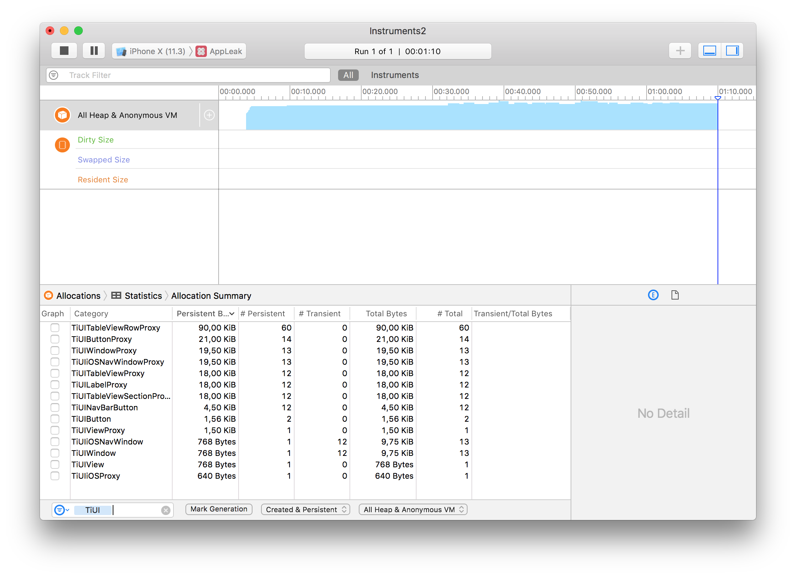
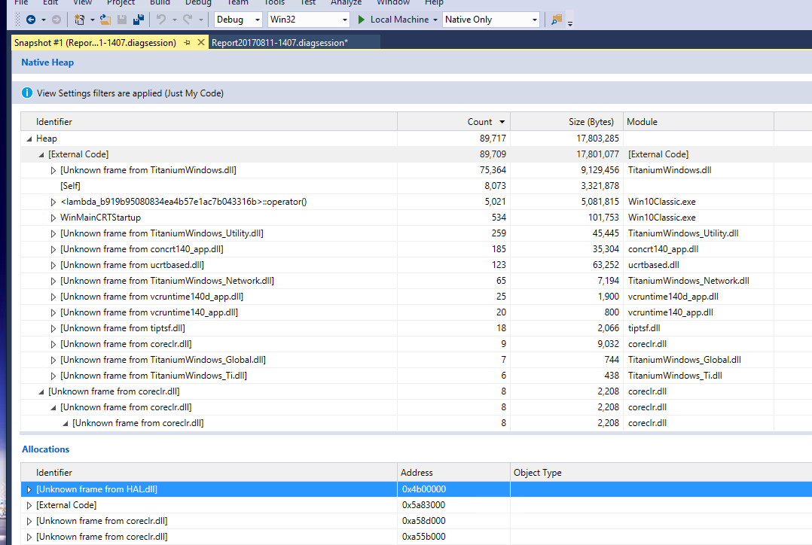

# Managing Memory and Finding Leaks

## Objective

In this section, you will learn how to monitor for and solve memory leaks in your apps. The processes for monitoring memory usage varies by platform. You'll learn separately how to perform this feat on iOS, Android and Windows.

## Contents

::: warning ⚠️ Warning
Let's start with a clarification: we're talking memory, _not_ storage in this section. Memory, sometimes called RAM, is the volatile location in which your app and its data are retained while they're being processed by the CPU. Storage is the long-term location where app data is retained while you're not using the app or device. In a desktop computer, the distinction is a bit easier: memory is done with chips; storage is done with the hard drive, floppy disk, or CD-ROM.

In a mobile device, both memory and storage are implemented as chips. Storage uses Flash memory chips, slow, but such chips don't lose their contents when power is removed. Memory uses RAM-style chips (DRAM, etc.), which are fast but volatile (contents lost when power removed).
:::

CPUs in smartphones and tablets are amazingly advanced. The JavaScript Core and V8 interpreters that Titanium uses are quite fast and well-optimized for mobile apps. Computation speed is rarely an issue with apps these days. Memory is typically the largest bottleneck, a factor you'll need to actively manage as your apps grow in complexity.

In this section, we'll see what factors go into determining how much memory your app uses. We'll see how Titanium frees memory, which will require a peek under the covers to see how JavaScript manages memory. And we'll look at issues that can cause memory leaks--memory allocations that grow over time to the point where your app could crash.

Memory limits vary by operating system and device and are not clearly documented by the vendors. Based on our sleuthing, here are the limits you must be concerned with:

::: danger ❗️ iOS notes
The numbers for iOS are rough estimates. Apple does not publish information about their app termination threshold, managed by processes called "watchdog" (responsible for monitoring) and "jetsam" (responsible for warnings/purging). App termination is controlled entirely at the discretion of these processes and their behavior may change at any time.

The upside of this is that if you see a crash or device log referencing jetsam, this certainly indicates a memory issue.
:::

* iPhone: Limited to 10% of system memory

* iPad: Limited to between 30-50 MB; smaller is always better

* Android: 24-32MB heap, optional "large heap" of 128MB ([Application properties](/guide/Titanium_SDK/Titanium_SDK_Guide/Appendices/tiapp.xml_and_timodule.xml_Reference/#application-properties) for how to enable this)

Compared to the memory space available to the desktop, these are severely restricted amounts. Furthermore, iOS, Android and Windows can force-reclaim memory or force-quit an app when the system needs more free memory. You'll want to limit your memory use and free allocations when you can. Let's see how JavaScript frees memory and then how you can release memory in your Titanium app.

### JavaScript garbage collection

In some languages, the programmer must explicitly allocate and de-allocate memory within their programs. This manual process can take quite a bit of work and is often the source of bugs. JavaScript instead uses an automatic technique called _garbage collection_. With garbage collection, the JavaScript interpreter determines when objects are no longer needed, then destroys them to free the memory they were using.

Most modern JavaScript interpreters use a "mark and sweep" method for determining when to garbage collect objects. Periodically, execution stops while the interpreter scans memory building a list of every object in memory. It marks those to which there is a reference (an active variable name, being a property of on object that's in use, and so forth) and those to which there are no active references. When it's done with this sweep, the interpreter sends a "destroy" message to all of the objects that have no active references. Those object tear themselves down and release their memory.

In this way, JavaScript automatically clears out objects that are not being used. Problems arise when you leave references to objects that you no longer need. You can remove references by setting variables and objects to `null` when you no longer need them. This includes both variables and objects you create to represent your app's business logic, but also objects that represent Titanium components such as Views or Images.

### When Titanium releases memory

Titanium is a bridge between JavaScript and the native operating system. When you define a Titanium object, such as a Button or View, Titanium creates a matching proxy in the native operating system. Titanium will destroy that native proxy object, freeing the memory it used, when the corresponding JavaScript object is destroyed.

* Calling _parent_.`remove()` then setting the JavaScript object to `null` destroys both the proxy and JavaScript object. You won't be able to `add()` it to the view hierarchy later without redefining it.

To be clear, calling _parent_.`remove()` on its own does _not_ destroy either the JavaScript or proxy object. You must `null` the JavaScript object to destroy its related proxy.

Destroying a parent object (setting it to `null`) will destroy any child objects as long as no other references to those child objects exist. Consider the following code snippet to get a feel for the specifics:

```javascript
var button = Ti.UI.createButton({
  // parameters go here...
});
var view = Ti.UI.createView({
  // some parameters here...
});
view.add(button);
// ... later
win.remove(view);  // view & button still exist
view = null; // deletes the view and its proxy, but not the button!

// compare that to:

var view = Ti.UI.createView({
  // some parameters here...
});
view.add(Ti.UI.createButton({
  // parameters go here...
}));
// ... later
win.remove(view);
view = null; // deletes the view, button, and their proxies
```

Make sure that you actively manage the Titanium objects you create, such as Windows, Views, and Buttons. Remove them from the view hierarchy and destroy them when you no longer need them. You might do this when a user closes a "dialog box" (view) or changes tabs in your app.

### Memory leaks

Memory leaks occur when your app allocates memory but doesn't release it. Leaks occur when unintended or overlooked references to objects remain in scope. When this happens, JavaScript can't garbage collect the objects and Titanium can't destroy the native proxies. Because the causes of leaks vary so widely, at best we'll be able to give you some strategies to attempt in order to solve the problems. There are no "cookie cutter" solutions for stopping memory leaks.

#### Example sources of memory leaks

* Hiding a View removes it from the display, but retains the object in memory. To conserve memory, call _parent_.`remove()` and/or set the object equal to `null` when you no longer need it, as described above.

* Declaration of an object within a [closure](http://jibbering.com/faq/notes/closures/) can preserve references to an object that might no longer be needed. Moving object declarations out of the closure (pass a reference in as a method argument) is one way to resolve this problem.

* Declaring objects within a "global" event listener means those objects will remain in scope as long as the event listener exists. Global event listeners include those set on Ti.App, Ti.Geolocation, Ti.Gesture, and so forth.

**Creating and fixing a memory leak in a global event listener**

```javascript
function doSomething(_event) {
  var foo = bar;
}
// adding this event listener causes a memory leak
// as references remain valid as long as the app is running
Ti.App.addEventListener('bad:idea', doSomething);

// you can plug this leak by removing the event listener, for example when the window is closed
thisWindow.addEventListener('close', function() {
  // to remove an event listener, you must use the exact same function signature
  // as when the listener was added
  Ti.App.removeEventListener('bad:idea', doSomething);
});
```

### Monitoring allocations on iOS

To run a Titanium app from the Xcode build, you have two choices:

1. Change your Xcode Workspace settings in **Xcode** > **Preferences** > **Locations** > **Derived Data** > **Advanced** > Select **Custom** in the Build Location options and select **Relative to Workspace** from the drop down.

    
2. Copy the contents of your `Resources/` (same for Alloy by including the generated Alloy code) directory to the "Resources" group in Xcode

Lets continue! Apple's Instruments application is a handy tool for monitoring and discovering memory leaks. Here's how you can use it for this purpose:

1. Open your app in the iOS simulator.

2. Open Instruments:

    * Start Xcode and from the menu, select **Xcode** > **Open Developer Tools** > **Instruments**.

    * In the Choose a Template window, click **Allocations** and click **Choose**.

3. Attach your application to Instruments.

    1. Click **Choose Target**, click **More...** under **System**, then scroll down and click your app's name.

    2. Click **Record**. Wait a moment till data begins recording.

4. In the Instrument Detail filter box, enter a filter string, such as "`TiUI`" to show only relevant allocation information.

5. Click and use your app while watching these values in Instruments:

| **Column** | **Shows** | **Notes** |
| --- | --- | --- |
| **Persistent Bytes  <br />(or Live Bytes)** | Memory currently being used by active instances of the object in memory | You may have a leak if this number continues to grow as you use your app. |
| **#Persistent  <br />(or #Living)** | Number of active instances of the object in memory | You may have a leak if this number continues to grow as you use your app. |
| **#Transient  <br />(or #Transitory)** | Number of ready-to-be-garbage-collected instances of the object | Transitory objects might or might not be in memory. It doesn't matter if this value grows over time. JavaScriptCore will garbage collect periodically; any transitory objects will be destroyed when it does so. |
| **Total Bytes  <br />(or Overall Bytes)** | Bytes used by Living and Transitory objects | This number will grow until garbage collection runs. |
| **#Total  <br />(or #Overall)** | Sum of Living and Transitory | This number will grow over time. |
| **Transient / Total Bytes  <br />\[or # Allocations (Net / Overall)\]** | A histogram of the current and total accounts. |  |

If you make a change to your app, the most reliable way to gather new statistics in Instruments is to close it and start over.

::: warning ⚠️ Tracking memory more accurately
On iOS, the runtime and other systems may frequently allocate (or deallocate) objects which can't be managed directly through your javascript code. In general, when checking your app for memory leaks, you should be filtering for objects with the "`Ti`" prefix.

Also note that by attaching the profiler after the app has started, you do not get any information on already-created objects until they are touched by the memory management system. To get more accurate information, you may need to open the Xcode project generated in your project's `build/iphone` folder, and choose **Product** \> **Profile**, then configure the resulting Instruments launch as described here.
:::



### Monitoring allocations on Android

Android's [DDMS Tool](https://developer.android.com/studio/profile/monitor.html) can show you memory leaks – both memory allocations that are not freed and objects that aren't garbage collected. Following the procedure shown here, you can watch as memory use and object allocations grow. You'll need to pair that information, with knowledge of your app to determine where within your app the cause might be.

1. Build your app for the Android emulator at least once.

2. In your text editor, open `<project>/build/android/AndroidManifest.xml`.

3. Copy the `<application>` node, a sample of which is shown here (your app name would vary, of course):

    ```xml
    <application android:icon="@drawable/appicon"
      android:label="AppLeak" android:name="AppleakApplication"
      android:debuggable="false">
    ```

4. Paste that into your app's tiapp.xml file, modifying the `<android>` node as shown:

    ```xml
    <android xmlns:android="http://schemas.android.com/apk/res/android">
      <manifest>
        <application android:icon="@drawable/appicon"
          android:label="AppLeak" android:name="AppleakApplication"
          android:debuggable="true">
        </application>
      </manifest>
    </android>
    ```

    Notice that we've set debuggable to true and added and completed a couple of the nodes.

5. Save and build your app for the Android emulator again.

6. Open DDMS.

7. As shown in the screenshot below, click to select your app in the list of processes. Then, click the Show Heap Updates button (labeled #2 in the graphic).

8. On the VM Heap tab, click Cause GC to force garbage collection. Note the values listed in the Allocated and # Objects columns.

9. Here's where you'll exercise your app and watch for memory leaks. For example, if you're using the AppLeak sample app linked to below, click the Test 1 button, click Back, and repeat. Memory and the object count in DDMS will grow, though that number includes objects that are ready to be garbage collected.

10. Click Cause GC to force garbage collection. If there's a leak, the values of Allocated and # Objects won't return to their former values.

These steps don't tell you exactly what is causing the leak in your app. Unlike Instruments, DDMS doesn't clearly show which objects are remaining in memory rather than being collected. You will need to test your app and watch the memory values to infer the potential causes of the leak.


### Monitoring allocations on Windows

Microsoft Visual Studio has "Diagnostic Tools" for monitoring memory usage.

1. Open Visual Studio.

2. Select **Debug** \> **Performance Profiler...** from Visual Studio menu.

3. Select **Choose Target** drop down list and choose target to profile. For instance choose **Installed App...** for monitoring installed Windows Store app. This tool also supports analyzing target against simulators and remote machine. Please refer to [Remote Debugging](http://msdn.microsoft.com/query/dev14.query?appId=Dev14IDEF1&l=EN-US&k=k(vs.debug.remote.overview)&rd=true) for more information.

    
4. Choose **Memory Usage** from **Available Tools** section, to investigate application memory to find issues such as memory leaks.

    
5. Start monitoring by clicking **Start**

6. When you want to take memory snapshot of the application, push **Take snapshot** button.

    
7. Then Visual Studio shows native heap and allocation details when you take snapshot and Visual Studio finishes diagnostics session.

    

For more information about Profiling Tools please refer to [Running Profiling Tools With or Without the Debugger](https://msdn.microsoft.com/en-us/library/mt695328.aspx).

### Hands-on practice

#### Goal

You'll examine an app that has a memory leak deliberately included. You'll apply various fixed and check your work until you have eliminated the leak.

(This lab is written to work on iOS / macOS. See the notes at the end of the lab for Android and Windows information.)

#### Steps

1. Download or clone the AppLeak project from [Github](https://github.com/appcelerator-developer-relations/appc-sample-app-leak). Extract it and then import the project into Studio or your CLI workspace. Confirm that the tiapp.xml file has appropriate values for your environment then close that file.

2. Open `test1.js` in Studio or your Editor. This file contains the leak, which you will fix.

3. Build the project for the iPhone or iPad simulator.

4. Open Instruments and attach it to your app's process:

    1. In the Choose a Template window, click Allocations and then click Choose.

    2. Click Choose Target, Attach to Process, then under System, click AppLeak.

    3. Click Record. Wait a moment till data begins recording.

    4. In the Instrument Detail filter box, enter `TiUITable`.

5. In the simulator, click the Test 1 button. In Instruments, the # Living column for `TiUITableViewRowProxy` should show 5 objects are in memory; these objects correspond to the rows in the table. Close the modal window, then click Test 1 again. This time, # Living should increase to 10. The original 5 rows were not released and 5 new rows are allocated in memory. While the actual usage is small, if you were to repeatedly show this window enough times the app would exhaust its available memory and crash.

6. Close the simulator. That will stop the data recording in Instruments.

7. In Studio, in `test1.js`, examine the code and speculate on the cause of the leak.

8. Add this code after the existing app-level event listener:

    ```
    test1win.addEventListener('close', function() {
      Ti.App.removeEventListener('bad:idea', doSomething);
    });
    ```

9. Build your app for the simulator again.

10. Repeat the Instruments testing steps listed above. This time, you should see the numbers in the # Transitory column increase as you open and close the Test 1 window. These values represent objects that have been garbage collected. You might see # Living go up above the 5 active rows occasionally; this simply reflects Instruments reacting more slowly than you clicking through the app. Note that because these objects are managed by garbage collection, you may not see them released immediately.

11. Close the Simulator and Instruments; don't save the log results.

The app-level listener added within `build()` remains in scope after the window is closed. This forces the objects the window contains to remain in scope, which means they cannot be garbage collected. When `build()` runs again, a new window and table are created, which also cannot be garbage collected. You've got a leak! By removing the event listener when the window closes, the rest of the objects can be marked as ready for garbage collection. Even though a new set of objects are created by `build()`, the old ones are gone from memory and this leak is fixed.

#### Android notes

Memory leaks can be a problem for Android, even though we didn't highlight that platform in this lab. You can use the DDMS tool, and its Allocation Tracker component to watch for such leaks. We choose to use Instruments in this lab because the output is by far more obvious and the steps to discover a leak are simpler.

## Summary

In this section, you learned how memory is managed by JavaScript and Titanium. You learned that you must actively manage memory by actively managing the allocation and destruction of Titanium objects. You also learned how to use Instruments to monitor memory usage and potential leaks for iOS development.

### References

* O'Reilly's [JavaScript: The Definitive Guide, section 11.3 Garbage Collection](http://docstore.mik.ua/orelly/webprog/jscript/ch11_03.htm)

* Video: Your Apps are Leaking, by Rick Blalock at [Codestrong 2011](http://vimeopro.com/appcelerator/codestrong-2011/video/29804284)

* Titanium Mobile [Best Practices and Recommendations](/guide/Titanium_SDK/Titanium_SDK_Guide/Best_Practices_and_Recommendations/)
