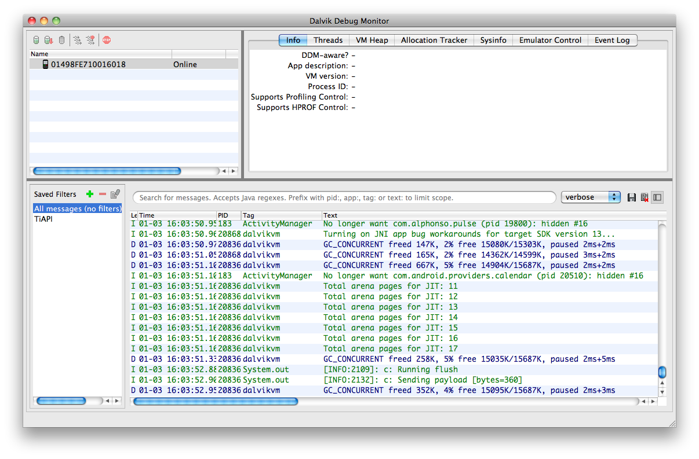

# Native Android Debugging and Testing Tools

## Objective

In this section, you will learn the basics of using the native tools included in the Android software development kit for troubleshooting Titanium projects.

## Contents

There are many tools supplied with the Android SDK. We'll focus on those that are troubleshooting related in this section, specifically DDMS and `adb`. DDMS (Dalvik Debug Manager Service) is a GUI tool that you can use to monitor and manage Android emulators and devices. `adb` is a command-line utility that does most of what DDMS does, plus offers a few tricks that DDMS can't do. We'll explore them separately.

### Accessing the emulator with DDMS

In this part, you'll see how to use DDMS to:

* View log output

* Access the file system on the emulator or device

* Set emulator parameters and simulate operating conditions

#### Examining log output with DDMS

You can view emulator or device log output using DDMS. Open DDMS and select the device or emulator in the top-left pane. Log output is displayed in the lower pane, as shown in the screenshot below.



DDMS shows all log output, not just messages from Titanium. Sometimes you need to view all those operating system messages. But in most cases, you will want to filter output to show just Titanium logging output (that output with `Ti.API.info()` and so forth). With DDMS, you can define a filter. As shown in the graphic, click the **Add Filter** button, then enter **TiAPI** in the Log Tag field. Click OK to save your filter. Then click it in the list to apply it to the log output.


#### Simulating network conditions

You should test your app under less-than-ideal conditions so that you know how it will react as users go into roaming mode, operate over low-speed data networks, and so forth. For example, many users turn off data when they're roaming. If they run your app in such a state, your app should react appropriately rather than crashing. You can simulate such conditions with DDMS. With the emulator running, select the instance in the top-left pane and then click **Emulator Control**. In the Telephony Status section, specify voice and data location state (e.g. roaming vs. searching for a signal vs. on their carrier's home network), and data speed and latency.

#### Simulating calls and SMS messages

You can simulate a call or text message to determine how your app will react to such interruptions. (For example, with a game, you'd want to pause your game so that the player's status doesn't change while they answer a phone call.) With the emulator running, select the instance in the top-left pane and then click **Emulator Control**. Scroll down to the Telephony Actions section. Enter a phone number (without any punctuation), select Voice or SMS, enter an optional SMS message, and click Call.

#### Setting GPS coordinates

The Android emulator doesn't provide a default simulated location so GPS lookups of the current location will fail. You can set a current location with DDMS. With the emulator running, select the instance in the top-left pane and then click **Emulator Control**. Scroll down to the Location Controls section. Enter longitude and latitude coordinates and click Send. This transmits the mock coordinates to the emulator, which will be used for "my location" type lookups until the emulator is stopped.

#### Exploring the file system with DDMS

If your app manipulates files, you might want to explore the file system in order to confirm that the files are being created or deleted as you expect. With DDMS, select the emulator or device to examine in the top-left pane, then from the Device menu, choose File System.

You can copy files to the emulator/device by dragging and dropping files into the File Explorer window. Alternatively, select the target location in File Explorer and click the Push File Onto Device button in the File Explorer's toolbar. A file-picker dialog opens in which you can select the file to "push" (copy) to the device. To copy a file from the device or emulator, you must "pull" it from the device: select the file, then click the Pull File From Device button in the toolbar. To delete a file or folder, select it in the file tree then click the Delete (minus-sign) button in the toolbar.

Newer Android devices (running Android 4 / Ice Cream Sandwich) use the Android File Transfer application for transferring files, music, and photos to and from your computer. If installed, this application should launch automatically when you plug in or dock your device. You can use the Android File Transfer application to explore your device's handset, though it displays the contents of the SD card only (/mnt/sdcard). DDBMS and `adb` enable you to access the entire file system.

#### Memory monitoring with DDMS

DDMS offers monitoring features that work well for native Android developers who write their apps with Java. Those tools are less helpful for Titanium projects because the code you want to debug-your JavaScript\-is running within one of the many processes and therefore isn't "visible" to DDMS. Still, it can be helpful to watch memory totals to see if usage climbs as your app runs (possibly indicating a memory leak). These tools are also quite helpful if you're developing a native Android module for Titanium.

Google's Android docs cover the basics of using DDMS for monitoring memory usage. See [http://developer.android.com/guide/developing/debugging/ddms.html#using-ddms](http://developer.android.com/guide/developing/debugging/ddms.html#using-ddms) for that. You'll also find a fair number of blog posts on the Internet from Java developers describing how they use DDMS for monitoring.

### Accessing the emulator with adb

`adb` offers many of the features of DDMS, including the means to:

* View log output

* Access the file system on the emulator or device

* Access SQLite databases on the emulator or device

* Issue shell commands on the emulator or device

#### Examining log output with adb

As with DDMS, you can view the emulator or device log output using the `adb logcat` command. If you have more than one emulator or device running, you'll need to supply an argument to the command to specify which device's log to output.

(The following are terminal commands, and those "comments" would cause errors. We're just using a code-like means of annotating what's happening in each step. So don't enter the // or what follows.)

```
adb logcat     // if you have just one device connected or emulator running
adb -d logcat  // for a USB-connected device
adb -e logcat  // for the emulator
adb -s emulator-5556 logcat  // to target the emulator running on port 5556
```

Use the `adb devices` command to get a list of connected devices or emulators that you could target. Use the resulting device labels with the `adb -s` command. In the examples below, we're omitting the device-targeting switches for simplicity's sake. You might need them in practice.

`logcat` outputs in a continuous manner, meaning that the command continues to run and will output more messages as they're logged. To quit out of `logcat` press `Ctrl+C` on your keyboard. (Mac users take note, that's Control+C, not Command+C).

You can filter log output by using the `grep` command (OS X) or `findstr` command (Windows). Better yet, just use the built-in `-s` argument of the `logcat` command. This technique works identically on both platforms. Titanium log statements are tagged with the "TiAPI" tag.

```
adb logcat | grep TiAPI
adb logcat -s TiAPI
```

Alternative, you can follow the Android docs which say to use the _tag_:_priority_ filtering option. This technique works just fine, but you need to include an extra argument that tells `logcat` to suppress all the other messages:

**Displaying only Titanium logging messages**

```
adb logcat TiAPI:I *:S  // if you leave off the *:S you'll output the whole log
```

#### Exploring the file system with adb

You can copy files to and from an emulator or device using `adb` and its commands. There isn't a built-in option to list the files on the device, but you can open a command shell and use a Unix-like `ls` command.

**Listing files via the adb shell**

```
adb shell
# ls -la  // enter Unix-like commands, with or without options
# cd /some/path  // to change directories
# exit    // to close the adb shell
```

When opening a shell on the emulator, you are logged in with root (superuser) permissions. On a device, you have limited permissions and will not be able to access the entire file system. If you have rooted your device and installed the `su` binary, you can gain full access to your device's file system. Be careful to not change or delete any critical files or you could cause your device to stop functioning.

While you can "walk" the directory tree via the shell, you can't use it to copy files to and from the device/emulator. Instead, you'll need to use the `push` and `pull` commands.

**Pushing a file to the device/emulator**

```
adb push foo.txt /path_on_device/foo.txt
```

**Pulling a file from the device/emulator**

```
adb pull /path_on_device/foo.txt /local_path/foo.txt
```

#### Accessing SQLite databases with adb

On the emulator and rooted devices, you can open an adb shell and run `sqlite3` to access a command-line SQL shell. In this database shell, you can execute SQLite commands such as `SELECT * FROM yourtable`. Not all Android systems ship with the `sqlite3` binary installed. You'll get a "not found" error if the binary isn't available.

You'll need to know the path to your app's database. According to Google's documentation, the path is `/data/data/com.example.yourapp/databases/yourdb.ext`. The `yourdb.ext` must match the file name you gave with the `Ti.Database.install()` or `Ti.Database.open()` statements within your app.

```
adb shell
# ls /data/data/com.example.yourapp/databases    // to list the db files
# sqlite3 /data/data/com.example.yourapp/databases/yourdb.sqlite
sqlite> SELECT * FROM yourtable;
sqlite> .exit
```

Keep in mind these points:

* Only SQLite statements are supported, not the full SQL language. See [http://www.sqlite.org/lang.html](http://www.sqlite.org/lang.html) for more info.

* You must terminate all SQLite statements with a semicolon.

* The `sqlite3` binary offers various commands, which are preceded by a period and _not_ terminated with a semicolon. Enter `.help` for a list of those commands.

* You're interacting with your app's actual database. So if you make modifications, you could create error conditions within your app.

### Creating an emulator

You can either use the `android` command-line tool or the Android AVD manager to create an emulator. By default, Studio creates an Android virtual device (emulator) for you if one does not exist.

#### Using the Command-Line

To create an emulator using the `android` command-line tool, run the command below. You need to pass in a name for the emulator (`-n` <`EMULATOR_NAME`\>), which system image (Android version) to install (`-t <TARGET_ID>`), which skin type to use (`-s <SKIN>`) and to use the x86 binary (`–abi x86`). You can optionally pass in the `-f` option to overwrite a previously created emulator and use the `-c` option to specify to create an SD card image and its size.

After you run the command, you will be asked if you want to create a custom hardware profile. If you reply 'yes', you will be prompted to set additional advanced emulator options.

```
## Syntax
path_to_android_sdk/tools/android create avd -n <EMULATOR_NAME> -t <TARGET_ID> -s <SKIN> --abi x86 [-f -c <SD_CARD_IMAGE> -c <SDCARD_SIZE_IN_MB>M]

## Example
android create avd -n my_avd_api_17 -t 1 -s WVGA800 --abi x86 -f -c ~/.titanium/my_avd_api_17.sdcard -c 1024M
## Launch the emulator
emulator -avd my_avd_api_17
```

To retrieve a list of target IDs and emulator skins run then `android list targets`. This command lists the system images you have installed with a corresponding target ID and details about the system image. The target ID is required to create an emulator. For example, the output below shows that the ID `1` corresponds to Android API level 17 while `2` corresponds to Android API level 17 with the Google APIs. This list and the IDs vary depending on which Android SDKs you have installed. Each target supports a different list of emulator skins.

```
$ android list targets
Available Android targets:
----------
id: 1 or "android-17"
     Name: Android 4.2.2
     Type: Platform
     API level: 17
     Revision: 2
     Skins: HVGA, QVGA, WQVGA400, WQVGA432, WSVGA, WVGA800 (default), WVGA854, WXGA720, WXGA800, WXGA800-7in
     ABIs : armeabi-v7a
----------
id: 2 or "Google Inc.:Google APIs:17"
     Name: Google APIs
     Type: Add-On
     Vendor: Google Inc.
     Revision: 3
     Description: Android + Google APIs
     Based on Android 4.2.2 (API level 17)
     Libraries:
      * com.google.android.media.effects (effects.jar)
          Collection of video effects
      * com.android.future.usb.accessory (usb.jar)
          API for USB Accessories
      * com.google.android.maps (maps.jar)
          API for Google Maps
     Skins: WVGA854, WQVGA400, WSVGA, WXGA800-7in, WXGA720, HVGA, WQVGA432, WVGA800 (default), QVGA, WXGA800
     ABIs : armeabi-v7a
----------
id: 3 or "android-18"
     Name: Android 4.3
     Type: Platform
     API level: 18
     Revision: 2
     Skins: HVGA, QVGA, WQVGA400, WQVGA432, WSVGA, WVGA800 (default), WVGA854, WXGA720, WXGA800, WXGA800-7in
     ABIs : no ABIs.
----------
id: 4 or "android-19"
     Name: Android 4.4.2
     Type: Platform
     API level: 19
     Revision: 2
     Skins: HVGA, QVGA, WQVGA400, WQVGA432, WSVGA, WVGA800 (default), WVGA854, WXGA720, WXGA800, WXGA800-7in
     ABIs : armeabi-v7a, x86
```

#### Using the AVD manager

The AVD manager provides a GUI to create and manage your emulators.

1. Launch the AVD manager from the console by running:

    ```
    path_to_android_sdk/tools/android avd
    ```

2. Once the AVD manager appears, click the **New** button on the right side. A dialog opens.

3. At minimum, you need to enter a name for the emulator, select a device, select a target and in the **CPU/ABI** drop-down, select **x86** if you have the option to.

4. Change the other options for your emulator.

5. Click **OK.**

### Modifying the emulator

#### Increase the emulator's disk space

By default, when a new emulator is created, it only has enough space to install one or two applications. To increase the disk size:

1. Open the AVD configuration file with your favorite text editor. The following are the default locations:

    1. On Mac OS X systems, open ~/`.android/avd/<AVD_name>.avd/config.ini`.

    2. On Windows 7 and 8 systems, open `C:\Users\<user>\.android\avd\<AVD_name>.avd\config.ini`.

2. Add or edit the following variable:

    ```
    disk.dataPartition.size=<size_in_MB>m
    ```

#### Resize the emulator

1. In Studio, run your application at least once in your chosen emulator, so that a virtual device will be created.

2. Close the emulator.

3. Launch the Android AVD Manager.

4. Select the emulator that was created in step 1.

5. Press the **Edit** button, change the resolution, and press the **Edit AVD** button to save.

6. Close the AVD Manager and launch your app again from Studio. The new resolution will take effect.

#### Resize the emulator on the fly

Once the emulator is launched, it can be scaled "on-the-fly" by connecting to the device using the **telnet** command. You will need the name and port of your emulator. You can get this information using the **adb devices** command.

```
$ adb devices
List of devices attached
emulator-5560 device

$ telnet localhost 5560
Connected to localhost.
Escape character is '^\]'.
Android Console: type 'help' for a list of commands
OK
window scale 0.75
OK
```

### Note on Native Java debugging

Debugging Java or C++ code is beyond the scope of this document. See [Debugging](http://developer.android.com/guide/developing/debugging/index.html) in the Android Developer Guide for more information.

Note that debugging Java requires setting the Android `debuggable` flag as described in [Enabling the debugger by default](/guide/Titanium_SDK/Titanium_SDK_Guide/Appendices/tiapp.xml_and_timodule.xml_Reference/#enabling-the-debugger-by-default).

### References

* Android DDMS docs: [Using DDMS](http://developer.android.com/guide/developing/debugging/ddms.html)

* Logcat options: [http://developer.android.com/guide/developing/tools/logcat.html](http://developer.android.com/guide/developing/tools/logcat.html)

* Shell commands with ADB (including `sqlite3`): [http://developer.android.com/guide/developing/tools/adb.html#shellcommands](http://developer.android.com/guide/developing/tools/adb.html#shellcommands)

* SQLite commands: [http://www.sqlite.org/lang.html](http://www.sqlite.org/lang.html) and [http://www.sqlite.org/pragma.html](http://www.sqlite.org/pragma.html)

* Android Debugging docs: [Debugging](http://developer.android.com/guide/developing/debugging/index.html)

## Summary

In this section, you learned that you can use DDMS and `adb` to interact with and manipulate both emulator instances and attached devices. You learned how to view log output, access the file system, and simulate operating conditions, like an incoming phone call. Each of these will help you debug and test your Titanium applications.
