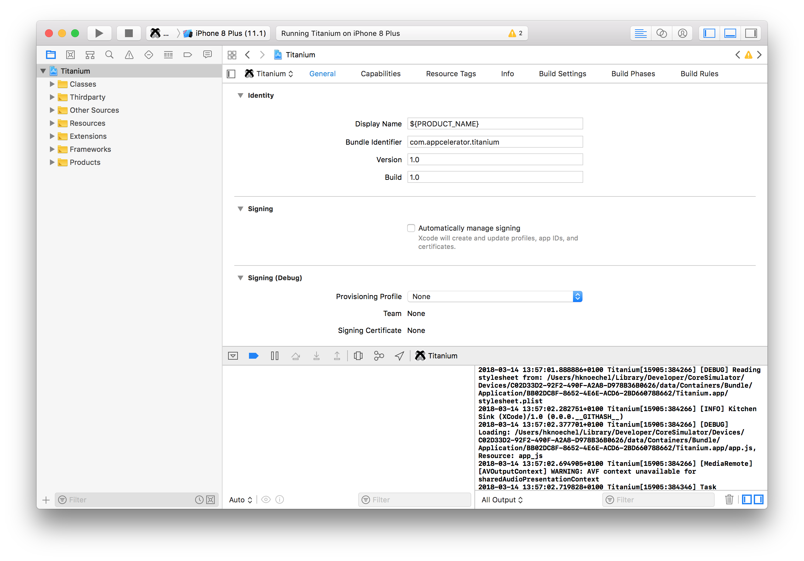
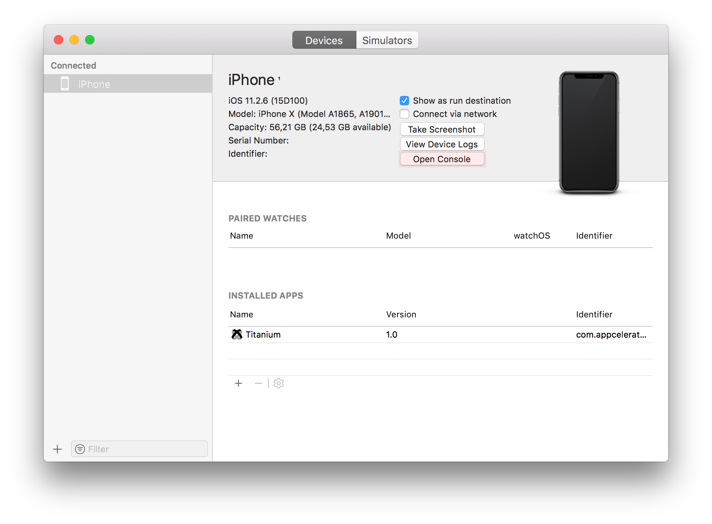

# Native iOS Debugging and Testing Tools

## Objective

In this section, you will about the testing and debugging tools provided as part of the Xcode environment.

## Contents

The iOS SDK provides various tools that are useful for debugging native apps. May of them can also be used for your Titanium application development. In this section, we'll take a look at how to view log output within Xcode, view device logs, and view crash logs. We'll introduce, but not dig too deep into the Instruments tool. We'll cover it in more depth in another section.

### View log output in Console

You can use the **Console** application to view log output from an iOS simulator. You can either open the **Console** application from the iOS simulator or through the `Applications` folder.

To open **Console** from the iOS simulator, from the menu bar, select **Debug** > **Open System Log** **...**.

To open **Console** from the `Applications` folder:

1. Click **Applications**.

2. Select **Utilities** > **Console****.app**.

3. On the left bar, expand **iOS Simulator**, then expand the version of the simulator you are using.

4. Click **system.log** item to view the simulator's log output.

### View log output in Xcode

You can view log output within Xcode. This includes the same information output to the Studio console. Viewing the Xcode (gdb) console is useful if you build your Titanium app from within Xcode to set project-specific parameters, build options, and so forth. (Keep in mind that you lose Titanium's i18n string handling if you build via Xcode.) It would also be useful when debugging a native iOS module for Titanium.

To view log output in Xcode:

1. Build your project via Studio, then close the simulator.

2. Open `yourproject/build/iphone/yourproject.xcodeproj` (e.g. `KitchenSink.xcodeproj`) in Xcode.

3. Build and run the project within Xcode. Log output is shown in the Console output panel.

### View log output on a connected device

A more useful technique is to view the logging messages that are generated by an app running on a connected iOS device. You can do this via the Console view in the Xcode Organizer or using the macOS system Console. The console displays Titanium logging messages, plus iOS system messages that might provide additional useful information.

To view the console output of a connected device:

1. Connect your device.

2. Build and deploy the app to the device using either the CLI (`appc run -p ios -T device`) or Studio.

3. Sync the application to the device using the [iPhone Configuration Utility](https://support.apple.com/downloads/iPhone-Configuration-Utility) (if you are not building directly to device).

4. Launch Xcode.

5. Open the **Devices** window. From the menu, select **Window** \> **Devices and Simulators**.

6. Select your device from the left bar.

7. Click the **Open Device** button to show the console.

### View crash logs on a device

You can view crash logs generated when an app running on your device crashes. That data is not hugely useful for debugging Titanium apps because it will include native object related logging messages, not Titanium logging output. That crash data will be tied to the Titanium module (object) that was involved with running your code rather than your JavaScript. This sort of logging information would be most useful when debugging a native iOS module for Titanium.

To view the crash log of a connected device:

1. Connect your device.

2. Launch Xcode.

3. Open the **Devices** window. From the menu, select **Window** \> **Devices and Simulator**.

4. Select your device from the left bar.

5. Click the **View** **Device Logs** button.

6. In the list of available log files, select your app. There might be more than one file for your app, one for each time it has crashed.

### Instruments

Instruments is a tool for memory monitoring and profiling. It can be a very useful tool for profiling your app to determine if there are memory leaks and perhaps to discover the causes of poor performance. We'll cover this tool in depth in the [Managing Memory and Finding Leaks](/guide/Titanium_SDK/Titanium_SDK_How-tos/Debugging_and_Profiling/Managing_Memory_and_Finding_Leaks/) section.

### Simulate cellular network conditions with the Network Link Conditioner

You should test your app under less-than-ideal conditions so that you know how it will react as users go into roaming mode, operate over low-speed data networks, and so forth. If they run your app in such a state, your app should react appropriately rather than crashing. You can simulate slow, noisy, and lossy networks by using the Network Link Conditioner preferences tool included with macOS.

Network Link Conditioner might not be installed by default. To install it:

1. Click the Spotlight (magnifying glass) icon and enter **Network Link Conditioner**.

2. When prompted, select **Install for all users of this computer** and click **Install**. Enter your password.

3. Select the profile that represents the network conditions you'd like to simulate.

4. Click the lock and enter your password.

5. Turn the link conditioner on.

::: warning ⚠️ Warning
Once installed, you can access the Network Link Conditioner via the System Preferences application.
:::

Once you turn on link conditioning, your network speed will throttled to the level defined by the profile you selected. At this point, you can test your app in the Simulator under conditions that more realistically reflect the real world.

Because the network throttling applies to your entire system, any macOS tasks you have running that use the network will also be throttled. This might include your email application, web browser, or streaming music player. Incidentally, this means you can use the Network Link Conditioner to test Android apps running in the emulator; it too will see network access throttled as you specified.

If the default network condition profiles don't meet your needs, you can create a custom network profile. You might use a custom profile to specify certain conditions, such as packet loss, upload or download delays, and so forth.

### References

* Apple Developer docs: [Viewing Console Output and Device Logs](http://developer.apple.com/library/IOs/#documentation/Xcode/Conceptual/ios_development_workflow/130-Debugging_Applications/debugging_applications.html)

* [Simulating slow network connections](http://titaniumninja.com/simulating-slow-network-links-on-os-x/) with `ifpw` for macOS.

## Summary

In this section, you learned that how to view log messages on a connected device, how to view crash logs, and how to view logging messages within Xcode. Of these, viewing log messages from a device is the technique most applicable to debugging Titanium JavaScript issues. The other techniques are better suited to module development.
