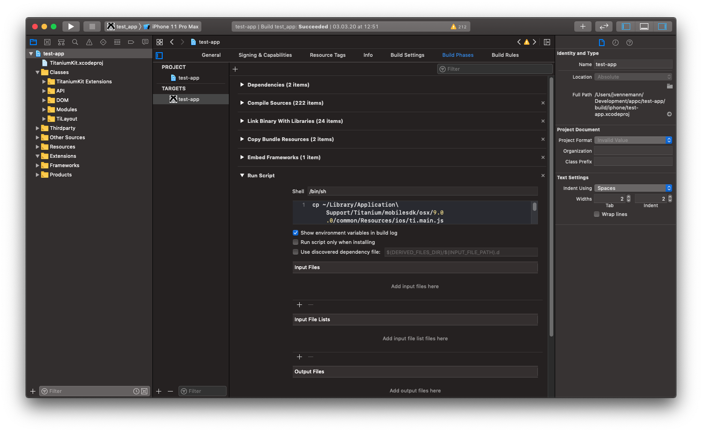
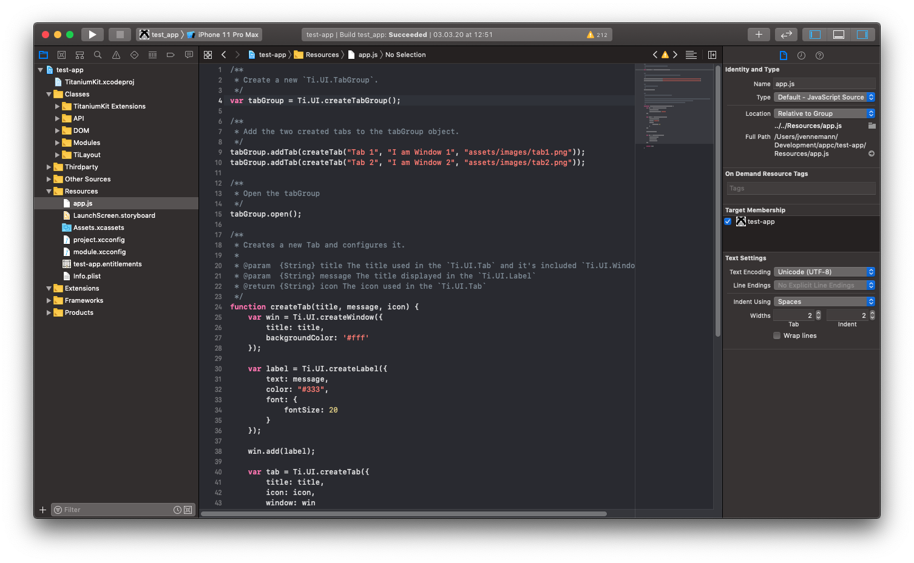
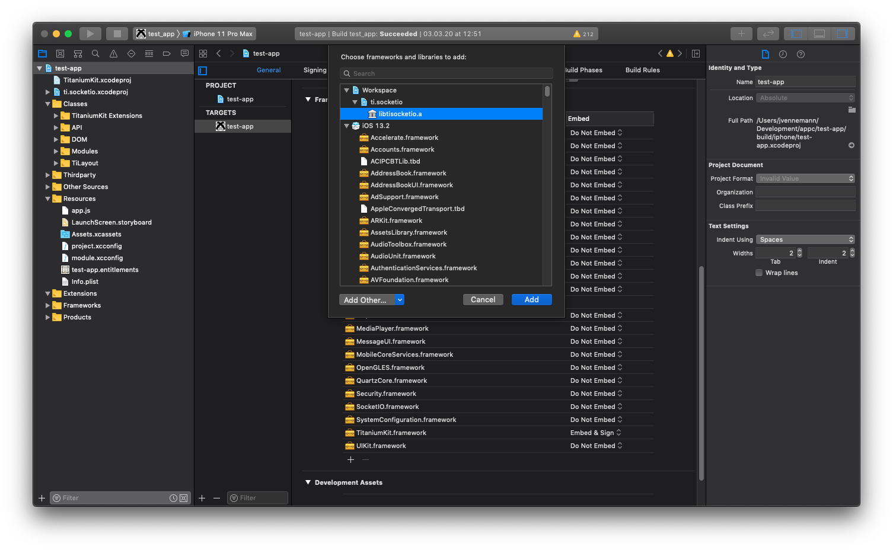
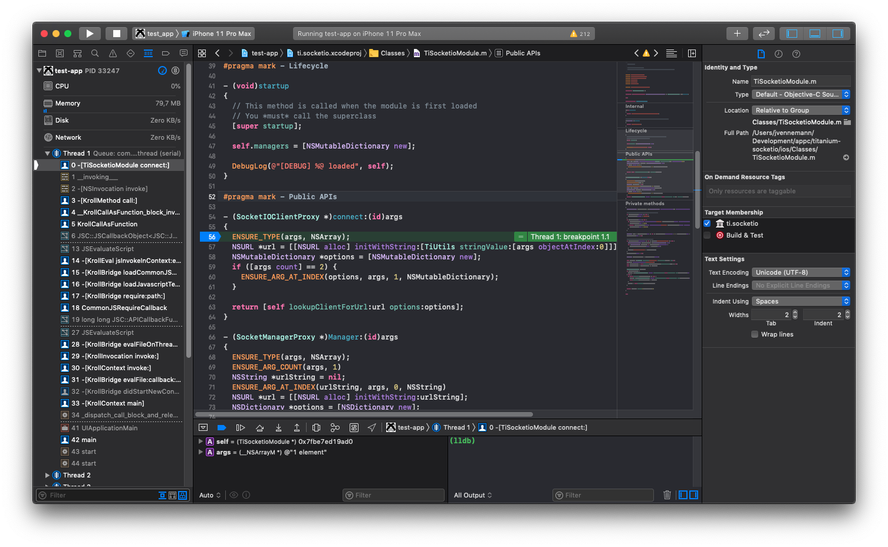

# iOS Module Debugging

## Introduction

This guide covers how to debug a native iOS module directly inside Xcode. As an example we will setup the [titanium-socketio](https://github.com/appcelerator-modules/titanium-socketio) module.

## Prerequisites

To debug a native iOS module you first need a Titanium test app. It is recommended to use a new plain Titanium app project. You can create a new one with the following command.

```
ti create -t app
```

After you created the new app project you need to build it once. This will generate the Xcode project we'll use as the starting point to setup iOS module debugging.

```
ti build -p ios -b
```

## Preparing Xcode project

Now that you have a newly generated Xcode project there are a few changes that need to be done to get everything up and running. Open up the generated Xcode project from `<project-dir>/build/iphone/<project-name>.xcodeproj`.

### Add Build Phase

First you need to add a new "Run Script" phase to the app target.

```
cp ~/Library/Application\ Support/Titanium/mobilesdk/osx/<sdk-version>/common/Resources/ios/ti.main.js ${BUILT_PRODUCTS_DIR}/${CONTENTS_FOLDER_PATH}/ti.main.js
cp ${SRCROOT}/build/Products/Debug-iphonesimulator/${CONTENTS_FOLDER_PATH}/_index_.json ${BUILT_PRODUCTS_DIR}/${CONTENTS_FOLDER_PATH}/_index_.json
```

Make sure to change the `<sdk-version>` to the SDK version that you used while running the above `ti build` command. This will copy two required runtime files into the app bundle, which is usually done by the Titanium CLI.



### Add Resources to Copy

Next you need to drag and drop the projects `Resources/app.js` file into the Xcode project and place it under the `Resources` group. Do this for all other JS files as well that you may want to require.



::: tip 💡 NOTE
These files are not getting transpiled like you are used to when building a Titanium app via CLI. You need to make sure that they only contain valid JavaScript for the device you targeting.
:::

## Adding and linking module

Next up you'll add the module Xcode project as a dependency. Again, simply drag and drop the module's Xcode project into the open Xcode project of your testing app.


Now you need to add the module's library (Objective-C) or framework (Swift) to the main Xcode project. Select the target and under the "General" tab, look for "Frameworks, Libraries, and Embedded Content" and press "+" to add it.



::: tip 💡 Third-Party Dependencies
If the module you are debugging contains third-party dependencies under its `ios/platform` folder, you need to add them here as well. In the dialog that pops up after pressing "+", select "Add Other..." > "Add files..." and select the dependencies of your module. You also need to adjust the header and/or framework search path under "Build Settings", so Xcode knows where to find your module's dependencies.
:::

Switch over to the "Build Phases" tab and make sure to add the module project as a dependency so Xcode will build both the app and the module. Press the "+" under "Dependencies" and select the module's library (Objective-C) or framework (Swift) as a dependency.


## Build and Debug

You can now build and debug the whole app and your module. Open `Resources/app.js` and add some code that uses your module from JavaScript.

**Resources/app.js**

```javascript
const io = require('ti.socketio');
const socket = io.connect('http://localhost:8080');
```

Set a breakpoint in the code you want to debug and run the app!


