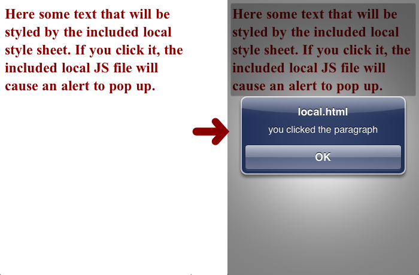

# The WebView Component

::: warning ⚠️ Warning
With Titanium SDK 8.0.0, we now use [WKWebView](/guide/Titanium_SDK/Titanium_SDK_How-tos/WKWebView/) to implement Ti.UI.WebView (as Apple has deprecated [UIWebView](https://developer.apple.com/documentation/uikit/uiwebview)).
:::

## Overview

Despite the fact that Titanium gives us the opportunity to use native UI components, sometimes we still need to make use of web content. Whether it's displaying an existing website, making use of the <canvas>, or handling an RSS feed, leveraging web content is something mobile developers need to be able to do. In order to make use of a platform's native webview component, we need only use `Ti.UI.WebView`. This API allows us to create, display, and interact with both local and remote web content.

In the following sections we'll see exactly how we can create `WebViews` in our apps using the Titanium API, use both local and remote data as the source of our web content, and examine how we can use the properties and functions of the `Ti.UI.WebView` to enhance the user experience.

## Contents

* Using Remote WebContent with WebView

* Using Local Web Content with WebView

* WebView Properties and Functions

* Performance and Interaction Concerns

### Using Remote WebContent with WebView

In its simplest form, a `WebView` is created with the `Ti.UI.createWebView()` function and added to the view hierarchy just as we would any other view component. Let's look at a simple example. Here we'll display an existing website in our native app using just a few lines of code.

```javascript
var win = Ti.UI.createWindow();
var webview = Ti.UI.createWebView({
  url: 'http://www.appcelerator.com'
});
win.add(webview);
win.open();
```


As pictured above, we need only specify the `url` of a remote website in order to display it in a `WebView`. And just like other view components, we are free to resize and position the `WebView` any way we like. For example, if we wanted to have a smaller `WebView` that was only a portion of the visible screen, we could do something like this:

```javascript
var win = Ti.UI.createWindow();
var webview = Ti.UI.createWebView({
    url: 'http://www.appcelerator.com',
    height: '200dp'
});
win.add(webview);
win.open();
```


The `WebView` itself is only 200 density independent pixels in height, but the entire webpage is viewable by scrolling vertically. By parceling our web content to a smaller portion of the screen, we are able to use the remaining space for anything we want. We can add native UI components or even more `WebViews`.

One of the more interesting uses of remote `WebViews` is displaying mobile optimized content. This is particularly useful when the content encompasses large amounts of functionality that we won't have to code for ourselves. A great example of this is the `Ti.Facebook` module that makes use of Facebook's default login screen via `WebView` for authentication. This example, along with a few others, can be found in the [WebView Use Cases](/guide/Titanium_SDK/Titanium_SDK_How-tos/Integrating_Web_Content/WebView_Use_Cases/) section of this chapter.

### Using Local Web Content with WebView

Often times when dealing with web content we'll want to load it from local resources. This allows offline usage and can decrease the load time of the `WebView`. This web content can include HTML, CSS, and even Javascript libraries. The syntax for loading local web content is identical to that of the remote:

```javascript
var win = Ti.UI.createWindow();
var webview = Ti.UI.createWebView({
  url: 'local.html'
});
win.add(webview);
win.open();
```

`local.html` refers to a local HTML file included in our project. The path used by the `url` property when referring to local web content is relative to your project's `Resources` directory for Titanium projects, or `app/assets` and `app/lib` directories for Alloy project. This is important to note as you include more complex local web content, as we'll discuss next.

Let's say you not only want to show a local HTML file, but you also want that HTML file to have access to local CSS and Javascript files. All you need to do is remember that all local web content is available relative to your project's `Resources` directory for Titanium projects, or `app/assets` and `app/lib` directories for Alloy project.. You can think of the directory almost as a local web server root path. To illustrate this point, let's take the prior example and expand it to use local CSS and Javascript files.

**local.html**

```html
<html>
  <head>
    <meta name="viewport" content="width=device-width, initial-scale=1.0">
    <title>Local HTML</title>
    <link rel="stylesheet" type="text/css" href="local.css"/>
    <script src="local.js"></script>
  </head>
  <body onload="addParagraphAlert();">
    <p id="localtest">
      Here some text that will be styled by the included local style sheet. If you click it,
      the included local JS file will cause an alert to pop up.
    </p>
  </body>
</html>
```

**local.css**

```css
p {
  color: #880000;
  font-weight: bold;
  font-size: 24px;
}
```

**local.js**

```javascript
function addParagraphAlert() {
  document.getElementById('localtest').addEventListener('click', function(e) {
    alert('you clicked the paragraph');
  });
}
```

All of the above files are placed in the `Resources` directory of your project. Below we can see what this would look like on an iPhone:



The included HTML/CSS/JS does not have to be this simplistic, though. With local web content you can include any HTML/CSS/JS that the platform's browser will support. This include graphics libraries for <canvas> or even using jQuery inside your `WebViews`. You get the best of both worlds with Titanium: Access to native components along with all the power of the web.

In addition to being able to specify local HTML files, you can also add HTML dynamically to your `WebViews` via the `html` property. This can be used for adding everything from simple styled text to a full fledged webpage. Here's how you would specify HTML in your own `WebView` via `html`. This would display a very simple paragraph in an unstyled `WebView`.

```javascript
var win = Ti.UI.createWindow();
var webview = Ti.UI.createWebView({
  html: '<html><body><p>Here is my paragraph</p></body></html>'
});
win.add(webview);
win.open();
```

One additional, and extremely powerful, bit of functionality available to you with local `WebViews` is the ability for your local web content to be able to communicate bidirectionally with your Titanium code via application level events. What this means is that interactions and data from your `WebViews` can be shared with your native Titanium code, and vice versa. This will be discussed in more detail in the [Communication Between WebViews and Titanium](/guide/Titanium_SDK/Titanium_SDK_How-tos/Integrating_Web_Content/Communication_Between_WebViews_and_Titanium/) section.

### WebView Properties and Functions

Now that you've seen how to render `WebViews` using both local and remote web content, let's look at some of the ways we can add more style and control to them. This includes functions, properties, and events for basic web browser navigation, data handling, loading control, and scaling.

#### Navigation

Let's first look at the functions available to us to manage navigation of the `WebView`. Just like a typical web browser, the `WebView` supports navigation via links. This means that if you want to support multi-page navigation, you need to now the following functions:

* `canGoBack()` - A function that returns a boolean value indicating whether or not the `WebView` can go back in its history

* `canGoForward()` - A function that returns a boolean value indicating whether or not the `WebView` can go forward in its history

* `goBack()` - A function that moves the `WebView` back in its history. This would commonly be bound with a UI "back" button.

* `goForward()` - A function that moves the `WebView` forward in its history. This would commonly be bound with a UI "forward" button.

#### Loading Control

Another familiar set of functionality is the ability to refresh and stop the loading of a `WebView`. The functions and properties listed below give us visibility into the loading state of the `WebView` and the ability to control it.

* `loading` - A boolean property that indicates whether or not the `WebView` is currently loading content.

* `reload()` - A function that reloads the `WebView`, much like a browser refresh.

* `repaint()` - A function that causes the `WebView` to repaint its contents.

* `stopLoading()` - A function that stops the loading of a `WebView`, much like the "stop" button in most browsers.

#### Data Handling & Scaling

As covered in the previous sections, passing local and remote data to the `WebView` is its core functionality. Additionally, we can pass in basic authentication and handle the initial scaling of that data as well.

* `setBasicAuthentication(username, password)` - A function that passes basic HTTP authentication into the `WebView`. It takes 2 string parameters, `username` and `password`, that will be used to authenticate.

* `html` - A string property containing the HTML you would like to render in the `WebView`.

* `scalesPageToFit` - A boolean property that indicates whether or not you would like to scale the content of the `WebView` to fit its dimensions. (Also see notes about the `viewport` meta tag in [#Web Content For WebViews](#WebContentForWebViews).)

* `url` - A URL property to local or remote web content. For remote content, this parameter is the web URL. For local content, this parameter is the path, relative to the project's `Resources` directory for Titanium projects, or `app/assets` and `app/lib` directories for Alloy project., to the local HTML file.

#### Events

`WebView` also has a few custom events to allow additional control over the lifecycle of a load, as well as any errors that may occur in the underlying native webview.

* `beforeload` - This event is fired before the `WebView` starts loading its content. The `url` property of the event object contains the source of the content.

* `error` - This event is fired when a `WebView` fails to load. Like the `beforeload` event, it has the `url` property. It also has a `message` property, which is a string that contains the details of the error.

* `load` - This event is fired when the `WebView` has loaded.

### Performance and Interaction Concerns

While `WebViews` give us the ability to leverage the power of the web in our apps, they do come at a cost. The `WebView` is on of the most expensive components to create in terms of resources and performance. Every `WebView` loaded requires its own rendering context and will take a moment to load, regardless of how simple its contents are.

For these reasons, it's critical that you are absolutely certain you need a `WebView` to create a specific functionality in your app. A good rule of thumb is that if you can recreate web content using Titanium native components, then you should do so. Minimal usage of `WebViews` will not likely be a problem, but their resource requirements can quickly become unmanageable if continually used. A prime example of this would be usage of `WebViews` in `Ti.UI.TableViews`. Performance is of utmost concern with `TableViews` and including `WebViews` in your `TableViewRows` is a recipe for sluggish performance.

On final consideration with `WebViews` is that they do not play well inside of other scrollable components. This is a limitation of the underlying native components. `WebViews` are pretty greedy when it comes to touch interactions and this will often steal those events from any containing views that have their own touch handlers. If you must include `WebViews` inside other scrollable components, your best bet will be to disable touch events on your `WebView` by setting its `touchEnabled` property to `false`.

### Best Practices for Web Content

Content displayed in a web view must be tuned for mobile browsers for best results. In particular, you should investigate the `viewport` meta tag options available for controlling the scaling, zooming, and size of the embedded content. For example, if a web view is resized, it may not dynamically relayout its contents. Setting the viewport meta tag correctly can resolve these issues.

For more information, see the following resources:

* [Configuring the Viewport](http://developer.apple.com/library/safari/#documentation/AppleApplications/Reference/SafariWebContent/UsingtheViewport/UsingtheViewport.html) in the Apple Safari Web Content Guide

* [Targeting Screens from Web Apps](http://developer.android.com/guide/webapps/targeting.html) in the Android API Guides

* [Using the viewport meta tag to control layout on mobile browsers](https://developer.mozilla.org/en/Mobile/Viewport_meta_tag) in Mozilla's Developer Documentation

## Summary

In this section we learned how to create `Ti.UI.WebViews` to display local and remote web content. We explored the multitude of functions, properties, and events available to `WebViews` that give it extensive control over its functionality and appearance. Finally, we discussed some of the performance and interaction concerns when incorporating `WebViews` into your apps.

In the next section we'll learn how we can use Titanium application level events to bidirectionally communicate between embedded Javascript in a `WebView` and native Titanium code. This will add a whole new level of interaction between our Titanium code and web content.
