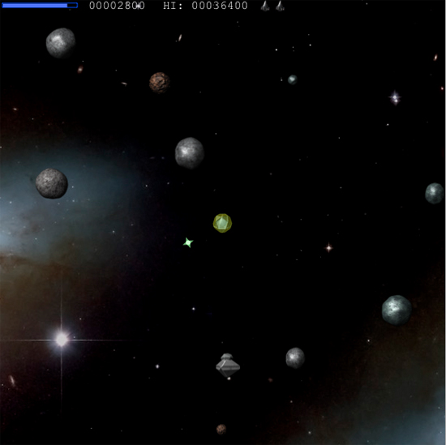
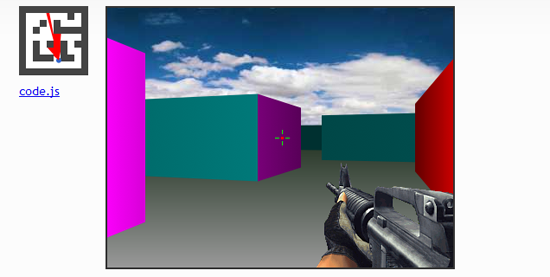
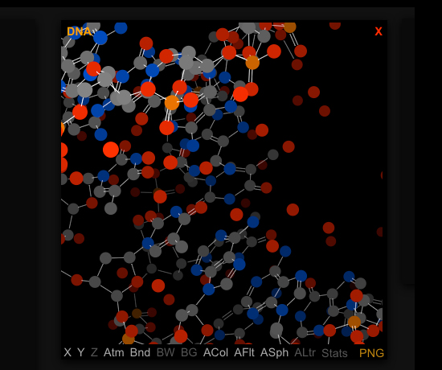

# WebView Use Cases

::: warning ⚠️ Warning
With Titanium SDK 8.0.0, we now use [WKWebView](/guide/Titanium_SDK/Titanium_SDK_How-tos/WKWebView/) to implement Ti.UI.WebView (as Apple has deprecated [UIWebView](https://developer.apple.com/documentation/uikit/uiwebview)).
:::

## Overview

We've discussed when you should and shouldn't use `WebViews` in your apps. It requires a careful evaluation of necessary functionality versus performance. Let's look at some real cases where `WebViews` are the most appropriate solution. We'll discuss integration with social networking authentication and leveraging HTML5 graphics processing as prime reasons to use `WebViews`.

### Ti.Facebook

One of the best reasons for leveraging `WebViews`, integration with social networking authentication, has actually been built into the Titanium API. The `Ti.Facebook` module includes a login component, rendered in a `WebView`, that handles the authentication of Facebook users. Users are presented with the familiar Facebook login screen and once authenticated, are free to use Facebook APIs via your app.

Here is a basic example of how this module is used. We supply `Ti.Facebook` with an `appid` and an array of `permissions`, set up an event handler for the login, then call the `Ti.Facebook.authorize()` function. The `WebView` that is presented with the Facebook login screen handles the rest. Here's the code, followed by the interface that your users will see when they attempt to login.

```javascript
var win = Ti.UI.createWindow();
Titanium.Facebook.appid = '[YOUR APPID]';
Titanium.Facebook.permissions = ['publish_stream'];
Titanium.Facebook.addEventListener('login', function(e) {
    if (e.success) {
        alert('Logged In');
    } else if (e.error) {
        alert(e.error);
    } else if (e.cancelled) {
        alert("Cancelled");
    }
});
Titanium.Facebook.authorize();
win.open();
```


This is a one-time dialog that your users will immediately recognize. This is a clear case where functionality and familiarity encapsulated in a `WebView` more than makes up for any performance or load delay your app might incur.

### HTML5 Canvas Rendering

Titanium, through its core API, does not include a canvas-like rendering context. While Titanium can animate properties of its UI components, it can't generate graphics, animation, physics, and other interactions as one would expect in a game. Modules give us the opportunity to extend rendering capabilities through native code, but in many cases a simpler solution is more appropriate.

Titanium developers, like other web-based mobile developers, can use the `WebView` component to render animations and interactions in the HTML5 `<canvas>` element. While the `<canvas>` element has varying levels of support in desktop browsers, Android and iOS webviews have supported it for some time now. Because of this, Titanium developers can deliver rich interactive apps via this powerful HTML5 element.

A tutorial explaining how to develop with the HTML5 `<canvas>` element is beyond the scope of this document, but that doesn't mean we can't take a look at what's possible. The following screenshots give just a taste of what's possible with `<canvas>` rendering. In addition to the visuals shown, the animation and user interaction possible with this element can create very complex and immersive user experiences.

 

 

 

As though the examples seen here aren't impressive enough, Titanium offers us even more. Titanium uniquely gives us the ability to augment our `<canvas>` code in `WebViews` with native UI components and services. The possibilities here can range from simple buttons and sliders to modify `<canvas>` settings to a full heads-up display overlay on fully interactive, animated web content.

### Forms

Titanium provides APIs to collect user input, such as the [Ti.UI.TextField](#!/api/Titanium.UI.TextField) and [Ti.UI.TextArea](#!/api/Titanium.UI.TextArea). Still, HTML forms offer a couple of features that might be advantageous in some cases.

* WebViews are automatically scrollable, so the soft keyboard won't cover the input fields in your HTML form.

* On iOS and some versions of Android, navigation buttons (Next, Previous, and Done) are displayed above the soft keyboard to assist data entry. Users can tap these buttons to navigate the fields of your form.

* You can use JavaScript libraries, such as jQuery, to add form validation, field highlighting, and so forth to an HTML form displayed within a WebView in your app. HTML 5 includes form validation support, though platform implementations vary.

You can control which keyboard type is displayed with a WebView form by setting attributes on the `<input>` tag. See [https://developer.mozilla.org/en-US/docs/Web/HTML/Element/input](https://developer.mozilla.org/en-US/docs/Web/HTML/Element/input) for more information.

## Summary

In this section we saw a few particular cases where `WebViews` are the most appropriate way to add functionality to our apps. The `Ti.Facebook` module makes use of a `WebView` to offer users a simple and familiar way to login to the world's most popular social network. We also saw how we can use the HTML5 `<canvas>` element to create graphics, animations, and interaction that go well beyond the core capabilities of the Titanium API.

`Ti.UI.WebViews` are a powerful component of the Titanium API. But as we know, with great power comes great responsibility. With the knowledge gained in this chapter, you should be well equipped to determine when a `WebView` is appropriate, and how to best leverage its capabilities in order to deliver a high quality user experience.
