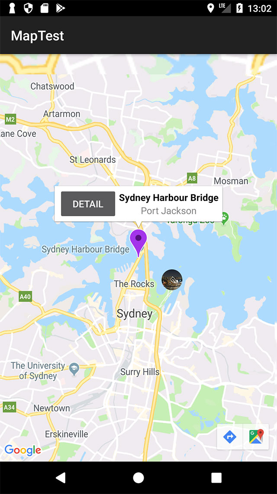

# Google Maps v2 for Android

## Introduction

The Google Maps Ti.Map module requires a Google API key to be set in your Android manifest (even for development and testing) and the Google Play services SDK, which can be installed using the Android SDK manager. Google Play services is also required to be installed on the device.

### Install the Google Play Services SDK

The Google Maps Ti.Map module uses Google Maps Android API v2, which requires the Google Play Services SDK. To install the Google Play Services SDK, launch the Android SDK Manager and select to install Google Play services.

1. To launch the Android SDK manager:

    ```
    #If the Android SDK tools folder is in your PATH:
    android
    #If not
    <path_to_android_sdk>/tools/android
    ```

2. After the Android SDK Manager application launches, in the **Extras** folder, select **Google Play services**, then click **Install X Packages....**

3. A dialog appears confirming your selection. Accept the license and click **Install** to continue.

### Obtain and Add a Google API Key

To use the Google Maps v2 module, you need to create a Google API project, enable Google Maps Android API v2, then obtain and add a Google Maps API key to the project.

1. Create a Google API project and enable Google Map Android API v2 for the project (see [Create an API project in the Google APIs Console](https://developers.google.com/maps/documentation/android/signup#create_an_api_project_in_the_console_name)).

2. Obtain and add a Google Maps API key to your project (see [Get an Android API key](https://developers.google.com/maps/documentation/android/signup#get_an_android_api_key)). To generate a Google Maps API key, you need a package name and a SHA-1 certificate fingerprint.

    1. The package name is the Application ID from the `tiapp.xml` file.

    2. For the SHA-1 certificate fingerprint, use JDK keytool command to extract the SHA-1 string from either the debug certificate, shipped with the Titanium SDK, or from a release certificate that you generate yourself to distribute an application. If you are using the Run command from Studio to build and test your application for an Android Device, use the debug certificate. If you are using the Publish command from Studio to package and distribute your application to the Android App Store, use the release certificate.

#### Obtain the SHA-1 certificate fingerprint

For the debug certificate, the SHA-1 certificate fingerprint is stored in a keystore file that comes with each Titanium SDK. The keystore is located at `mobilesdk/<platform>/<sdk_version>/android/dev_keystore` in your Titanium SDK home directory. For example, to retrieve the SHA-1 fingerprint on macOS, for Titanium SDK 7.2.0.GA in the default install location, run the following command:

```
keytool -list -v -keystore ~/Library/Application\ Support/platform/mobilesdk/osx/7.2.0.GA/android/dev_keystore
```

If prompted for a password, hit enter (no password). Use the `SHA1` string under Certificate fingerprints.

For the release certificate, follow the directions from [Distributing Android apps](/guide/Titanium_SDK/Titanium_SDK_Guide/Preparing_for_Distribution/Distributing_Android_apps/) to create your release certificate, then run the `keytool` command to retrieve the SHA-1 certificate fingerprint.

#### Add the Google API key and permissions to the tiapp.xml file

After you have obtained a Google API key, add it your `tiapp.xml` file. Add the `meta-data` element to the `android` section as shown below. You may need to add the `manifest` and `application` elements.

```xml
<ti:app>
    <android xmlns:android="http://schemas.android.com/apk/res/android">
        <manifest>
            <application>
                <!-- Replace "PASTE YOUR GOOGLE MAPS API KEY HERE" with the Google API key you obtained -->
                <meta-data android:name="com.google.android.maps.v2.API_KEY" android:value="PASTE YOUR GOOGLE MAPS API KEY HERE"/>
            </application>
        </manifest>
    </android>
</ti:app>
```

### Add the module to your project

The `ti.map` module is included as part of the Titanium SDK and you do not need to download it. Edit your `tiapp.xml` file to use the module.

* In Studio, double-click the `tiapp.xml` file to open it in TiApp Editor, select the GUI Overview tab, and in the **Modules** section, click the add button (green plus sign), select the `ti.map` module, then click the OK button to add it.

* or in a text editor, add the following to your modules section:

```
...
    <modules>
        <!-- Add this line to your modules section -->
        <module platform="android">ti.map</module>
    </modules>
...
```

Within your application's JavaScript files, instantiate the module with the `require('ti.map')` method:

```javascript
var MapModule = require('ti.map');
```

Then, you can make subsequent API calls using the previously created `MapModule` object .

```javascript
// Create a default Map.View class
var mapView = MapModule.createView({
  mapType:MapModule.NORMAL_TYPE
});
```

## Transitioning from Titanium.Map

The new add-on module behaves the same as the built-in Titanium.Map proxy with the following exceptions:

**Requirements:**

* Only works on Android devices. Not supported on the Android emulator.

* Requires Google Play services SDK to be installed.

* Requires Google Maps API key for both development and production.

**New features:**

* **Support for multiple map views.** Unlike the built-in Titanium.Map proxy, the new Google Maps v2 module can display multiple map views.

* **Support native UI controls and gestures.** The new Google Maps v2 module supports the native UI controls (zooming, compass and user position) and gestures (rotating and tilting).

* **Custom view annotations.** You can display annotations with a custom view instead of the default pin image. Set the Annotation's `customView` property to use a custom view.

* **Draggable annotations.** Annotations are draggable with the new Google Maps v2 module. Set the Annotation's `draggable` property to true to enable this behavior and use the `pinchangedragstate` to monitor the pin's drag state.

* **Display traffic conditions.** The new Google Maps v2 module can display current traffic conditions, depending on data availability. Set the View's `traffic` property to true to enable this behavior.

* **Additional Annotation colors.** The new Google Map v2 module has more color constants besides ANNOTATION\_GREEN and ANNOTATION\_RED.

**Behavior changes:**

* **Route class.** In the Google Maps v2 module, you need to create a Route object before adding it. Previously in the Titanium.Map proxy, routes were created using an abstract data type with the `addRoute` method.

* **Missing Annotation properties.** The `animate` property and its accessors are not supported on the Annotation class in the Google Maps v2 module. This is a native iOS-specific feature.

* **Missing View properties.** The following properties and their accessors are not supported on the View class in the Google Maps v2 module: `hideAnnotationWhenTouchMap` , `latitudeDelta` , `longitudeDelta` `and` `regionFit` .

    * For the `hideAnnotationWhenTouchMap` property, annotations can be deselected by either touching the annotation again or touching the View outside the annotation. Previously in the Titanium.Map proxy, you had to choose one of these behaviors to deselect the annotation. In the Google Maps v2 module, both methods of deselecting an annotation work by default.

    * The `latitudeDelta` and `longitudeDelta` properties were read-only properties in the Titanium.Map proxy that can be accessed using View's `region` property with the Google Maps v2 module.

* **Missing Map constants.**

    * The STANDARD\_TYPE constant is missing from the Google Maps v2 module. Use the NORMAL\_TYPE constant instead.

    * The ANNOTATION\_PURPLE constant is missing from the Google Maps v2 module. Use the ANNOTATION\_VIOLET constant instead.

## Check for Google Play Services

In order to view maps, Google Play services needs to be installed on the device. Use the `isGooglePlayServicesAvailable()` method to check to see if Google Play services is installed.

```javascript
var MapModule = require('ti.map');
var rc = MapModule.isGooglePlayServicesAvailable();
switch (rc) {
    case MapModule.SUCCESS:
        Ti.API.info('Google Play services is installed.');
        break;
    case MapModule.SERVICE_MISSING:
        alert('Google Play services is missing. Please install Google Play services from the Google Play store.');
        break;
    case MapModule.SERVICE_VERSION_UPDATE_REQUIRED:
        alert('Google Play services is out of date. Please update Google Play services.');
        break;
    case MapModule.SERVICE_DISABLED:
        alert('Google Play services is disabled. Please enable Google Play services.');
        break;
    case MapModule.SERVICE_INVALID:
        alert('Google Play services cannot be authenticated. Reinstall Google Play services.');
        break;
    default:
        alert('Unknown error.');
}
```

If Google Play services is not installed on device, either the map view is black, displays a message that Google Services is missing or the application crashes.

## Views

The `View` class is the core UI component of the Google Maps v2 module. It allows Titanium to make use of Google's Android Maps v2 API to view geographic data and add annotations and routes. As it is a native UI component, users will also have access to features like scrolling and multi-touch zoom. In its most basic form, the `View` can simply display a basic map given a geographic position via latitude and longitude.

```javascript
// Add in the module
var MapModule = require('ti.map');

var win = Ti.UI.createWindow({ backgroundColor: 'white' });

var map1 = MapModule.createView({
    userLocation: true,
    mapType: MapModule.NORMAL_TYPE,
    animate: true,
    region: { latitude: -33.87365, longitude: 151.20689, latitudeDelta: 0.1, longitudeDelta: 0.1 },
    height: '50%',
    top: 0,
    left: 0,
    width: '50%'
});

var map2 = MapModule.createView({
    userLocation: true,
    mapType: MapModule.TERRAIN_TYPE,
    animate: true,
    region: { latitude: -33.87365, longitude: 151.20689, latitudeDelta: 0.1, longitudeDelta: 0.1 },
    height: '50%',
    top: 0,
    right: 0,
    width: '50%'
});

var map3 = MapModule.createView({
    userLocation: true,
    mapType: MapModule.SATELLITE_TYPE,
    animate: true,
    region: { latitude: -33.87365, longitude: 151.20689, latitudeDelta: 0.1, longitudeDelta: 0.1 },
    height: '50%',
    bottom: 0,
  left: 0,
    width: '50%'
});

var map4 = MapModule.createView({
    userLocation: true,
    mapType: MapModule.HYBRID_TYPE,
    animate: true,
    region: { latitude: -33.87365, longitude: 151.20689, latitudeDelta: 0.1, longitudeDelta: 0.1 },
    height: '50%',
    bottom: 0,
    right: 0,
    width: '50%',
    traffic: true
});

win.add(map1);
win.add(map2);
win.add(map3);
win.add(map4);
win.open();
```


The previous example displays four map views of the same region in the same window with different map types and options set. From the top-left, going clockwise, you have an example of NORMAL\_TYPE, TERRAIN\_TYPE, HYBRID\_TYPE with traffic conditions and SATELLITE\_TYPE.

As seen above, changing a few lines of code alters the appearance of each map. The following properties are unique to Map View to manipulate the appearance and behavior of the View class:

* `mapType` - Indicates what type of map should be displayed. Choses are:

    * `<MapObject>.STANDARD_TYPE -`Basic map with labels.

    * `<MapObject>.SATELLITE_TYPE -`Satellite imagery without map labels.

    * `<MapObject>.TERRAIN_TYPE -`Terrain map with labels.

    * `<MapObject>.HYBRID_TYPE` - SATELLITE\_TYPE with map labels.

* `region` - This is an object that contains the four properties defining the visible area of the `View`. The same latitude and longitude of a `region` can be represented with a different level of zoom via the `latitudeDelta`and `longitudeDelta` properties.

    * `latitude`\- The latitude of your map's target region.

    * `longitude` - The longitude of your map's target region.

    * `latitudeDelta` - The measure of latitude north and south from your target regions's latitude that will be visible in the `View`. The smaller the delta value, the closer the zoom on your map.

    * `longitudeDelta` - The measure of longitude east and west from your target regions's longitude that will be visible in the `View.`

* `animate` - A boolean that indicates whether or not map actions, like opening and adding annotations, should be animated.

* `traffic` - A boolean that indicates if the map should display traffic conditions. This varies by region.

* `userLocation` - A boolean that indicates if the map should show the user's current device location as a pin on the map.

There are two more components that add a significant amount of functionality to your map `View`\--`Annotation` and `Route`. They allow us to add places of interest to our maps as well as plot paths between them.

## Annotations

Annotations, created with the `createAnnotation` method, mark places of interest on our `View`with "pins", images, and text. They can be added when a `View` is created via the `annotations` array property, or anytime afterwards with the `addAnnotation` method. Users can even interact with them to learn more about annotated locations.

Adding an annotation to a `View` is simple. Let's modify the previous example to show only one view of Sydney with some landmarks.

```javascript
var MapModule = require('ti.map');
var win = Ti.UI.createWindow();
var opera = MapModule.createAnnotation({
    latitude: -33.8569,
    longitude: 151.2153,
    centerOffset: { x: 80, y: 25 },
    image: 'SydneyOperaHouse.png',
    title: 'Sydney Opera House',
    subtitle: 'Sydney, New South Wales, Australia'
});

var bridge = MapModule.createAnnotation({
    latitude: -33.852222,
    longitude: 151.210556,
    pincolor: MapModule.ANNOTATION_PURPLE,
    title: 'Sydney Harbour Bridge',
    subtitle: 'Port Jackson',
    // For eventing, use the Map View's click event
    // and monitor the clicksource property for 'leftButton'.
    leftButton: Ti.UI.createButton({ title: 'Detail' })
});

var mapview = MapModule.createView({
    mapType: MapModule.NORMAL_TYPE,
    region: { latitude: -33.87365, longitude: 151.20689, latitudeDelta: 0.1, longitudeDelta: 0.1 },
    annotations: [bridge, opera]
});

win.add(mapview);
win.open();
```



The previous example creates three annotations and adds them to the view–two on creation and one post creation. Note that the View's annotations property accepts an array. Even if there is only one annotation, we still need to pass it to the `View` as an entry in an array. The map view displays three custom annotations:

* The Sydney Harbour Bridge annotation uses the default pin image, but the info window contains a Button in the left pane, set with the `leftView` property, and an image of the bridge in the right pane, set with the `rightButton` property.

* The Sydney Opera House annotation uses an image of the opera house instead of the default pin image, set with the `image` property.

* The random annotation uses a Label instead of the default pin image, set with the `customView` property, and is also draggable, set with the `draggable` property.

L et's take a look at each of the properties used in this example.

* `customView –`A custom view to be used in place of the default pin image. This property takes precedence over the `image` property. The annotation only responds to the map view's events and not the events of the view component.

* `draggable` - A boolean variable that indicates whether or not the annotation can be dragged and replaced in the `View`.

* `image` - The URL to an image to be used in place of the default pin image.

* `leftButton`/`rightButton` – Places an image in the left or right side of the annotation's info window. Listen to the map view's `click` event and check the `clicksource` property for either `leftPane` or `rightPane`to see if the user interacted with this component. This property takes precedence over the `leftView`/`rightView` property.

* `leftView`/`rightView` – Places a custom view in the left or right side of the annotation's info window. The events of the view component do not fire. Listen to the map view's `click` event and check the `clicksource` property for either `leftPane` or `rightPane`to see if the user interacted with this component.

* `pincolor` - The color of the default pin representing an annotation. It can have the following values:

    * `<MapObject>.ANNOTATION_AZURE`

    * `<MapObject>.ANNOTATION_BLUE`

    * `<MapObject>.ANNOTATION_CYAN`

    * `<MapObject>.ANNOTATION_GREEN`

    * `<MapObject>.ANNOTATION_MAGENTA`

    * `<MapObject>.ANNOTATION_ORANGE`

    * `<MapObject>.ANNOTATION_RED`

    * `<MapObject>.ANNOTATION_ROSE`

    * `<MapObject>.ANNOTATION_VIOLET`

    * `<MapObject>.ANNOTATION_YELLOW`

* `subtitle` - The subtitle text that appears on your annotation when clicked.

* `title` - The main title text that appears on your annotation when clicked.

The next section discusses the `Route` class, a feature to create paths between locations on a `View`.

## Routes

Routes, created with the `createRoute` method, allow us to draw paths between locations on a `View`. These paths can be driving directions, bike paths, or any other reason you have to connect point A to point B. In the example below, a route is created going between three points:

```javascript
var MapModule = require('ti.map');

var win = Ti.UI.createWindow({backgroundColor: 'white'});

var appc = MapModule.createAnnotation({
    latitude: 37.389569,
    longitude: -122.050212,
    title: 'Appcelerator HQ',
    subtitle: 'Mountain View, CA',
    pincolor: MapModule.ANNOTATION_GREEN
});

var apple = MapModule.createAnnotation({
    latitude: 37.331689,
    longitude: -122.030731,
    title: 'Apple HQ',
    subtitle: 'Cupertino, CA',
    pincolor: MapModule.ANNOTATION_RED
});

var google = MapModule.createAnnotation({
    latitude: 37.422502,
    longitude: -122.0855498,
    title: 'Google HQ',
    subtitle: 'Mountain View, CA',
    pincolor: MapModule.ANNOTATION_VIOLET
});

var route = MapModule.createRoute({
    width: 4,
    color: '#f00',
    points: [
        {latitude:google.latitude, longitude:google.longitude},
        {latitude:appc.latitude, longitude:appc.longitude},
        {latitude:apple.latitude, longitude:apple.longitude}
    ]
});

var mapview = MapModule.createView({
    mapType: MapModule.NORMAL_TYPE,
    region: {latitude: 37.389569, longitude: -122.050212, latitudeDelta: 0.2, longitudeDelta: 0.2},
    annotations: [google,appc,apple]
});

mapview.addRoute(route);
win.add(mapview);
win.open();
```

After creating the three annotation points, the application creates a route object, using the `createRoute` method. Let's take a look at each of the route properties.

* `points` - Array of latitude and longitude coordinates that represent each point in the route. As geometry dictates, you must have a least two points to draw a line, or route in this case.

* `color` - Specifies the color of the line.

* `width` - Specifies the width of the line in pixels.

Once the route object is created, the application can add it to the view using the `addRoute` method.

## Event handling

The Map View object provides a few extra events that provide additional control for using the Map module:

* `click` - This event only fires when the user selects or deselects an Annotation object and does not respond to any other user interaction. Check the event object's `annotation` property to see which annotation was clicked and the `clicksource` property to see what part of the annotation the user clicked.

* `complete` - This event fires when the Map View finishes rendering.

* `pinchangedragstate` - This event fires when the pin's drag state changes if the pin's `draggable` property is set to true. Check the event object's `annotation` property to see which annotation was clicked and the `newState` property for one of the following:

    * `<MapModule>.ANNOTATION_DRAG_STATE_START` – indicates the user started dragging the pin.

    * `<MapModule>.ANNOTATION_DRAG_STATE_END` – indicates the user stopped dragging the pin.

* `regionchanged` - This event fires when the user either changes the zoom level or pans the Map View. The event returns the new latitude and longitude coordinates as well as delta values.

For example, the following code listens to each of the previous events and outputs information to the console when each event fires:

```javascript
var MapModule = require('ti.map');
var win = Ti.UI.createWindow({backgroundColor: 'white'});
var appc = MapModule.createAnnotation({
    latitude: 37.389569,
    longitude: -122.050212,
    title: 'Appcelerator HQ',
    subtitle: 'Mountain View, CA',
    pincolor: MapModule.ANNOTATION_GREEN,
    draggable: true
});
var mapview = MapModule.createView({
    mapType: MapModule.HYBRID_TYPE,
    region: {latitude: 37.389569, longitude: -122.050212, latitudeDelta: 0.2, longitudeDelta: 0.2},
    annotations: [appc]
});
mapview.addEventListener('pinchangedragstate', function(e){
    Ti.API.info(e.type);
    Ti.API.info(JSON.stringify(e.newState));
});

mapview.addEventListener('click', function(e){
    Ti.API.info(e.type);
    Ti.API.info(JSON.stringify(e.clicksource));
});

mapview.addEventListener('regionchanged', function(e){
    Ti.API.info(e.type);
    Ti.API.info(e.latitude + "," + e.longitude);
});

mapview.addEventListener('complete', function(e){
    Ti.API.info(e.type);
});

win.add(mapview);
win.open();
```

If we run the example code, then:

* Start dragging the annotation

* Stop dragging the annotation

* Click the annotation

* Click the subtitle on the info window, and

* Pan to the left

The following output is printed to the console using the `adb logcat` command:

```
I/TiAPI   ( 3499):  complete
I/TiAPI   ( 3499):  pinchangedragstate
I/TiAPI   ( 3499):  0
I/TiAPI   ( 3499):  pinchangedragstate
I/TiAPI   ( 3499):  1
I/TiAPI   ( 3499):  click
I/TiAPI   ( 3499):  "pin"
I/TiAPI   ( 3499):  click
I/TiAPI   ( 3499):  "subtitle"
I/TiAPI   ( 3499):  regionchanged
I/TiAPI   ( 3499):  37.389843440466116,-121.93723306059837
```

The application responds to the user's interaction of selecting the annotation and panning as seen by the console output.

The Annotation and Route objects do not have events. To support click events on the Annotation object, use the Map View click event as described before.

## Troubleshooting

### Map is blank

In the `tiapp.xml` file (or `AndroidManifest.xml` file), do not set the `android:anyDensity` attribute in the `<supports-screens>` element. Specifically do not set it to true. Also, ensure to set a valid Google Maps API key before using native Google Maps features.

## Further reading

* [Titanium Map Module API Reference Documentation](#!/api/Modules.Map)
