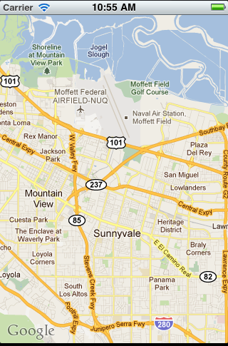
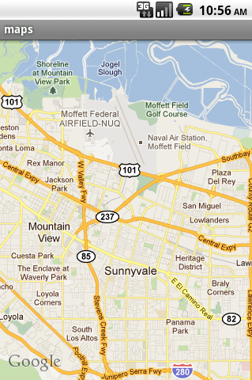
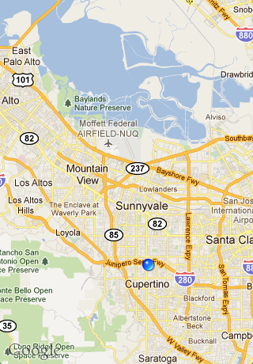
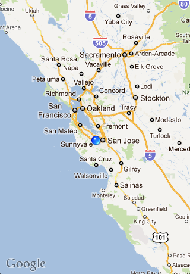
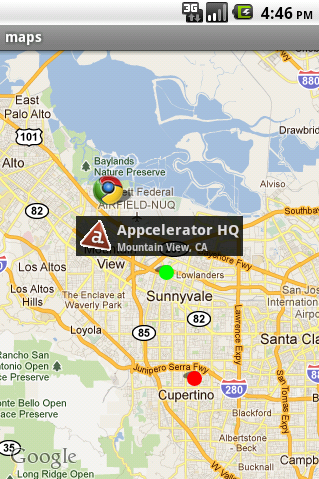
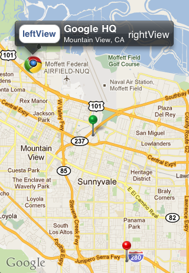
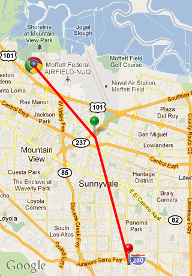

# Native Maps and Annotations

::: warning ⚠️ Warning
Use [ti.map add-on module](#!/api/Modules.Map) to add native maps support for your application. Google is no longer issuing Google Maps API v1 keys. If you have an application that still uses the old keys, you can either transition to the new module or continue using the built-in Titanium.Maps module. For more information about the add-on module, refer to [Google Maps v2 for Android](/guide/Titanium_SDK/Titanium_SDK_How-tos/Location_Services/Google_Maps_v2_for_Android/).
:::

## Objective

In this chapter, you'll learn how to use Titanium's Map API to visually represent location data via maps, routes, and annotations. In addition you'll learn best practices with respect to using the API. The context of location is one of the most powerful features of mobile apps, and soon you'll be equipped to visualize that data using native UI components through Titanium.

## Content

* Displaying a MapView

* Handling MapView events

* Annotations

* Routes

* Android Maps API Key for Distribution

### Displaying a MapView

The `MapView` is the core UI component of the `Ti.Map` module. It allows Titanium to make use of a mobile device's underlying native maps to view geographic data and add annotations and routes. As it is a native UI component, users will also have access to features like scrolling and multi-touch zoom. In its most basic form, the `MapView` can simply display a basic map given a geographic position via latitude and longitude.

```javascript
const Map = require('ti.map');
const win = Ti.UI.createWindow();
const mapview = Map.createView({
    mapType: Map.NORMAL_TYPE,
    region: {latitude:37.389569, longitude:-122.050212,
            latitudeDelta:0.1, longitudeDelta:0.1},
    animate:true,
    regionFit:true,
    userLocation:false
});
mapview.addEventListener('complete', function(e) {
    Ti.API.info('complete');
    Ti.API.info(e);
});
mapview.addEventListener('error', function(e) {
    Ti.API.info('error');
    Ti.API.info(e);
});
mapview.addEventListener('loading', function(e) {
    Ti.API.info('loading');
    Ti.API.info(e);
});
mapview.addEventListener('regionChanged', function(e) {
    Ti.API.info('regionChanged');
    Ti.API.info(e);
});

win.add(mapview);
win.open();
```

 

As seen above, those few lines of code generate native maps on both iOS and Android, respectively. Now that we have a basic map, let's discuss some of the properties of the `Ti.Map.MapView` in order to see how it can be manipulated.

* `mapType` - Indicates what type of map should be displayed. Below we see the `Ti.Map.NORMAL_TYPE`, `Ti.Map.SATELLITE_TYPE`, and `Ti.Map.HYBRID_TYPE` respectively.
      

* `region` - This is an object that contains the 4 properties defining the visible area of the `MapView`. Below we can see how the same latitude and longitude of a `region` can be represented with a different level of zoom via the `latitudeDelta` and `longitudeDelta` properties.
      

    * `latitude`\- The latitude of your map's target region

    * `longitude` - The longitude of your map's target region

    * `latitudeDelta` - The measure of latitude north and south from your target region's latitude that will be visible in the `MapView`. The smaller the delta value, the closer the zoom on your map.

    * `longitudeDelta` - The measure of longitude east and west from your target region's longitude that will be visible in the `MapView`

* `animate` - A boolean that indicates whether or not map actions, like opening and adding annotations, should be animated

* `regionFit` - A boolean that indicates if the map should attempt to fit the `MapView` into the region in the visible view

* `userLocation` - A boolean that indicates if the map should show the user's current device location as a pin on the map

::: warning ⚠️ Android MapView Limitation
On Android, only a **single** map view is supported per application. Adding a second map view to an application results in an exception being thrown.
:::

There are 2 more components that add a significant amount of functionality to your `mapViews`. They are `annotations` and `routes`. They allow us to add places of interest to our maps as well as plot paths between them. We'll address each in the following sections. But let's first discuss how we can handle events on our basic `MapView`.

### Handling MapView Events

In addition to the typical touch interaction events that all views have, `MapViews` have a couple more that give you more refined control. In many cases, we want to know exactly how a user's interaction with our initial map has changed its appearance. Also, having events that let us know when the map is loading and completed allow us to make our location based apps more responsive.

Here's the 3 events specific to `MapView` that give you that additional control, and one additional event for handling mapping errors:

* complete - This event is fired when the `MapView` has completed querying and rendering

* loading - This event is fired when the `MapView` has started querying for new data, as well as rendering the new map. This is typically the result of the user changing the visible region of the map.

* regionChanged - The event is fired when the visible region of our `MapView`has changed. This can occur from programmatic changes, or from user interaction with the map. The new region data is returned in the following structure:

    ```
    {
        latitude: 37.389569
        latitudeDelta: 0.1
        longitude: -122.050212,
        longitudeDelta: 1
        source: "[object TiMapView]",
        type: 'regionChanged'
    }
    ```

* error - This event let's us know when ever there is an error encountered by the underlying native maps. Often times these errors are not critical, but need to be handled in order to preserve a quality user experience.

As mentioned, the most common way to trigger the above events is through user interaction via scrolling and zooming. Let's change the `MapView` example code to handle all of the aforementioned events.

```javascript
const Map = require('ti.map');
const win = Ti.UI.createWindow();
const mapview = Titanium.Map.createView({
    mapType: Titanium.Map.NORMAL_TYPE,
    region: {latitude:37.389569, longitude:-122.050212,
            latitudeDelta:0.1, longitudeDelta:0.1},
    animate:true,
    regionFit:true,
    userLocation:false
});
mapview.addEventListener('complete', function(e) {
  Ti.API.info('complete');
  Ti.API.info(e);
});
mapview.addEventListener('error', function(e) {
  Ti.API.info('error');
  Ti.API.info(e);
});
mapview.addEventListener('loading', function(e) {
  Ti.API.info('loading');
  Ti.API.info(e);
});
mapview.addEventListener('regionChanged', function(e) {
  Ti.API.info('regionChanged');
  Ti.API.info(e);
});

win.add(mapview);
win.open();
```

Now we'll run the example again, this time zooming the map out after it renders.


And here is the event console output from this interaction.

```
[INFO] loading
[INFO] {
    source = "[object TiMapView]";
    type = loading;
}
[INFO] complete
[INFO] {
    source = "[object TiMapView]";
    type = complete;
}
[INFO] regionChanged
[INFO] {
    latitude = "37.35867258291223";
    latitudeDelta = "1.883241287989044";
    longitude = "-122.049009169728";
    longitudeDelta = "1.648237229196269";
    source = "[object TiMapView]";
    type = regionChanged;
}
```

Notice the order of events. `loading` is first, signifying that new map data needs to be queried. `complete` follows, letting us know that the preceding map query has completed. Finally, we get the `regionChanged` event which gives us the new coordinates and deltas for the visible map region. This is the typical flow for all map interactions.

So now that we can display a basic `MapView` and handle user interactions with it, let's take a look at how we can use annotations and routes to further extend the `MapView` functionality.

### Annotations

Annotations, created with the `Ti.Map.createAnnotation()` function, allow us to mark places of interest on our `MapViews` with "pins", images, and text. They can be added when a `MapView` is created via the `annotations` array property, or anytime afterwards with the `Ti.Map.MapView.addAnnotation()` function. Users can even interact with them to learn more about annotated locations.

Adding an annotation to a `MapView` is simple. Let's modify the basic `MapView` example to see how we can add the Appcelerator headquarters, and a few other locations, as annotations. To make things more interesting, we'll use a number of the styling properties available to annotations through the Titanium API.

```javascript
const Map = require('ti.map');
const win = Ti.UI.createWindow();
const annotations = [
    Map.createAnnotation({
        latitude: 37.389569,
        longitude: -122.050212,
        title: 'Appcelerator HQ',
        subtitle: 'Mountain View, CA',
        animate: true,
        pincolor: Map.ANNOTATION_GREEN,
        leftButton: 'appcelerator.gif'
    }),
    Map.createAnnotation({
        latitude: 37.331689,
        longitude: -122.030731,
        title: 'Apple HQ',
        subtitle: 'Cupertino, CA',
        animate: true,
        pincolor: Map.ANNOTATION_RED,
        rightButton: 'apple.png'
    }),
    Map.createAnnotation({
        latitude: 37.422502,
        longitude: -122.0855498,
        title: 'Google HQ',
        subtitle: 'Mountain View, CA',
        animate: true,
        image: 'google.png',
        leftView: Ti.UI.createButton({
            title: 'leftView',
            height: 32,
            width: 70
        }),
        rightView: Ti.UI.createLabel({
            text: 'rightView',
            color: '#fff'
        })
    })
];
const mapview = Map.createView({
    mapType: Map.NORMAL_TYPE,
    region: {
        latitude:37.389569,
        longitude:-122.050212,
        latitudeDelta:.05,
        longitudeDelta:.05
    },
    animate:true,
    regionFit:true,
    userLocation:false,
    annotations: annotations
});

win.add(mapview);
win.open();
```

We just created an array full of annotations, then passed that array to the `MapView` for use when it was created. Even if we had only one annotation, we still need to pass it to the `MapView` as an entry in an array. With the array of annotations constructed, we are ready to display them in a `MapView`. Here's what it looks like on Android and iPhone, respectively.

 

As we can see, there's many `Annotation` properties available for styling and interaction. We can add text, animations, colors, and even more UI components through use of these properties. Let's take a look at each of the properties used in this example.

* `animate` - A boolean variable that indicates whether or not the annotation should be animated when it is added to the `MapView`

* `image` - The URL to an image to be used in place of the default pin image

* `leftButton` - A button that will appear on the left side of your annotation when clicked. This property must have a value equal to the URL of an image, or to a `Ti.UI.iOS.SystemButton` constant.

* `leftView` - A Titanium View object that will appear on the left side of your annotation when clicked. This property can be a single view like a `Ti.UI.Button` or `Ti.UI.Label`, or it can be a hierarchy of views.

* `pincolor`\- The color of the default pin representing an annotation. It can have the following values:

    * `Ti.Map.ANNOTATION_GREEN`

    * `Ti.Map.ANNOTATION_PURPLE`

    * `Ti.Map.ANNOTATION_RED`

* `rightButton` - A button that will appear on the right side of your annotation when clicked. This property must have a value equal to the URL of an image, or to a `Ti.UI.iPhone.SystemButtonStyle` constant.

* `rightView` - A Titanium View object that will appear on the right side of your annotation when clicked. This property can be a single view like a `Ti.UI.Button` or `Ti.UI.Label`, or it can be a hierarchy of views.

* `subtitle` - The subtitle text that appears on your annotation when clicked

* `title` - The main title text that appears on your annotation when clicked

So now you know how to create a `MapView`, handle changes in its region, and add locations of interest via `Annotations`. There's one more bit of functionality: `routes`. In the next section we'll discuss `routes`, a feature that allows us to create paths between locations on a `MapView`.

### Routes

Routes allow us to draw paths between locations on a `MapView`. These paths can be driving directions, bike paths, or any other reason you have to connect point A to point B.

`Routes` are added to `MapViews` via the `Ti.Map.MapView.addRoute()` function. To use the `addRoute()` function, we pass it a properly structured `route` object that will then be represented on the `MapView`. The `route` object should take the following form:

```
{
    name: 'route name',
    color: '#f00',
    width: 4,
    points: [
        {latitude:50, longitude:50},
        ...
    ]
}
```

While the `name`, `color`, and `width` fields are self-explanatory, the `points` array could use some additional detail. `points` holds the array of latitude and longitude coordinates that represent each point in our `route`. As geometry dictates, you must have at least 2 points to draw a line, or route in this case. Limitations on the number of points you can use in a route are platform specific and are not governed by the Titanium API.

So let's go back to our `MapView` example one more time and add a route to it. We'll create a route that connects the 3 locations we've already annotated. The route will go from north to south, connecting each location with a red, 4 pixel wide line.

```javascript
const Map = require('ti.map');
const win = Ti.UI.createWindow();
const annotations = [
    Map.createAnnotation({
        latitude: 37.389569,
        longitude: -122.050212,
        title: 'Appcelerator HQ',
        subtitle: 'Mountain View, CA',
        animate: true,
        pincolor: Map.ANNOTATION_GREEN,
        leftButton: 'appcelerator.gif'
    }),
    Map.createAnnotation({
        latitude: 37.331689,
        longitude: -122.030731,
        title: 'Apple HQ',
        subtitle: 'Cupertino, CA',
        animate: true,
        pincolor: Map.ANNOTATION_RED,
        rightButton: 'apple.png'
    }),
    Map.createAnnotation({
        latitude: 37.422502,
        longitude: -122.0855498,
        title: 'Google HQ',
        subtitle: 'Mountain View, CA',
        animate: true,
        image: 'google.png',
        leftView: Ti.UI.createButton({
            title: 'leftView',
            height: 32,
            width: 70
        }),
        rightView: Ti.UI.createLabel({
            text: 'rightView',
            color: '#fff'
        })
    })
];
const mapview = Map.createView({
    mapType: Map.NORMAL_TYPE,
    region: {
        latitude:37.389569,
        longitude:-122.050212,
        latitudeDelta:.05,
        longitudeDelta:.05
    },
    animate:true,
    regionFit:true,
    userLocation:false,
    annotations: annotations
});
var route = Map.createRoute({
    name: 'myroute',
    width: 4,
    color: '#f00',
    points: [
        {latitude:37.422502, longitude:-122.0855498},
        {latitude:37.389569, longitude:-122.050212},
        {latitude:37.331689, longitude:-122.030731}
    ]
});

mapview.addRoute(route);
win.add(mapview);
win.open();
```

After we add the route to the existing `MapView`, we get the following map on iPhone.



### Google Maps API Key for Android

Google requires a different Map API key for each certificate that signs an Android application. While Titanium automatically provides you with this key during development, you'll need your own when you build for distribution. API Keys can be obtained without a fee from Google. For a more in depth overview, read the [Google Maps External Library overview](https://developers.google.com/maps/documentation/android/v1/).

In order to receive an API key that corresponds to your apps' certificate, you'll need to follow these steps:

#### 1\. Obtain the MD5 hash of your app's certificate from the keystore

Google uses the MD5 fingerprint of the certificate that signs your mobile application to generate a Maps API Key. This API Key is needed by Titanium when constructing the MapView. When your mobile application is run on the emulator or on a device, the underlying Maps implementation verifies that the API key used to pull map data matches the certificate which signed your application.

In order to get the MD5 hash of your distribution certificate, we run the Java SDK keystore tool `keytool` from command line with the following parameters, explained below:

```
keytool -list -keystore YOUR_KEYSTORE -alias ALIAS -storepass STOREPASS
```

* `YOUR_KEYSTORE` - The full path to your app's keystore file. For more details on how a keystore is generated, please reference the [Distributing Android apps](/guide/Titanium_SDK/Titanium_SDK_Guide/Preparing_for_Distribution/Distributing_Android_apps/) chapter of this book, as well as the [Android app signing documentation](http://developer.android.com/guide/publishing/app-signing.html).

* `ALIAS` - The alias you assigned to your keystore when you created it

* `STOREPASS` - The password you assigned to secure your keystore when you created it

Upon successful execution of this command you should receive an output similar to the one below. The MD5 hash required is the `Certificate fingerprint (MD5)` field, which has been highlighted. Copy and/or save the value found in this field.


#### 2\. Sign up for an Android Maps API Key

Once you have the MD5 fingerprint, log in with your Google (Gmail) account and visit the [Android Maps API Key Signup](https://developers.google.com/maps/documentation/android/v1/maps-api-signup) form.


Paste in your fingerprint and agree to the terms. Press Generate API Key. You should see a result similar to the image below.


#### 3\. Put your API Key in tiapp.xml in the property ti.android.google.map.api.key

Once you have received your API key, you need only include it in your project's `tiapp.xml` file to use it. To do so, we add an application property to the existing file under the main `<ti:app>` element. The property will look like this:

```xml
<property name="ti.android.google.map.api.key">YOUR_ANDROID_MAPS_API_KEY</property>
```

So if you were to include this in a basic `tiapp.xml` file, it would look something like this:

```xml
<?xml version="1.0" encoding="UTF-8"?>
<ti:app xmlns:ti="http://ti.appcelerator.org">
    <deployment-targets>
        <target device="mobileweb">false</target>
        <target device="iphone">false</target>
        <target device="ipad">false</target>
        <target device="android">true</target>
    </deployment-targets>
    <id>com.maps</id>
    <name>maps</name>
    <version>1.0</version>
    <publisher>tlukasavage</publisher>
    <url>http://appcelerator.com</url>
    <description>not specified</description>
    <copyright>2011 by tlukasavage</copyright>
    <icon>appicon.png</icon>
    <persistent-wifi>false</persistent-wifi>
    <prerendered-icon>false</prerendered-icon>
    <statusbar-style>default</statusbar-style>
    <statusbar-hidden>false</statusbar-hidden>
    <fullscreen>false</fullscreen>
    <navbar-hidden>false</navbar-hidden>
    <analytics>true</analytics>
    <guid>YOUR_GUID</guid>
    <iphone>
        <orientations device="iphone">
            <orientation>Ti.UI.PORTRAIT</orientation>
        </orientations>
        <orientations device="ipad">
            <orientation>Ti.UI.PORTRAIT</orientation>
            <orientation>Ti.UI.UPSIDE_PORTRAIT</orientation>
            <orientation>Ti.UI.LANDSCAPE_LEFT</orientation>
            <orientation>Ti.UI.LANDSCAPE_RIGHT</orientation>
        </orientations>
    </iphone>
    <android xmlns:android="http://schemas.android.com/apk/res/android"/>
    <modules/>

    <!-- Here's where we add the API key -->
    <property name="ti.android.google.map.api.key">YOUR_ANDROID_MAPS_API_KEY</property>
</ti:app>
```

You are now ready to use the Google map views in your distributable Titanium app.

## Summary

In this chapter we learned how to use the `Ti.Map` module to create, display, annotate, and navigate through maps. We used `Ti.Map.MapView` to represent native maps in our mobile app. In addition we used `Ti.Map.Annotations` to mark places of interest on our maps, adding more detailed data to our location based interactions. Finally, we learned how we can use `routes` to connect points of interest to our maps.
