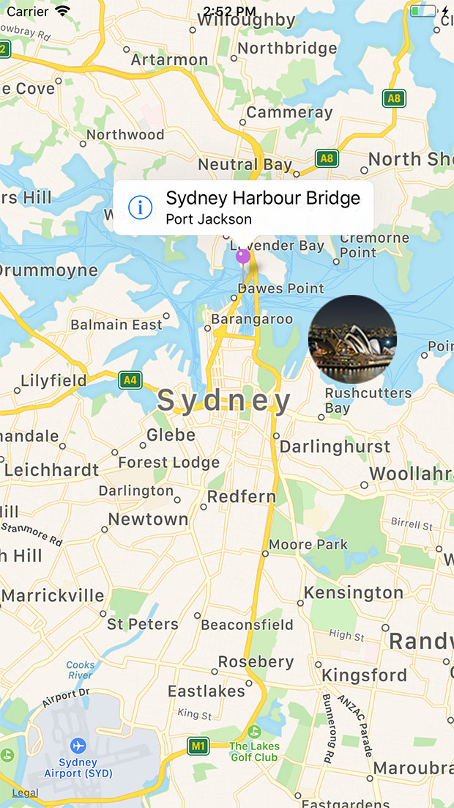

# iOS Map Kit

## Introduction

The ti.map module provides native map support using the iOS Map Kit framework to use native iOS map features in Titanium.

## Getting started

The Ti.Map module is included as part of the Titanium SDK. To include it in your project, edit your `tiapp.xml` file to use the module:

* Using the GUI Overview version of the `tiapp.xml` editor, in the **Modules** section, click the add button (green plus sign), select the ti.map module, then click the OK button to add it.

* If you are using a text editor, add the following to your modules section:

```
...
    <modules>
        <!-- Add this line to your <modules> section -->
        <module>ti.map</module>
    </modules>
...
```

* To use the `userLocation` property of the map-view, add either the [`NSLocationWhenInUseUsageDescription`](https://developer.apple.com/library/prerelease/ios/documentation/General/Reference/InfoPlistKeyReference/Articles/CocoaKeys.html#//apple_ref/doc/uid/TP40009251-SW26) or [`NSLocationAlwaysUsageDescription`](https://developer.apple.com/library/prerelease/ios/documentation/General/Reference/InfoPlistKeyReference/Articles/CocoaKeys.html#//apple_ref/doc/uid/TP40009251-SW18) key to the iOS plist section. For iOS 11+, also add the [NSLocationAlwaysAndWhenInUseUsageDescription](https://developer.apple.com/documentation/corelocation/choosing_the_authorization_level_for_location_services/requesting_always_authorization?language=objc) key for best user experience:

```
...
    <ios>
        <plist>
            <dict>
                <key>NSLocationAlwaysUsageDescription</key>
                <string>
                    Specify the reason for accessing the user's location information.
                    This appears in the alert dialog when asking the user for permission to
                    access their location.
                </string>
        <!-- iOS 11+ only. Ignored on older iOS versions -->
        <key>NSLocationAlwaysAndWhenInUseUsageDescription</key>
        <string>
          Specify additional information on accessing the user location. Refer
          to the Apple docs for details.
        </string>
            </dict>
        </plist>
    </ios>
...
```

Within your application's JavaScript files, instantiate the module with the `require('ti.map')` method:

```javascript
var MapModule = require('ti.map');
```

Then, you can make subsequent API calls using the previously created `MapModule` object .

```javascript
// Create a default Map.View class
var mapView = MapModule.createView({
  mapType:MapModule.NORMAL_TYPE
});
```

## Views

The `View` class is the core UI component of the ti.map module. It allows Titanium to use the iOS map kit framework to view geographic data and add annotations and routes. As it is a native UI component, users will also have access to features like scrolling and multi-touch zoom. In its most basic form, the `View` can simply display a basic map given a geographic position via latitude and longitude.

```javascript
// Add in the module
var MapModule = require('ti.map');

var win = Ti.UI.createWindow({ backgroundColor: 'white' });
var oneThird = Ti.Platform.displayCaps.platformHeight / 3;
var map1 = MapModule.createView({
    userLocation: true,
    mapType: MapModule.NORMAL_TYPE,
    animate: true,
    region: { latitude: -33.87365, longitude: 151.20689, latitudeDelta: 0.1, longitudeDelta: 0.1 },
    height: '33%',
    top: 0,
    width: Ti.UI.FILL
});

var map2 = MapModule.createView({
    userLocation: true,
    mapType: MapModule.HYBRID_TYPE,
    animate: true,
    region: { latitude: -33.87365, longitude: 151.20689, latitudeDelta: 0.1, longitudeDelta: 0.1 },
    height: '33%',
    top: oneThird,
    width: Ti.UI.FILL
});

var map3 = MapModule.createView({
    userLocation: true,
    mapType: MapModule.SATELLITE_TYPE,
    animate: true,
    region: { latitude: -33.87365, longitude: 151.20689, latitudeDelta: 0.1, longitudeDelta: 0.1 },
    height: '33%',
    top: 2 * oneThird,
    width: Ti.UI.FILL
});

win.add(map1);
win.add(map2);
win.add(map3);
win.open();
```


The previous example displays three map views of the same region in the same window with different map types set. From the top to bottom, you have an example of `NORMAL_TYPE`, `HYBRID_TYPE` and `SATELLITE_TYPE`.

As seen above, changing a few lines of code alters the appearance of each map. The following properties are unique to Map View to manipulate the appearance and behavior of the View class:

* `mapType` - Indicates what type of map should be displayed. Choses are:

    * `<MapObject>.STANDARD_TYPE -`Basic map with labels.

    * `<MapObject>.SATELLITE_TYPE -`Satellite imagery without map labels.

    * `<MapObject>.HYBRID_TYPE` - SATELLITE\_TYPE with map labels.

* `region` - This is an object that contains the four properties defining the visible area of the `View`. The same latitude and longitude of a `region` can be represented with a different level of zoom via the `latitudeDelta`and `longitudeDelta` properties.

    * `latitude`\- The latitude of your map's target region.

    * `longitude` - The longitude of your map's target region.

    * `latitudeDelta` - The measure of latitude north and south from your target regions's latitude that will be visible in the `View`. The smaller the delta value, the closer the zoom on your map.

    * `longitudeDelta` - The measure of longitude east and west from your target regions's longitude that will be visible in the `View.`

* `animate` - A boolean that indicates whether or not map actions, like opening and adding annotations, should be animated.

* `userLocation` - A boolean that indicates if the map should show the user's current device location as a pin on the map.

* `camera` - Specify a Camera object to view the map in a 3D perspective. For more details, see the [Camera section](#camera).

* `rotatesEnabled` - A boolean that indicates if the map can be rotated by the user.

There are two more components that add a significant amount of functionality to your map `View,``Annotation` and `Route` instances. They allow us to add places of interest to our maps as well as plot paths between them.

## Annotations

Annotations, created with the `createAnnotation` method, mark places of interest on our `View`with "pins", images, and text. They can be added when a `View` is created via the `annotations` array property, or anytime afterwards with the `addAnnotation` method. Users can even interact with them to learn more about annotated locations.

Adding an annotation to a `View` is simple. Let's modify the previous example to show only one view of Sydney with some landmarks.

```javascript
var MapModule = require('ti.map');
var win = Ti.UI.createWindow();
var opera = MapModule.createAnnotation({
    latitude: -33.8569,
    longitude: 151.2153,
    centerOffset: { x: 80, y: 25 },
    image: 'SydneyOperaHouse.png', // 80x80px in this example
    title: 'Sydney Opera House',
    subtitle: 'Sydney, New South Wales, Australia',
    // For events, use the Map View's click event
    // and monitor the clicksource property for 'rightButton'.
    rightButton: Ti.UI.iOS.SystemButton.CONTACT_ADD
});

var bridge = MapModule.createAnnotation({
    latitude: -33.852222,
    longitude: 151.210556,
    pincolor: MapModule.ANNOTATION_PURPLE,
    title: 'Sydney Harbour Bridge',
    subtitle: 'Port Jackson',
    // For eventing, use the Map View's click event
    // and monitor the clicksource property for 'leftButton'.
    leftButton: Ti.UI.iOS.SystemButton.INFO_DARK
});

var mapview = MapModule.createView({
    mapType: MapModule.NORMAL_TYPE,
    region: { latitude: -33.87365, longitude: 151.20689, latitudeDelta: 0.1, longitudeDelta: 0.1 },
    annotations: [bridge, opera]
});

win.add(mapview);
win.open();
```



The previous example creates two annotations and adds them to the view. Note that the View's annotations property accepts an array. Even if there is only one annotation, we still need to pass it to the `View` as an entry in an array. The map view displays three custom annotations:

* The Sydney Harbour Bridge annotation uses the default pin image, and the callout window contains the iOS info system button, set with the `leftButton` property.

* The Sydney Opera House annotation uses an image of the opera house instead of the default pin image, set with the `image` property. The callout window contains the iOS add system button, set with the `rightButton` property.

L et's take a look at some of the properties that can be used to customize an annotation.

* `canShowCallout` - Set to `false` to disable showing the callout window when the annotation is clicked. Default is `true`.

* `centerOffset` - Repositions the annotation from its actual location. Specify a point where positive offset values move the annotation view down and right, while negative values move it up and left.

* `customView` –A custom view to be used in place of the default pin image. This property takes precedence over the `image` property. The annotation does not respond to any user interaction or events.

* `draggable` - A boolean variable that indicates whether or not the annotation can be dragged and replaced in the `View`.

* `image` - The URL to an image to be used in place of the default pin image.

* `leftButton`/`rightButton` - Place an [iOS system button](#!/api/Titanium.UI.iPhone.SystemButton) in the left or right side of the annotation's callout window. Listen to the map view's `click` event and check the `clicksource` property for either `leftButton` or `rightButton` to see if the user interacted with this component.

* `pincolor` - The color of the default pin representing an annotation. It can have the following values:

    * `<MapObject>.ANNOTATION_GREEN`

    * `<MapObject>.ANNOTATION_PURPLE`

    * `<MapObject>.ANNOTATION_RED`

* `subtitle` - The subtitle text that appears on your annotation when clicked.

* `title` - The main title text that appears on your annotation when clicked.

The next section discusses the `Route` class, a feature to create paths between locations on a `View`.

## Routes

Routes, created with the `createRoute` method, allow us to draw paths between locations on a `View`. These paths can be driving directions, bike paths, or any other reason you have to connect point A to point B. In the example below, a route is created going between three points:

```javascript
var MapModule = require('ti.map');

var win = Ti.UI.createWindow({ backgroundColor: 'white' });

var appc = MapModule.createAnnotation({
    latitude: 37.389569,
    longitude: -122.050212,
    title: 'Appcelerator HQ',
    subtitle: 'Mountain View, CA',
    pincolor: MapModule.ANNOTATION_GREEN
});

var apple = MapModule.createAnnotation({
    latitude: 37.331689,
    longitude: -122.030731,
    title: 'Apple HQ',
    subtitle: 'Cupertino, CA',
    pincolor: MapModule.ANNOTATION_RED
});

var google = MapModule.createAnnotation({
    latitude: 37.422502,
    longitude: -122.0855498,
    title: 'Google HQ',
    subtitle: 'Mountain View, CA',
    pincolor: MapModule.ANNOTATION_RED
});

var route = MapModule.createRoute({
    width: 4,
    color: '#f00',
    points: [
        { latitude: google.latitude, longitude: google.longitude },
        { latitude: appc.latitude, longitude: appc.longitude },
        { latitude: apple.latitude, longitude: apple.longitude }
    ]
});

var mapview = MapModule.createView({
    mapType: MapModule.NORMAL_TYPE,
    region: { latitude: 37.389569, longitude: -122.050212, latitudeDelta: 0.2, longitudeDelta: 0.2 },
    annotations: [google, appc, apple]
});

mapview.addRoute(route);
win.add(mapview);
win.open();
```

After creating the three annotation points, the application creates a route object, using the `createRoute` method. Let's take a look at each of the route properties.

* `points` - Array of latitude and longitude coordinates that represent each point in the route. As geometry dictates, you must have a least two points to draw a line, or route in this case.

* `color` - Specifies the color of the line.

* `width` - Specifies the width of the line in pixels.

* `level` - Specifies which overlay level to place the route. Set to either `<MapObject>.OVERLAY_LEVEL_ABOVE_LABELS` (above map labels) or `<MapObject>.OVERLAY_LEVEL_ABOVE_ROADS` (below labels but above roads).

Once the route object is created, the application can add it to the view using the `addRoute` method.

## Camera

You can view the map using a 3D perspective by specifying a Camera object that describes the coordinate of the location you want to look at and the pitch, altitude and heading of the camera. To create a Camera object, use the `createCamera` method and pass in a dictionary with the following properties:

* `centerCoordinate`: point that you want to look at.

* `altitude`: how high above the ground to position the camera in meters.

* `heading`: angle relative to the center coordinate to position the camera in degrees. `0` means due North, `90` mean due East, `180` mean due South, and so forth.

* `pitch`: angle to tilt the camera downwards in degrees. This property is set to `0` (flat, no tilt) if the map type is either satellite or hybrid.

After you have created your Camera object, you can either set it to the View's `camera` property or pass the object to the View's `animateCamera` method. The property changes the perspective without an animation, while the method animates the perspective change. The map view needs to be on screen before using these APIs.

You can customize the look of the map by specifying the following Map View properties:

* `pitchEnabled` - A boolean specifying whether to use the Camera's pitch information.

* `showsBuildings` - A boolean specifying whether to display extruding building information if available.

* `showsPointsOfInterest` - A boolean specifying whether to display points of interest.

The example below views the Eiffel Tower looking towards the Seine River.

```javascript
var MapModule = require('ti.map');
var win = Ti.UI.createWindow();

// Camera view centered on the Eiffel Tower
var pariscam = MapModule.createCamera({
    altitude: 300,
    centerCoordinate: {
        longitude: 2.2945,
        latitude: 48.8582
    },
    heading: -45,
    pitch: 60
});

// Map centered on the Eiffel Tower
var mapview = MapModule.createView({
    mapType: MapModule.NORMAL_TYPE,
    animate: true,
    region: { latitude: 48.8582, longitude: 2.2945, latitudeDelta: 0.02, longitudeDelta: 0.02 }
});

// Change the view perspective after the map view appears on the display
function animateCamera() {
    // Remove the event listener or else you cannot pan the view
    mapview.removeEventListener('complete', animateCamera);
  // Does not animate the camera change
  //mapview.camera = pariscam;
  // Animates the camera change
  mapview.animateCamera({
    camera: pariscam,
    curve: Ti.UI.ANIMATION_CURVE_EASE_IN,
    duration: 500
  });
};
mapview.addEventListener('complete', animateCamera);
win.add(mapview);
win.open();
```


## Event handling

The Map View object provides a few extra events that provide additional control for using the Map module:

* `click` - This event only fires when the user selects or deselects an Annotation object and does not respond to any other user interaction. Check the event object's `annotation` property to see which annotation was clicked and the `clicksource` property to see what part of the annotation the user clicked.

* `complete` - This event fires when the Map View finishes rendering.

* `pinchangedragstate` - This event fires when the pin's drag state changes if the pin's `draggable` property is set to true. Check the event object's `annotation` property to see which annotation was clicked and the `newState` property for one of the following:

    * `<MapModule>.ANNOTATION_DRAG_STATE_START` – indicates the user started dragging the pin.

    * `<MapModule>.ANNOTATION_DRAG_STATE_END` – indicates the user stopped dragging the pin.

* `regionchanged` - This event fires when the user either changes the zoom level or pans the Map View. The event returns the new latitude and longitude coordinates as well as delta values.

For example, the following code listens to each of the previous events and outputs information to the console when each event fires:

```javascript
var MapModule = require('ti.map');
var win = Ti.UI.createWindow();
var appc = MapModule.createAnnotation({
    latitude: 37.389569,
    longitude: -122.050212,
    title: 'Appcelerator HQ',
    subtitle: 'Mountain View, CA',
    pincolor: MapModule.ANNOTATION_GREEN,
    draggable: true
});
var mapview = MapModule.createView({
    mapType: MapModule.HYBRID_TYPE,
    region: { latitude: 37.389569, longitude: -122.050212, latitudeDelta: 0.2, longitudeDelta: 0.2 },
    annotations: [appc]
});
mapview.addEventListener('pinchangedragstate', function (e) {
    Ti.API.info(e.type);
    Ti.API.info(JSON.stringify(e.newState));
});

mapview.addEventListener('click', function (e) {
    Ti.API.info(e.type);
    Ti.API.info(JSON.stringify(e.clicksource));
});

mapview.addEventListener('regionchanged', function (e) {
    Ti.API.info(e.type);
    Ti.API.info(e.latitude + ',' + e.longitude);
});

mapview.addEventListener('complete', function (e) {
    Ti.API.info(e.type);
});

win.add(mapview);
win.open();
```

The application responds to the user's interaction of selecting the annotation and panning as seen by the console output.

The Annotation and Route objects do not have events. To support click events on the Annotation object, use the Map View click event as described before.

## Further reading

* [Titanium Map Module API Reference Documentation](#!/api/Modules.Map)
