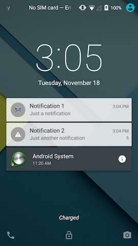
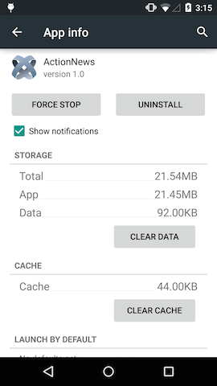
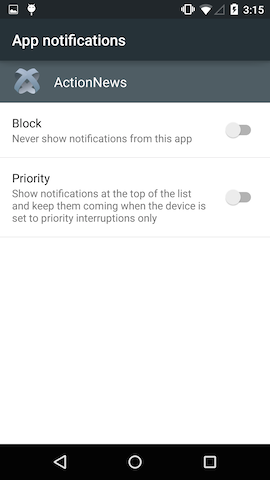
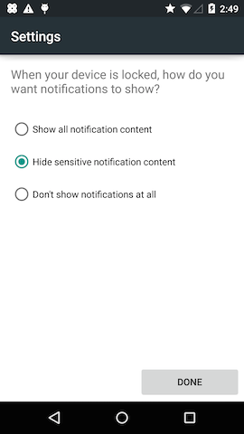

# Android Notifications

## Introduction

Local notifications alert the user that something is happening to your application while it is in the background. On Android, notifications appear in the notification drawer until the user clears them and on the lock screen for devices running Android 5.0 or greater. The application can also play a sound or vibrate to alert the user there is a new notification, customize the notification layout from the basic title, text and icon layout; and use the devices default alert settings or override them. Note that the user can filter or turn notifications on and off from **Settings**.

<table class="confluenceTable"><thead class=" "></thead><tfoot class=" "></tfoot><tbody class=" "><tr><td class="confluenceTd" rowspan="1" colspan="1"><p></p><p>Lock Screen (Android 5.0 and greater)</p></td><td class="confluenceTd" rowspan="1" colspan="1"><p></p><p>Notification Drawer</p></td></tr></tbody></table>

## Configure notification settings

Starting with Android 4.1, the user can turn notifications on and off per application, and on devices running Android 5.0 (API 21) and greater, decide how to filter notifications based on the visibility setting of the notification set by the application.

For devices running Android 4.1 or greater, to turn notifications on or off:

1. Open **Settings**

2. Under the **Device** group, tap **Apps**.

3. Tap the application you want to configure notifications for.

4. Check or uncheck the **Show notifications** checkbox to turn notifications on or off, respectively.



### Additional Android 5.0 and greater options

For devices running Android 5.0 or greater, you can also control notifications from the **Sound & notification** screen and control the visibility of notifications in the lock screen.

To turn notifications on or off, or to display application notifications when the device is set to priority interruptions only:

1. Open **Settings**

2. Under the **Device** group, tap **Apps**.

3. Tap **App notifications**.

4. Tap the application you want to configure notifications for.

5. Tap **Block** to turn notifications on or off.

6. Tap **Priority** to display notifications when the device is set to priority interruptions only.



To control the visibility of notifications in the lock screen, the user must set a pattern, PIN or password, then the user will be presented the option to filter notifications:

1. Open **Settings**

2. Under the **Personal** group, tap **Security**.

3. Tap **Screen lock**.

4. Choose either **Pattern**, **PIN**, or **Password**.

5. After you enter a pattern, pin or password, the user can filter notifications in the lock screen:

    1. Select **Show all notification content** to always display notifications in the lock screen.

    2. Select **Hide sensitive notification content** to let the application control which notifications to display based on the `visibility` property.

    3. Select **Don't show notifications at all** to no display any notification in the lock screen.

6. Tap **Done**.



## Create a notification

To create a notification, use the `Titanium.Android.createNotification()` method. Pass the method a dictionary of properties, which are described below.

### Basic layout

By default, a notification contains an icon, title, message, and an optional timestamp and badge number.


Specify the following properties to modify the basic layout of the notification:

* `contentIntent`: Intent to execute if the user taps the notification. By default without an intent attached to the notification, if the user taps on a notification, it does nothing and stays in the notification drawer. See the _Respond to a Notification_ section for further details.

* `contentText`: message displayed in the notification.

* `contentTitle`: Title of the notification.

* `icon`: Image file to display in the notification. Place the image file in either:

    * a density-specific folder (or use `res-nodpi` for all densities) in `/app/assets/android/images` for Alloy project or `/Resources/android/images/` for Classic projects, then reference the image file using only the `/images` path, for example, `/images/filename.png`.

    * the `/platform/android/res/drawable/` folder and reference the image file by removing its extension and prefixing it with the `Ti.App.Android.R.drawable` namespace, for example, `Ti.App.Android.R.drawable.filename`.

* `number`: Badge number to display in the notification.

* `when`: Timestamp to display in the notification. Does NOT schedule the notification.

For example, the code below creates the notification pictured above. A blank intent is attached to the notification, so when the user taps the notification, it will be removed from the drawer. Note that by default, the notification's `flags` property (see description in the _Other customizations_ section) is set to `Titanium.Android.FLAG_AUTO_CANCEL`, which automatically clears a notification when the intent is executed.

```javascript
var notification = Titanium.Android.createNotification({
    contentTitle: 'Notification 2',
    contentText : 'Just another notification',
    // Blank intent that will remove the notification when the user taps it
    // Do not override the default value of the 'flags' property
    contentIntent: Ti.Android.createPendingIntent({intent: Ti.Android.createIntent({})}),
    // Image file located at /platform/android/res/drawable/warn.png
    icon: Ti.App.Android.R.drawable.warn,
    number: 5,
    when: new Date()
});
```

### Sound

To play a sound when the notification first appears, assign the `Notification` object's `sound` property a sound file to play. Place the file in the `/platform/android/res/raw/` folder. Reference the file by using the `Ti.Filesystem.getResRawDirectory()` method to retrieve the location of the file, then append the filename to the end, for example, `Ti.Filesystem.getResRawDirectory() + 'sound.wav'`.

By default, the sound plays each time the application calls the `notify()` method. To override this behavior, add the `Titanium.Android.FLAG_ONLY_ALERT_ONCE` constant to the `Notification` object's `flags` property.

```javascript
var notification = Titanium.Android.createNotification({
    contentTitle: 'Notification 2',
    contentText : 'Just another notification',
    contentIntent: Ti.Android.createPendingIntent({intent: Ti.Android.createIntent({})}),
    icon: Ti.App.Android.R.drawable.warn,
    number: 5,
    when: new Date().getTime(),
    // Sound file located at /platform/android/res/raw/sound.wav
  sound: Ti.Filesystem.getResRawDirectory() + 'sound.wav',
});
```

### Custom layout

To use a custom layout for a notification:

1. [Create an Android XML Layout](http://developer.android.com/guide/topics/ui/declaring-layout.html) and save it to `/platform/android/res/layout/`.

2. Create a `Titanium.Android.RemoteViews` object using the XML layout. Reference the layout file by removing the file extension and prefixing it with the `Titanium.App.Android.R.layout` namespace. Once the `RemoteViews` object is created, you can modify its layout or bind intents by calling other `RemoteViews` methods on the object.

3. Assign the `RemoteViews` object to the `Notification` object's `contentView` property.

::: warning ⚠️ Warning
If the application calls the `setLatestEventInfo()` method or sets either the `contentTitle` or `contentText` properties, the notification will use the default basic layout even if the `contentView` property is set.
:::

**Example**

To create the following notification that displays a message with two buttons:


1. Create an XML layout that uses a `LinearLayout` to display a `TextView` and two `Button` widgets:

    **/platform/android/res/layout/customview.xml**

    ```xml
    <?xml version="1.0" encoding="utf-8"?>
    <LinearLayout xmlns:android="http://schemas.android.com/apk/res/android"
                  android:layout_width="match_parent"
                  android:layout_height="match_parent"
                  android:orientation="horizontal" >
        <TextView android:id="@+id/message"
                  android:layout_width="wrap_content"
                  android:layout_height="wrap_content"
                  android:textSize="18dp"
                  android:text="Default text" />
        <Button android:id="@+id/okbutton"
                android:layout_width="wrap_content"
                android:layout_height="wrap_content"
                android:text="OK" />
        <Button android:id="@+id/cancelbutton"
                android:layout_width="wrap_content"
                android:layout_height="wrap_content"
                android:text="Cancel" />
    </LinearLayout>
    ```

2. In the application, create a `RemoteViews` object using the XML layout as a reference, then modify the `RemoteViews` by changing the default text and binding `PendingIntents` to the buttons:

    **/Resources/app.js**

    ```javascript
    var customView = Ti.Android.createRemoteViews({
        layoutId: Ti.App.Android.R.layout.customview
    });

    // Blank intents (example) that will remove the notification when the user taps one of them
    var downloadIntent = Ti.Android.createPendingIntent({intent: Ti.Android.createIntent()});
    var cancelIntent = Ti.Android.createPendingIntent({intent: Ti.Android.createIntent()});

    // Reference elements in the layout by prefixing the IDs with 'Ti.App.Android.R.id'
    customView.setTextViewText(Ti.App.Android.R.id.message, "Update available!");
    customView.setTextViewText(Ti.App.Android.R.id.okbutton, "Download");
    customView.setOnClickPendingIntent(Ti.App.Android.R.id.okbutton, downloadIntent);
    customView.setTextViewText(Ti.App.Android.R.id.cancelbutton, "Not now");
    customView.setOnClickPendingIntent(Ti.App.Android.R.id.cancelbutton, cancelIntent);
    ```

3. Finally, assign the `RemoteViews` object to the `Notification` object's `contentView` property.

    **/Resources/app.js**

    ```javascript
    var notification = Titanium.Android.createNotification({contentView: customView});
    ```

### Other customizations

* `defaults`: Set to one of the following constants or bitwise-OR the values together to use the device's default notification settings:

    * `Titanium.Android.DEFAULT_ALL`: Use all of the device's default settings.

    * `Titanium.Android.DEFAULT_SOUND`: Use the device's default notification sound.

    * `Titanium.Android.DEFAULT_VIBRATE`: Use the device's default vibrate setting.

    * `Titanium.Android.DEFAULT_LIGHTS`: Use the device's default LED setting.

* `deleteIntent`: Intent to execute if the user taps the clear all notifications button in the notification drawer.

* `flags`: Additional flags to set on the notification to modify its behavior. Set to one of the following constants or bitwise -OR the constants together:

    * `Titanium.Android.FLAG_AUTO_CANCEL`: Clear the notification if the user taps it. Requires that the `contentIntent` property to be set or else the notification will not be cleared.

    * `Titanium.Android.FLAG_INSISTENT`: Repeat the sound until the notification is canceled or removed from the notification drawer.

    * `Titanium.Android.FLAG_NO_CLEAR` : Do not remove the notification from the notification drawer if the user taps the remove all notification button.

    * `Titanium.Android.FLAG_ONGOING_EVENT`: Indicates if the notification is in reference to an ongoing event.

    * `Titanium.Android.FLAG_ONLY_ALERT_ONCE`: If the notification is present in the notification drawer, do no replay the sound, vibrate or flash the LED again.

    * `Titanium.Android.FLAG_SHOW_LIGHTS`: Set if you want to use the LED with the notification. Need to also set the notification's LED properties. Note that most devices will not allow you to control the LED.

* `priority`: set to one of the following constants to determine where the notification is displayed in the drawer. Requires Titanium SDK 4.0.0 and greater and only works on devices running Android 4.1 and greater.

    * `Titanium.Android.PRIORITY_MAX`: Use for urgent or time-critical notifications, for example, turn-by-turn directions or emergency alerts. Notifications will appear at the very top of the notification drawer.

    * `Titanium.Android.PRIORITY_HIGH`: Use for high priority notifications like real-time chat messages.

    * `Titanium.Android.PRIORITY_DEFAULT`: Default priority if it does no fit into another priority category.

    * `Titanium.Android.PRIORITY_LOW`: Use for low priority notifications like software updates.

    * `Titanium.Android.PRIORITY_MIN` : Use for expired events. Note that the user will not be alerted to the notification (sound, vibration, etc.) and a notification icon will not appear in the status bar, but the notification will appear in the drawer.

* `tickerText`: Text to display in the status bar when the notification first appears. This features does not work on devices running Android 5.0 (API 21) and later.

### Android 5.0 and greater customizations

The following properties are available for devices running Android 5.0 and greater and requires Titanium SDK 4.0.0 and greater:

* `category`: Set to one of the following constants if the notification falls into one of the pre-defined notification categories. Android uses the category to determine where and how it should be displayed.

    * `Titanium.Android.CATEGORY_ALARM`

    * `Titanium.Android.CATEGORY_CALL`

    * `Titanium.Android.CATEGORY_EMAIL`

    * `Titanium.Android.CATEGORY_ERROR`

    * `Titanium.Android.CATEGORY_EVENT`

    * `Titanium.Android.CATEGORY_MESSAGE`

    * `Titanium.Android.CATEGORY_PROGRESS`

    * `Titanium.Android.CATEGORY_PROMO`

    * `Titanium.Android.CATEGORY_RECOMMENDATION`

    * `Titanium.Android.CATEGORY_SERVICE`

    * `Titanium.Android.CATEGORY_SOCIAL`

    * `Titanium.Android.CATEGORY_STATUS`

    * `Titanium.Android.CATEGORY_TRANSPORT`

* `visibility`: Set to one of the following constants to filter notifications in the lock screen:

    * `Titanium.Android.VISIBILITY_PUBLIC`: All information is displayed in the lock screen.

    * `Titanium.Android.VISIBILITY_PRIVATE`: Only the application name and icon appear in the lock screen with the message: "Contents hidden".

    * `Titanium.Android.VISIBILITY_SECRET`: The notification is not displayed in the lock screen.

## Send a notification

To send a notification, use the `Titanium.Android.NotificationManager.notify()` method. Pass the method a numeric ID as the first argument to identify it if it needs to be removed and the notification object as the second argument. This method sends the notification immediately.

```
Ti.Android.NotificationManager.notify(1, notification);
// Pass '1' to the Titanium.Android.NotificationManager.cancel method if you need to clear the notification programmatically
```

## Update a notification

To update a notification that is currently being displayed, use the `Notification` object's [`setLatestEventInfo()`](#!/api/Titanium.Android.Notification-method-setLatestEventInfo) method. Pass the method an updated or the existing title, message and intent. You need to pass the method all three parameters.

```
// Update the title and message but keep the existing intent
notification.setLatestEventInfo('Wake me up', 'Before you go go', notification.contentIntent);
```

## Remove a notification

If the application needs to remove a notification it sent from the notification drawer, it can either selectively choose which notification(s) to remove or remove all previously sent notifications.

**To remove all notifications**, call the `Titanium.Android.NotificationManager.cancelAll()` method.

**To remove a specific notification**, call the `Titanium.Android.NotificationManager.cancel()` method and pass it the ID that was assigned to it by the `Titanium.Android.NotificationManager.notify()` call.

```
// Remove all notifications sent by the application
Titanium.Android.NotificationManager.cancelAll();
// Remove a specific notification sent by the application
Titanium.Android.NotificationManager.cancel(1);
```

## Respond to a notification

By default, when a user taps a notification, it does nothing. In order to perform an action when the user taps the notification, assign a `Titanium.Android.PendingIntent` object to the Notification's `contentIntent` property. For more information about Intents, see [Android Intents](/guide/Titanium_SDK/Titanium_SDK_How-tos/Platform_API_Deep_Dives/Android_API_Deep_Dives/Android_Intents/).

For example, if you want to launch the application when the user taps the notification, the application needs to create an intent that launches the main activity of your application. To create an Intent, use the `Titanium.Android.createIntent()` method and pass the method a dictionary with the following properties:

* `action`: Assign it a `Titanium.Android.ACTION_*` constant which specifies the action to execute. For this example, assign it `Ti.Android.ACTION_MAIN` to launch the main activity.

* `className`: Name of the main activity of the application prefixed with project's application ID (or `packageName`). The name of the main activity is the name of the application/project with only the first letter capitalized and `Activity` appended to the end of it. For example, if the name of the project is `MyApp` and the application ID is `com.appcelerator.testapp`, the class name will be `com.appcelerator.testapp.MyappActivity`. You can also find the name of the main activity in the `build/android/AndroidManifest.xml` file after you build your application.

* `packageName`: Project's application ID located in the `tiapp.xml` file.

After creating an `Intent`, modify its flags by bitwise-OR-ing the `Ti.Android.FLAG_ACTIVITY_SINGLE_TOP` and `Ti.Android.FLAG_ACTIVITY_RESET_TASK_IF_NEEDED` constants. These constants tell the intent not to launch the application if it is already open and resets the activity to its initial state if needed, respectively.

Use the intent's `addCategory()` method to add the `Ti.Android.CATEGORY_LAUNCHER` category to indicate that the activity is listed in the application launcher.

Pass the intent to the [`Titanium.Android.` `createPendingIntent()`](#!/api/Titanium.Android-method-createPendingIntent) method to create a `PendingIntent`, which can be assigned to the Notification's `contentIntent` property.

```javascript
var intent = Ti.Android.createIntent({
    action: Ti.Android.ACTION_MAIN,
    className: 'com.appcelerator.testapp.MyappActivity',
    packageName: 'com.appcelerator.testapp'
});
intent.flags |= Ti.Android.FLAG_ACTIVITY_RESET_TASK_IF_NEEDED | Ti.Android.FLAG_ACTIVITY_SINGLE_TOP;
intent.addCategory(Ti.Android.CATEGORY_LAUNCHER);

notification.contentIntent = Ti.Android.createPendingIntent({intent: intent});
```

## Schedule a notification

To schedule a notification in the future, the application can create an Android service using a JavaScript context. The service runs in the background at a regular intervals. The service will need to wait for the appropriate time to create and send the notification allowing the notification to be sent while the application is in the background. For more information about Android Services, see [Android Services](/guide/Titanium_SDK/Titanium_SDK_How-tos/Platform_API_Deep_Dives/Android_API_Deep_Dives/Android_Services/).

::: warning ⚠️ Warning
The service may stop if the application is killed by either backing out of the application or if the application is removed from the recent apps tray.
:::

To create a service that sends a notification at a specific time:

1. In a separate JavaScript file, code the creation of the notification. After the notification is sent, be sure to stop the service since it will no longer be needed and to stop it from sending the same notification again.

    **Resources/ExampleService.js**

    ```javascript
    // Retrieves a reference to the service and its intent
    var service = Ti.Android.currentService,
        serviceIntent = service.getIntent(),
        // Information passed in from the intent
        timestamp = new Date(serviceIntent.getStringExtra('timestamp'));

    // Wait for right moment to create and send the notification
    if (new Date() > timestamp) {

        // Create a notification
        var notification = Ti.Android.createNotification({...});

        // Send the notification
        Ti.Android.NotificationManager.notify(1, notification);

        // Stop the service once the notification is sent
        Ti.Android.stopService(serviceIntent);
    }
    ```

2. Add the `<services>` tag to the `<android>` section of the `tiapp.xml` and add a `<service>` tag as a child of the `<services>` tag. In the `<service>` tag, assign the `type` attribute to `interval` to indicate the service runs at regular intervals and the `url` attribute to the JavaScript file the application needs to run as a service.

    **tiapp.xml**

    ```xml
    <ti:app>
        <android xmlns:android="http://schemas.android.com/apk/res/android">
            <!-- the services tag must be added so that our service will run -->
            <services>
                <service url="ExampleService.js" type="interval" />
            </services>
        </android>
    </ti:app>
    ```

3. In the main application, create an intent by assigning the JavaScript file to the Intent's `url` property and start the service by passing the intent to the `Titanium.Android.startService` `()` method. The application needs to set the interval for the service by using the Intent object's `putExtra()` method. You can also use this method to pass in data to the service. Pass the method the property name as the first argument and a value as the second argument. To set the service interval, set the property name to `interval` and the value to how often to call the service in milliseconds.

    **Resources/app.js**

    ```javascript
    // Create an intent using the JavaScript service file
    var intent = Ti.Android.createServiceIntent({
        url : 'ExampleService.js'
    });

    // Set the interval to run the service; set to five seconds in this example
    intent.putExtra('interval', 5000);

    // Send extra data to the service; send the notification 30 seconds from now in this example
    intent.putExtra('timestamp', new Date(new Date().getTime() + 30 * 1000));

    // Start the service
    Ti.Android.startService(intent);
    ```

**Example**

In the following example, the main application passes the message and title of the notification to the service as well as when to send it. The service waits until the right moment to create and send the notification, then stops itself. Note that the service can only send one notification. The application can launch more service instances but all of them will be stopped when the first notification is sent.

**Resources/app.js**

```javascript
var win = Ti.UI.createWindow();

var btn = Ti.UI.createButton({
    title : 'Add Notification'
});

btn.addEventListener('click', function(e) {
    var intent = Ti.Android.createServiceIntent({
        url : 'ExampleService.js'
    });
    intent.putExtra('title' , 'Richard III');
    intent.putExtra('message' , 'Now is the winter of our discontent...');
    intent.putExtra('timestamp', new Date(new Date().getTime() + 30 * 1000));
    intent.putExtra('interval', 5000);
    Ti.Android.startService(intent);
});
win.add(btn);
win.open();
```

**Resources/ExampleService.js**

```javascript
var service = Ti.Android.currentService;
var serviceIntent = service.getIntent();
var timestamp = new Date(serviceIntent.getStringExtra('timestamp'));

if (new Date() > timestamp) {
    // Grab extra data sent with the intent
    var title = serviceIntent.getStringExtra('title');
    var message = serviceIntent.getStringExtra('message');

    // Create an intent that launches the application
    var intent = Ti.Android.createIntent({
        action : Ti.Android.ACTION_MAIN,
        className: 'com.appcelerator.testapp.MyappActivity',
        packageName: 'com.appcelerator.testapp'
    });
    intent.flags |= Ti.Android.FLAG_ACTIVITY_RESET_TASK_IF_NEEDED | Ti.Android.FLAG_ACTIVITY_SINGLE_TOP;
    intent.addCategory(Ti.Android.CATEGORY_LAUNCHER);

    // Create notification
    var notification = Ti.Android.createNotification({
        contentIntent : Ti.Android.createPendingIntent({intent : intent}),
        contentTitle : title,
        contentText : message,
    });

    // Send the notification
    Ti.Android.NotificationManager.notify(1, notification);

    // Stop the service once the notification is sent
    Ti.Android.stopService(serviceIntent);
}
```

**tiapp.xml**

```xml
<ti:app>
    <android xmlns:android="http://schemas.android.com/apk/res/android">
        <!-- the services tag must be added so that our service will run -->
        <services>
            <service url="ExampleService.js" type="interval" />
        </services>
    </android>
</ti:app>
```

## Further reading

* [Android Developers: Notifications](http://developer.android.com/design/patterns/notifications.html)

[Titanium.Android.Notification API Reference](#!/api/Titanium.Android.Notification)
