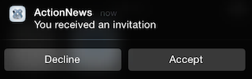
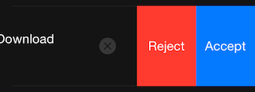

# iOS Interactive Notifications

## Introduction

You can create interactive notifications, where users can respond to application notifications without launching the application to the foreground. The user needs to reveal notification actions in the notification, then press a notification action to respond to the notification. This feature is available on devices running iOS 8 or later.

To create an interactive notification, the applications needs to:

1. Create and configure notification actions

2. Create notification categories and assign notification actions to them

3. Register the notification categories

4. Monitor the `localnotificationaction` event to respond to local notifications and the `remotenotificationaction` event to respond to push notifications

## Interactive notification types

The following screenshots illustrate how iOS presents and the user interacts with the notification:

### Alert dialog

The user needs to tap the **Options** button when the alert dialog first appears to display the notification actions. Tapping **Open** launches the application in the foreground, while tapping **Close** dismisses the notification.


### Banner message

In a banner message, the user needs to swipe the banner message down to reveal the notification actions. Tapping the notification (not an action) launches the application in the foreground. The user can dismiss the notification by swiping up the notification tray.



### Lock screen or notification center

In the lock screen or notification center, the user needs to swipe the notification to the left to reveal the notification actions. If the user swipes the notification to the right in the locked screen, the application is launched in the foreground. The user can dismiss the notification by tapping the **x** button.



## Create a notification action

A notification action is an action that the application performs in response to a notification. The action is represented as a button in the notification.

To create a notification action, use the `Titanium.App.iOS.createUserNotificationAction()` method. Pass the method a dictionary with the following required properties:

* `activationMode`:

    * Set to `Titanium.App.iOS.USER_NOTIFICATION_ACTIVATION_MODE_BACKGROUND` to activate the application in the background to respond to the action unless the application is already in the foreground.

    * Set to `Titanium.App.iOS.USER_NOTIFICATION_ACTIVATION_MODE_FOREGROUND` to launch the application in the foreground to respond to the action.

* `authenticationRequired`: set to true if the action requires the device to be unlocked.

* `destructive`: set to true if the action causes destructive behavior to the user's data or the application. The action appears red in the locked screen and notification center instead of the default color.

* `identifier`: string identifier of the action. Used to identify the action the user pressed.

* `title`: title of the button to display in the notification

```javascript
// The following action launches the application in the foreground and requires the device to be unlocked
var acceptAction = Ti.App.iOS.createUserNotificationAction({
    identifier: "ACCEPT_IDENTIFIER",
    title: "Accept",
    activationMode: Ti.App.iOS.USER_NOTIFICATION_ACTIVATION_MODE_FOREGROUND,
    destructive: false,
    authenticationRequired: true
});

// The following action will only activate the application in the background, requires the device to be unlocked, and may have a red background.
var rejectAction = Ti.App.iOS.createUserNotificationAction({
    identifier: "REJECT_IDENTIFIER",
    title: "Reject",
    activationMode: Ti.App.iOS.USER_NOTIFICATION_ACTIVATION_MODE_BACKGROUND,
    destructive: true,
    authenticationRequired: true
});
```

## Create a notification category

A notification category is a group of notification actions for a specific notification. The notification category allows the application to customize the notification options based on which notification style is used. For alert dialogs, only four notification actions can be displayed, while all other notifications can only display two actions.

To create a notification action, use the `Titanium.App.iOS.createUserNotificationCategory()` method. Pass the method a dictionary with the following properties:

* `actionsForDefaultContext`: Array of notification action objects to associate with the group. Note that only the first four actions can be displayed for an alert dialog and the first two actions can be displayed for all other notifications.

* `actionsForMinimalContext`: Array of notification action objects to display for non-dialog-style notifications. If not specified, the first two actions from `actionsForDefaultContent` are displayed.

* `identifier`: string identifier of the group of actions. When scheduling a notification, pass this value to the `category` property.

```javascript
var invitationCategory = Ti.App.iOS.createUserNotificationCategory({
    identifier: "INVITE_CATEGORY",
    // The following actions will be displayed for an alert dialog
    actionsForDefaultContext: [acceptAction, rescheduleAction, delayAction, rejectAction],
    // The following actions will be displayed for all other notifications
    actionsForMinimalContext: [acceptAction, rejectAction]
});
```

## Register notification categories

Like notification types, you also need to register notification categories with iOS by using the `Titanium.App.iOS.registerUserNotificationSettings()`method. Pass the method a dictionary with the `type` property set to the notification types to use and the `categories` property to an array of notification category objects the application needs to use.

```
Ti.App.iOS.registerUserNotificationSettings({
    types: [Ti.App.iOS.USER_NOTIFICATION_TYPE_ALERT, Ti.App.iOS.USER_NOTIFICATION_TYPE_BADGE],
    categories: [invitationCategory, downloadCategory]
});
```

If you are using push notifications, the application needs to call the `Titanium.Network.registerForPushNotifications()` method. The application should monitor the `usernotificationsettings` to register for push notifications.

```javascript
function registerForPush() {
   Ti.Network.registerForPushNotifications({
       success: deviceTokenSuccess,
       error: deviceTokenError,
       callback: receivePush
   });
   // Remove event listener once registered for push notifications
   Ti.App.iOS.removeEventListener('usernotificationsettings', registerForPush);
};

// Wait for user settings to be registered before registering for push notifications
Ti.App.iOS.addEventListener('usernotificationsettings', registerForPush);
```

## Monitor interactive notifications

The application can monitor interactive notifications and respond to them in the background by using the iOS application-level`localnotificationaction`event for local notifications and `remotenotificationaction` event for push notifications. The event is triggered when the user selects a notification action.

### localnotificationaction

Monitor the iOS application-level`localnotificationaction` event to respond to an interactive local notification. The event is passed the same object as the `notification` event except it returns two extra properties:

* `category`: string identifier indicating the notification category that triggered the event

* `identifier` : string identifier indicating the notification action the user pressed

Use the properties to have the application decide how to respond to the interactive notification.

```
Ti.App.iOS.addEventListener('localnotificationaction', function(e) {
    // Switch for categories
    switch (e.category) {
        case "DOWNLOAD_CATEGORY":
            // Switch for actions
            switch (e.identifier) {
                case "ACCEPT_IDENTIFIER":
                    if (e.userInfo && "url" in e.userInfo){
                        httpGetRequest(e.userInfo.url);
                    }
                    break;
                // more actions...
            }
            break;
        // more categories...
        default:
            break;
    };
});
```

### remotenotificationaction

Monitor the iOS application-level `remotenotificationaction` event to respond to an interactive push notification. The event is passed an object with the following properties:

* `category`: string identifier indicating the notification category that triggered the event

* `data`: push notification payload as a JSON object

* `identifier`: string identifier indicating the notification action the user pressed

Use the properties to have the application decide how to respond to the interactive notification.

```
Ti.App.iOS.addEventListener('remotenotificationaction', function(e) {
    // Switch for categories
    switch (e.category) {
        case "DOWNLOAD_CATEGORY":
            // Switch for actions
            switch (e.identifier) {
                case "ACCEPT_IDENTIFIER":
                    if (e.data && "url" in e.data){
                        httpGetRequest(e.data.url);
                    }
                    break;
                // more actions...
            }
            break;
        // more categories...
        default:
            break;
    };
});
```

## Schedule an interactive local notification

To send an interactive local notification, use the `Titanium.App.iOS.scheduleLocalNotification()` method. Use it the same way when scheduling a non-interactive local notifications except when creating the dictionary of options to pass to the method, the application must specify the `category` property and set it to the `identifier` of the notification category to use. The notification category indicates which group of actions to use with the notification. The notification category must also be registered or else the notification will be presented as a default non-interactive notification.

```
Ti.App.iOS.scheduleLocalNotification({
    date: new Date(new Date().getTime() + 3000),
    alertBody: "New content available! Download now?",
    badge: 1,
    userInfo: {"url": "http://www.download.com/resource/asset.json"},
    category: "DOWNLOAD_CATEGORY"
});
```

## Send an interactive push notification

To send an interactive push notification, send a payload with the category field set to the identifier of the notification category to use.

```
{
    "alert": "New content available! Download now?",
    "badge": 1,
    "url": "http://www.download.com/resource/asset.json",
    "category": "DOWNLOAD_CATEGORY"
}
```

To send the payload, you can use either the:

* Appcelerator Dashboard: [Sending and Scheduling Push Notifications](#undefined)

* Titanium Cloud Module (ti.cloud) APIs: [Cloud.PushNotifications.notify()](#!/api/Modules.Cloud.PushNotifications-method-notify) or [Cloud.PushNotifications.notifyTokens()](#!/api/Modules.Cloud.PushNotifications-method-notifyTokens)

* Arrow REST APIs: [PushNotification.notify](/arrowdb/latest/#!/api/PushNotifications-method-notify) or [PushNotification.notify\_tokens](/arrowdb/latest/#!/api/PushNotifications-method-notify_token)

## Example

In the following example, run the code on an iOS device or simulator. Click the "Trigger Notification" button, then either lock the phone or place the application in the background. You will have three seconds or else the application will respond to the notification in the foreground. If the device or simulator is running iOS 8 or later, you will receive the interactive local notification. If not, you will receive a regular local notification.

```javascript
// Check for iOS 8 or greater
if (Ti.Platform.name == "iPhone OS" && parseInt(Ti.Platform.version.split(".")[0]) >= 8) {
    Ti.API.info("I am iOS 8!");
    // Create notification actions
    var acceptAction = Ti.App.iOS.createUserNotificationAction({
        identifier: "ACCEPT_IDENTIFIER",
        title: "Accept",
        activationMode: Ti.App.iOS.USER_NOTIFICATION_ACTIVATION_MODE_FOREGROUND,
        destructive: false,
        authenticationRequired: true
    });

    var rejectAction = Ti.App.iOS.createUserNotificationAction({
        identifier: "REJECT_IDENTIFIER",
        title: "Reject",
        activationMode: Ti.App.iOS.USER_NOTIFICATION_ACTIVATION_MODE_BACKGROUND,
        destructive: true,
        authenticationRequired: false
    });

    // Create a notification category
    var downloadContent = Ti.App.iOS.createUserNotificationCategory({
      identifier: "DOWNLOAD_CONTENT",
      actionsForDefaultContext: [acceptAction, rejectAction]
    });

    // Register for user notifications and categories
    Ti.App.iOS.registerUserNotificationSettings({
        types: [
            Ti.App.iOS.USER_NOTIFICATION_TYPE_ALERT,
            Ti.App.iOS.USER_NOTIFICATION_TYPE_BADGE,
            Ti.App.iOS.USER_NOTIFICATION_TYPE_SOUND
        ],
        categories: [downloadContent]
    });

    // Monitor notifications received while app is in the background
    Ti.App.iOS.addEventListener('localnotificationaction', function(e) {
        if (e.category == "DOWNLOAD_CONTENT" && e.identifier == "ACCEPT_IDENTIFIER") {
            alert("start download");
        }

        // Reset the badge value
        if (e.badge > 0) {
            Ti.App.iOS.scheduleLocalNotification({
                date: new Date(new Date().getTime() + 3000),
                badge: "-1"
            });
        }
        Ti.API.info(JSON.stringify(e));
    });
}

// Monitor notifications received while app is in the foreground
Ti.App.iOS.addEventListener('notification', function(e) {
    // Reset the badge value
    if (e.badge > 0) {
        Ti.App.iOS.scheduleLocalNotification({
            date: new Date(new Date().getTime() + 3000),
            badge: "-1"
        });
    }
    Ti.API.info(JSON.stringify(e));
});
// App UI
var win = Ti.UI.createWindow({backgroundColor: 'white'});
var button = Ti.UI.createButton({title: 'Trigger Notification'});
button.addEventListener('click', function(e){
    // Send a notification in 3 seconds
    var note = Ti.App.iOS.scheduleLocalNotification({
        date: new Date(new Date().getTime() + 3000),
        alertBody: "New content available! Download now?",
        badge: 1,
        userInfo: {"url": "http://www.download.com/resource/asset.json", id:"1"},
        category: "DOWNLOAD_CONTENT"
    });
});
win.add(button);
win.open();
```
