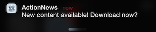
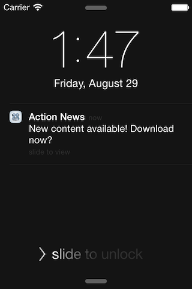
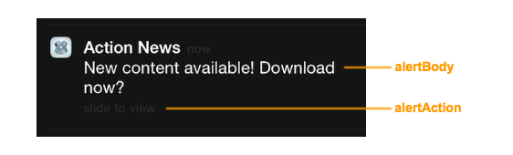

# iOS Local Notifications

## Introduction

Local notifications alert the user that something is happening to your application while it is in the background. On iOS, the notification can appear as an alert or banner message and stays in the notification center until the user clears them. The user can tap or swipe the notification to launch the application or dismiss the notification. The application can also play a sound or modify its badge value on its icon. Note that the user can customize how they want to receive notifications from **Settings**. They can change how the message appears or even disable them.

The application can create interactive notifications if the device is running iOS 8 or later. An interactive notification presents options that the user can tap to respond to the application while it is in the background. To create an interactive notification, see [iOS Interactive Notifications](/guide/Titanium_SDK/Titanium_SDK_How-tos/Notification_Services/iOS_Interactive_Notifications/).

## Notification Types

The following sections describe how iOS may present notifications to users.

### Alert Dialog

If the application is in the background and the device is unlocked, iOS presents the notification as either a banner message or an alert depending on the user's selection. The user can tap on **Open** to launch the application, while tapping **Close** dismisses the notification.


### Badge

The application can optionally set the badge value, which appears in the application's icon. Use the value to indicate the number of items the user needs to respond to. After the user responds, be sure to reset the badge value.


### Banner Message

If the application is in the background and the device is unlocked, iOS presents the notification as either a banner message or an alert depending on the user's selection. The user can tap the banner message to launch the application. If the user does nothing, the banner message eventually disappears and the notification will be queued in the notification center.



### Lock Screen

If the device is locked, the notification appears in the lock screen. The user swipes the notification to the right to launch the application.



### Notification Center

If the user never responds to notifications, the notifications are queued in the notification center. The user can click on the notification to launch the application or click the **x** button to clear the notifications.


### Sound

The application can play a sound when a notification is received.

## Configure Notification Settings

The user can configure how to receive notifications from your application using **Settings**. To access the notification settings, open **Settings**, then:

* For iOS 8 and later, tap the application to configure, then tap **Notifications**.

* For iOS 7, tap **Notification Center**, then tap the application to configure.

In the **Notifications** screen, the user can selectively decide which notification types to receive.


## Send a Local Notification

To send a local notification, use the `Titanium.App.iOS.scheduleLocalNotification()` method. The application can monitor local notifications using the [`notification`](#!/api/Titanium.App.iOS-event-notification) event. For devices running iOS 8 and later, you need to register the application to use the local notification service before scheduling local notifications.

### Register for Local Notifications

For devices running iOS 8 and later, you need to register the application to use the local notification services. Use the `Titanium.App.iOS.registerUserNotificationSettings()`method to enroll the application in local notification services. Pass the method a dictionary with the `types` property set to an array of notification types to use.

* `Titanium.App.iOS.USER_NOTIFICATION_TYPE_ALERT`: allow the application to display an alert or banner message.

* `Titanium.App.iOS.USER_NOTIFICATION_TYPE_BADGE`: allow the application to modify the badge value in the application's icon.

* `Titanium.App.iOS.USER_NOTIFICATION_TYPE_NONE`: disable application UI notifications. The application will still be notified of the notification by the `notification` event.

* `Titanium.App.iOS.USER_NOTIFICATION_TYPE_SOUND`: allow the application to play a sound.

```
// Check if the device is running iOS 8 or later, before registering for local notifications
if (Ti.Platform.name == "iPhone OS" && parseInt(Ti.Platform.version.split(".")[0]) >= 8) {
    Ti.App.iOS.registerUserNotificationSettings({
      types: [
            Ti.App.iOS.USER_NOTIFICATION_TYPE_ALERT,
            Ti.App.iOS.USER_NOTIFICATION_TYPE_SOUND,
            Ti.App.iOS.USER_NOTIFICATION_TYPE_BADGE
        ]
    });
}
```

::: tip 💡 Hint
If you are using interactive notifications, the application also needs to register the notification categories you want to use. Set the `categories` property of the dictionary passed to the `registerUserNotificationSettings()` method to an array of notification category objects that the application needs to use. For more details, see the [iOS Interactive Notifications](/guide/Titanium_SDK/Titanium_SDK_How-tos/Notification_Services/iOS_Interactive_Notifications/).
:::
::: warning ⚠️ Warning
Callbacks get called properly only when Liveview is enabled.
:::

After the application registers for notification services, iOS will prompt the user to allow the application to send notifications or not. The user can re-configure the notification settings later from **Settings**.

The application can monitor the `usernotificationsettings` event to know when and which user notification types and categories are registered.

### Schedule a Local Notification

To send a local notification, use the `Titanium.App.iOS.scheduleLocalNotification()` method. Pass the method a dictionary with the following properties. All properties are optional:

* `alertAction`: modify the default slider text of the alert ("slide to view") (see diagram below) or the title of the **Open** button for the alert dialog. The value replaces "view" for the slide text, so the message will be "slide to <alertAction>".

* `alertBody`: text to display in the alert or banner message (see diagram below). If omitted, an alert is not displayed.

* `alertLaunchImage`: splash image to display instead of the application's default splash image.

* `badge`: number to set in the application icon's badge. To remove the badge value, set the value to a negative number.

* `category`: s tring identifier of the category of actions to be displayed in the interactive notification (for iOS 8 and later).

* `date`: datetime to send the notification as a JavaScript Date object. If omitted, the notification is sent immediately.

* `repeat`: interval to repeat the notification. Values can be: `daily`, `weekly`, `monthly` or `yearly`. Default is once.

* `sound`: sound file to play relative to the `Resources` or `app/assets` directory.

* `timezone`: t imezone of the date configured for the notification. If not set, the system timezone is used.

* `userInfo`: extra data to pass to the application that can be processed in the `notification` event.



The `scheduleLocalNotification()` method returns a LocalNotification object. The application can use the object to call the `cancel()` method in case it needs to cancel the notification.

```javascript
// The following code snippet schedules an alert to be sent within three seconds
var notification = Ti.App.iOS.scheduleLocalNotification({
    // Alert will display 'slide to update' instead of 'slide to view'
    // or 'Update' instead of 'Open' in the alert dialog
    alertAction: "update",
    // Alert will display the following message
    alertBody: "New content available! Update now?",
    // The badge value in the icon will be changed to 1
    badge: 1,
    // Alert will be sent in three seconds
    date: new Date(new Date().getTime() + 3000),
    // The following sound file will be played
    sound: "/alert.wav",
    // The following URL is passed to the application
    userInfo: { "url":"http://www.download.com/content/asset.json"}
});
```

### Monitor Local Notifications

The application can monitor incoming local notifications by using the iOS application-level [`notification`](#!/api/Titanium.App.iOS-event-notification) event if it is in the foreground or returns to the foreground. The event is passed a dictionary containing the same properties as the ones used to schedule the notification except the `interval` property.

```
// Fired when the application receives an incoming local notification when it's in the foreground
Ti.App.iOS.addEventListener('notification', function(e) {

    // Process custom data
    if (e.userInfo && "url" in e.userInfo){
        httpGetRequest(e.userInfo.url);
    }

    // Reset the badge value
    if (e.badge > 0) {
        Ti.App.iOS.scheduleLocalNotification({
            date: new Date(new Date().getTime()),
            badge: -1
        });
    }
});
```

### Cancel a Notification

If the application needs to cancel a notification, it can either selectively choose which notification(s) to cancel or cancel all pending notifications.

**To cancel all pending notifications**, call the `Titanium.App.iOS.cancelAllLocalNotifications()` method.

**To cancel a specific notification**, the application can either:

1. Keep a reference to the notification object and call the `cancel()` method on the object.

2. Add an ID to the notification and pass the ID to the `Titanium.App.iOS.cancelLocalNotification()` method. To add an ID to the notification, set the `id` property of the `userInfo` dictionary passed to the `scheduleLocationNotification()` method.

```javascript
var notification = Ti.App.iOS.scheduleLocalNotification({
    // Create an ID for the notification
    userInfo: {"id": "foo"},
    alertBody: "Test? Test?",
    date: new Date(new Date().getTime() + 3000)
});

// Either one of these methods will cancel the notification
notification.cancel();
Ti.App.iOS.cancelLocalNotification("foo");
```
