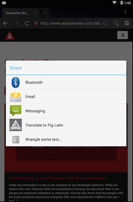
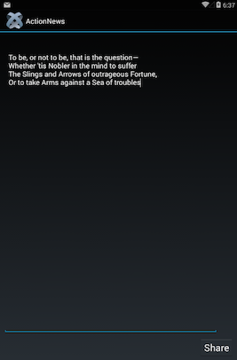
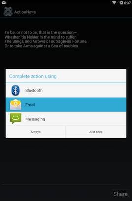
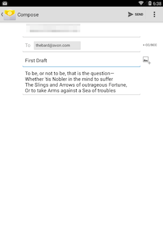

# Android Intents

## Introduction

In Android, applications and application components cannot directly communicate with each other. In order to communicate with another application, create an intent and start a new activity with the intent. An _intent_ is a message sent to the Android OS. Android directs the message to an application or application component based on the intent's settings.

Intents can be used to start an activity, start a service or start a broadcast. This document discusses how to use an intent to start an activity.

* To use an intent to start a service, see [Android Services](/guide/Titanium_SDK/Titanium_SDK_How-tos/Platform_API_Deep_Dives/Android_API_Deep_Dives/Android_Services/).

* To use an intent to start a broadcast or to create a broadcast receiver, see [Android Broadcast Intents and Receivers](/guide/Titanium_SDK/Titanium_SDK_How-tos/Platform_API_Deep_Dives/Android_API_Deep_Dives/Android_Broadcast_Intents_and_Receivers/).

* To receive intents from other applications, see [Android Intent Filters](/guide/Titanium_SDK/Titanium_SDK_How-tos/Platform_API_Deep_Dives/Android_API_Deep_Dives/Android_Intent_Filters/).

## Intent types

There are two kinds of intents:

* _Explicit intents_ specify the application to start. When creating the intent, specify the application's package name and class when creating the intent. Explicit intents are normally used to start components within your own application.

* _Implicit intents_ do **NOT** specify the application to start. Instead, they declare a general action. The user can decide which application to start if multiple applications can handle the action or a default application has not been selected by the user. For example, if a user opens their browser and highlights some text, the user can share that text with other Android apps, such as an e-mail application, SMS application or a social networking application.



## Create an intent

To create an intent, use the `Titanium.Android.createIntent()` method to create an Intent object. Pass the method a dictionary with the following properties:

* `action`: Action to associate with the intent. Specify one of the `Titanium.Android.ACTION_*` constants. The most commonly used actions are:

    * `Titanium.Android.ACTION_SEND`: Send data to an application.

    * `Titanium.Android.ACTION_VIEW`: View data in an application.

* `flags`: Optional flags to set to modify the behavior of the intent. Bitwise-OR the `Titanium.Android.FLAG_*` constants with the `Intent` object's `flag` property rather than specifying them during creation.

* `data`: Optional data URI to pass to an application's activity.

* `type`: Optional MIME type for the intent.

::: tip 💡 Hint
For the action, you can also define your own custom action name. Use a reverse domain scheme to name the action to avoid potential conflicts, for example, `com.appcelerator.action.LINT` . Custom actions are only useful to communicate between your applications and application activities using intents.
:::

The following example creates an intent to view the data URI:

```javascript
var intent = Ti.Android.createIntent({
    action: Ti.Android.ACTION_VIEW,
    data: 'http://maps.google.com/maps?q=loc:37.3906238,-122.0499305,19'
});
```

### Create an explicit intent

To create an explicit intent, in addition to the previously mentioned intent properties, you need to also set the `packageName` and `className` properties, or the `url` property, but not both.

* `className`: Name of the class. For the main activity of a Titanium project, this is the name of the activity prefixed with project's application ID (or `packageName`). The name of the main activity is the name of the application/project with only the first letter capitalized and `Activity` appended to the end of it. For example, if the name of the project is `MyApp` and the application ID is `com.appcelerator.testapp`, the class name will be `com.appcelerator.testapp.MyappActivity`. You can also find the name of the main activity in the `build/android/AndroidManifest.xml` file after you build your application.

* `packageName`: Package name of the application. For Titanium project's, this is the project's application ID located in the `tiapp.xml` file.

* `url`: URL of the JavaScript activity file to launch.

The following example creates an intent to launch the main activity of the MyApp application:

```javascript
var intent = Ti.Android.createIntent({
    action: Ti.Android.ACTION_MAIN,
    className: 'com.appcelerator.testapp.MyappActivity',
    packageName: 'com.appcelerator.testapp'
});
// Tells the OS to reset the activity if needed or launch the application if it has not already been launched
intent.flags |= Ti.Android.FLAG_ACTIVITY_RESET_TASK_IF_NEEDED | Ti.Android.FLAG_ACTIVITY_SINGLE_TOP;
```

If the application uses a JavaScript activity, add the activity to the `tiapp.xml` file in order to define the activity as part of the application. Create an `<activities>` element as a child of the `<android>` element, then create an `<activity>` element, as a child of the `<activities>` element, and assign the `url` attribute to the URL of the JavaScript file to define it as an Android activity.

**tiapp.xml**

```xml
<ti:app>
  <android xmlns:android="http://schemas.android.com/apk/res/android">
    <activities>
      <activity url="activity.js"/>
    </activities>
  </android>
</ti:app>
```

### Add extra data

To send extra data with the intent, which can be used by the activity, use the Intent's `putExtra()` method. Pass the method the name of the data as the first parameter and the data to add as the second parameter. The application can also specify one of the `Titanium.Android.EXTRA_*` constants to use one of the Android-defined extra data fields.

The following example adds a custom field called "timestamp" to the intent and the Android-defined `EXTRA_TEXT` data:

```
intent.putExtra('timestamp', new Date());
intent.putExtra(Ti.Android.EXTRA_TEXT, 'Some text that we want to share');
```

### Add a category

To add a category to an intent, use the Intent's `addCategory()` method. A category provides additional details about the purpose of the intent. Note that most categories are only useful for intent filters. Pass the method one of the following `Titanium.Android.CATEGORY_*` constants:

* `Titanium.Android.CATEGORY_DEFAULT`: Do not use category filtering.

* `Titanium.Android.CATEGORY_BROWSABLE`: Activity can be opened by a browser when clicking a link.

* `Titanium.Android.CATEGORY_TAB`: Activity should be opened in a tab.

* `Titanium.Android.CATEGORY_ALTERNATIVE`: Activity should be considered as an alternative option, usually displayed in the options menu.

* `Titanium.Android.CATEGORY_SELECTED_ALTERNATIVE`: Activity should be considered as an alternative option, usually displayed in a dialog.

* `Titanium.Android.CATEGORY_LAUNCHER`: Activity is the application's initial activity and is listed in the OS's application launcher.

* `Titanium.Android.CATEGORY_INFO`: Provides information about the application package.

* `Titanium.Android.CATEGORY_HOME`: Home activity.

* `Titanium.Android.CATEGORY_PREFERENCE`: Activity is a preference panel.

* `Titanium.Android.CATEGORY_TEST`: Activity is for testing purposes.

::: tip 💡 Hint
For categories, you can also define your own custom category name. Use a reverse domain scheme to name the category to avoid potential conflicts, for example, `org.foo.category.SUPER` . Custom categories are only useful to communicate between your applications and application activities using intents.
:::

## Start an activity with an intent

To start an activity (application or application component), call the application's current Activity's `startActivity()` or `startActivityForResult()` method. To get the current activity, use the `activity` property of either the currently opened Window or TabGroup, or if the activity does not have an open Window or TabGroup, use the `Titanium.Android.currentActivity` property.

* The `startActivity()` method starts an Activity by passing it only an intent object.

* The `startActivityForResult()` method starts an Activity by passing it an intent object and a callback function to handle the response returned by the activity when it finishes. Use this method if the application wants to communicate between two activities.

::: warning ⚠️ Warning
Wait for the TabGroup or Window to open before invoking any methods on its activity.
:::

The following example starts an activity (another application) to view the data URI:

```javascript
var intent = Ti.Android.createIntent({
    action: Ti.Android.ACTION_VIEW,
    data: 'http://maps.google.com/maps?q=loc:37.3906238,-122.0499305,19'
});
win.activity.startActivity(intent);
```

The following example starts an activity to let the user choose a contact. After the user successfully selects a contact and the activity completes, a new intent is created to view the contact using the result of the first activity. Note that the URI returned by first intent is a content provider URI (`content://`) and the contact information cannot be directly accessed by a Titanium application using the URI. If the application needs to retrieve and manipulate the data, you need to create a native Android module to handle content provider URIs, or in this case, the application can use the `Titanium.Contacts` API to directly retrieve the contact data.

```javascript
// Create an intent to choose a contact
var intent = Ti.Android.createIntent({
    action: Ti.Android.ACTION_GET_CONTENT,
    type: 'vnd.android.cursor.item/contact'
});

// Start an activity and execute the callback when the result returns
win.activity.startActivityForResult(intent, function (e) {
  // If successful, open the selected contact
  if (e.resultCode == Ti.Android.RESULT_OK && e.intent.data) {
    var newIntent = Ti.Android.createIntent({
      action: Ti.Android.ACTION_VIEW,
      data: e.intent.data
    });
    win.activity.startActivity(newIntent);
  }
});
```

## Force an intent chooser

If the user selects a default application to handle a specific action, the **Share** dialog will not appear. If the application needs to explicitly show a dialog to the user to allow them to choose from a list of applications, create an intent chooser using the `Titanium.Android.createIntentChooser()` method. Pass the method the `Intent` object the application would use to start an activity as the first parameter. Pass a string to display as the title of the dialog as the second parameter. Both parameters are required. This method returns an `Intent` object, which is used to start an activity.

The following example creates an intent chooser that displays "Send Message" as the title of the dialog.

```javascript
var chooser = Ti.Android.createIntentChooser(intent, "Send Message");
win.activity.startActivity(chooser);
```

## Example

This example shows a very common and effective use of Intents. This examples uses an Android Intent to share text with any apps on the Android device that accept text intents.

First, create an implicit intent that sends text data. When creating the intent, set the `action` property to the `Ti.Android.ACTION_SEND` constant and the `type` property to the `text/plain` MIME type. The following intent tells Android the application wants to send plain text data.

```javascript
var intent = Ti.Android.createIntent({
    action: Ti.Android.ACTION_SEND,
    type: "text/plain"
});
```

Next, the application needs to send the text data with the intent. Use the intent's `putExtra` method to send extra data with the intent. Pass the method the `Ti.Android.EXTRA_TEXT` constant as the first parameter and the string to share as the second parameter. The `EXTRA_TEXT` constant signifies the intent is passing a standardized Android format with the intent.

```
intent.putExtra(Ti.Android.EXTRA_TEXT, 'Some text that we want to share');
```

Use the intent's `addCategory` method to specify the `Ti.Android.CATEGORY_DEFAULT` category, which indicates not to use any category filtering.

```
intent.addCategory(Ti.Android.CATEGORY_DEFAULT);
```

Finally, pass the intent to the application's current Activity's `startActivity()` method. The application can use the `activity` property of either a Window or TabGroup object. Note that to invoke any methods on an activity, the application needs to wait until the Window or TabGroup is open.

```
// Wait for the Window or TabGroup to open before invoking any methods on the activity
win.activity.startActivity(intent);
```

When the intent is sent, the OS should display a list of applications to launch if it has multiple applications that can receive text intents. If there are not many applications installed on the device or if the user selected a default application to handle text, the default application will be launched.

<table><tbody><tr><td><p></p></td><td><p></p></td><td><p></p></td></tr></tbody></table>

### Complete code

```javascript
var win = Ti.UI.createWindow();
var label = Ti.UI.createLabel({
  text: 'Say Something!',
  color:'white',
  font: {
    fontSize:'20dp',
    fontWeight:'bold'
  },
  height:'Ti.UI.SIZE',
  top:'5dp'
});
var textarea = Ti.UI.createTextArea({
  width:'90%',
  top:'44dp',
  bottom: '70dp',
  left:10,
  right:10
});
var button = Ti.UI.createButton({
  title:'Share',
  font: {
    fontSize:'24dp'
  },
  bottom:'10dp',
  right:10
});
button.addEventListener('click', function(e) {
  var intent = Ti.Android.createIntent({
    action: Ti.Android.ACTION_SEND,
    type: "text/plain"
  });

  intent.putExtra(Ti.Android.EXTRA_TEXT, textarea.value);
  intent.addCategory(Ti.Android.CATEGORY_DEFAULT);
  win.activity.startActivity(intent);
});

win.add(label);
win.add(textarea);
win.add(button);

win.open();
```

## Further reading

* [Titanium.Android API Reference](http://developer.appcelerator.com/apidoc/mobile/latest/Titanium.Android-module)

* [Android Developers: Intent and Intent Filters](http://developer.android.com/guide/components/intents-filters.html)
