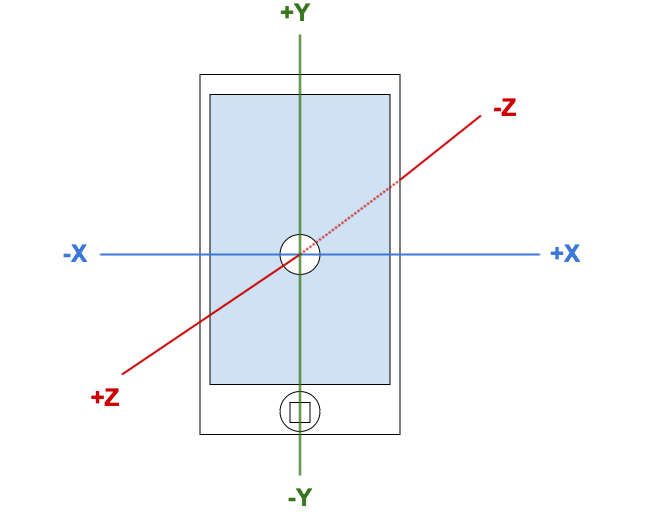
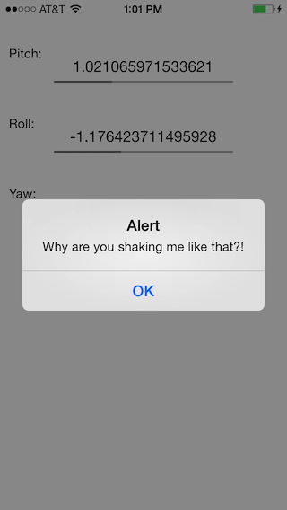

# Core Motion Module

## Introduction

The Core Motion module provides support for monitoring various hardware sensors on iOS devices, such as the accelerometer, gyroscope, and magnetometer. The Core Motion module allows you to access the measurements provided by these sensors.

### Requirements

Not all devices have the same hardware sensors, so all features may not be available for all devices. Be sure to use the API to check the device for the existence of a feature.

You can only test the Core Motion module on a device. The Core Motion API cannot be tested on the iOS simulator.

Some features may require permission to use "Motion Activity". iOS requires the user's approval to use the "Motion Activity" permission. When the application uses the Core Motion API for the first time, iOS prompts the user to either approve or deny access to the Core Motion features of the device. The user can change the permission settings with **Settings > Privacy**.

### Concepts

An iOS device contains various sensors on it to measure and collect different measurements. Most modern devices contain an accelerometer, gyroscope and magnetometer:

* **Accelerometer**: The accelerometer measures the instantaneous g-force acceleration acting on the device along the three spatial axes. The accelerometer measures each force in G's (gravitational force or 9.81 m/s^2). An accelerometer allows the software to know the orientation of the device.

* **Gyroscope**: The gyroscope measures the instantaneous rotation rate of the device. The gyroscope measures the rotation rate of each individual axis in radians (360 degrees = 2 \* pi radians). The gyroscope improves the accuracy of recognizing movement in 3D space.

* **Magnetometer**: The magnetometer measures the strength and direction of magnetic fields in microteslas. The device uses the magnetometer as a digital compass.

The measurement from these three sensors provide raw data that is used to calculate other useful measurements of the device:

* **Activity**: The activity indicates the motion activity the user is currently doing with the device, such as walking, running or if the device is in an automobile.

* **Attitude:** Measurement of the orientation of the device relative to a frame of reference, represented as either Euler angles (roll, pitch and yaw), a rotation matrix, or a [quaternion](http://en.wikipedia.org/wiki/Quaternion).

* **Pedometer**: Measures the number of steps the user has taken with the device.

* **User Acceleration:** Instantaneous acceleration force the user applies to the device.

### Coordinate system

The accelerometer and magnetometer measure forces along the three spatial axes. If you hold the device in portrait mode with the screen facing you:

* The X-axis runs along the width of the screen in the center of the device. Positive values are to the right and negative values are to the left. For example, landscape left reports positive values and landscape right reports negative values. Note that the left and right names come from the location of the home button, not the edge of the device.

* The Y-axis runs along the height of the screen in the center of the device. Positive values are up and negative values are down. For example, upside down mode reports positive values and portrait mode reports negative values.

* The Z-axis runs through the screen and back of the device in the center of the device. Positive values are towards the screen and negative values are behind the device. For example, face down reports positive values and face up reports negative values.



The gyroscope measures forces along the three spatial axes. If you hold the device in portrait mode with the screen facing you:

* The X-axis runs along the width of the screen in the center of the device. Rotating the screen down indicates a positive rotation direction.

* The Y-axis runs along the height of the screen in the center of the device. Rotating the screen to the right indicates a positive rotation direction.

* The Z-axis runs through the screen and back of the device in the center of the device. Rotating the device to right landscape mode (left edge down) indicates a positive rotation direction.

## Getting started

The Core Motion module is available as part of the Titanium SDK. To use core motion services in your application, add the module as a dependency to your application.

1. Modify the modules section of your `tiapp.xml` file to include the `ti.coremotion` module:

    ```xml
    <modules>
        <module platform="iphone">ti.coremotion</module>
    </modules>
    ```

2. Require in the module in your JavaScript code. Use the reference to make API calls to the module.

    ```javascript
    var CoreMotion = require('ti.coremotion');
    var Pedometer = CoreMotion.createPedometer();
    if (Pedometer.isSupported()) {
        Pedometer.startPedometerUpdates({
            start: new Date(new Date().getTime() - 60 * 60 * 1000) // 1 hr ago
        }, function(e) {
            Ti.API.info(JSON.stringify(e));
        });
    } else {
        Ti.API.warn('This device does not support the pedometer.');
    }
    ```

## Using the Core Motion API

The [Core Motion API](http://docs.appcelerator.com/.%20latest/#!/api/Modules.CoreMotion) breaks down in to the following six features:

* **Device Motion**: access the device's data for attitude and user acceleration as well as the raw data sent by the accelerometer, gyroscope and magnetometer

* **Activity**: access the device's motion activity functionality

* **Pedometer**: access the device's step counting functionality (replaced the in iOS 7 deprecated **Step Counter** by covering the same API and additional features)

* **Accelerometer**: access the device's accelerometer measurements

* **Gyroscope**: access the device's rotation rate measurements

* **Magnetometer**: access the device's magnetic field measurements

Each core motion feature follows a basic sequence. To use a core motion feature:

1. Create a new accelerometer instance and query the device to see if the feature is available. Use the feature's "is available" method.

    ```javascript
    var Accelerometer = CoreMotion.createAccelerometer();
    if (Accelerometer.isAccelerometerAvailable()) {
       // Start the service
       accelerometer_state = true;
    }
    ```

2. Start the service with or without a callback function to start collecting data. Use the feature's "start" method.

    1. If you start the service with a callback, use the feature's "set interval" method to determine how often the device sends data to the application. Note that pushing data from the device to the application requires a lot of CPU cycles. The application may not be able to keep up with the data rate if the device moves rapidly.

        ```javascript
        // Send data at 1 s (1000 ms) intervals
        Accelerometer.setAccelerometerUpdateInterval(1000);
        // Start with a callback
        Accelerometer.startAccelerometerUpdates(updateAccelData);

        function updateAccelData (e) {
            data = e.acceleration;
            xLabel.text = data.x;
            yLabel.text = data.y;
            zLabel.text = data.z;
        }
        ```

    2. If you start the service without a callback, you need to periodically check for data with the feature's "get" or "query" method.

        ```javascript
        // Start without a callback and get data
        Accelerometer.startAccelerometerUpdates();

        // The user manually polls for data
        button.addEventListener('click', function(e) {
            updateAccelData(Accelerometer.getAccelerometerData());
        });

        function updateAccelData (e) {
            data = e.acceleration;
            xLabel.text = data.x;
            yLabel.text = data.y;
            zLabel.text = data.z;
        }
        ```

3. Stop the service when the application does not need to collect data. Use the feature's "stop" method.

    ```
    if (acceleratormeter_state) {
        Accelerometer.stopAccelerometerUpdates();
        acceleratormeter_state = false;
    }
    ```

### Callbacks

The Core Motion API performs asynchronous calls and relies on callback functions for responses. The callbacks are passed a dictionary as its only argument. The dictionary contains the following common properties:

* `code`: Returns an error code if the method failed. The value can be one of the following constants:

    * `<CoreMotion>.ERROR_DEVICE_REQUIRES_MOVEMENT`: The device must move for a sampling of motion data to occur.

    * `<CoreMotion>.ERROR_INVALID_PARAMETER`: An invalid parameter was specified.

    * `<CoreMotion>.ERROR_MOTION_ACTIVITY_NOT_AUTHORIZED`: The app is not currently authorized to use motion activity support.

    * `<CoreMotion>.ERROR_MOTION_ACTIVITY_NOT_AVAILABLE`: Motion activity support is not available on the current device.

    * `<CoreMotion>.ERROR_MOTION_ACTIVITY_NOT_ENTITLED`: The app is missing a required entitlement.

    * `<CoreMotion>.ERROR_NULL`: No error.

    * `<CoreMotion>.ERROR_TRUE_NORTH_NOT_AVAILABLE`: True north is not available on this device. This usually indicates that the device's location is not yet available.

    * `<CoreMotion>.ERROR_UNKNOWN`: An unknown error occurred.

* `error`: Error message if any.

* `success`: Returns true if the method succeeded.

* `timestamp`: Logged time of the measurement. (Only for the "get" methods).

The dictionary also contains properties specific to each feature, reporting different measurements.

### Device motion

The Device Motion API captures data from the accelerometer, gyroscope and magnetometer to calculate the attitude of the device and the acceleration applied by the user to the device.

The Device Motion API provides the same interface as the other Core Motion APIs except the application can initialize the service with a specific reference frame for attitude calculations. Use the `availableAttitudeReferenceFrames` method to retrieve a bitmask indicating the available reference frames. Use the bitmask to bitwise-AND with a reference frame constant to check its availability. The Device Motion API uses the following constants:

* `<CoreMotion>.ATTITUDE_REFERENCE_FRAME_X_ARBITRARY_CORRECTED_Z_VERTICAL`: Describes the same reference frame as `ATTITUDE_REFERENCE_FRAME_X_ARBITRARY_Z_VERTICAL` except that the magnetometer, when available and calibrated, is used to improve long-term yaw accuracy. Using this constant instead of `ATTITUDE_REFERENCE_FRAME_X_ARBITRARY_Z_VERTICAL` results in increased CPU usage.

* `<CoreMotion>.ATTITUDE_REFERENCE_FRAME_X_ARBITRARY_Z_VERTICAL`: Describes a reference frame in which the Z axis is vertical and the X axis points in an arbitrary direction in the horizontal plane.

* `<CoreMotion>.ATTITUDE_REFERENCE_FRAME_X_MAGNETIC_NORTH_Z_VERTICAL`: Describes a reference frame in which the Z axis is vertical and the X axis points toward magnetic north. Note that using this reference frame may require device movement to calibrate the magnetometer.

* `<CoreMotion>.ATTITUDE_REFERENCE_FRAME_X_TRUE_NORTH_Z_VERTICAL`: Describes a reference frame in which the Z axis is vertical and the X axis points toward true north. Note that using this reference frame may require device movement to calibrate the magnetometer. It also requires the location to be available in order to calculate the difference between magnetic and true north.

```javascript
// Check to see if the true north reference frame is available
var DeviceMotion = CoreMotion.createDeviceMotion();
var frames = DeviceMotion.availableAttitudeReferenceFrames();

return (frames & CoreMotion.ATTITUDE_REFERENCE_FRAME_X_TRUE_NORTH_Z_VERTICAL);
```

To retrieve the default reference frame, call the `getAttitudeReferenceFrame` method.

If the application gets a valid reference frame, use the `startDeviceMotionUpdatesUsingReferenceFrame` method to initialize the Device Motion API with the reference frame. Pass a dictionary with one key-value pair as the first argument. Set the `referenceFrame` property to the reference frame constant you want to use. Pass an optional callback as the second parameter to the method.

The Device Motion API uses five extra dictionaries to report the motion state of the device:

* `attitude`: Reports the orientation device in relation to a reference frame. The attitude is reported as either a quaternion, rotation matrix; or the pitch, roll and yaw of the device. The dictionary contains the following properties:

    * `pitch`: Rotation of the device in radians along the X-axis.

    * `roll:` Rotation of the device in radians along the Y-axis.

    * `yaw`: Rotation of the device in radians along the Z-axis.

    * `quaternion`: Quaternion representing the attitude of the device. Contains four properties: `w`,`x`, `y` and `z`, which provides the values along the W-, X-, Y- and Z-axes, respectively.

    * `rotationMatrix`: 2D matrix representing the attitude of the device. Contains nine properties: `m11` to `m33`, representing the values of the matrix.

* `gravity`: Same dictionary of values returned by the Accelerometer API. Contains three properties: x, y and z, which provides the acceleration values in G's along the X-, Y- and Z-axes, respectively.

* `magneticField`: Same dictionary of values returned by the Magnetometer API. Contains three properties: `x`, `y` and `z`, which provides the magnetic field values in microteslas along the X-, Y- and Z-axes, respectively.

* `rotationRate:` Same dictionary of values returned by the Gyroscope API. Contains three properties: `x`, `y` and `z`, which provides the rotational rates in radian along the X-, Y- and Z-axes, respectively.

* `userAcceleration`: Reports the acceleration applied by the user to the device. Contains three properties: `x`, `y` and `z`, which provides the acceleration values in G's along the X-, Y- and Z-axes, respectively.

#### Example

The sample below initializes the Device Motion API with the specified reference frame. If the frame is not available, the application falls back to the default frame or no frame. If the user shakes the device for about 3 s, the application determines the direction the user is shaking, based on the user acceleration data. The application outputs the attitude data to the display.

**app/views/index.xml**

```xml
<Alloy>
    <Window backgroundColor="white" layout="vertical">
        <Label>Pitch:</Label>
        <ProgressBar id="pitch" />
        <Label>Roll:</Label>
        <ProgressBar id="roll" />
        <Label>Yaw:</Label>
        <ProgressBar id="yaw" />
    </Window>
</Alloy>
```

**app/styles/index.tss**

```javascript
"ProgressBar" : {
    "top" : 10,
    "width" : 200,
    "min" : 0,
    "max" : 3.1415927
},
"Label" : {
    "font" : {
        textStyle: Ti.UI.TEXT_STYLE_SUBHEADLINE
    },
    "top" : 50,
    "left" : 10
}
```

**app/controllers/index.js**

```javascript
var accelX = accelY = accelZ = 0;
var lastX = lastY = lastZ = 0;
var ACCEL_THRESHOLD = 2;
var SHAKE_THRESHOLD = 5;

var CoreMotion = require('ti.coremotion');
var DeviceMotion = CoreMotion.createDeviceMotion();
if (DeviceMotion.isDeviceMotionAvailable()) {
    DeviceMotion.setDeviceMotionUpdateInterval(500);
    var frames = DeviceMotion.availableAttitudeReferenceFrames();
    var ref_frame = CoreMotion.ATTITUDE_REFERENCE_FRAME_X_TRUE_NORTH_Z_VERTICAL;
    if (frames & ref_frame) {
        // Use the True North Frame if available
        Ti.API.debug('REFERENCE FRAME: True North');
        DeviceMotion.startDeviceMotionUpdatesUsingReferenceFrame(
            {referenceFrame: ref_frame},
            updateMotionData
        );
    } else if (ref_frame = DeviceMotion.getAttitudeReferenceFrame()) {
        // Use the default frame if it exists
        Ti.API.debug('REFERENCE FRAME: Default ' + ref_frame);
        DeviceMotion.startDeviceMotionUpdatesUsingReferenceFrame(
            {referenceFrame: ref_frame},
            updateMotionData
        );
    } else {
        // Do not use a reference frame
        Ti.API.debug('REFERENCE FRAME: None');
        DeviceMotion.startDeviceMotionUpdates(updateMotionData);
    }
}
function updateMotionData (e) {

    if (e.success) {
        var data = e.userAcceleration;
        if (Math.abs(lastX - data.x) > ACCEL_THRESHOLD) {
            accelX++;
        }
        if (Math.abs(lastY - data.y) > ACCEL_THRESHOLD) {
            accelY++;
        }
        if (Math.abs(lastZ - data.z) > ACCEL_THRESHOLD) {
            accelZ++;
        }
        analyzeResults();
        lastX = data.x;
        lastY = data.y;
        lastZ = data.z;

        data = e.attitude;
        $.pitch.message = data.pitch;
        $.pitch.value = Math.abs(data.pitch);
        $.roll.message = data.roll;
        $.roll.value = Math.abs(data.roll);
        $.yaw.message = data.yaw;
        $.yaw.value = Math.abs(data.yaw);
    } else {
        if (e.error) Ti.API.error(e.error);
    }
}

function analyzeResults() {
    if (accelX > SHAKE_THRESHOLD || accelY > SHAKE_THRESHOLD || accelZ > SHAKE_THRESHOLD) {
        var err = SHAKE_THRESHOLD * 0.5;
        if (accelX > SHAKE_THRESHOLD && (accelY < err && accelZ < err)) {
            alert('Quit shaking me back and forth!');
        } else if (accelY > SHAKE_THRESHOLD && (accelX < err && accelZ < err)) {
            alert('Quit shaking me up and down!');
        } else if (accelZ > SHAKE_THRESHOLD && (accelX < err && accelY < err)) {
            alert('Why are you shaking me like that?!');
        } else {
            alert('Quit shaking me!');
        }
        accelX = accelY = accelZ = 0;
    }
}

$.pitch.show();
$.roll.show();
$.yaw.show();
$.index.open();
```



### Activity

The Activity API determines what the motion-related activity the user is doing with the device and keeps a log of the activities.

The Activity API provides the same basic interface as the other Core Motion APIs except:

* Use the `queryActivity` method to retrieve a log of activities within a time period. Pass a dictionary with two key-value pairs as the first parameter. Set the `start` property to a JavaScript Date object indicating the start time of the period and the `end` property to a JavaScript Date object indicating the end of the period. Neither of these properties can be left undefined. Pass a callback to handle the query response as the second parameter. Check the `activities` property, which returns an array of `activity` dictionaries, for the query results.

* The dictionary object passed to the callback only contains the `activity` property. The dictionary does not contain the `code`, `error`, `success` or `timestamp` properties.

* The Activity API does not have a "set interval" method.

The Activity API uses an `activity` dictionary to report the motion state of the device. The `activity` dictionary contains the following properties:

* `automotive`: indicates whether the device is in an automobile.

* `running`: indicates whether the device is on a running person.

* `stationary`: indicates whether the device is stationary.

* `unknown`: indicates whether the type of motion is unknown.

* `walking`: indicates whether the device is on a walking person.

* `confidence`: confidence in the assessment of the motion type reported as one of the following constants:

    * `<CoreMotion>.MOTION_ACTIVITY_CONFIDENCE_LOW`

    * `<CoreMotion>.MOTION_ACTIVITY_CONFIDENCE_MEDIUM`

    * `<CoreMotion>.MOTION_ACTIVITY_CONFIDENCE_HIGH`

* `startDate` : The time at which the change in motion occurred.

The first five properties indicate a possible motion-related activity that can be logged. Only one of these properties may be set to true. If you passed a callback to the `startActivity` method, check the `activity` property for the current results.

#### Example

The following Alloy application captures the activity log of the device and displays it as a list to the user. The application checks the confidence level of the captured data and see if the activity changed. The application adds the activity data to the collection, which updates the list in the application.

**app/views/index.xml**

```xml
<Alloy>
    <Collection src="activities"/>
    <Window class="container">
        <ListView top="25">
            <ListSection dataCollection="activities">
                <ListItem title="{activity}"
                    subtitle="{timestamp}"
                    template="Ti.UI.LIST_ITEM_TEMPLATE_SUBTITLE" />
            </ListSection>
        </ListView>
    </Window>
</Alloy>
```

**app/controllers/index.js**

```javascript
var activities = Alloy.Collections.activities;
var model = Backbone.Model.extend();
var CoreMotion = require('ti.coremotion');
var MotionActivity = CoreMotion.createMotionActivity();
var last_activity = 'unknown';

MotionActivity.startActivityUpdates(updateActivity);

function updateActivity(e) {
    var data = e.activity;
    var dict = {};
    // Only capture data if the confidence is medium or high
    if (data.confidence != CoreMotion.MOTION_ACTIVITY_CONFIDENCE_LOW) {
        dict.timestamp = data.startDate;
        if (data.automotive) {
            dict.activity = 'automotive';
        } else if (data.running) {
            dict.activity = 'running';
        } else if (data.stationary) {
            dict.activity = 'stationary';
        } else if (data.walking) {
            dict.activity = 'walking';
        } else {
            return;
        }

        if (dict.activity === last_activity) {
            return;
        } else {
            activities.add(new model(dict));
            last_activity = dict.activity;
        }
    }
}

$.index.open();
```

**app/models/activities.js**

```javascript
exports.definition = {
    config: {
        adapter: {
            type: "properties",
            collection_name: "activities"
        }
    }
};
```


### Pedometer

The Pedometer API keeps track of how many steps a user takes with the device. The Pedometer API provides the same basic interface as the other Core Motion APIs except:

* The `startPedometerUpdates` method requires an additional parameter. Pass a dictionary with one key-value pair. Set the `start` property to a valid date to use when gathering pedometer data. Pedometer API starts counting steps from this date. Pass an optional callback function as the second parameter. Check the `numberOfSteps` property for the current results.

* The Pedometer API does not have a "set interval" method.

#### Example

The sample code below uses the Pedometer API to measure the number of steps a user takes. The device displays the measurement on screen. The user presses the button to retrieve the number of steps taken within the last hour. The application calls the `queryStepCount` method to retrieve the number of steps taken within the last minute.

```javascript
var CoreMotion = require('ti.coremotion');
var Pedometer = CoreMotion.createPedometer();

var win = Ti.UI.createWindow({ backgroundColor: 'white', layout: 'vertical' });

var step_label = Ti.UI.createLabel({ text: 0, top: 25 });
win.add(step_label);

var step_history_label = Ti.UI.createLabel({ text: 'Press the button for step history.', top: 25 });
win.add(step_history_label);

if (Pedometer.isStepCountingAvailable()) {
    Pedometer.startPedometerUpdates({
        start: new Date(new Date().getTime() - 60 * 60 * 1000)
    }, function(e) {
        step_label.text = e.numberOfSteps;
    });
}

var button = Ti.UI.createButton({ title: 'Last Minute', top: 25 });
button.addEventListener('click', function(e) {
    Pedometer.queryPedometerData({
        start: new Date(new Date().getTime() - 60*1000),
        end: new Date()
    }, function (e) {
            step_history_label.text = "You walked " + e.numberOfSteps + " steps in the last minute.";
    });
});
win.add(button);

win.open();
```

### Accelerometer

The accelerometer measures the instantaneous g-force acceleration acting on the device along each spatial axis.

The Accelerometer API uses a `acceleration` dictionary to report the measurements of the device. The dictionary contains three properties: `x`, `y` and `z`, which provides the acceleration values in G's along the X-, Y- and Z-axes, respectively. If you passed a callback to the `setAccelerometerUpdates` method, check the `acceleration` property for these values.

If you want to measure acceleration force the user applies to the phone, use the Device Motion API.

#### Example

The sample code below use the Accelerometer API to send acceleration data at 1 s intervals. The device displays the data on screen.

```javascript
var CoreMotion = require('ti.coremotion');
var Accelerometer = CoreMotion.createAccelerometer();

if (Accelerometer.isAccelerometerAvailable()) {
    Accelerometer.setAccelerometerUpdateInterval(1000);
    Accelerometer.startAccelerometerUpdates(updateAccelData);
} else {
  alert('Device does not have an accelerometer.');
}

// GUI to display measurements
var win = Ti.UI.createWindow({ backgroundColor: 'white', layout: 'vertical' });

var progress_bar_args = {
    max: 1,
    min: 0,
    value: 0,
    width: 200,
    top: 50
};

var accelX = Ti.UI.createProgressBar(progress_bar_args);
var accelY = Ti.UI.createProgressBar(progress_bar_args);
var accelZ = Ti.UI.createProgressBar(progress_bar_args);

win.add(accelX);
win.add(accelY);
win.add(accelZ);

accelX.show();
accelY.show();
accelZ.show();

function updateAccelData (e) {
    data = e.acceleration;
    accelX.message = "X: " + data.x;
    accelX.value = Math.abs(data.x);
    accelY.message = "Y: " + data.y;
    accelY.value = Math.abs(data.y);
    accelZ.message = "Z: " + data.z;
    accelZ.value = Math.abs(data.z);
}

win.open();
```

### Gyroscope

The gyroscope measures the instantaneous rotational rate of the device along each spatial axis.

The Gyroscope API uses a `rotationRate` dictionary to report the measurements of the device. The dictionary contains three properties: `x`, `y` and `z`, which provides the rotational rates in radian along the X-, Y- and Z-axes, respectively. If you passed a callback to the `setGyroUpdates` method, check the `rotationRate` property for these values.

#### Example

The sample code below use the Gyroscope API to send rotation rate data at 1s intervals. The device displays the data on screen.

```javascript
var CoreMotion = require('ti.coremotion');
var Gyroscope = CoreMotion.createGyroscope();

if (Gyroscope.isGyroAvailable()) {
    Gyroscope.setGyroUpdateInterval(1000);
    Gyroscope.startGyroUpdates(updateGyroData);
} else {
  alert("Device does not have an gyroscope.");
}

// GUI to display measurements
var win = Ti.UI.createWindow({ backgroundColor: 'white', layout: 'vertical' });

var progress_bar_args = {
    max: 1,
    min: 0,
    value: 0,
    width: 200,
    top: 50
};

var gyroX = Ti.UI.createProgressBar(progress_bar_args);
var gyroY = Ti.UI.createProgressBar(progress_bar_args);
var gyroZ = Ti.UI.createProgressBar(progress_bar_args);

win.add(gyroX);
win.add(gyroY);
win.add(gyroZ);

gyroX.show();
gyroY.show();
gyroZ.show();

function updateGyroData (e) {
  if (e.success) {
      data = e.rotationRate;
      gyroX.message = 'X: ' + data.x;
      gyroX.value = Math.abs(data.x);
      gyroY.message = 'Y: ' + data.y;
      gyroY.value = Math.abs(data.y);
      gyroZ.message = 'Z: " + data.z;
      gyroZ.value = Math.abs(data.z);
  } else {
    if (e.error) {
      Ti.API.error(e.error);
    }
  }
}

win.open();
```

### Magnetometer

The magnetometer measures the strength and direction of magnetic fields along each spatial axis.

The Magnetometer API uses a `magneticField` dictionary to report the measurements of the device. The dictionary contains three properties: `x`, `y` and `z`, which provides the magnetic field values in microteslas along the X-, Y- and Z-axes, respectively. If you passed a callback to the `setMagnetometerUpdates` method, check the `magnetField` property for these values.

#### Example

The sample code below uses the Magnetometer API to take magnetic field measurements. The user must manually press the button to update the data on the display.

```javascript
var CoreMotion = require('ti.coremotion');
var Magnetometer = CoreMotion.createMagnetometer();

if (Magnetometer.isMagnetometerAvailable()) {
    Magnetometer.startMagnetometerUpdates();
} else {
    alert("Device does not have a magnetometer.");
}

var win = Ti.UI.createWindow({backgroundColor: 'white', layout: 'vertical'});

var xMag = Ti.UI.createLabel({ text: 'X: 0', top: 50 });
var yMag = Ti.UI.createLabel({ text: 'Y: 0', top: 50 });
var zMag = Ti.UI.createLabel({ text: 'Z: 0', top: 50 });
var totalMag = Ti.UI.createLabel({ text: 'TOTAL: 0', top: 50 });

win.add(xMag);
win.add(yMag);
win.add(zMag);
win.add(totalMag);

var button = Ti.UI.createButton({ title: "Update Values", top: 25 });
button.addEventListener('click', function(e) {
    updateMagnetometerData(Magnetometer.getMagnetometerData());
});
win.add(button);
function updateMagnetometerData (e) {
    data = e.magneticField;
    xMag.text = "X: " + data.x;
    yMag.text = "Y: " + data.y;
    zMag.text = "Z: " + data.z;
    totalMag.text = "Total: " + Math.sqrt(data.x * data.x + data.y * data.y + data.z * data.z);
}

win.open();
```
