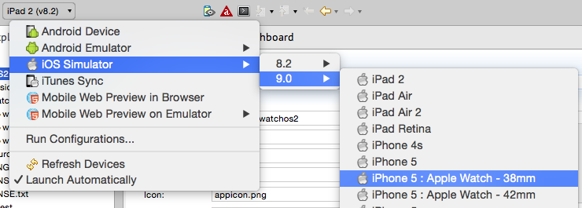

# Integrate a WatchKit App Built in Xcode

## Introduction

This guide covers how to integrate a WatchKit app built in Xcode with your Titanium application as well as information about sharing data between the extension and application. This guide does not cover how to develop a WatchKit app. Currently, the Titanium SDK supports WatchKit apps that are built in Xcode and run on watchOS 2.

A WatchKit app contains a specialized app extension that runs on either the Apple Watch or iOS device, depending on the watchOS version. The WatchKit app allows the user to access data from your application on their Apple Watch.

### Prerequisites

* Titanium CLI 5.0 or greater

* Titanium SDK 5.0 or greater

* Xcode 7 or greater

* Xcode Command-Line Tools

* Paired iOS devices must run iOS 9.0 or greater

## Create an Apple Watch Application

**Using the CLI**

To create an Apple Watch application, run the following command from the Titanium project that will include the watch application:

```bash
ti create -t applewatch -n <WATCH_APP_NAME> --template watchos2
```

If you omit the `--template option`, the CLI will create a watchOS 2 project by default.

The CLI will generate a new Xcode WatchKit project in the Titaniuim project's `extensions` folder and updates the `ios extensions` element in the `tiapp.xml` file. Open the Xcode project's `<NAME>.xcodeproj` to start developing the watch application.

## Share Data Between the Application and Extension

For watchOS 2 extensions (or later), use the [Watch Connectivity Framework](https://developer.apple.com/library/prerelease/watchos/documentation/WatchConnectivity/Reference/WatchConnectivity_framework/index.html#//apple_ref/doc/uid/TP40015269) and the [Titanium.WatchSession APIs](#!/api/Titanium.WatchSession) to transfer files and data between the watch and iOS application, respectively.

### Setup a Session

To setup a Watch Connectivity session, the watch application needs to check if the paired device supports Watch Connectivity sessions before retrieving a default session and activating it. Activating the session opens a channel between the paired devices.

```
if ([WCSession isSupported]) {
    watchSession = [WCSession defaultSession];
    watchSession.delegate = self;
    [watchSession activateSession];
}
```

In the Titanium application, you must also check to see if the paried devices supports Watch Connectivity sessions with the `Titanium.WatchSession.isSupported` property, then call the `Titanium.WatchSession.activateSession()` method to activate the session allowing messages to be transferred between devices.

```
if (Ti.WatchSession.isSupported) {
    Ti.WatchSession.activateSession();
}
```

To check if the session is activated and the paired watch application is reachable, use the following APIs. Some APIs require that the applications are in a reachable state.

| Watch Connectivity Framework API | Titanium.WatchSession API | Description |
| --- | --- | --- |
| +`isSupported` | [Ti.WatchSession.isSupported](#!/api/Titanium.WatchSession-property-isSupported) | Checks to see if the paired device supports Watch Connectivity sessions. |
| `reachable` | [Ti.WatchSession.isReachable](#!/api/Titanium.WatchSession-property-isReachable) | Checks to see if the paired devices share a Watch Connectivity session and both applications are in the foreground. |
| `-sessionReachabilityDidChange:` | [Ti.WatchSession.reachabilitychanged](#!/api/Titanium.WatchSession-event-reachabilitychanged) | Called or fired when the reachability state changes on the paired device. |

### Transfer Data

The Watch Connectivity framework provides a few different ways to exchange data between the iOS device and watch.

* **Application Context**: a shared data object between the paired devices that lasts for the current active session. Use the application context mechanism to synchronization the state between the watch and iOS device.

    | Watch Connectivity Framework API | Titanium.WatchSession API | Description |
    | --- | --- | --- |
    | `applicationContext` | [Ti.WatchSession.recentApplicationContext](#!/api/Titanium.WatchSession-property-recentApplicationContext) | Retrieve the current application context. |
    | `-updateApplicationContext:error:` | [Ti.WatchSession.updateApplicationContext()](#!/api/Titanium.WatchSession-method-updateApplicationContext) | Updates the session's application context. |
    | `-session:didReceiveApplicationContext:` | [Ti.WatchSession.receiveapplicationcontext](#!/api/Titanium.WatchSession-event-receiveapplicationcontext) | Called or fired when the session receives an update from the paired device. |

* **Messages**: pass a data object immediately between the paired devices. Requires that both applications are reachable.

    | Watch Connectivity Framework API | Titanium.WatchSession API | Description |
    | --- | --- | --- |
    | `-sendMessage:replyHandler:errorHandler:` | [Ti.WatchSession.sendMessage()](#!/api/Titanium.WatchSession-method-sendMessage) | Sends a message to the paired device. |
    | `-session:didReceiveMessage:` | [Ti.WatchSession.receivemessage](#!/api/Titanium.WatchSession-event-receivemessage) | Called or fired when the device receives a message from the paired device. |

    ::: warning ⚠️ Warning
    If you are using SDK 5.1.0 or earlier, you should form your request like this: `Ti.WatchSession.sendMessage(message)`. If you are using SDK 5.1.0 and above, form your request like this: `Ti.WatchSession.sendMessage(params)`.
    :::

* **User Info Transfer**: pass a data object in the background. Queued and delivered later when the application is reachable again.

    | Watch Connectivity Framework API | Titanium.WatchSession API | Description |
    | --- | --- | --- |
    | `-transferUserInfo:` | [Ti.WatchSession.transferUserInfo()](#!/api/Titanium.WatchSession-method-transferUserInfo) | Transfers user info (data object) to the paired device in the background. |
    | `-session:didReceiveUserInfo:` | [Ti.WatchSession.receiveuserinfo](#!/api/Titanium.WatchSession-event-receiveuserinfo) | Called or fired when the device receives user info from the paired device. |
    | `-session:didFinishUserInfoTransfer:error:` | [Ti.WatchSession. finishuserinfotransfer](#!/api/Titanium.WatchSession-event-finishuserinfotransfer) | Called of fired when the transfer completes on the paired device. |

### Transfer Files

Besides data, you can transfer files between the paired devices. Use the following APIs to transfer files:

| Watch Connectivity Framework API | Titanium.WatchSession API | Description |
| --- | --- | --- |
| `-transferFile:metadata:` | [Ti.WatchSession.transferFile()](#!/api/Titanium.WatchSession-method-transferFile) | Transfers a file to the paired device in the background. |
| `-session:didReceiveFile:` | [Ti.WatchSession.receivefile](#!/api/Titanium.WatchSession-event-receivefile) | Called or fired when the device receives a file transfer from the paired device. |
| `-session:didFinishFileTransfer:error:` | [Ti.WatchSession.finishfiletransfer](#!/api/Titanium.WatchSession-event-finishfiletransfer) | Called or fired when the transfer completes (successfully or not) on the paired device. |

## Provisioning Profiles

Before deploying a watchOS application to a device or creating a package for distribution, you need to create provisioning profiles for both the WatchKit application and WatchKit extension. You may either add the watch device to an existing provisioning profile or create separate provisioning profiles. Separate provisioning profiles will be needed if you want to support push notifications.

For directions on creating a provisioning profile, see [Deploying to iOS devices](/guide/Titanium_SDK/Titanium_SDK_Guide/Preparing_for_Distribution/Deploying_to_iOS_devices/) or [Distributing iOS apps](/guide/Titanium_SDK/Titanium_SDK_Guide/Preparing_for_Distribution/Distributing_iOS_apps/).

After you create your provisioning profiles and add them to Xcode, you need to add the UUID of the provisioning profiles to the `tiapp.xml` file.

**Using a Text Editor:**

1. Open the `tiapp.xml` file.

2. Locate the `extensions` element under the `ios` element.

3. Xcode 8 requires the Team-ID of your app to be set in order to link the different app targets. Add the Team-ID of your app into the `team-id` element

4. Under the `extensions` element, you should see two `target` elements. One is for the WatchKit extension (target name should contain the `Extension`) and the other is for the WatchKit app (target name should not contain `Extension`.

5. Under each `target` element, you should see three self-closing elements: `devices`, `dist-appstore` and `dist-adhoc`. Add the UUID of the provisioning profile as node text for each deployment type.

    1. `devices`: Add the UUID of the development provisioning profile

    2. `dist-appstore`: Add the UUID of the app store distribution provisioning profile

    3. `dist-adhoc`: Add the UUID of the ad hoc distribution provisioning profile

The example below add the development provisioning profiles to the file.

**tiapp.xml**

```xml
<ti:app>
  <ios>
    <!-- Required for Xcode 8 and later (Titanium SDK 5.5.0+) -->
    <team-id>YOUR-TEAM-ID</team-id>
    <extensions>
      <extension projectPath="extensions/foo/foo.xcodeproj">
        <target name="foo WatchApp Extension">
          <provisioning-profiles>
            <devices>12345678-0987-6543-2121-fedcba098765</devices>
            <dist-appstore/>
            <dist-adhoc/>
          </provisioning-profiles>
        </target>
        <target name="foo WatchApp">
          <provisioning-profiles>
            <devices>abcdef-dead-beef-0909-01234567</devices>
            <dist-appstore/>
            <dist-adhoc/>
          </provisioning-profiles>
        </target>
      </extension>
    </extensions>
  <ios>
</ti:app>
```

## Run the Project

To run the project, just build and launch the project like you would any other Titanium project, but for the WatchKit app, add the `--launch-watch-app` or `--launch-watch-app-only` flags to launch the watch application with or without the iOS application, respectively.

For Studio, use the run command from the launch options toolbar. If you want to run the watch application on a simulator, in the Target drop-down, select a 9.0 or greater simulator that has a paired watch target.



For the CLI, execute `ti build -p ios` with the additional build options.

```bash
ti build -p ios --launch-watch-app
```

If you have more than one watch application extensions, specify the watch application to launch with the `--watch-app-name <APP_NAME>` option.

If you want to specify the watch simulator, use the `--watch-device-id <UDID>` option.

## Package the Application

To package the application with the extension, just package the project like you would any other Titanium application. For Studio, use the package command from the launch options toolbar, and for the CLI, execute `ti build` command with the package options.

## Further Reading

[iOS Developer Library: Apple Watch Programming Guide](https://developer.apple.com/library/ios/documentation/General/Conceptual/WatchKitProgrammingGuide/index.html)
