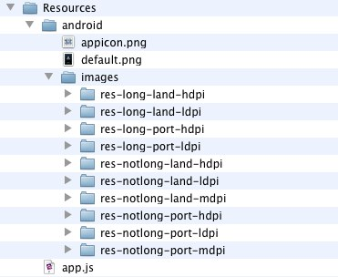
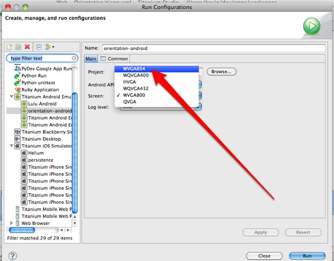
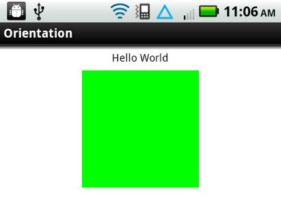

# Using density-specific resources on Android

## Contents

## Overview

This guide explains how a Titanium application can support different screen densities on Android.

## Platform-specific images Folder

The Android OS [divides the available screen densities into three groups](http://developer.android.com/guide/practices/screens_support.html), high, medium, and low. You can specify image resources to use per density by placing them in an `android/images/density` folder, as in:


Similarly to the iOS example, if we were creating a button in code (or referencing the image in a configuration file), we would just use `myButton.png`:

```javascript
var myButton = Ti.UI.createButton({
  backgroundImage: 'images/myButton.png'
});
```

## More control

We can be even more specific about when these resources should be used. This is the same concept as above, but instead of using high, medium, and low we can put our images in subdirectories that give us more control over when they are used.



## Folder name breakdown

Images that are in a folder named `"res-long-land-hdpi"` will be used for:

* **Long** screens, such as WQVGA, WVGA, FWVGA

* Device is in **landscape** orientation (horizontal)

* **High-density screens**; approximately 240dpi.

## Working with the folder names

With this naming convention you can be as specific or as broad as you need to be.
For instance, if you have these two folders in `"Resources/android/images"`:

* `"res-long-land-hdpi"`

* `"res-notlong-land-hdpi"`

But you don't need to have different images based on it being long or notlong. So all you need to do is remove that property from the folder name. So you end up with one folder named:

* "res-land-hdpi"

that will cover both instances. And if you where also going to use the same images for hdpi devices, no matter if it is portrait or landscape you could just name that folder

* "res-hdpi"

## Documentation

The full list of qualifiers that you can use for these folders can be found [here](http://developer.android.com/guide/topics/resources/providing-resources.html).

## Subfolders

If you want to put your image in a subfolder, you would put it in "Resources/android/images/res-long-land-hdpi/subfolder/test.png" and refer to it in your app as "image/subfolder/test.png".

### Notes

* These folders are searched for images from most specific to most broad. It is a good idea to have a folder named "res-mdpi", if an image doesn't exist in one of the other folders it will look there for it last before it fails to find the image. It is the default folder.

* Using "high", "medium", and "low" is the same as using "res-hdpi", "res-mdpi", and "res-ldpi".

## The appicon

The method above will not work for the appicon.png because the it is referenced directly from the android project and does not pass through titanium. When you use the method above the names of images are mangled to avoid collisions and we are only able to reference them through titanium.

To use density specific versions of the appicon you will need to create a folder structure in the root of the app that looks something like this:

* `"<app>/platform/android/res/drawable"`

* `"<app>/platform/android/res/drawable-hdpi"`


The folder "drawable" is the default folder that is looked in last.

## Using Density Independent Pixels

Android devices, as you are no doubt aware, come in many shapes and sizes. For developers, that means supporting screens with different resolutions and densities - the [official Android docs on supporting multiple screens](http://developer.android.com/guide/practices/screens_support.html) is essential reading on this topic. **Screen density** is the number of pixels on a physical space on the screen, usually measured in dpi (dots per inch). **Screen resolution** is the actual number of pixels on the screen, usually given in a width by height notation like "1440x960".

For example, I have a [Motorola Droid 2](http://developer.motorola.com/products/droid2/) I use for development. The resolution of its display is 480x854 - it is also considered a "high density" screen (240dpi) because all of those pixels are packed into a reasonably small area. If I wanted to test this device screen size on my desktop in the emulator, I would use the "WVGA854" skin, which is available in the Run Configurations menu in Studio:



Android will ship on devices with many different screen densities, so coding our application with different pixel sizes for fonts and layouts would get old pretty fast. To help combat this, Android allows developers to specify layout values (and font sizes, though the term is slightly different) in **density independent pixels**, also called **dips**. When your UI components are sized in dips, the Android OS will scale your UI up or down as if the screen your application is running on were what it calls a "medium density" (or 160dpi) screen. Most of the time, this is the behavior we would want and expect.

To make dips the default unit for UI components in an Android application, it requires an entry in AndroidManifest.xml (android:anyDensity="false"), which is what we specified in our tiapp.xml above.

### Code Examples

In Titanium SDK, typically we specify fontSize or `height/width/top/bottom/left/right` values as integer values. On iPhone, these values correspond to the 320x480 point system used to lay out UI components (even though the densities of iPhone handsets can be different). On Android in 1.7, raw integer values (unless the tiapp.xml configuration is changed) correspond to real pixels on the screen. Consider the following simple app.js:

```javascript
var win = Ti.UI.createWindow({
    backgroundColor: 'white',
    layout: 'vertical'
});

win.add(Ti.UI.createLabel({
    top: 10,
    text: 'Hello World',
    color: 'black',
    height: Ti.UI.SIZE,
    width: Ti.UI.FILL,
    font: {
        fontSize:18
    }
}));

win.add(Ti.UI.createView({
    top: 10,
    height: 200,
    width: 200,
    backgroundColor: 'green'
}));

win.open();
```

On Android, on a medium density display (like the HVGA screen size in the emulator), the box and text show up at a pretty large size. On a high resolution, high density display like my Droid 2, the text and box are pretty small:



In terms of proportions, I'd prefer to have the box and text show up at about the same size on the high density screen as well. I can fix my code by specifying my heights/widths/font sizes as density-independent pixels (DIPs) by specifying a 'dp' or 'dip' string rather than an integer value:

```javascript
var win = Ti.UI.createWindow({
    backgroundColor: 'white',
    layout: 'vertical'
});

win.add(Ti.UI.createLabel({
    top: '10dp',
    text: 'Hello World',
    color: 'black',
    height: Ti.UI.SIZE,
    width: Ti.UI.FILL,
    font: {
        fontSize:'18dp'
    }
}));

win.add(Ti.UI.createView({
    top: '10dp',
    height: '200dp',
    width: '200dp',
    backgroundColor: 'green'
}));

win.open();
```

On the iOS side, the default unit is DIPs, so this doesn't change anything on iOS. The updated code produces something which is a little closer to what I'd expect on Android.
