# Attributed Strings

## Introduction

This topic discusses how to use attributed strings on the Android and iOS platform. You can manage and apply specific attributes, such as font and kerning, to characters or range of characters in a string used as the label text, text area value, or text field hint text or value. This feature is exposed using the [Titanium.UI.AttributedString](#!/api/Titanium.UI.AttributedString) class.

## Creating an attributed string

To create an attributed string, use the `Titanium.UI.createAttributedString` method to create an `AttributedString` object by passing in a dictionary object that specifies the `text` and `attributes` properties:

* The `text` property specifies the text to use.

* The `attributes`property specifies an array of attribute dictionaries to apply to the text. An attribute dictionary includes the following properties:

    * `type`: the text attribute to apply as a `Titanium.UI.ATTRIBUTE_*` constant.

    * `value`: specifies a setting based on the `type` property, such as a color for a color attribute or dash style for a strikethrough or underline attribute.

    * `range`: which characters to modify as an array range: `[start_position, length]`.

After you have created your AttributedString object, to use it, set the `attributedString` property for either a Label, TextArea or TextField object.

* Setting this property on a Label is equivalent to setting the `text` property.

* Setting this property on a TextArea is equivalent to setting the `value` property.

* Setting this property on a TextField is equivalent to setting the `value` property.

You can also assign the AttributedString object to TextField's `attributedHintText` property, which is equivalent to setting the `hintText` property.

::: warning ⚠️ Warning
If you use the `attributedString` or the `attributedHintText` property, do not set any other properties that modify the appearance of text, such as `font`, `color`, etc. If you use an attributed string, only use an attributed string. Titanium does not support using attributed strings with other text modifying properties.
:::

The example below highlights the word "hyperloop" in the Label.

**app.js**

```javascript
var win = Ti.UI.createWindow({
    backgroundColor: '#ddd',
});

var text = "Have you tried hyperloop yet?";
var attr = Ti.UI.createAttributedString({
    text: text,
    attributes: [
        {
            type: Ti.UI.ATTRIBUTE_BACKGROUND_COLOR,
            value: "yellow",
            range: [text.indexOf('hyperloop'), ('hyperloop').length]
        }
    ]
});

var label = Ti.UI.createLabel({
    attributedString: attr
});

win.add(label);
win.open();
```

## Types of attributes

### Font

To specify a different font for part of your string, in the attribute dictionary, set the `type` property to `Titanium.UI.ATTRIBUTE_FONT` and the `value` property to a custom [Font](#!/api/Font) dictionary to describe the font attributes.

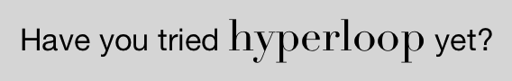

```javascript
var text = "Have you tried hyperloop yet?";
var attr = Ti.UI.createAttributedString({
    text: text,
    attributes: [
        {
            type: Ti.UI.ATTRIBUTE_FONT,
            value: { fontSize: 24, fontFamily: 'Didot' },
            range: [text.indexOf('hyperloop'), ('hyperloop').length]
        }
    ]
});
```

### Foreground color

To specify a different text color for part of your string, in the attribute dictionary, set the `type` property to `Titanium.UI.ATTRIBUTE_FOREGROUND_COLOR` and the `value` property to a color name or hex value.

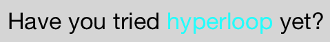

```javascript
var text = "Have you tried hyperloop yet?";
var attr = Ti.UI.createAttributedString({
    text: text,
    attributes: [
        {
            type: Ti.UI.ATTRIBUTE_FOREGROUND_COLOR,
            value: 'cyan',
            range: [text.indexOf('hyperloop'), ('hyperloop').length]
        }
    ]
});
```

### Background color

To specify a different background color for part of your string, in the attribute dictionary, set the `type` property to `Titanium.UI.ATTRIBUTE_BACKGROUND_COLOR` and the `value` property to a color name or hex value.

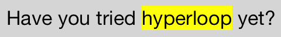

```javascript
var text = "Have you tried hyperloop yet?";
var attr = Ti.UI.createAttributedString({
    text: text,
    attributes: [
        {
            type: Ti.UI.ATTRIBUTE_BACKGROUND_COLOR,
            value: "yellow",
            range: [text.indexOf('hyperloop'), ('hyperloop').length]
        }
    ]
});
```

### Underline

To place a horizontal line under part of your string, set the `type` property to `Titanium.UI.ATTRIBUTE_UNDERLINES_STYLE`.

For Android, you do not need to specify the `value` property. If set, the property is ignored by Android. Android only displays a single line under the text.

For iOS, set the `value` property to a `Titanium.UI.ATTRIBUTE_UNDERLINE_*` constant describing the style of the horizontal line:

* `Titanium.UI.ATTRIBUTE_UNDERLINE_STYLE_NONE: does not draw a line`

* `Titanium.UI.ATTRIBUTE_UNDERLINE_STYLE_SINGLE:`draws a single line

Supported on iOS 7 and later:

* `Titanium.UI.ATTRIBUTE_UNDERLINE_STYLE_THICK:` draws a think line

* `Titanium.UI.ATTRIBUTE_UNDERLINE_STYLE_DOUBLE:`draws two lines

* `Titanium.UI.ATTRIBUTE_UNDERLINE_PATTERN_SOLID:`draws a solid line

* `Titanium.UI.ATTRIBUTE_UNDERLINE_PATTERN_DOT:`draws a dotted line

* `Titanium.UI.ATTRIBUTE_UNDERLINE_PATTERN_DASH:`draws a dashed line

* `Titanium.UI.ATTRIBUTE_UNDERLINE_PATTERN_DASH_DOT:`draws an alternating dash and dot line

* `Titanium.UI.ATTRIBUTE_UNDERLINE_PATTERN_DASH_DOT_DOT:`draws an alternating dash and two dot line

* `Titanium.UI.ATTRIBUTE_UNDERLINE_BY_WORD:`draw lines only under or through characters

You can logically-OR more than one constant together to use more than one style or pattern.

For iOS 7 and later, you can control the color of the horizontal line. Set the `type` property to `Titanium.UI.ATTRIBUTE_UNDERLINE_COLOR` and the `value` property to a color name or hex value.

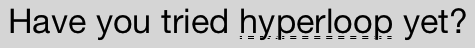

```javascript
var text = "Have you tried hyperloop yet?";
var attr = Ti.UI.createAttributedString({
    text: text,
    attributes: [
        {
            type: Ti.UI.ATTRIBUTE_UNDERLINES_STYLE,
            value: Ti.UI.ATTRIBUTE_UNDERLINE_STYLE_DOUBLE | Ti.UI.ATTRIBUTE_UNDERLINE_PATTERN_DOT, // Ignored by Android only displays a single line
            range: [text.indexOf('hyperloop'), ('hyperloop').length]
        }
    ]
});
```

### Strikethrough

To place a horizontal line through part of your string, set the `type` property to `Titanium.UI.ATTRIBUTE_STRIKETHROUGH_STYLE`.

For Android, you do not need to specify the `value` property. If set, the property is ignored by Android. Android only displays a single line through the text.

For iOS, set the `value` property to a `Titanium.UI.ATTRIBUTE_UNDERLINE_*` constant describing the style of the horizontal line. See the previous section for a description of these constants. You can logically-OR more than one constant together to use more than one style or pattern.

For iOS 7 and later, you can control the color of the horizontal line. Set the `type` property to `Titanium.UI.ATTRIBUTE_STRIKETHROUGH_COLOR` and the `value` property to a color name or hex value.

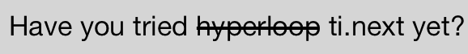

```javascript
var text = "Have you tried hyperloop ti.next yet?";
var attr = Ti.UI.createAttributedString({
    text: text,
    attributes: [
        {
            type: Ti.UI.ATTRIBUTE_STRIKETHROUGH_STYLE,
            value: Ti.UI.ATTRIBUTE_UNDERLINE_STYLE_THICK, // Ignored by Android only displays a single line
            range: [text.indexOf('hyperloop'), ('hyperloop').length]
        }
    ]
});
```

### Links

To add a link to part of your string, in the attribute dictionary, set the `type` property to `Titanium.UI.ATTRIBUTE_LINK` and the `value` property to the URL. For iOS, this API only works on iOS 7 and later.

Listen for the `link` event to respond to a tap on linked text. Prior to Release 4.0, on iOS, the `link` event was only triggered by a long press.

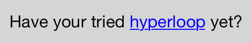

```javascript
var win = Ti.UI.createWindow({
    backgroundColor: '#ddd',
});

var text = "Have your tried hyperloop yet?";
var attr = Ti.UI.createAttributedString({
    text: text,
    attributes: [
        {
            type: Titanium.UI.ATTRIBUTE_LINK,
            value: "https://github.com/appcelerator/hyperloop",
            range: [text.indexOf('hyperloop'), ('hyperloop').length]
        }
    ]
});

var label = Ti.UI.createLabel({
    attributedString: attr
});

// Only works for iOS
label.addEventListener('link', function(e){
  Ti.API.info(JSON.stringify(e));
});

win.add(label);
win.open();
```

## iOS attributes

The following attributes are only available on the iOS platform.

### Ligature

A ligature combines two or more characters in to a special character. To enable ligatures for your string, set the `type` property to `Titanium.UI.ATTRIBUTE_LIGATURE` and the `value` property to `1` to use default ligatures. Set `value` to `0` to disable ligatures. Note that not all fonts support ligatures. Notice the difference between 'fi' when ligatures are disabled and enabled.


```javascript
var text = "fee-fi-fo-fum\nfee-fi-fo-fum";
var attr = Ti.UI.createAttributedString({
    text: text,
    attributes: [
        {
            type: Ti.UI.ATTRIBUTE_FONT,
            value: { fontSize: 24, fontFamily: Cochin-Italic' },
            range: [0, text.length]
        },
        {
            type: Titanium.UI.ATTRIBUTE_LIGATURE,
            value: 0,
            range: [4, 1]
        }
    ]
});
```

### Kerning

Kerning adjusts the spacing between characters. To specify a different kerning for part of your string, set the `type` property to `Titanium.UI.ATTRIBUTE_KERN` and the `value` property to a float value specifying the distance between characters in points. Setting the `value` to `0` disables kerning, which is the default behavior.

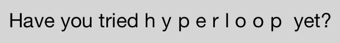

```javascript
var text = "Have you tried hyperloop yet?";
var attr = Ti.UI.createAttributedString({
    text: text,
    attributes: [
        {
            type: Ti.UI.ATTRIBUTE_KERN,
            value: 5.0,
            range: [text.indexOf('hyperloop'), ('hyperloop').length]
        }
    ]
});
```

### Stroke text

To use a stroke text for part of your string, in the attribute dictionary, set the `type` property to `Titanium.UI.ATTRIBUTE_STROKE_WIDTH` and the `value` property to a float describing the size of the outline. A positive value only displays an outline of the character, while a negative value fills the character.

To change the color of the text, set the `type` property to `Titanium.UI.ATTRIBUTE_STROKE_COLOR` and the `value` property to a color name or hex value.

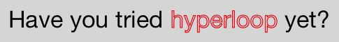

```javascript
var text = "Have you tried hyperloop yet?";
var attr = Ti.UI.createAttributedString({
    text: text,
    attributes: [
        {
            type: Ti.UI.ATTRIBUTE_STROKE_COLOR,
            value: 'red',
            range: [text.indexOf('hyperloop'), ('hyperloop').length]
        },
        {
            type: Ti.UI.ATTRIBUTE_STROKE_WIDTH,
            value: 3.0,
            range: [text.indexOf('hyperloop'), ('hyperloop').length]
        }
    ]
});
```

### Shadow

To add a shadow effect to part of your string, in the attribute dictionary, set the `type` property to `Titanium.UI.ATTRIBUTE_SHADOW` and the `value` property to a dictionary describing the shadow with the following properties:

* `blurRadius` (iOS 7 and later): specifies the blur radius of the shadow. `0` means no blur.

* `color`: color name or hex triplet specifying the color of the shadow.

* `offset`: dictionary with the properties `width` and `height` used as the horizontal and vertical offset of the shadow, respectively.

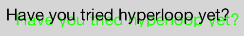

```javascript
var text = "Have you tried hyperloop yet?";
var attr = Ti.UI.createAttributedString({
    text: text,
    attributes: [
        {
            type: Ti.UI.ATTRIBUTE_SHADOW,
            value: {color: 'green', offset: {width: 10, height: 5}},
            range: [0, text.length]
        }
    ]
});
```

### Letterpress effect

Supported on iOS 7 and later.

To add a letterpress effect to your text, in the attribute dictionary, set the `type` property to `Titanium.UI.ATTRIBUTE_TEXT_EFFECT` and the `value` property to `Titanium.UI.ATTRIBUTE_LETTERPRESS_STYLE`.

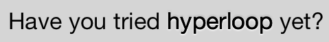

```javascript
var text = "Have you tried hyperloop yet?";
var attr = Ti.UI.createAttributedString({
    text: text,
    attributes: [
        {
            type: Ti.UI.ATTRIBUTE_TEXT_EFFECT,
            value: Ti.UI.ATTRIBUTE_LETTERPRESS_STYLE,
            range: [text.indexOf('hyperloop'), ('hyperloop').length]
        }
});
```

### Text direction

Supported on iOS 7 and later.

To change the direction of part of your string, in the attribute dictionary, set the `type` property to `Titanium.UI.ATTRIBUTE_WRITING_DIRECTION` and the `value` property to a `Titanium.UI.ATTRIBUTE_WRITING_*` constant:

* `Titanium.UI.ATTRIBUTE_WRITING_DIRECTION_NATURAL`: use the [Unicode Bidirection Algorithm rules P2 and P3](http://www.unicode.org/reports/tr9/#The_Paragraph_Level) to determine which direction to use

* `Titanium.UI.ATTRIBUTE_WRITING_DIRECTION_LEFT_TO_RIGHT`: write the text from left to right

* `Titanium.UI.ATTRIBUTE_WRITING_DIRECTION_RIGHT_TO_LEFT`: write the text from right to left

You can logically-OR the previous writing direction constants with one of the below constants to specify the writing direction behavior:

* `Titanium.UI.ATTRIBUTE_WRITING_DIRECTION_EMBEDDING`: use the embedded direction of the text

* `Titanium.UI.ATTRIBUTE_WRITING_DIRECTION_OVERRIDE`: override the embedded direction of the text and force the direction


```javascript
var text = "Have you tried hyperloop yet?";
var attr = Ti.UI.createAttributedString({
    text: text,
    attributes: [
        {
            type: Ti.UI.ATTRIBUTE_WRITING_DIRECTION,
            value: Ti.UI.ATTRIBUTE_WRITING_DIRECTION_RIGHT_TO_LEFT | Ti.UI.ATTRIBUTE_WRITING_DIRECTION_OVERRIDE,
            range: [text.indexOf('hyperloop'), ('hyperloop').length]
        }
    ]
});
```

### Baseline

Supported on iOS 7 and later.

To change the baseline (vertical position) of part of your string, in the attribute dictionary, set the `type` property to `Titanium.UI.ATTRIBUTE_BASELINE_OFFSET` and the `value` property to a number specifying how many pixels above (positive value) or below (negative value) the main baseline to position the text.

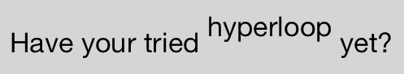

```javascript
var text = "Have your tried hyperloop yet?";
var attr = Ti.UI.createAttributedString({
    text: text,
    attributes: [
        {
            type: Ti.UI.ATTRIBUTE_BASELINE_OFFSET,
            value: 10,
            range: [text.indexOf('hyperloop'), ('hyperloop').length]
        }
    ]
});
```

### Oblique

Supported on iOS 7 and later.

To skew part of your string, in the attribute dictionary, set the `type` property to `Titanium.UI.ATTRIBUTE_OBLIQUENESS` and the `value` property to a float indicating how much skew to apply to the text. A value of `0` indicates no skewing, which is the default behavior.


```javascript
var text = "Have your tried hyperloop yet?";
var attr = Ti.UI.createAttributedString({
    text: text,
    attributes: [
        {
            type: Ti.UI.ATTRIBUTE_OBLIQUENESS,
            value: 0.25,
            range: [text.indexOf('hyperloop'), ('hyperloop').length]
        }
    ]
});
```

### Stretch

Supported on iOS 7 and later.

To stretch part of your string horizontally but not vertically, in the attribute dictionary, set the type property to `Titanium.UI.ATTRIBUTE_EXPANSION` and the value property to a float indicating the log of the expansion factor to be applied. A value of `0` indicates no expansion, which is the default behavior.


```javascript
var text = "Have your tried hyperloop yet?";
var attr = Ti.UI.createAttributedString({
    text: text,
    attributes: [
        {
            type: Titanium.UI.ATTRIBUTE_EXPANSION,
            value: 0.25,
            range: [text.indexOf('hyperloop'), ('hyperloop').length]
        }
    ]
});
```
