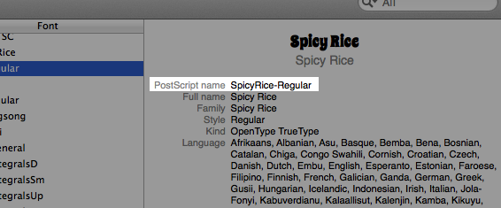

# Custom Fonts

Custom fonts are a quick and easy way to personalize or brand your application. Titanium SDK supports TrueType and OpenType fonts on both iOS and Android. There are some differences between how fonts are referenced on iOS and Android that need to be considered.


For an example of using custom fonts, download the [Custom\_Fonts](./attachments_37685705_2_Custom_Fonts.zip) application.

## Finding fonts

You will need TTF or OTF font files to ship with your Titanium SDK project. Depending on your application's license and distribution model, you might need to pay for such use, or you might be able to use an open source font. Below are links to a couple of sources of fonts:

* [Google WebFonts](http://www.google.com/webfonts) - Free fonts, mostly open source but some licenses for use in commercial projects

* [FontSquirrel](http://www.fontsquirrel.com/) - Freeware fonts licensed for commercial and open source projects

## Using a custom font (Alloy application)

To use a custom font in an Alloy project, place the font file in a "fonts" folder inside each platform-specific assets folder, as shown below:


Create a text-based UI element, such as a [Label](#!/api/Titanium.UI.Label) element, and optionally assign it an ID or class, as shown below.

**View - index.xml**

```xml
<Alloy>
  <View>
      <Label id="spicyrice">This is Spicy Rice.</Label>
      <Label id="burnstowndam">This is Burnstown Dam.</Label>
  </View>
</Alloy>
```

Create style rules for the `#spicyrice` and `#burnstowndam` elements that assigns the font to the rule's [`fontFamily`](#!/api/Font-property-fontFamily) property. The value you assign to `fontFamily` depends on the platform.

* Android expects `fontFamily` to be the font's file name without the file extension (.otf or .tff).

* iOS expects `fontFamily` to be the font's PostScript name (see [Finding a font's PostScript name](#finding-a-font's-postscript-name)). This name is embedded in the font file and does not change if you rename the file.

For example, in the following code the file name of the Burnstown Dam font is "burnstown\_dam.otf". For an Android application you therefore assign the value **burnstown\_dam** to `fontFamily`:

```
"#burnstowndam": {
  font: {
      fontFamily: 'burnstown_dam'
  }
}
```

The PostScript name for Burnstown Dam is **BurnstownDam-Regular**, so for an iOS application you assign that value to `fontFamily`:

```
"#burnstowndam": {
  font: {
      fontFamily: 'BurnstownDam-Regular'
  }
}
```

### Rename font file to match PostScript name

One way to handle cross-platform font differences easier is to rename the base name of the font file to match the font's PostScript name. You can then use that same value for `fontFamily` for both iOS and Android. To apply this to the previous example, rename "burnstown\_dam.otf" to **BurnstownDam-Regular.otf** (the PostScript name). Then you can use a single style rule for both platforms.

**Font file renamed to match PostScript name**

```
"#burnstowndam": {
  font: {
      fontFamily: 'BurnstownDam-Regular'
  }
}
```

This is the approach taken in the [CustomFonts](./attachments_37685705_2_Custom_Fonts.zip) sample application.

### Using platform-specific styles

You can also use platform-specific styles in your TSS file (see [Alloy Styles and Themes](/guide/Alloy_Framework/Alloy_Guide/Alloy_Views/Alloy_Styles_and_Themes/#platform-specific-styles)) to assign the proper `fontFamily` name. At build time, only those settings appropriate to your target platform are included in the build.

**Platform-specific font styling**

```
"#burnstowndam[platform=ios]": {
  font: {
    fontFamily: "BurnstownDam-Regular"
  }
},
"#burnstowndam[platform=android]": {
  font: {
    fontFamily: "burnstown_dam"
  }
}
```

### Finding a font's PostScript name

iOS applications expect the font's PostScript name, while Android expect the font's base file name. If you rename the font file's to match its PostScript name, you can use the same value on both platforms when assigning a font. On Mac, you can find a font's PostScript name using the [FontBook](http://support.apple.com/kb/ht2509) application provided with OS X.

**To find a font's PostScript name on OS X**:

1. Open FontBook.

2. Select the desired font from the list.

3. Press Cmd+I to view the **PostScript name** for the font.

    

A font's PostScript name is often the same as its "friendly name" but not always, especially with font variants (italic, bold, etc.).

## Using a custom font (Classic application)

Using a custom font in a classic Titanium application requires adding some runtime platform-switching code to apply the right . Once you've identified the font to use, follow these steps:

**Using a custom font in a classic application**:

1. Copy the font file to your project's **Resources/fonts/** directory. To use different fonts on iOS and Android, copy the font files to `Resources/iphone/fonts` and `Resources/android/fonts`.

2. The code you use varies a bit by platform, as illustrated in the following code sample:

    ```javascript
    /*
    * Let's say you downloaded the "Spicy Rice" font from Google WebFonts.
    * You'd have a file named SpicyRice-Regular.ttf in your fonts directory
    */

    var customFont = 'Spicy Rice'; // use the friendly-name on iOS
    if(Ti.Platform.osname=='android') {
       // on Android, use the "base name" of the file (name without extension)
       customFont = 'SpicyRice-Regular';
    }

    var label1 = Titanium.UI.createLabel({
       color: '#000',
       text: 'I am Window 1',
       font: {
          fontSize: 40,
          fontFamily: customFont
       },
       textAlign: 'center'
    });
    ```

3. On Android, build your project and the custom font should show up.

### iOS platform notes

For iOS builds, all fonts located in the `Resources/fonts` folder are automatically added to the application's `info.plist` file. Custom fonts that you're using only on Android (or other platform) should not should be placed in this folder so they aren't added to the `info.plist` of iOS builds. Those fonts should instead be placed in the platform-specific resource subfolder (`Resources/android/fonts`, for example).

### Platform-switching sugar

Building in those if/then statements can make for some hard to read and maintain code. So, here's a little trick pulled from Kevin Whinnery's Tweetanium app. First, include the following function in your app (maybe in your library of helper functions):

```javascript
/*
  Branching logic based on OS
*/
var osname = Ti.Platform.osname;
var os = function(/*Object*/ map) {
  var def = map.def||null; //default function or value
  if (map[osname]) {
    if (typeof map[osname] == 'function') { return map[osname](); }
    else { return map[osname]; }
  }
  else {
    if (typeof def == 'function') { return def(); }
    else { return def; }
  }
};
```

With that in place, you can now put the platform-dependent values right in line with the property assignment. Like this:

```javascript
var label1 = Titanium.UI.createLabel({
  color: '#000',
  text: 'I am Window 1',
  font: {
    fontSize: 40,
    fontFamily: os({
      iphone: 'Spicy Rice',
      ipad: 'Spicy Rice',
      ipod: 'Spicy Rice',
      android: 'SpicyRice-Regular'
    })
  },
  textAlign: 'center'
});
```

The `os()` function will take the values you provide for each of the platforms, and return the correct one for the OS on which your code is running. You can use any of the values returned by `Ti.Platform.osname` as keys for that function's single argument, as shown above.

## Sample application

[CustomFonts](./attachments_37685705_2_Custom_Fonts.zip) demonstrates using custom fonts in an Alloy application that works on both iOS and Android.

## Resources

You might also want to check out the fonts built into the system before you go installing a custom font. Of course, support varies by OS version and in the case of Android, probably by handset maker and carrier. Here are some links to get you started:

* [iOS system fonts](http://jomnius.blogspot.com/2011/10/new-fonts-in-ios-50-and-some-missing.html)

* [iOSfonts.com](http://iosfonts.com/)

* [Android fonts](https://github.com/android/platform_frameworks_base/tree/master/data/fonts) - GitHub repo for current version of Android, older versions won't support all of these
