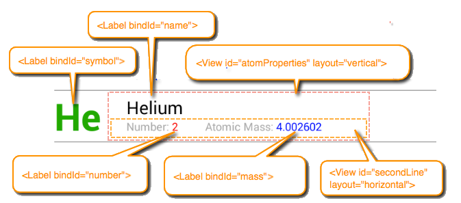
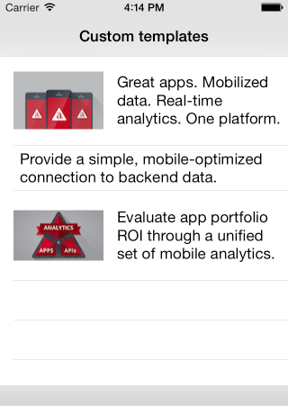
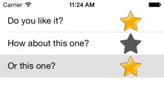

# Alloy ListView Guide

## Introduction

The `ListView` class lets you create high-performance, vertically scrolling lists. To achieve the fast-scrolling behavior expected in mobile applications, the `ListView` class manages the life cycle (creation, deletion, updating) of individual list items itself, rather than the application developer. Instead, the developer provides one or more list item _templates_ that define an item's presentation, and a list of data items for the list to display. As the user scrolls through the list, the data items are cycled through a limited number of rendered list view items.

## ListView basics

In Alloy, a ListView consists minimally of a `<` `ListView/>` element that contains one or more `<ListSection/>` elements, which in turn contain one or more of < `ListItem/` > elements. You can declaratively populate a ListView (using the default list item template), as shown below.

**index.xml**

```xml
<Alloy>
  <Window class="container">
    <ListView id="elementsList">
      <ListSection name="elements">
        <ListItem title="Hydrogen"/>
        <ListItem title="Helium"/>
        <ListItem title="Lithium"/>
        <ListItem title="Beryllium"/>
        <ListItem title="Boron"/>
        <ListItem title="Carbon"/>
        <ListItem title="Nitrogen"/>
        <ListItem title="Oxygen"/>
        <!-- Abbreviated... -->
      </ListSection>
    </ListView>
  </Window>
</Alloy>
```


### Assigning data programmatically to a ListView

For small data sets, it's convenient to declaratively create the ListItems in the XML view, as shown previously. For large data sets, you will likely want to separate the data set from its presentation. To do this, you pass an array of [ListDataItem](#!/api/ListDataItem) objects to the `setItems()` method of a `ListSection`.

The view controller (index.js) defines an array of `ListDataItem` objects, and then calls the `setItems()` method on the `ListSection` to populate it.

**index.js**

```javascript
var items = [
  {properties: {title: "Hydrogen"}},
  {properties: {title: "Helium"}},
  {properties: {title: "Lithium"}},
  {properties: {title: "Beryllium"}},
  {properties: {title: "Boron"}},
  {properties: {title: "Carbon"}},
  {properties: {title: "Nitrogen"}}
];
$.elementsList.sections[0].setItems(items);
```

In this case, the XML view (index.xml) can be reduced to a `<ListView/>` and `<ListSection/>` elements, without any `<ListItem/>` elements.

**index.xml**

```xml
<Alloy>
  <Window class="container">
    <ListView id="elementsList">
      <ListSection name="elements" />
    </ListView>
  </Window>
</Alloy>
```

If the source data is provided in a form that doesn't match the [`ListDataItem`](#!/api/ListDataItem) structure (for example from a web service), you can easily map it to the correct format using the included Underscore library's `map()`method, as shown below.

```javascript
var elementData = [
  {name: "Hydrogen"},
  {name: "Helium"},
  {name: "Lithium"},
  {name: "Beryllium"},
  {name: "Boron"},
  {name: "Carbon"},
  {name: "Nitrogen"}
];
var items = _.map(elementData, function(element) {
  return {
    properties: {
      title: element.name
    }
  };
});
$.elementsList.sections[0].setItems(items);
```

Calling `setItems()` method clears the `ListSection` before setting its items. To discretely update list items, you can use the`appendItems()`,`insertItemsAt(),`and`replaceItemsAt()` methods of the `ListSection` class.

## ListItem templates

Each `ListItem` element has an associated _template_ that determines how the data for that row is displayed. A template consists of standard UI elements – Label, ImageView, Button, and so forth – that are bound to specific fields in the list item data set. You can use the provided [default list item template](#undefined) (as in the previous) examples, or create a custom template that you can apply to all list items, or apply to individual list items. On iOS, you can also use one of the additional built-in templates.

### Default list item template

By default, a `ListView` uses the [default list item template](#!/api/Titanium.UI-property-LIST_ITEM_TEMPLATE_DEFAULT), which consists of an image view, a black, left-aligned title label, and an optional accessory icon. On Android, the image appears on the right side of the cell, and on iOS the image appears on the left side of the cell. This is the template used in the previous examples. For example, the following XML and TSS code adds an image and a disclosure icon accessory type to each list item.

**index.xml**

```xml
<Alloy>
  <Window class="container">
    <ListView id="elementsList">
      <ListSection name="elements">
        <ListItem title="Hydrogen" image="icons/Hydrogen.png"/>
        <ListItem title="Helium" image="icons/Helium.png"/>
        <ListItem title="Lithium" image="icons/Lithium.png"/>
        <ListItem title="Beryllium" image="icons/Beryllium.png"/>
        <ListItem title="Boron" image="icons/Boron.png"/>
        <!-- Abbreviated... -->
      </ListSection>
    </ListView>
  </Window>
</Alloy>
```

The template label's text and image source are bound to each `<ListItem>` element's `title` and `image` attributes. If an attribute is not set on the element, then that template element is not displayed. As with any Alloy element, you can specify an attribute value in a TSS file. The following associated TSS specifies the `accessoryType` for each `ListItem`.

**index.tss**

```javascript
"ListItem": {
  accessoryType: Titanium.UI.LIST_ACCESSORY_TYPE_DISCLOSURE
}
```


### Custom ListItem templates

If the default `ListItem` template doesn't suit your needs, you can create a custom template that defines each list item's structure and style. A custom template is a container for Titanium UI elements, such as `Label`, `ImageView` and `View`. To bind list item data to a particular view element, you must assign a `bindId` attribute to the element. The following illustrates the structure of a custom item template containing several (bindable) Label elements and a couple of (non-bindable) View elements.



To declare a custom item template add a `<Templates/>` element to the `<ListView/>` element and then add one or more named `<ItemTemplate>` elements to the `<Templates/>` element. A `<Templates/>` element can contain multiple <ItemTemplate/> elements, each of which must have a `name` attribute that uniquely identifies it.

To the `<ItemTemplate/>` add any UI elements you want to appear in each list item. To enable data binding on a given view, assign a `bindId` attribute to the element. To apply the the custom template by default to all list items (rather than the built-in default item template) set the `ListView` `defaultItemTemplate` attribute to the value of the `name` attribute you assigned to the `<ItemTemplate/>`. If you have more than one custom template, you can override the default item template for a given list item by setting it's `template` property. See Below for more information.

**Custom item template**

```xml
<ListView id="elementsList" defaultItemTemplate="elementTemplate">
    <Templates>
        <ItemTemplate name="elementTemplate">
            <Label bindId="symbol" id="symbol" />
            <View id="atomProperties">
                <Label bindId="name" id="name" />
                <View id="secondLine">
                  <Label class="line2 fieldLabel" text="Number: " />
                    <Label class="line2" bindId="number" id="number" />
                  <Label class="line2 fieldLabel" text="Atomic Mass: " />
                    <Label class="line2" bindId="mass" id="mass" />
                </View>
            </View>
      <ImageView bindId="image" id="image" />
        </ItemTemplate>
    </Templates>
  <ListSection>
    <ListItem symbol:text="H" symbol:color="#090" name:text="Hydrogen" number:text="1" mass:text="1.00794"/>
    <ListItem symbol:text="He" symbol:color="#090" name:text="Helium" number:text="2" mass:text="4.002602"/>
      <ListItem symbol:text="Li" name:text="Lithium" number:text="3" mass:text="6.941"/>
  </ListSection>
</ListView>
```

As you can see above, to declaratively bind data to the proper view element in a custom template, you specify the element's bindId and the property name to update, separated by colon. For instance, `mass:text="1.00794"` means to assign the specified value to the `text` property of the `<Label/>` element whose `bindId` is `mass`.

Below is the TSS file used to style the elements in the custom template.

**Custom item template TSS**

```
"#symbol": {
  left: 15,
  color: "black",
  font: { fontSize: 34, fontWeight: 'bold' }
},
"#symbol[platform=android]": {
  left: 0
}
"#atomProperties": {
  top: 0, left: 80, right: 0, bottom: 0,
  layout: "vertical"
},
"#atomProperties[platform=android]": {
  left: 65
},
"#name": {
  left: 0, top: 4,
  color: "black",
  textAlign: Ti.UI.TEXT_ALIGNMENT_LEFT,
  font: { fontSize: 16 }
},
"#secondLine": {
  left: 0, right: 0,
  layout: "horizontal"
},
".fieldLabel": {
  color:"#999"
},
".line2": {
  font: { fontSize: 10 }
},
"#number": {
  width: 30,
  color: 'red'
},
"#mass": {
  color: "blue"
}
```

The images below show the custom item template on iOS and Android.


### Assigning data programmatically with custom templates

To programmatically bind data to view in a custom template, the object you pass to `setItems()` defines custom key-value pairs. The key for each pair must match the `bindId` of the child view, and its values are a dictionary of properties to bind the view. Using the `elementTemplate` from the previous example, the following code assigns data to the list view:

**index.js**

```javascript
var items = [
      {
          mass: {text: "1.00794"},
          name: {text: "Hydrogen"},
          number: {text: "1"},
          symbol: {color: "#090", text: "H"}
      },
      {
          mass: {text: "4.002602"},
          name: {text: "Helium"},
          number: {text: "2"},
          symbol: {color: "#090", text: "He"}
      },
      {
          mass: {text: "6.941"},
          name: {text: "Lithium"},
          number: {text: "3"},
          symbol: {color: "#090", text: "Li"}
      }
  ];
$.elementsList.sections[0].setItems(items);
```

### Assigning ListItem templates

As shown in previous examples, you can assign a custom template to all list items by setting the ListView's `defaultItemTemplate`. You can also assign a custom template to an individual list item's `template` property. For example, the following ListView defines two custom item templates named "image\_title" and "image\_only". The first template consists of a `<View/>` with a horizontal layout containing an `<ImageView/>` and a `<Label/>` element; the second uses the default (absolute) layout and contains only a `<Label/>` element. These layouts are illustrated below.



The following XML view defines the two templates.

**index.xml**

```xml
<ListView id="dynamicListView">
  <Templates>
    <ItemTemplate name="image_title" height="100">
      <View layout="horizontal" left="15">
        <ImageView bindId="image" id="image"/>
        <Label bindId="label" id="label1"/>
      </View>
    </ItemTemplate>
    <ItemTemplate name="title_only" height="50">
      <View left="15">
        <Label bindId="label"/>
      </View>
    </ItemTemplate>
  </Templates>
  <ListSection/>
</ListView>
```

The following controller code programmatically assigns a template to each list item by setting its `template` property:

**index.js**

```javascript
var items = [
  {
    label: {text: "Great apps. Mobilized data. Real-time analytics. One platform."},
    image: {image: "appcelerator.png"},
    template: "image_title"
  },
  {
    label: {text: "Provide a simple, mobile-optimized connection to backend data."},
    template: "title_only"
  },
  {
    label: {text: "Evaluate app portfolio ROI through a unified set of mobile analytics."},
    image: {image: "mobile-analytics.png"},
    template: "image_title"
  }
];
$.listview2.sections[0].setItems(items, {animated: "false"});
```

## Handling events

### Marker events

If the data set you want to display in a ListView is extremely large (or perhaps infinite), it's often preferable to load an initial set of list data items. Then as the user scrolls to the end of available data, additional data items are loaded. For performance reasons, ListView doesn't support scroll events but does provide a feature called "markers". A marker identifies a point in a rendered ListView that acts like a tripwire: the first time a user scrolls past a list item where a marker has been set, it emits a [marker](#!/api/Titanium.UI.ListView-event-marker) event. Your application can respond to this event by loading additional data and set a new marker, if necessary.

The following code demonstrates how this works. In your XML view, add an `onMarker` attribute to the ListView that specifies the function to handle the `marker` event:

```xml
<ListView id="infiniteList" onMarker="markerReached">
  <ListSection/>
</ListView>
```

You call `setMarker()`, passing it the list view section index and item index where you want to set a marker. For example, the following sets a marker at the 100th list item in the first section in the ListView.

```
$.infiniteList.setMarker({sectionIndex:0,itemIndex:100});
```

The application loads the initial data set and sets the first marker. For the purposes of demonstration, this example use a `for()` loop to generate an "infinite" data source based on the value of a state variable. In practice, your application will likely consume data from a remote or local paginated data source.

**Load initial data and set initial marker**

```javascript
// Variable that contains current marker value:
var currentMarker = 25;

// Create initial data set...
var data = [];
for (var k = 0; k < currentMarker; k++) {
    data.push({
        properties : {
            title: 'Row ' + (k + 1)
        }
    });
}
// ...load it, and set the initial marker:
$.infiniteList.sections[0].setItems(data);
$.infiniteList.setMarker({sectionIndex:0,itemIndex:currentMarker-1});
```

When the marker event is fired, a new set of data is generated and appended to the list view. Finally, a new marker point is set.

**Marker event handler**

```javascript
// Marker callback
var markerReached = function(e) {
    var max = currentMarker + 25;
    var data = [];
    for (var k = currentMarker; k < max; k++) {
        data.push({
            properties : {
                title: 'Row ' + (k + 1)
            }
        });
    }
  // Append new data to the list view section:
    $.infiniteList.sections[0].appendItems(data);
  // Set new marker point:
    currentMarker = currentMarker + 25;
    $.infiniteList.setMarker({sectionIndex:0, itemIndex: (currentMarker - 1)});
};
```

### Handling events on ListItems

To handle click events on list items, you attach an `onItemclick` attribute to the `<ListView/>` that specifies the event function handler to invoke. The event handler is passed an `itemclick` event whose properties identify the clicked list item (by section and item index), as well as the `bindId` of of the control that generated the event, if any. For example:

**index.xml**

```xml
<ListView id="list" onItemclick="handleClick">
  <ListSection>
    <ListItem title="row 1"/>
    <ListItem title="row 2"/>
    <ListItem title="row 3"/>
    <ListItem title="row 4"/>
    <ListItem title="row 5"/>
  </ListSection>
</ListView>
```

The `itemclick` handler updates the `title` property of the list item and sets its `color` to red, before updating the item in the list.

**index.js**

```javascript
function handleClick (e) {
  // Get the section of the clicked item
  var section = $.list.sections[e.sectionIndex];
  // Get the clicked item from that section
  var item = section.getItemAt(e.itemIndex);
  // Update the item's `title` property and set it's color to red:
  item.properties.title += " (clicked)";
  item.properties.color = 'red';
  // Update the item in the list
  section.updateItemAt(e.itemIndex, item);
}
```

### Handling events on template views

When using a custom template, you can also handle events on individual template view objects. For example, each list item might contain an image the user can click to indicate they like that item.



To do this, you attach an `onEvent`attribute to the view element in the `<ItemTemplate/>` element, whose value is the event handler to invoke when the user clicks that view object. For example, the following defines the custom template used in the above screenshot, consisting of a `<Label/>` element and an `<ImageView/>` element. The `<ListView/>` has an `onItemclick` attribute set to `"handleItemClick"`to set the star image by bubbling the event down to the image view. The project's /assets folder contains two PNGs: `star_grey.png` and `star_gold.png`. Initially, each list item displays the grey star.

```xml
<ListView id="likeList" defaultItemTemplate="custom" onItemclick="handleItemClick">
  <Templates>
    <ItemTemplate name="custom">
      <Label bindId="label" left="15" />
      <ImageView bindId="icon" right="15" />
    </ItemTemplate>
  </Templates>
  <ListSection>
    <ListItem label:text="Do you like it?" icon:image="star_grey.png" />
    <ListItem label:text="How about this one?" icon:image="star_grey.png" />
    <ListItem label:text="Or this one?" icon:image="star_grey.png" />
  </ListSection>
</ListView>
```

The `handleItemClick()` event handler function, shown below, toggles the image displayed by the image between the grey and gold versions.

```javascript
function handleItemClick (e) {
    // Check if the clicked item is the image view
    if (e.bindId != "icon") {
        return;
    }

  // Get the clicked item
  var item = e.section.getItemAt(e.itemIndex);
  var currentImage = item.icon.image;

    if (currentImage == "star_grey.png") {
    item.icon.image = "star_gold.png"
  } else {
    item.icon.image = "star_grey.png"
  }
  e.section.updateItemAt(e.itemIndex, item);
}
```

::: warning ⚠️ Warning
The views that display each list data item are recycled as the user scrolls through the list. Therefore, when changing the content of a ListItem, do so by changing the the underlying list item data, not by modifying the source of the event.

```javascript
// Don't do this:
function handleItemClick(e) {
  e.source.image = "star_gold.png";
}
```

The above code can have unexpected consequences if the user scrolls past the item and then scrolls it back into view.
:::
