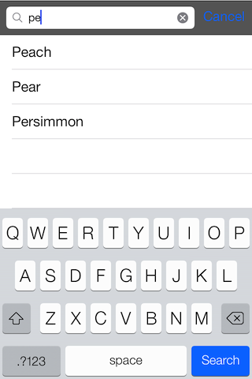
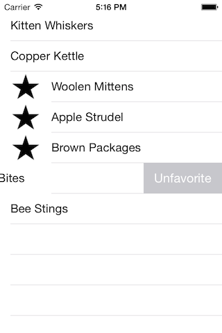
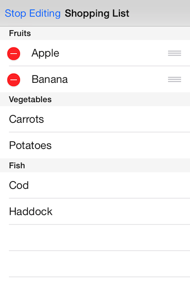

# ListViews

## Introduction

This topic describes how to create a scrollable list of data using the new ListView object. The first section covers what a list view is and the important concepts related to creating and using it. The next three sections of this topic cover the important objects needed to create a scrollable list of data: ListView, ListSection and ListItem. The next section describes how the application can respond to user interaction, followed by sections on customizing the list view and using native iOS-specific features. The last section in this topic describes the differences between ListViews and [TableViews](/guide/Titanium_SDK/Titanium_SDK_How-tos/User_Interface_Deep_Dives/TableViews/), the previous way to create a scrollable list of data.

For information about using ListView in an Alloy application, see the [Alloy ListView Guide](/guide/Titanium_SDK/Titanium_SDK_How-tos/User_Interface_Deep_Dives/ListViews/Alloy_ListView_Guide/).

## Concepts

ListView is designed as a replacement for TableView as a way to display data in a scrollable list. Both list view and table view present data to a user as a vertically scrolling list of rows. However, ListView is designed to perform better with a large number of rows. As such, list view uses a data-oriented approach, where the creation and manipulation of the actual on-screen views is managed by the platform, not the application.

ListView's data-driven tables separate the data to be displayed from the individual view structure of each row, which limits direct access to each individual row. You cannot manipulate the properties and children of a row directly; instead you define _templates_ that define how the data for a row is displayed. ListViews can use multiple templates, so each row or set of rows can have their own unique view structure.

The following terms are important concepts used with ListView:

* **ListItem.** A list item is a "virtual" view object that represents an individual row in a list. A list item is created from an item template and data item.

    * **ItemTemplate.** An item template is a JavaScript object used to define the view structure of your list items. Add child views and default properties to customize the appearance of the item.

    * **ListDataItem.** A list data item is a JavaScript object that contains the data you want to display in the list. The data is applied to a template to create a list item.

* **ListSection.** A list section is a view object that is used to manipulate and organize list items contained within it.

* **ListView.** A list view is a view object that is used to manipulate and organize list sections contained within it.

## ListView

A ListView object is used to manipulate ListSections, which contain ListItems--the actual items you want to display to a user. The data is presented as a list of rows that is vertically scrollable. To create a list view, use the `Titanium.UI.createListView` method, then add list sections using the `sections` property:

```javascript
var listView = Titanium.UI.createListView({
  // properties
  sections: [section1, section2, section3],
    headerTitle: "Shopping List"
});
```

Some properties specific to list view include:

* `allowsSelection` – enable or disable selecting items in the list. (Only on the iOS platform)

* defaultItemTemplate – sets the default item template for all data items if they do not specify a template to use. You can either specify one of the built-in styles or a style name that was mapped to an item template using the `templates` property.

* `headerTitle` – set a title for the table's header.

* `headerView` – sets a custom header view (since 3.2.0).

* `footerTitle` – sets a title for the table's footer.

* `footerView` – sets a custom footer view (since 3.2.0).

* `pullView` – sets a custom view when the list is pulled down (since 3.2.0 for iOS).

* `searchView` – sets a search bar for the list to filter or find items in a list (since 3.2.0).

* `sections`– sets the list sections to display.

* `separatorColor` – sets the color of the separator between rows (since 3.2.0).

* `templates` – maps a style name to an item template object. The style name is used to bind the item data to an item template with the data item's `template` property or the list view's `defaultItemTemplate` property.

After the list view renders, use the `appendSection`, `deleteSectionAt`, `insertSectionAt` and `replaceSectionAt` methods to manipulate the sections of the list view.

## ListSection

A ListSection object is used to manipulate ListItems contained within it, allowing you to organize your list items into groups. To create a list section, use the `Titanium.UI.createListSection` method, then add ListDataItems (not ListItems) to the section using the `items` property:

```javascript
var listSection = Titanium.UI.createListSection({
    // properties
    items: [item1, item2, item3],
    headerTitle: "Section A"
});
```

Some properties specific to list section include:

* `headerTitle` – sets a title for the section's header.

* `headerView` – sets a custom header view (since 3.2.0).

* `footerTitle` – sets a title for the section's footer.

* `footerView` – sets a custom footer view (since 3.2.0).

* `items`– sets the list data items to display.

After the list view renders, use the `appendItems`, `deleteItemsAt`, `insertItemsAt`, `replaceItemsAt`, and `updateItemAt` methods to manipulate the items of the list section.

## ListItem

A ListItem is an individual row in a ListView, created from a ListDataItem and ItemTemplate. The list data item is the data you want to display to a user, while an item template defines the style and structure of the row. You do not need to create an item template to display data, but you need it to customize the view or bind event callbacks.

ListItems are not created the same way as other Titanium views. You cannot create a ListItem directly. To create a ListItem object, you need to supply an array of ListDataItem objects to a list section and create an ItemTemplate to customize the view structure.

### ItemTemplate

An item template defines the structure and style of a data item as well as binds event callbacks. Use an item template to customize the view of a row. An item template is a JavaScript object with three properties:

* **properties**: Add key-value pairs of view properties and their values to the `properties` dictionary of the item template to set view properties of the list item. If the list data item's properties keys are also set, the list data item's settings supersedes the templates.

* **events**: Add key-value pairs of event names and their callback functions (or array of callback functions for multiple callback bindings) to the `events` dictionary of the item template to bind callbacks to events, which are bubbled from the subcomponents of the item.

* **childTemplates**: Add additional views, such as labels or image views, to the `childTemplates` array of the item template. The child templates are item templates with two extra properties:

    * Set the `type` property to a Titanium view class, such as `Ti.UI.Label` or `Ti.UI.ImageView`, to use that view in your template.

    * Set the `bindId` to bind the template to a custom property in the list data item. The custom properties in the list data item contain key-value pairs of view properties and their values.

::: tip 💡 Hint
Item templates only support the following view classes:

* Titanium.UI.ActivityIndicator

* Titanium.UI.Button

* Titanium.UI.ImageView

* Titanium.UI.Label

* Titanium.UI.ProgressBar

* Titanium.UI.Slider

* Titanium.UI.Switch

* Titanium.UI.TextArea

* Titanium.UI.TextField
:::

To bind the list data item to an item template, use the list view's `templates` property to map the template to a style name, then use the style name to either set the list view's `defaultItemTemplate` property to globally set the style for all items or set the `template` property of the list data item to override or individually set the style.

```javascript
var itemTemplate = {
    properties: {
        // These are the same as the list data item properties
        // The list data item properties supersedes these if both are defined
        accessoryType: Ti.UI.LIST_ACCESSORY_TYPE_NONE
    },
    events: {
        // Bind event callbacks for bubbled events
        // Events caught here are fired by the subcomponent views of the ListItem
        click: clickCB
    },
    childTemplates: [ // Add view subcomponents to the ListItem
        {
            // Display a Label
            type: 'Ti.UI.Label',
            // If there is a rowtitle dictionary in the ListDataItem,
            // that data binds with this view subcomponent
            bindId: 'rowtitle',
            properties: {
                // Set view properties for the Label view subcomponent
                font: {fontSize: '14dp'}
            },
            events: {
                // Bind event callbacks only to the subcomponent
                click: clickCB
            },
            childTemplates: [
                // View subcomponents can also have subcomponents
            ],
        },
        // ...add more components
    ]
}
```

### ListDataItem

A list data item is a JavaScript object with data you want to display in a list. The simplest way to display data is to use the default template and pass the data you want to display by setting the `title` property in the list data item's `properties` dictionary, then pass the list data items to the list section:

```javascript
// Simplest list data items that can be displayed in a list view
var data = [
    { properties: { title: 'Row 1'} },
    { properties: { title: 'Row 2'} },
    { properties: { title: 'Row 3'} }
];

// Add the list data items to a section
var listSection = Titanium.UI.createListSection({items: data});

// Add the list section to a list view
var listView = Titanium.UI.createListView({sections: [listSection]});
```

View elements you can set in the `properties` dictionary include:

* `accessoryType` – displays an accessory (checkmark, disclosure indicator or detail button) on the right side of row for a built-in or custom template.

* `backgroundColor` – sets the row's background color for a built-in or custom template.

* `backgroundGradient` – sets the row's background gradient.

* `backgroundImage` – sets the row's background image.

* `canEdit` – allows the item to be deleted in editing mode. (Only on the iOS platform)

* `canMove` – allows the item to be moved in editing mode. (Only on the iOS platform)

* `color`– sets the text color for a built-in template.

* `font` – sets the font properties for a built-in template.

* `height` – sets the height of the row for a built-in or custom template.

* `image` – sets the image to use for a built-in template. On Android, the image is displayed on the right, and on iOS, the image is displayed on the left. Ignored by the contacts built-in template.

* `itemId` – set to identify this item when events are fired by this item.

* `searchableText` – sets the text used to match for searching.

* `selectedBackgroundColor` – sets the row's background color when selected.

* `selectedBackgroundGradient` – sets the row's background gradient when selected.

* `selectedBackgroundImage` – sets the row's background image when selected.

* `selectionStyle` – selects the highlight color when this item is selected. (Only on the iOS platform)

* `subtitle` – sets the subtitle to be displayed for a built-in template.Ignored by the default built-in template.

* `title` – sets the title to be displayed for a built-in template.

Most of these properties only work with the built-in templates.By default, only the image, title and accessory are displayed.See the "Built-in Templates" section for a description of the other built-in templates.

You can also set the `template` property of a list data item to set or override the default item template, and add custom key-value pairs, which bind to the child templates of an ItemTemplate. The key for these pairs match the `bindId` of the child view templates and the values are a dictionary of view properties applied to the view components. Any other properties that are not identified by a `bindId` are permitted but are ignored by the item template.

### Accessories

You can optionally display an accessory on the right side of the row by setting the `accessoryType` property in the `properties` dictionary of either the list data item or item template. Set the `accessoryType` property to one of the following constants:

* Titanium.UI.LIST\_ACCESSORY\_TYPE\_CHECKMARK – displays a checkmark. Use to indicate that an item in a list is selected or not.

* Titanium.UI.LIST\_ACCESSORY\_TYPE\_DETAIL – displays a detail disclosure button. Use to indicate that clicking on the detail button displays a detailed view of the item.

* Titanium.UI.LIST\_ACCESSORY\_TYPE\_DISCLOSURE – display a disclosure indicator. Use to indicate that clicking on this item displays another list, reflecting the next level in the data model hierarchy.

* Titanium.UI.LIST\_ACCESSORY\_TYPE\_NONE – do not display anything.

The accessory always appears if using either the built-in templates or custom item templates.

## Eventing

You can bind event callbacks to either ListViews or ListItems.

### ListView itemclick event

ListView's `itemclick` event can be used to monitor click events on all ListItems.

```javascript
listView.addEventListener('itemclick', function(e){
    var item = e.section.getItemAt(e.itemIndex);
    if (item.properties.accessoryType == Ti.UI.LIST_ACCESSORY_TYPE_NONE) {
        item.properties.accessoryType = Ti.UI.LIST_ACCESSORY_TYPE_CHECKMARK;
    }
    else {
        item.properties.accessoryType = Ti.UI.LIST_ACCESSORY_TYPE_NONE;
    }
    e.section.updateItemAt(e.itemIndex, item);
    alert(
        "ItemId: " + e.itemId + "\n" +
        "BindId: " + e.bindId + "\n" +
        "Section Index: " + e.sectionIndex + ", Item Index: " + e.itemIndex
    );
});
```

If this event is fired, the code toggles the checkmark accessory on or off and displays an alert message with event information. As shown above, you have access to an event object that holds important information about the location of the user interaction:

* `accessoryClicked`– if the accessory is a detail button, returns true if it was clicked.

* `bindId` – the bindID of the view subcomponent that was clicked.

* `itemId` – the itemID of the list item that was clicked.

* `itemIndex` – index of the item relative to the section that was clicked.

* `section` – reference to the ListSection object that was clicked.

* `sectionIndex` – index of the list section that was clicked.

Do not use the `source` property to determine which item the click originated from. Instead, use the previously mentioned properties.

On iOS, the `itemclick` event does not fire if you click on a control, such as a button or switch, even though the control might animate in response to the click. You need to add a `click` event to the child template of the control.

On Android, the `itemclick` event fires if you click on a control. Check the event's `bindId` to make sure the user interacted with the control.

### ListView marker event

Since Release 3.2.0, ListView fires the `marker` event when the user scrolls up or down near a predetermined item in the list. Use `ListView.setMarker()` method to set when this event should be fired. Once the user scrolls close to this item, the `marker` event is fired and you can execute some code, for example, to load more data. Note that the marker event is fired only once per set marker. You need to use the `setMarker` method again to set a new item threshold and the `marker` event will be fired once again.

Starting with Release 4.1.0, use the `addMarker()` method to add additional markers. Note that if you call the `setMarker()` method again, it will remove and override any previous set markers.

```javascript
var win = Ti.UI.createWindow({backgroundColor: 'white', fullscreen: true});
var listView = Ti.UI.createListView();
var section = Ti.UI.createListSection();
var sectionData = [];
var i = 25;
for (var k = 0; k < 25; k++) {
    sectionData.push({
        properties : {
            title: 'Row ' + (k + 1)
        }
    });
}
section.setItems(sectionData);
listView.sections = [section];
win.add(listView);
win.open();

// Set the initial item threshold
listView.setMarker({sectionIndex:0, itemIndex: (i - 1) });

// Load more data and set a new threshold when item threshold is reached
listView.addEventListener('marker', function(e){
    var max = i + 25;
    var data = [];
    for (var k = i; k < max; k++) {
        data.push({
            properties : {
                title: 'Row ' + (k + 1)
            }
        });
    }
    section.appendItems(data);
    i = i + 25;
    listView.setMarker({sectionIndex:0, itemIndex: (i - 1)});
});
```

### ListView move and delete events

Since 3.2.0, on the iOS platform, you can use the `move` and `delete` event to see when the user reorders and removes an item from the list, respectively, when the list is in editing mode. Note that if you add custom items to list actions, the delete event will not fire. For an example, see the "Editing" section in the "iOS-Specific Features" section below.

### ListView pull and pullend events

Since 3.2.0, on the iOS platform, you can use the `pull` and `pullend` events with ListView's `pullView` property to implement a pull to refresh feature for your list. First, create a custom View with other view objects contained within it and set this View to ListView's `pullView` property. Then, listen for the `pull` and `pullend` events to execute code to refresh the list.

* The `pull` event fires when the user pulls the pull view past the top of the list view, so the pull view is completely on screen.

* The `pullend` event fire when the user releases the pull view after it has been completely shown on screen.

For a complete example, see the "ListView with a pullView" example in the [ListView API Reference guide](#!/api/Titanium.UI.ListView).

### ListView noresults event

Since 3.3.0, when items are filtered in a list view using either `searchView` or `searchText`, the `noresults` event fires when the search does not return any results. See the "Search Text and View" section in the "iOS-Specific Features" section below

### ListView scrollstart and scrollend events

Since 4.1.0, on the Android and iOS platform, you can use the `scrollstart` and `scrollend` events to monitor when the list starts and stops scrolling, respectively. The event object returns the following information indicating the start location and number of visible items when the events occurred:

* `firstVisibleSectionIndex` – index of the first visible section

* `firstVisibleItemIndex` – index of the first visible item

* `visibleItemCount` – number of visible items

* `firstVisibleSection` – first visible section

* `firstVisibleItem` – first visible item

### ListItem eventing

For ListItems, add the events to the `events` dictionary of either the item template or child template. If you assign an event callback in the item template, the callback responds to a bubbled event fired by a view subcomponent. See the example below.

## Simple ListView example

The example below creates an item template to display a title on the left side of the row, an image view in the center, and a button on the right side of the row. When the list view is created, the item template is mapped to the style name called `plain`, which is used to set the `defaultItemTemplate` property to globally set the plain template for each list item. A click event callback is set on the button control of the list item, and another callback, which toggles the checkmark accessory, is set on the ListView's `itemclick`event but only responds to clicks on the label and image.

```javascript
var win = Ti.UI.createWindow({backgroundColor: 'white'});

var plainTemplate = {
    childTemplates: [
        {
            type: 'Ti.UI.Label', // Use a label
            bindId: 'rowtitle',  // Bind ID for this label
            properties: {        // Sets the Label.left property
                left: '10dp'
            }
        },
        {
            type: 'Ti.UI.ImageView',  // Use an image view
            bindId: 'pic',            // Bind ID for this image view
            properties: {             // Sets the ImageView.image property
              image: 'KS_nav_ui.png'
            }
        },
        {
            type: 'Ti.UI.Button',   // Use a button
            bindId: 'button',       // Bind ID for this button
            properties: {           // Sets several button properties
                width: '80dp',
                height: '30dp',
                right: '10dp',
                title: 'press me'
            },
            events: { click : report }  // Binds a callback to the button's click event
        }
    ]
};

function report(e) {
  Ti.API.info(e.type);
}

var listView = Ti.UI.createListView({
    // Maps the plainTemplate object to the 'plain' style name
    templates: { 'plain': plainTemplate },
    // Use the plain template, that is, the plainTemplate object defined earlier
    // for all data list items in this list view
    defaultItemTemplate: 'plain'
});

var data = [];
for (var i = 0; i < 10; i++) {
    data.push({
        // Maps to the rowtitle component in the template
        // Sets the text property of the Label component
        rowtitle : { text: 'Row ' + (i + 1) },
        // Sets the regular list data properties
        properties : {
            itemId: 'row' + (i + 1),
            accessoryType: Ti.UI.LIST_ACCESSORY_TYPE_NONE
        }
    });
}

var section = Ti.UI.createListSection({items: data});
listView.sections = [section];
listView.addEventListener('itemclick', function(e){
    // Only respond to clicks on the label (rowtitle) or image (pic)
    if (e.bindId == 'rowtitle' || e.bindId == 'pic') {
        var item = e.section.getItemAt(e.itemIndex);
        if (item.properties.accessoryType == Ti.UI.LIST_ACCESSORY_TYPE_NONE) {
            item.properties.accessoryType = Ti.UI.LIST_ACCESSORY_TYPE_CHECKMARK;
        }
        else {
            item.properties.accessoryType = Ti.UI.LIST_ACCESSORY_TYPE_NONE;
        }
        e.section.updateItemAt(e.itemIndex, item);
    }
});
win.add(listView);
win.open();
```


## Advanced customizations

The following sections describe some advanced features to customize the look and feel of a list.

### Custom header and footer

Since Release 3.2.0, you can create a custom header or footer for the list or list sections. Create a custom View object with other view objects, then set the ListView or ListSection's `headerView` or `footerView` property to this object. For example:

```javascript
// Function to create a view with a label
var createCustomView = function(title) {
    var view = Ti.UI.createView({
        backgroundColor: '#222',
        height: 40
    });
    var text = Ti.UI.createLabel({
        text: title,
        left: 20,
        color: '#fff'
    });
    view.add(text);
    return view;
};

var win = Ti.UI.createWindow({backgroundColor: 'white', fullscreen: true});
var listView = Ti.UI.createListView({
    headerView: createCustomView('Header View'),
    footerView: createCustomView('Footer View')
});
var section = Ti.UI.createListSection({
    // Or add a custom header or footer to the section
    // headerView: createCustomView('Section Header'),
    // footerView: createCustomView('Section Footer')
});
var sectionData = [
    {properties: { title: 'Row 1'}},
    {properties: { title: 'Row 2'}},
    {properties: { title: 'Row 3'}},
];
section.setItems(sectionData);
listView.sections = [section];
win.add(listView);
win.open();
```


### Pull to refresh

Since Release 3.2.0, on the iOS platform, you can create a custom pull view for your list, then wait for the `pull` and `pullend`events to refresh the list. See the "Eventing" section for an explanation of these events, and for a complete example, see the "List View with a pullView" example in the [ListView API Reference guide](#!/api/Titanium.UI.ListView).


### Row selections

To change the look of a row when it is selected or clicked on, set the `selectedBackgroundColor`, `selectedBackgroundImage` and `selectedBackgroundGradient` properties in the `properties` dictionary of either the ListDataItem or ItemTemplate to customize the look.

On the iOS platform, in order to select a row, ListView's `allowsSelection` property needs to be set to `true`.

You can also set the `selectionStyle` property in the `properties` dictionary of either the ListDataItem or ItemTemplate to one of the supported constants:

* Titanium.UI.iOS.ListViewCellSelectionStyle.BLUE

* Titanium.UI.iOS.ListViewCellSelectionStyle.GRAY (default)

* Titanium.UI.iOS.ListViewCellSelectionStyle.NONE

### Search text and view

Since Release 3.2.0, you can add search capabilities to your list to filter or find items. You can either use ListView's `searchView` property to add a search bar to your list or you can pass your search query to ListView's `searchText` property. You cannot use both of these properties simultaneously. Listen for the `noresults` event to see if the search did not return any results.

To use the `searchView` property, create a `Titanium.UI.SearchBar` object and set it to the ListView's `searchView` property. Then, you need to add the `searchableText`property to each item in your list when you create it to assign it the text to match when searching. You can optionally set the `caseInsensitiveSearch` property to `false` to enable case sensitive searches and set the `keepSectionsInSearch` to `true` to preserve section labels while searching.

On Android, `Titanium.UI.SearchBar` is not native when build with Titanium versions older than 10.0.0. In this case, it's recommended to use `Titanium.UI.Android.SearchView` instead which is native. As of Titanium 10.0.0, `Titanium.UI.SearchBar` is native.

To use the `searchText` property, set the property to the value you want to search for and the list automatically updates with the results. You still need to add the `searchableText` property to each item in your list. See the commented code sections below.

```javascript
var win = Ti.UI.createWindow({backgroundColor: 'white', fullscreen: true});

var search = Titanium.UI.createSearchBar({
    barColor:'#000',
    showCancel:true,
    height:43,
    top:0,
});
search.addEventListener('cancel', function(){
    search.blur();
});
// for textSearch, use the change event to update the search value
// search.addEventListener('change', function(e){
//     listView.searchText = e.value;
// });

var listView = Ti.UI.createListView({searchView: search, caseInsensitiveSearch: true});
// for textSearch, add the search bar or text field as a header view
// var listView = Ti.UI.createListView({headerView: search, caseInsensitiveSearch: true});

var listSection = Ti.UI.createListSection();
var fruits = ['Papaya', 'Peach', 'Pear', 'Persimmon', 'Pineapple', 'Pluot', 'Pomegranate'];
var data = [];
for (var i = 0; i < fruits.length; i++) {
    data.push({
        properties: {title: fruits[i], searchableText: fruits[i]}
    });
}
listSection.setItems(data);

listView.addEventListener('noresults', function(e){
    alert("No results found!");
});
listView.sections = [listSection];
win.add(listView);
win.open();
```



## iOS-specific features

ListView supports a few extra native features specific to the iOS platform.

### Action items

Starting with Release 4.1.0, you can add custom action items to the list items. Action items appear when the user swipes left on a list item, then the user can select an action to perform on the item. Custom action items require iOS 8 and above.

To use an action item:

1. Create an action item, which is only a dictionary with the following properties:

    * `title` – Name of the action. Displayed the user and indicates which action was chosen.

    * `style` – Style of the action. Specify one of the following constants: `Titanium.UI.iOS.ROW_ACTION_STYLE_DEFAULT`, `Titanium.UI.iOS.ROW_ACTION_STYLE_DESTRUCTIVE`, or `Titanium.UI.iOS.ROW_ACTION_STYLE_NORMAL`.

    * `color` – Background color the action. Optional. Default is to use the one defined by the style.

2. Add the action item to the list data item's `editActions` property and set the `canEdit` property to true. You may also set these properties in the item template. If you do not set the `canEdit` property to true, the user cannot swipe left on the item to reveal the action items.

3. Listen to the ListView's `editaction` event to respond when the user clicks on an action item. The event returns an object with the following properties to indicate the action and item the user clicked:

    * `action` – The `title` property of the action the user clicked.

    * `itemId` – the itemID of the list item that was clicked.

    * `itemIndex` – index of the item relative to the section that was clicked.

    * `section` – reference to the ListSection object that was clicked.

    * `sectionIndex` – index of the list section that was clicked.

**Example**

The example below creates a list where you can favorite or unfavorite items.

```javascript
var win = Ti.UI.createWindow({backgroundColor: 'white'}),
    favoriteAction = {
        title: 'Favorite',
        style: Ti.UI.iOS.ROW_ACTION_STYLE_DEFAULT
    },
    unfavoriteAction = {
        title: 'Unfavorite',
        style: Ti.UI.iOS.ROW_ACTION_STYLE_NORMAL
    },
    data = [
        {properties: {canEdit: true, editActions: [favoriteAction], title: 'Kitten Whiskers'}},
        {properties: {canEdit: true, editActions: [favoriteAction], title: 'Copper Kettle'}},
        {properties: {canEdit: true, editActions: [favoriteAction], title: 'Woolen Mittens'}},
        {properties: {canEdit: true, editActions: [favoriteAction], title: 'Apple Strudel'}},
        {properties: {canEdit: true, editActions: [favoriteAction], title: 'Brown Packages'}},
        {properties: {canEdit: true, editActions: [favoriteAction], title: 'Dog Bites'}},
        {properties: {canEdit: true, editActions: [favoriteAction], title: 'Bee Stings'}}
    ],
    listSection = Ti.UI.createListSection({
        items: data
    }),
    listView = Ti.UI.createListView({
        top: 15,
        sections: [listSection]
    });

listView.addEventListener('editaction', function(e) {
    var item = e.section.getItemAt(e.itemIndex)
    if (e.action === 'Favorite') {
        item.properties.editActions = [unfavoriteAction];
        item.properties.image = '/star.png';
    } else if (e.action === 'Unfavorite') {
        item.properties.editActions = [favoriteAction];
        item.properties.image = null;
    }
    e.section.updateItemAt(e.itemIndex, item);
});

win.add(listView);
win.open();
```



### Animations

You can specify a row animation constant with ListSection's `appendItems`, `deleteItemsAt`, `insertItemsAt`, `replaceItemsAt`, and `updateItemAt`methods and ListView's `appendSection` , `deleteSectionAt` , `insertSectionAt` and `replaceSectionAt` methods to add, remove or modify a row(s) with an animation. For example, the code below makes the application remove the first ten rows in the section with an animation that shifts the rows to the left before they are deleted:

```
listSection.removeItemsAt(0, 10, {animationStyle: Titanium.UI.iOS.RowAnimationStyle.LEFT});
```

### Built-in templates

On iOS, ListView supports three additional built-in templates besides the default template:

* Titanium.UI.ITEM\_LIST\_TEMPLATE\_CONTACTS: right-justified title with a left-justified subtitle, both near the center of the row.

* Titanium.UI.ITEM\_LIST\_TEMPLATE\_SETTINGS: left-justified title on the left side of the row with a right-justified subtitle on the right side of the row.

* Titanium.UI.ITEM\_LIST\_TEMPLATE\_SUBTITLE: left-justified title with the subtitle below it in smaller gray text.

* Titanium.UI.ITEM\_LIST\_TEMPLATE\_DEFAULT: only displays the left-justified title. No subtitle is displayed even if one is specified.

Each template displays the image view on the left side and accessory on the right side of the row except the contacts template, which does not display an image view even if the `image` property is specified.

To use a built-in template, set either the list view's `defaultItemTemplate` property or the list data item's `template` property. The default template is used if a template is not specified using either of these properties.

```javascript
var win = Ti.UI.createWindow({backgroundColor: 'white'});

var data = [
    {
        properties: {
            title: 'Title',
            subtitle: 'Subtitle',
            image: 'KS_nav_views.png', // not used by this template
            accessoryType: Ti.UI.LIST_ACCESSORY_TYPE_NONE
        },
        template: Ti.UI.LIST_ITEM_TEMPLATE_CONTACTS
    },
    {
        properties: {
            title: 'Title',
            subtitle: 'Subtitle',
            image: 'KS_nav_views.png',
            accessoryType: Ti.UI.LIST_ACCESSORY_TYPE_CHECKMARK
        },
        template: Ti.UI.LIST_ITEM_TEMPLATE_SETTINGS
    },
    {
        properties: {
            title: 'Title',
            subtitle: 'Subtitle',
            image: 'KS_nav_views.png',
            accessoryType: Ti.UI.LIST_ACCESSORY_TYPE_DETAIL
        },
        template: Ti.UI.LIST_ITEM_TEMPLATE_SUBTITLE
    },
    {
        properties: {
            title: 'Title',
            subtitle: 'Subtitle', // not used by this template
            image: 'KS_nav_views.png',
            accessoryType: Ti.UI.LIST_ACCESSORY_TYPE_DISCLOSURE
        },
        template: Ti.UI.LIST_ITEM_TEMPLATE_DEFAULT
    }
];

var listSection = Ti.UI.createListSection({items: data});
var listView = Ti.UI.createListView({sections: [listSection]});
win.add(listView);
win.open();
```


The previous example displays each of the built-in templates for the iOS platform with an accessory--from the top, the contacts template with not accessory, the settings template with the checkmark accessory, the subtitle template with the detail accessory and the default template with the disclosure accessory. Note that the `image` property is ignored by the contacts template and the `subtitle` property is ignored by the default template even though they were defined.

### Editing

Since Release 3.2.0, you can move or delete individual items in a list. First, to allow an item to be moved or deleted, set the `canMove` or canEdit property to `true`in the `properties` dictionary of the ListItem, respectively. Next, to enable editing mode, set the ListView's `editing` property to `true`. Set the property to `false` to return to selection mode. You can optionally set the ListView's `pruneSectionsOnEdit` to `true` to remove the list section when all items are removed either by moving or deleting.

While editing mode is enabled for the list, the user can use the deletion control on the left side of the item to remove the item from the list and the reorder control on the right side of the item to move it around in the list.

In the example below, the items in the fruit section can be moved or deleted.

```javascript
var win = Ti.UI.createWindow({backgroundColor: 'white', fullscreen: true, title: 'Shopping List'});
var navWin = Ti.UI.iOS.createNavigationWindow({window: win});

var listView = Ti.UI.createListView();

// Listen when items are deleted or moved
function report (e) {
    Ti.API.info('Item ' + e.itemIndex + ' was ' + e.type + 'd!');
}
listView.addEventListener('delete', report);
listView.addEventListener('move', report);
// Left navigation button to toggle between editing and selection mode
var button = Ti.UI.createButton({title: 'Edit'});
win.leftNavButton = button;
var flag = false;
button.addEventListener('click', function(){
    flag = !flag;
    listView.editing = flag;
    if (flag) {
        button.title = "Stop Editing";
    } else {
        button.title = 'Edit';
    }
});

var sections = [];
var fruitSection = Ti.UI.createListSection({ headerTitle: 'Fruits'});
var fruitDataSet = [
    {properties: { title: 'Apple', canEdit: true, canMove: true}},
    {properties: { title: 'Banana', canEdit: true, canMove: true}}
];
fruitSection.setItems(fruitDataSet);
sections.push(fruitSection);

var vegSection = Ti.UI.createListSection({ headerTitle: 'Vegetables'});
var vegDataSet = [
    {properties: { title: 'Carrots'}},
    {properties: { title: 'Potatoes'}}
];
vegSection.setItems(vegDataSet);
sections.push(vegSection);

var fishSection = Ti.UI.createListSection({ headerTitle: 'Fish'});
var fishDataSet = [
    {properties: { title: 'Cod'}},
    {properties: { title: 'Haddock'}}
];
fishSection.setItems(fishDataSet);
sections.push(fishSection);

listView.sections = sections;
win.add(listView);
navWin.open();
```



### Grouped rows

When creating a list view, set the `style` property to Titanium.UI.iOS.ListViewStyle.GROUPED to display the list sections as separate components as shown below. This property can only be specified at creation. Once the list view is rendered, you cannot change it.


## Transitioning from Titanium.UI.TableView

This section describes the differences between the new list view and the old table view.

`ListView` is analogous to `TableView`, `ListSection` is analogous to `TableViewSection`, and `ListItem` is analogous to `TableViewRow`.

ListView is designed for performance. One side effect of the design is that you cannot directly manipulate the views–add children, set view properties and bind event callbacks–as you can in TableView. Instead, you interact with list items indirectly, using templates and data items. The next subsection describes how to use list items.

### ListItem versus TableViewRow

With TableView, you can directly add rows to a table view using the data property and its accessors. With TableViewRows, you can directly create a row using the `Ti.UI.createTableViewRow` and customize its styling by setting its view properties. You can add view subcomponents to the row using the `add` method.

With ListView, you need to explicitly create a `ListSection` in order to add a `ListItem` to a `ListView`. You cannot directly add a `ListItem` to a `ListView`. In a `TableView`, a `TableViewRow` can be directly added to a `TableView` because a `TableViewSection` is implicitly created and added to the `TableView`.

A `ListItem` object is not created in the same method as a `TableViewRow`. A `ListItem` is create by passing an array of `ListDataItem` objects to the `ListSection`.

You cannot add views to a `ListItem` using the `add` method, which could be done with a `TableViewRow`. To add views to a `ListItem`, you need to define an ItemTemplate, which is bound to a list data item using the `template` property.

You cannot explicitly set properties or bind events for a `ListItem`. You have to set them using the `properties` dictionary of a ListDataItem or ItemTemplate and the `events` dictionary of the ItemTemplate or ViewTemplate, respectively.

See the "ListItem" section for details on how to create list items.

### API differences

**Note:** This is the first version of list view and some features have not been implemented. The differences listed are for the final planned list view and the current table view in Release 3.1.0.

* **TableViewRow properties**: The following properties and their accessors are not available for ListItem: `accessibilityLabel`, `className`, `editable`, `hasCheck`, `hasChild`, `hasDetail`, `leftImage`, `moveable` and `rightImage`.

    * For `hasCheck`, `hasChild`, and `hasDetail`, use the `accessoryType` property.

    * For `leftImage` and `rightImage`, use the `image` property or create a custom item template.

* **TableViewRow methods**: ListItem does not support any methods. Adding views and binding event callbacks are supported through the item template.

* **TableViewSection properties**: The following properties and their accessors are not supported by ListSection: `rows` and `rowCount` .

    * For `rows`, use the `items` property.

    * For `rowCount`, use the `itemCount` property. (Not yet implemented.)

* **TableViewSection methods**: The following methods are not supported by ListSection: `add` , `remove` and `rowAtIndex` .

    * For `rowAtIndex` , use the `getItemAt` method.

    * For `add` and `remove` , use the other ListSection methods to manipulate the ListItems in the ListSection.

* **TableView properties**: The `data` property and its accessors are not available for ListView. Use the `sections` property to set the ListSections for a ListView. You cannot directly add ListItems to a ListView.

* **TableView methods**: The following methods are not available to ListView: `appendRow` , `deleteRow`, `deselectRow`, `insertRowAfter`, `insertRowBefore`, `selectRow`, `updateRow`, `scrollToIndex,` and `selectRow` .

    * For `scrollToIndex`, use the `scrollToItem` method.

    * For `selectRow`, use the `selectItem` method. (Currently implemented only for iOS.)

    * For all other row methods, you cannot manipulate ListItems with a ListView. You have to manipulate them with the ListSection they are contained in.

## Troubleshooting

### Scrolling is jerky

If possible, do not use the `Ti.UI.SIZE` constant to size your list items. Instead, try to set static dimensions.

## Further Reading

* [Titanium ListView API Reference Guide](#!/api/Titanium.UI.ListView)
