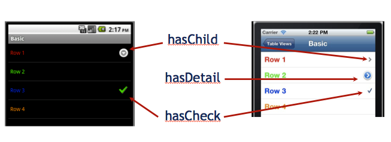
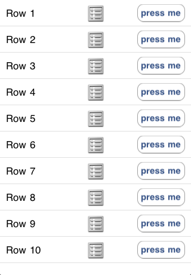
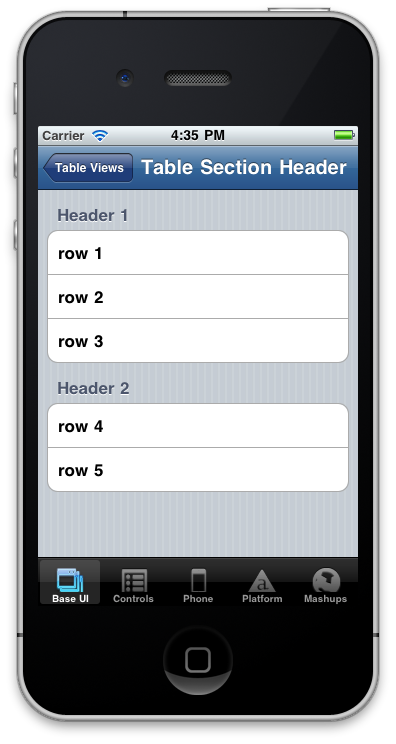

# TableViews

## Objective

In this chapter, we’ll examine TableView basics then dig a bit deeper into what you can do with tables. We’ll look at headers, footers, and sections. Finally, we'll wrap up with a look at handling events associated with tables and rows.

## Contents

Let's start by creating a table. You do so with the `Ti.UI.createTableView()` method, like this:

```javascript
var table = new Titanium.UI.createTableView({
  /* properties */
});
```

Some key table properties include:

* `height` and `width` – controls the dimensions of the table; it doesn't have to fill its parent container

* `top` and `left` – controls placement of the table, useful if you want to add buttons or labels above or below it

* `backgroundColor` and `backgroundImage` – controls the background of the table; `transparent` is a valid `backgroundColor`

* `rowHeight` / `minRowHeight` / `maxRowHeight` – controls table-wide dimensions of rows

* `headerTitle` / `headerView` – controls the table's header

* `footerTitle` / `footerView` – controls the table's footer

* `scrollable` (boolean) – controls whether the table is scrollable (vertically)

### Assigning data to your table

Next we'll move on to adding rows, which are the core of any table component. Let's take a look at the options that Titanium makes available to you for creating and adding rows.

Table rows are represented by the `Ti.UI.TableViewRow` object. This object contains various properties and methods that you can use to style and manage your table rows. You can create TableViewRow objects explicitly using the `Ti.UI.createTableViewRow()` function. Conversely, you can use simple Javascript object literals to represent your rows. For quick and dirty row creation, the object literal technique is likely faster and easier. When you want to carefully style and control the behavior of rows, though, you'll probably want to create explicit row objects.


**Object literals as rows**

```javascript
// create an array of anonymous objects
var tbl_data = [
  {title:'Row 1'},
  {title:'Row 2'},
  {title:'Row 3'}
];
// now assign that array to the table's data property to add those objects as rows
var table = Titanium.UI.createTableView({
  data:tbl_data
});
// alternatively, you could do
table.setData(tbl_data);
var win = Ti.UI.createWindow();
win.add(table);
win.open();
```

Creating object literals in this way is very handy when pulling data out of a database or across the network. By explicitly creating TableViewRow objects, you gain access to a few handy methods such as `add()` or `fireEvent()`.

**Explicit TableViewRow objects**

```javascript
var row = Titanium.UI.createTableViewRow({
    title: 'Row 1'
    /* other properties */
});
table.appendRow(row);
// with an explicit object, you can call methods such as
// var imgCapture = row.toImage();
```

#### Emptying a table

You can empty a table by setting its `data` property to an empty array.

::: warning ⚠️ Warning
Do not set a TableView's `data` property to `null` or `undefined` as it will result un unexpected behavior.
:::

```
table.setData([]);
// or
table.data = [];
```

#### Setting data vs. setData() vs. appendRow()

For best performance, create an array of row objects (object literals or explicitly typed) and then assign them to the table using either `setData()` or by setting the `data` property. In community tests, `appendRow()` performs significantly slower than `setData()` when adding thousands of rows to a test table. Though this is an uncommon scenario, it is still best to manage your tables, and all UI components, in the most performant manner possible.

If your app does however currently require a table with thousands of rows, you should may want to reconsider your UI. Users won't want to scroll through that many rows to find the one that interests them. Even on the fastest device, such a table will be slow. Consider some sort of drill-down interface, filtering mechanism, or alternate UI/UX paradigm to reduce the size of the available table.

### Row properties

Now that we've seen how to create tables and rows, let's learn a bit more about the built-in row properties. TableViewRow objects have various useful properties that you can use to add style and functionality to your tables.

* `className` – set this property equal to an arbitrary string to optimize rendering performance. On both iOS and Android, setting this property enables the operating system to reuse table rows that are scrolled out of view to speed up the rendering of newly-visible rows. On iOS, the string you supply is used to specify the reuse-identifier string ([setdequeueReusableCellWithIdentifier](http://developer.apple.com/library/ios/#documentation/UIKit/Reference/UITableView_Class/Reference/Reference.html#//apple_ref/occ/instm/UITableView/dequeueReusableCellWithIdentifier:)); on Android, it is used within a custom object reuse method within Titanium.

* `leftImage` – set this property equal to an image URL (local or remote) to display that image to the left of the row's title

* `rightImage` – set this property equal to an image URL (local or remote) to display that image to the right of the row's title

* `backgroundImage` – set this property equal to an image URL (local or remote) to display that image in the background of the row

* `backgroundColor` – set this property to a color string to set the row's background color

So let's augment the properties of the prior TableView example rows. In the following code we'll utilize the above properties on a per row basis, making for a highly styled set of table rows.


```javascript
var tbl_data = [
    {title:'Row 1', leftImage: 'KS_nav_ui.png'},
    {title:'Row 2', rightImage: 'KS_nav_ui.png'},
    {title:'Row 3', backgroundColor: '#fdd'}
];
// now assign that array to the table's data property to add those objects as rows
var table = Titanium.UI.createTableView({
    data:tbl_data
});
// alternatively, you could do
table.setData(tbl_data);

var win = Ti.UI.createWindow();
win.add(table);
win.open();
```

#### Row indicators

Row indicators are icons that provide visual cues to your users related to your table rows. As shown in the following graphic, Android supports two built-in icons while iOS supports three. Each is a boolean value set with the property listed following the graphic.



* `hasChild` – indicates sub-table or additional rows (most commonly used on iOS with the navigation controller)

* `hasDetail` – indicates a detail view or alert will appear when row is tapped (not supported on Android)

* `hasCheck` – an on/off or yes/no indicator

### Custom rows

If the stock properties don't suit your needs, you can add Views, ImageViews, Labels, Buttons, and so forth as children of your rows. This gives you enormous flexibility when laying out the content of your table.

Let's once again visit the example TableView code. This time we'll modify it to use explicit TableViewRows. To these TableViewRows we will add a label, button, and image in a custom format.



```javascript
// Create an array of explicitly defined custom TableViewRows
var tbl_data = [];
for (var i = 0; i < 10; i++) {
  var row = Ti.UI.createTableViewRow();
  var label = Ti.UI.createLabel({
    left: 10,
    text: 'Row ' + (i+1)
  });
  var image = Ti.UI.createImageView({
    image: 'KS_nav_ui.png'
  });
  var button = Ti.UI.createButton({
    right: 10,
    height: 30,
    width: 80,
    title: 'press me'
  });
  row.add(label);
  row.add(image);
  row.add(button);
  tbl_data.push(row);
}

// now assign that array to the table's data property to add those objects as rows
var table = Titanium.UI.createTableView({
    data:tbl_data
});

var win = Ti.UI.createWindow();
win.add(table);
win.open();
```

This is just one very simple example of how you can create custom rows for your tables. You can literally embed almost any Titanium UI component in any visual configuration to create your rows.

::: warning ⚠️ Warning
It is tempting to make heavy use of Titanium's flexibility with custom rows. You need to be aware, however, of the performance implications of making your rows overly complex. Each unique UI element you add to a row has resources requirements, and those requirements are magnified by the number of rows in your tables. Be sure to test both on simulator/emulator and device as you develop to ensure you are getting the app performance you expect, and scale back row complexity if necessary.
:::

### Grouped rows

On iOS, you can set the `style` property of the table to display table sections as separate components, as shown in the following graphic.

```javascript
var inputData = [
  {title:'row 1', header:'Header 1'},
  {title:'row 2'},
  {title:'row 3'},
  {title:'row 4', header:'Header 2'},
  {title:'row 5'}
];
var table = Titanium.UI.createTableView({
  data:inputData,
  style:Titanium.UI.iPhone.TableViewStyle.GROUPED
});

var win = Ti.UI.createWindow();
win.add(table);
win.open();
```



### Headers and footers

You can use the built-in `headerTitle` and `footerTitle` to add header and footer titles to your tables. This convenience property allows you to enter arbitrary text for these titles, but will only use the default font formatting.

```javascript
var data = [
  { title: 'Row 1' },
  { title: 'Row 2' },
  { title: 'Row 3' }
];
var table = Titanium.UI.createTableView ({
    data:data,
    headerTitle:'TableView examples and test cases',
    footerTitle:"Wow. That was cool!",
});

var win = Ti.UI.createWindow();
win.add(table);
win.open();
```


A more flexible technique is to use Views for your headers and footers. You can create a view and set it in the table's `headerView` or `footerView` properties. Here's an example of setting both the header and footer using these properties.


```javascript
var tbl_data = [
  { title: 'Row 1' },
  { title: 'Row 2' },
  { title: 'Row 3' }
];

var createCustomView = function(title) {
  var view = Ti.UI.createView({
    backgroundColor: '#222',
    height: 40
  });
  var text = Ti.UI.createLabel({
    text: title,
    left: 20,
    color: '#fff'
  });
  view.add(text);
  return view;
};

// now assign that array to the table's data property to add those objects as rows
var table = Titanium.UI.createTableView({
    data:tbl_data,
    headerView: createCustomView('Header View'),
    footerView: createCustomView('Footer View')
});
// alternatively, you could do
table.setData(tbl_data);

var win = Ti.UI.createWindow();
win.add(table);
win.open();
```
