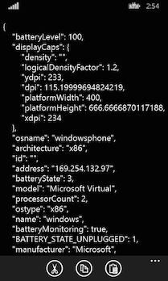
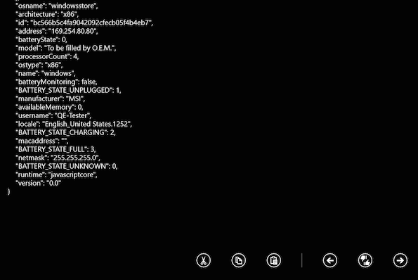

# Windows UI Components and Conventions

::: danger ❗️ Warning
As of Titanium 9.0.0, building Windows apps is no longer supported.
:::
::: danger ❗️ Warning
Support for Windows 8.1 and Windows Phone SDKs has been deprecated as of SDK 6.3.0.GA and has be removed in SDK 7.0.0.GA.
:::

## Introduction

In this section, you will learn some of the user interface and user experience components that are specific to Windows.

## Back button

Windows phones have a hardware back button allowing you to go to the previous opened window. However, Windows tablets do not have a hardware back button. If you rely on the back button for navigation, you will need to implement a navigation element, such as a software back button, for Windows tablets if you choose to support it.

To distinguish between the Windows Phone OS and Windows OS, the `Titanium.Platform.osname` property will return `windowsphone` if the application is running on a Windows Phone device or `windowsstore` if the application is running on a device running the Windows OS.

In Alloy, use the `formFactor` attribute to distinguish between a phone (set to `handheld`) or tablet (set to `tablet`).

```xml
<Alloy>
    <Window>
        <Button formFactor="tablet" onClick="closeWindow">Back</Button>
    </Window>
</Alloy>
```

As of 5.0.0 of the SDK, you can create an event that can prevent accidental closure of the app due to hitting the back button to many times.

```javascript
var win = Ti.UI.createWindow(
  { // some code... }
);
// more code
win.addEventListener("windows:back", function()
  { alert("Back pressed"); }
);
```

## Command Bar

The command bar displays a row of buttons the user can tap to invoke additional functionality with your application (similar to the Action Bar in Android or Toolbar in iOS). On a phone, the command bar always appears at the bottom of the application, and on a tablet, the user needs to tap the More icon (`[...]`) to reveal the command bar. If you are testing locally on your Windows computer, right-click on the application to reveal the command bar.

| Windows Phone app | Windows Store app |
| --- | --- |
| * Buttons are centered<br />    <br />* Room for only four buttons<br />    <br />* Command bar is always present<br />    <br /><br /> | * Buttons are right-aligned<br />    <br />* Room for more than four buttons<br />    <br />* Command bar must be revealed by the user<br />    <br /><br /> |

To create a command bar:

1. Create buttons and separator objects using the following methods:

    * [Titanium.UI.Windows.createAppBarButton()](#!/api/Titanium.UI.Windows-method-createAppBarButton)

    * [Titanium.UI.Windows.createAppBarToggleButton()](#!/api/Titanium.UI.Windows-method-createAppBarToggleButton)

    * [Titanium.UI.Windows.createAppBarSeparator()](#!/api/Titanium.UI.Windows-method-createAppBarSeparator) – note that separators only appear for Windows Store apps (for the tablet)

2. Pass an array of button and separator objects to the `items` property when creating a command bar with the [Titanium.UI.Windows.createCommandBar()](#!/api/Titanium.UI.Windows-method-createCommandBar) method. Note that on the phone only four buttons can be displayed.

3. Add the command bar to a [Titanium.UI.Window](#!/api/Titanium.UI.Window) object.

```javascript
var backButton = Ti.UI.Windows.createAppBarButton({
        icon: Ti.UI.Windows.SystemIcon.BACK
    }),
    likeButton = Ti.UI.Windows.createAppBarToggleButton({
        icon: Ti.UI.Windows.SystemIcon.LIKEDISLIKE
    }),
    forwardButton = Titanium.UI.Windows.createAppBarButton({
        icon: Ti.UI.Windows.SystemIcon.FORWARD
    }),
    commandBar = Ti.UI.Windows.createCommandBar({
        items: [backButton, likeButton, forwardButton]
    }),
    win = Ti.UI.createWindow();
win.add(commandBar);
win.open();
```

## Asset qualifiers

Windows provides different qualifiers to select which assets to use. The qualifiers can be used to support devices with different screen sizes, contrast themes, layout directions, languages, regions, etc.

For information about using qualifiers, see [Windows Asset Qualifiers](/guide/Titanium_SDK/Titanium_SDK_How-tos/User_Interface_Deep_Dives/Windows_UI_Components_and_Conventions/Windows_Asset_Qualifiers/).
