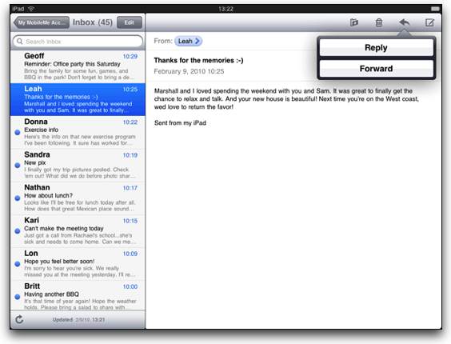
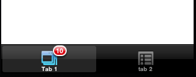

# iOS UI Components and Conventions

## Objective

In this section, you will learn some of the user interface and user experience components that are specific to iOS.

## Contents

We've already covered many of the iOS UI conventions in the [iOS Platform Overview](/guide/Titanium_SDK/Titanium_SDK_How-tos/Cross-Platform_Mobile_Development_In_Titanium/iOS_Platform_Overview/) chapter. In this section, we'll dig just a bit deeper into some iOS specifics. These include iPad-only UI controls, app badges, and integration with the platform's Settings app.

### iPad-only UI APIs

The iPad includes two UI components that are not available with the iPhone. These are the [Popover](http://developer.appcelerator.com/apidoc/mobile/latest/Titanium.UI.iPad.Popover-object.html) and [SplitWindow](http://developer.appcelerator.com/apidoc/mobile/latest/Titanium.UI.iPad.SplitWindow-object.html).

#### Popovers

You use popovers to present information temporarily, but in a way that does not take over the entire screen like a modal view does. The popover content is layered on top of your existing content in a special window. The popover remains visible until the user taps outside of the popover window or explicitly dismisses it. The Popover is created by the method `Titanium.UI.iPad.createPopover()`.


Popovers provide a way for you to display additional information associated with a particular UI component. This is shown in the picture above, in which event repetition options are shown as a row in a table. Within the popover, you can display a view or other component.

```javascript
var button = Ti.UI.createButton({
  title: 'Show popover',
  width: 250,
  height: 50,
  top: 30,
  right: 5
});
var popover = Ti.UI.iPad.createPopover({
  width: 300,
  height: 250,
  title: 'I\'m a Popover',
    arrowDirection: Ti.UI.iPad.POPOVER_ARROW_DIRECTION_RIGHT
});
button.addEventListener('click', function(e) {
  popover.show({
    view: button,
    animated: true
  });
});
win.add(button);
```

In the preceding code, line 16 creates the association between the button and the popover. It's this line that controls the placement of the popover. It will be placed automatically by iOS according to this association and the arrow direction. In this example, the arrow points to the right, which means the popover will be displayed to the left of the button. If you used POPOVER\_ARROW\_DIRECTION\_UP, the popover would be shown below the button.

#### SplitWindows

A SplitWindow is a window that manages the presentation of two side-by-side view controllers. You use this class to implement a master-detail interface, in which the left-side view presents a list of items and the right-side presents details of the selected item. The SplitView is for use exclusively on iPad devices. The SplitWindow is created by the method `Titanium.UI.iPad.createSplitWindow()`.



You cannot control the width of either of the view controllers, and the user cannot resize those "panes." A SplitWindow is a top-level container, which means you don't add it to a Ti.UI.Window. The SplitWindow inherits from the Window object.

```javascript
// Window shown in narrower, left "pane"
var masterWin = Ti.UI.createWindow({
  backgroundColor: '#fff'
});
masterWin.add(Ti.UI.createLabel({
  text: 'Master View',
  top: 10,
  height: 'Ti.UI.SIZE',
  font: {
    textAlign: 'center',
    fontWeight: 'bold'
  }
}));
// Window shown in wider, right "pane"
var detailWin = Ti.UI.createWindow({
  backgroundColor: '#dfdfdf'
});
detailWin.add(Ti.UI.createLabel({
  text: 'Detail View',
  top: 10,
  height: 'Ti.UI.SIZE',
  font: {
    textAlign: 'center',
    fontWeight: 'bold'
  }
}));
// the split window
var splitwin = Ti.UI.iPad.createSplitWindow({
    detailView: detailWin,
    masterView: masterWin,
    orientationModes: [ Titanium.UI.LANDSCAPE_LEFT,Titanium.UI.LANDSCAPE_RIGHT ]
});
splitwin.open();
```

### Badges




Tab and app badges are indicators of updates, new messages, and so forth. You can apply these badges, with a numeric value, to your app and to tabs within your app. Doing so is quite simple. For tabs, simply set the `yourTab.badge` property equal to some number to show the tab badge icon. For your app, set the `Ti.UI.iOS.appBadge` property equal to a number to show the app badge icon. You might do so when your app initializes or shuts down. You could also use a [background service](http://developer.appcelerator.com/apidoc/mobile/latest/Titanium.App.iOS.BackgroundService-object.html) to set your app's badge as needed.

To remove either a tab or app badge, set the corresponding property to `null`. Setting it to 0 would still display the badge, but with the number zero displayed.

```javascript
// Sets the app's icon badge to 23
Ti.UI.iOS.appBadge = 23;

var tabGroup = Ti.UI.createTabGroup();
var win1 = Ti.UI.createWindow({
    title: 'Window 1',
    backgroundColor: '#fff'
});

// Set the badge for this tab to 10
var tab1 = Ti.UI.createTab({
    icon: 'myIcon.png',
    title: 'Tab 1',
    window: win1,
    badge: 10
});
```

### Settings integration

Apple's guidelines specify that app settings should be configurable through the native Settings app rather than through in-app controls. Apple's own apps generally follow this recommendation. For example, you configure Safari's options via Settings rather than within the app. Titanium provides a mechanism for configuration options via the Settings app via a native module.


With 1.8, the location of the Settings.bundle was changed. Platform-specific resources are supposed to be in the platform-specific directories. That was not the case before, but that's fixed now.

If you're running SDK 1.8+

1. Download a recent copy of the [KitchenSink app](https://github.com/tidev/KitchenSink)

2. Copy **Settings.bundle** from **platform/iphone** folder to your project's **Resources/platform/iphone** directory (you might need to create those directories).

3. In Studio, expand platform/iphone/Settings.bundle and double-click Root.plist to open the Xcode Property List editor.

4. Edit the settings, as described below.

5. Clean your project, then build for either the Simulator or device.

If you're running SDK <1.8

1. Download a copy of the [KitchenSink app](https://github.com/tidev/KitchenSink)

2. Copy **Settings.bundle** from **modules/iphone** folder to your project's **Resources/modules/iphone** directory (you might need to create those directories).

3. In Studio, expand modules/iphone/Settings.bundle and double-click Root.plist to open the Xcode Property List editor.

4. Edit the settings, as described below.

5. Clean your project, then build for either the Simulator or device.

In the Xcode Property List editor, you'll see the app's name defined in Item 0. The three preferences defined by KitchenSink appear under Items 1, 2, and 3. You can modify these to suit your needs or add new properties items following the pattern set out in these items.

In your app, you can access the values of these app preferences by using Titanium's `App Properties module` with one minor tweak. The name of the app property you retrieve must match the value you set in the Identifier field in the Property List editor. You'll note that all the KitchenSink examples include the "\_preference" suffix, which you should also include with your identifiers.

```
Ti.API.info(Ti.App.Properties.getString('name_preference')); // logs the name pref value from KitchenSink example
```

### Hands-on Practice

#### Goal

In this activity, you will enable Settings-integration for a simple iOS app and use the preferences configured by the user within the app.

#### Resources

To complete this activity, you will need an Intel-based Mac with the iOS development tools (Xcode) installed.

#### Steps

1. Create a new Titanium Mobile project named AppSettings that targets the iPhone and iPad.

2. If you have not done so already, download a copy of the KitchenSink project from [https://github.com/tidev/KitchenSink](https://github.com/tidev/KitchenSink). Copy the modules folder to your project's directory.

3. In Studio, expand modules/iphone/Settings.bundle and double-click Root.plist

4. Edit the name of the app in the plist file to match your app's name. You can leave the other settings options as-is. Save your changes and close Xcode.

5. Change `label1` to display the name the user enters in the Settings app for the Name preference. If no value is set, display the text "Set Name in Settings" in the label.

6. If the "Enabled" switch is set to Yes (on) , display an ImageView that contains the KS\_nav\_ui.png graphic. If it's set to No (off) , don't display the image. You can use the `Ti.App.Properties.getBool()` method for this purpose.

7. Build and test your app. After it's installed and run the first time, open the Settings app and configure your name and Enabled value.

8. Because the app remains running (iOS doesn't fully close an app when you return to the Springboard), you'll need to close and relaunch the simulator or use the Fast App Switcher to kill the app. If using the simulator launched by Studio, using the Fast App Switcher might crash the simulator.

    1. Close the AppSettings app, if necessary

    2. Double-click the Home button to display the Fast App Switcher tray.

    3. Press and hold on the AppSetting icon in the tray until it begins to shake. Tap its red minus-sign button to kill the app.

    4. Press Home to leave "edit mode" then press Home again to return to the Springboard.

    5. You can now re-open the app to see the new settings in place.

### References and Further Reading

* [Finished code](http://assets.appcelerator.com.s3.amazonaws.com/app_u/ebook/AppSettings.zip)

* Apple's [iPad Human Interface Guidelines](http://developer.apple.com/iphone/library/documentation/General/Conceptual/iPadHIG/Introduction/Introduction.html)

* [Apple's Introduction to Property Lists](http://developer.apple.com/library/ios/#documentation/Cocoa/Conceptual/PropertyLists/Introduction/Introduction.html)

* [Sample code for create app preferences](http://developer.apple.com/library/ios/#samplecode/AppPrefs/Introduction/Intro.html) (Settings)

## Summary

In this chapter, you learned that iOS offers a handful of UI components that are not available on other platforms. You learned how to implement iPad-specific controls and how to create and save app preferences in the Settings app.
