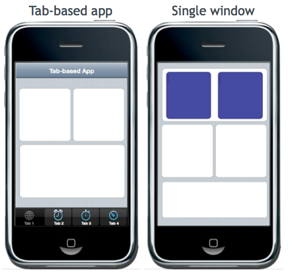
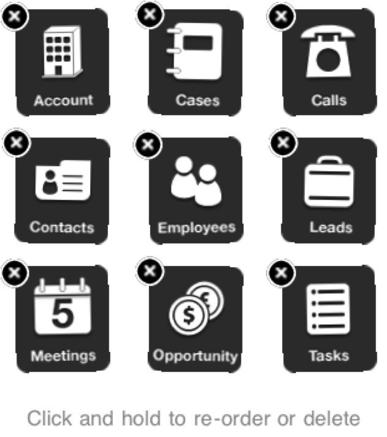

# Application Structures and Core Building Blocks

## Objective

In this section, you'll take a look at the core building blocks of a Titanium app. Tab groups, windows, and their core functionality will be discussed here in detail.

## Contents

In web development parlance, a Titanium **window** is roughly analogous to a **web page**. In turn, Titanium **view** is analogous to a **div**. We already touched on the fact that Titanium windows can, but aren't required to, run within their own [execution context](/guide/Titanium_SDK/Titanium_SDK_How-tos/Cross-Platform_Mobile_Development_In_Titanium/Coding_Strategies/#execution-contexts) like a web page. Conceptually, windows are a top-level container just like a web page.

Titanium views are like divs in that both are style-able, generic content containers. Both can enclose other content (buttons, views, etc.) and must be contained within a window, or web page.

Tab groups are a mobile component without a clear equivalent in the web world. Web pages sometimes use the tab UI metaphor, but the contents of those tabs are typically implemented as divs. The closest analog for mobile tab groups would probably be a set of pages listed in a menu or set of navigation links.

Let's see how you'd use tab groups, windows, and views to construct your app's UI. Mobile utility apps generally feature one of two basic layouts: tab-based or window-based. These are illustrated below:



### Tab-based applications

In a tab-based app, two or more tabs are contained within a [tab group](http://developer.appcelerator.com/apidoc/mobile/latest/Titanium.UI.TabGroup-object). Each tab contains a window. Each window contains the various controls and graphics of your app. The basic code for creating a two-tabbed app skeleton looks like this:

```javascript
// create tab group
var tabGroup = Titanium.UI.createTabGroup();
var win1 = Titanium.UI.createWindow({
    title: 'Tab 1',
    backgroundColor: '#fff'
});
var tab1 = Titanium.UI.createTab({
    icon: 'tab1icon.png',
    title: 'Tab 1',
    window: win1
});
var win2 = Titanium.UI.createWindow({
    title: 'Tab 2',
    backgroundColor: '#fff'
});
var tab2 = Titanium.UI.createTab({
    icon: 'tab2icon.png',
    title: 'Tab 2',
    window: win2
});
// add tabs to the group
tabGroup.addTab(tab1);
tabGroup.addTab(tab2);
// open tab group
tabGroup.open();
```

In the preceding code, the tab's `title` is the text shown on the tab "handle" while the window's `title` is shown in a title bar across the top of the window. On iOS, you can add navigation buttons (`leftNavButton` and `rightNavButton`) to the window's title bar. Also on iOS, a modal window opened within a tab will fill the entire screen, overlaying the tab group. A non-modal window will open within the tab. On Android, a window automatically fills the entire screen and inherits the Back button functionality. Tapping the Back button closes the window and returns you to the tab group's focused window.

#### Tab recommendations

Users expect each tab to be focused on a limited and related set of functionality. Tabs are expected to be related to each other, within the overall purpose of your app. However, they are not expected to be in any sort of hierarchical relationship. Tabs are peers, or siblings, of each other; not children of one another.

On iOS, the tab "handles" have a fixed minimum width. If you define more tabs than will fit, iOS will display an ellipsis on a new tab labeled "More". Tapping that tab opens a table view style window listing additional tabs.

On Android, tab "handles" are not fixed-width. Instead, tabs will shrink to fit the number of tabs you have created. While this behavior is convenient, you need to be aware that using too many tabs in this manner make shrink your tab "handles" to unusable dimensions. Always test the usability of your UI as you develop.

For both platforms, we recommend you limit the tabs in your app to four or less so that all your tabs can be visible at once and remain easily clickable across platforms.

### Window-based apps

A window-based app uses views, controls, and graphics that are contained within a full-screen window. All app flow is driven from menu, UI, or navigation components available to the given platform. Both Android and iOS can take advantage of the Titanium Window's `open()` function which will create a new window that will present itself on the top of our stack. Conversely, to _pop_ a window from the stack, we can use its `close()` function.

In addition to this cross platform method, let's take a look at some of the platform specific ways you can navigate through your app without the aid of tab groups.

* Android

    * The Menu button can be used to display options for navigation. These can be sections similar to tabs, or more direct instructions like "Back" or "Forward" in a web browser.

    * The Back button will close the current window and go back to the previous one

* iOS

    * You can use a [navigation window](#!/api/Titanium.UI.iOS.NavigationWindow), which is the core of most iOS app navigation.

    * You could implement a [DashboardView](http://developer.appcelerator.com/apidoc/mobile/latest/Titanium.UI.DashboardView-object)

        

It's also notable that window based apps are the common choice for mobile games. As most games employ only a single screen and use mostly custom UI components, OS level navigation is rarely useful. The game is simply presented full-screen and the gameplay itself dictates how the user interacts with the app.

## References and Further Reading

* [Titanium.UI module](http://developer.appcelerator.com/apidoc/mobile/latest/Titanium.UI-module)

## Summary

In this section, you looked at the core building blocks of a Titanium app, including tab groups and windows and the ways you can use each. In the upcoming sections, we'll look in depth at how to lay out the views and components of your UI in the Titanium model.
