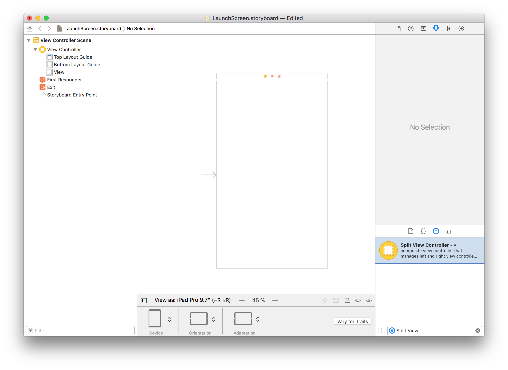
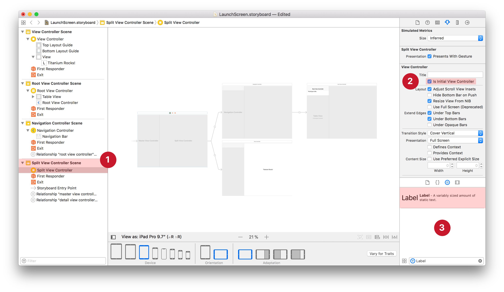

# iOS Launch Files

## What are Launch Files?

Until now, you used to create a bunch of `Default*.png` Launch Images. In iOS 8 Apple introduced [Launch Files](https://developer.apple.com/library/ios/documentation/UserExperience/Conceptual/MobileHIG/LaunchImages.html). These are the same XIB files or Storyboards that you’d normally build you UI with in Xcode. This means you can use any iOS UI component and only need one file to support all devices. When you app first runs, iOS takes a snapshot image of the launch file to use as launch image. A great way to slim down your IPA!

## Why use Launch Files?

The iPad Pro no longer supports Launch Images. Without it, a (Titanium) iOS app will be stretched to fit the iPad Pro:


Split View and Slide Over for the iPad also requires Launch Files. Since your app might now be opened as Slide Over in either landscape or portrait you would otherwise need 6 more launch images to cover the different sizes of iPad screens out there.

Launch Files allow you to strip down the size of your final `.ipa` considerably. You only need a single storyboard and a logo in a handful of densities to cover all iOS devices.

## How to enable Launch Files?

You have two ways to use Launch Files: with our builtin Storyboard or your own.

Both need to be enabled in the `<ios>` section of your [tiapp.xml](https://github.com/appcelerator-developer-relations/appc-sample-ti520/blob/master/tiapp.xml#L28):

**tiapp.xml**

```xml
<enable-launch-screen-storyboard>true</enable-launch-screen-storyboard>
```

The templates for new Titanium projects have this property enabled by default.

### Option A: Use the built-in Storyboard

The builtin Storyboard features a centered image on a solid background color. The sample uses the builtin storyboard with a [custom image](https://github.com/appcelerator-developer-relations/appc-sample-ti520/tree/master/app/assets/iphone) on an [Appcelerator red Background Color](https://github.com/appcelerator-developer-relations/appc-sample-ti520/blob/master/tiapp.xml#L31):


#### Customising the image

By default we’ll generate the image from `DefaultIcon[-ios].png`. To use a different image, add the following `LaunchLogo*.png` files to the [app/assets/iphone](https://github.com/appcelerator-developer-relations/appc-sample-ti520/tree/master/app/assets/iphone) folder:

| Filename | Scale | Size |
| --- | --- | --- |
| LaunchLogo~iphone.png | 1x | 320×320 |
| LaunchLogo@2x~iphone.png | 2x | 374×374 |
| LaunchLogo@3x~iphone.png | 3x | 621×621 |
| LaunchLogo~ipad.png | 1x | 384×384 |
| LaunchLogo@2x~ipad.png | 2x | 1024×1024 |

You can generate these images with TiCons [Web](http://ticons.fokkezb.nl/) or [CLI](https://www.npmjs.com/package/ticons) `--storyboard` option.

#### Customising the background color

By default the background color is white. You can set a different color via the `<ios>`section of your [tiapp.xml](https://github.com/appcelerator-developer-relations/appc-sample-ti520/blob/master/tiapp.xml#L31):

**tiapp.xml**

```xml
<default-background-color>#C7172C</default-background-color>
```

This will also change the background color of your app between after the launch files is dismissed and before a view (with a solid background color) is opened, or [Ti.UI.backgroundColor](#!/api/Titanium.UI-property-backgroundColor) is set. The sample [opens with a 2s delay](https://github.com/appcelerator-developer-relations/appc-sample-ti520/blob/master/app/controllers/index.js#L23-L30) so you can see this better.

### Option B: Use a custom Storyboard

To use a custom Storyboard, put this file in [app/platform/ios/LaunchScreen.storyboard](https://github.com/tidev/titanium-sdk/blob/master/iphone/iphone/LaunchScreen.storyboard) (for Alloy projects) or [platform/ios/LaunchScreen.storyboard](https://github.com/tidev/titanium-sdk/blob/master/iphone/iphone/LaunchScreen.storyboard) (for classic projects). As you can see the sample has it disabled using a `_` prefix. Just remove the underscore and do a clean build to see the difference:


As you can see I’ve used an iOS Activity Indicator. Notice that it is not spinning as iOS uses a snapshot image of the storyboard.

#### Using images

To use an image in your custom Storyboard, simply set the `Image` property of an _Image View_ to the path under `app/assets/` without the image modifier (`~ipad`, `@2x`) or extension:


::: tip 💡 Hint
[Currently](https://jira-archive.titaniumsdk.com/TIMOB-20429) Titanium does not package the `LaunchLogo*.png` file if you use a custom storyboard. You need to rename this image before you can use it.
:::

**Important**: If you have the [use-app-thinning](/guide/Titanium_SDK/Titanium_SDK_Guide/Appendices/tiapp.xml_and_timodule.xml_Reference/#use-app-thinning) enabled, you will have to use the name of the generated asset catalog. This is a hash based on the image path. To find out the hash for your image build the app, look up the right `[hash].imageset` under `build/iphone/Assets.xcassets/` and use the `[hash]` part.

## Advanced use-cases

Using native Storyboards, you can even do complex complex layouts inside your launch-screen, for example split-screen layouts. To do so, open the `LaunchScreen.storyboard` in Xcode and start adding UI-elements from the bottom right "Object library":



Now drag the "Split View Controller" element to the center, remove the old "View Controller" and set the Split View Controller as the "Initial View Controller". Finally, add a label to the detail-view by searching and dragging the "Label" object into your space:



Thats it! Save the storyboard, clean the build directory and cache (see chapter below) and run your app. If you want to include images, make sure to check the "**Use images**" paragraph above to handle image hashes.

## Handle dark mode in storyboard

You can add dark mode support to custom storyboards (see `Option B: Use a custom Storyboard` above) by using semantic colors inside the storyboard.
Titanium will automatically pick up the correct colors based on the system setting afterwards.

## Dealing with Launch File cache

As you modify the (custom) storyboard, you might not always see your changes immediately. This is because iOS caches the snapshot it makes from your Launch File and a [known issue](https://jira-archive.titaniumsdk.com/TIMOB-20430) where Titanium does not always recompile the storyboard.

To deal with this follow these steps before you build:

1. Use _Simulator > Reset Content and Settings…_

2. Use _Project > Clean…_ or `ti clean` from CLI.

Alternatively you can reset an individual app using a tool like [SimPholders](https://simpholders.com/). With this app, just hold `alt/⌥` and click the app from the dropdown:


