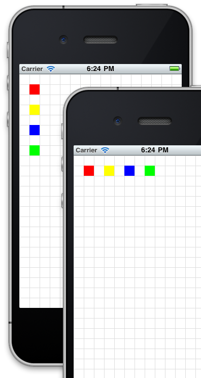

# Layouts Positioning and the View Hierarchy

## Objective

In this chapter, you will learn how to lay out your user interface components using Titanium's various positioning properties. You will examine the coordinates system used by Titanium, its view hierarchy, and the layering and positioning rules that it follows when rendering your UI.

## Contents

The [Composite UI Layout](/guide/Titanium_SDK/Titanium_SDK_Guide/Contributing_to_Titanium/Platform_Development/Specs/UI_Composite_Layout_Behavior_Spec/) defines a consistent layout behavior between platforms and added the ability to set up the UI declaratively via [Alloy](/guide/Alloy_Framework/).

In this guide, we're going to explore the following factors that affect how you position elements within your app's UI:

* Units

* The coordinates grid

* Positioning and the view hierarchy

* Layout modes

* zIndex & default stacking order

### Units

Placement and dimensions of UI elements are specified using a numeric value plus an implicit or explicit unit of measurement. If you don't specify a unit of measurement, the "system" unit is assumed. You can also set a default unit of measurement to use in your app by setting a tiapp.xml property.

First, a couple of definitions we'll use in the rest of this guide:

* **dip**: Density-independent pixels. A measurement which is translated natively to a corresponding pixel measure using a scale factor based on a platform-specific "default" density, and the device's physical density.

* **System unit**: A platform-dependent unit which is the default for how the system presents its view information to the native layout system. On Android this is pixels; on iOS it is dip.

Supported units are:

* Absolute measurements

    * **px**: pixels

    * **mm**: millimeters

    * **cm**: centimeters

    * **in**: inches

    * **dp/dip**: Density-independent pixels (we sometimes call these "points")

        * Android: actual pixels = dip \* (screen density) / 160

        * iOS: actual pixels = dip \* (screen density) / 163 (effectively 1dip=1px on standard, 1dip=2px on retina)

        * Windows: actual pixels = dip \* (screen density) / 96

* Relative measurements

    * **%**: Percentage of the size of the parent.

        * For x-axis values (width, left, right, center.x) this is relative to the parent's width

        * For y-axis values (height, top, bottom, center.y) this is relative to the parent's height.

You would use these units of measurement like this:

```javascript
var view = Ti.UI.createView({
  /* You would not normally mix units like this */
  top: '10mm',
  left: '5px',
  width: '30%',
  height: 50 /* default units are used here */
});
```

#### Setting default units in tiapp.xml

You can specify the default unit type to use with untyped values. In the tiapp.xml file, you would add:

```xml
<property name="ti.ui.defaultunit" type="string">value</property>
```

Where `value` can be set to `px`, `mm`, `cm`, `in`, `dp`, `dip`, or `system`. The "system" value corresponds to the platform-dependent system unit as described above. If you do not specify this property in the tiapp.xml, then the units default to "system".

As of SDK 8.0.0, `dp` starts supported for default unit on Windows. Since Windows default unit has been `px` in previous versions this means this may cause breaking change. You might want to update your `tiapp.xml` to use `px` for default unit explicitly like `<property name="ti.ui.defaultunit" type="string">px</property>` to keep consistency between previous SDK versions.

### The coordinates grid

Titanium uses a grid coordinate system for layout. Grid locations are based on the system unit (platform-dependent unit). This means that by default on iOS, elements are positioned on a density-independent grid and on Android on a density-dependent grid. The net result is that on iOS, elements are positioned in visually the same locations regardless of the actual density of the screen. On Android, elements are positioned at the same absolute pixel locations and might lay out differently depending on the device.

* iPhone with either original or retina display is based on a 320 x 480 dip grid.

* iPad is based on a 1024 x 768 dip grid.

* Android device screen sizes vary. Considering these emulator examples:

    * HVGA emulator is 320 x 480 px

    * WVGA800 emulator is 480 x 800 px

    * WVGA854 emulator is 480 x 854 px

Remember that you can specify `dp` or `dip` units on Android (and even set an app-level default in tiapp.xml) to achieve the same density-independent grid as offered by default on iOS.

### Positioning and dimensions of elements

Elements in Titanium are positioned relative to their parent container, such as a window or view. The positional options are:

* `top` property which is relative to the parent's top edge.

* `left` property which is relative to the parent's left edge.

* `bottom` property which is relative to the parent's bottom edge. (Zero is located at the parent's bottom edge and higher numbers are above the bottom edge.)

* `right` property which is relative to the parent's right edge. (Zero is located at the parent's right edge and higher numbers are to the left of the right edge.)

* `center` property specifying the position of the view's center point relative to the parent's top/left corner.

(A read-only `size` property is available, which provides the `width` and `height` of a view after it has been laid out by the window. This property won't provide the actual size of the view until a postlayout event has been received.)

You specify a view's dimensions by setting the `width` and `height` properties. If you omit the `height` property, but set the `top` and `bottom` properties, then the view's height will be calculated dynamically relative to the parent's top and bottom edges. The same is true when you omit the `width` property, but set `left` and `right`.

Each of these attributes accept values with or without units, including percentage-based relative measurements as described above.

In the following example, the red view is positioned at the 20,20 point relative to the window's top/left corner. The yellow view's bottom/right corner is 100 points/pixels from the bottom/right corner of the display. The blue view's center is at 160,240 and given its width of 50, this means its top-left corner would be at 135,215. The green view has a sufficiently negative `top` value given its width that it is positioned off the top of the screen.


**Positioning**

```javascript
var win = Ti.UI.createWindow({
  backgroundColor: '#fff'
});
var redview = Ti.UI.createView({
    top: 20,
  left: 20,
    width: 10,
    height: 10,
    backgroundColor: "red"
});
win.add(redview);
var yellowview = Ti.UI.createView({
    bottom: 100,
  right: 100,
    width: 10,
    height: 10,
    backgroundColor: "yellow"
});
win.add(yellowview);
var blueview = Ti.UI.createView({
  center: {x: 160, y: 240},
  width: 50,
  height: 50,
  backgroundColor: "blue"
});
win.add(blueview);
var greenview = Ti.UI.createView({
    top: -20,
    width: 10,
    height: 10,
    backgroundColor: "green"
});
win.add(greenview);
win.open();
```

### Layout modes

Titanium Windows and Views can employ one of three layout modes by setting its `layout` property to one of the following values:

* `composite` - This is the default mode. Views are stacked on top of each other, where the last view added will be on top (unless zIndex is specified). Positional properties are relative to the parent container.

* `vertical` - This layout mode stacks child views vertically and are horizontally centered. The child's `top` property becomes an offset value. It describes the number of units below the previously added view's bottom edge and can be used as padding.

* `horizontal` - This layout mode lines up child views horizontally from left to right, starting from the parent's top/left corner. If horizontalWrap is set true, will wrap views to the next row if they don't fit on the current row. The child's `left` property becomes an offset. It's the position from the previous sibling's right edge and can be used as padding.

Here's an example of these layouts in action:


**Layout modes**

```javascript
var win = Ti.UI.createWindow({
  backgroundColor:'#fff'
});
// uses grid-drawing module from https://gist.github.com/1187384
// to draw grid lines every 20 points
var grid = require('gridlines');
grid.drawgrid(20,win);
// draw a view that fills the window and set its layout property
var view = Ti.UI.createView({
  backgroundColor: 'transparent',
  top: 0,
  left: 0,
  width: '100%',
  height: '100%',
  layout: 'vertical'
});
// simple function for making colored boxes
function makeView(color) {
  return Ti.UI.createView({
      top: 20,
    left: 20,
      width: 20,
      height: 20,
      backgroundColor: color
  });
}
view.add(makeView('red'));
view.add(makeView('yellow'));
view.add(makeView('blue'));
view.add(makeView('green'));

win.add(view);
win.open();
```

### Auto-size behaviors

You can auto-size a UI element by setting its `width` and `height` properties to one of the following constants:

* `Ti.UI.SIZE` will set the width or height to just-fit the view's contents

* `Ti.UI.FILL` will set the width or height to fill the parent. For a composite layout , this will be equal to the parent's width or height and will disregard previously added child views. For horizontal and vertical layouts, this takes into account previously added child views and will fill the remaining width or height available within the parent

UI components exhibit default SIZE or FILL behaviors, as listed in this table:

| SIZE views | FILL views | Mixed behavior |
| --- | --- | --- |
| Button | Window | Toolbar: FILL for width, SIZE for height |
| Label | View | TableViewRow: FILL for width, SIZE for height |
| ImageView | TabGroup | Slider: FILL for width, SIZE for height |
| ProgressBar | TableView |  |
| Switch | WebView |  |
| TextArea | ScrollView |  |
| TextField | ScrollableView |  |
| Picker |  |  |
| SearchBar |  |  |
| ButtonBar |  |  |
| TableViewSection |  |  |

#### ScrollView content sizes

In the case of ScrollView, `contentWidth` and `contentHeight` may also be set to "auto" or Ti.UI.SIZE, and in those cases, this is the expected behavior:

* When all children views have FILL behavior, the content area of the scroll view will be clipped to the physical size of the scroll view

* Otherwise, the content area will grow according to the bottom offset of the bottom-most View and the right offset of right-most View. In some cases the bottom-most and right-most View may be the same View.

### zIndex & default stacking

You can position elements atop one another. By default, as you add views to a parent container, they will overlay any views you previously added (assuming their boundaries overlap). You can control the stacking order by either changing the order you add elements to the container (not always convenient) or by setting the `zIndex` property. As with HTML elements, `zIndex` accepts an integer value of zero or greater. The higher the `zIndex` value, the closer to the top of the stack a view will become.

On Android, `zIndex` is only supported by `composite` layouts. This property is ignored by `horizontal` and `vertical` layouts.

### Hands-on practice

#### Goal

In this activity, you will test the position behavior of elements by implementing some of the code examples in this chapter.

#### Resources

To perform the steps in this activity, you will need the gridlines module from [https://gist.github.com/1187384](https://gist.github.com/1187384).

#### Steps

1. Create a new Titanium Mobile project.

2. Create a gridlines.js file containing the code shown at the Gist linked to above.

3. In app.js, remove all of the existing code. Declare a window, require the grid line module, and draw grid lines every 20 points, following the example code as shown in the Gist.

4. Implement the positioning code shown in the example labeled "Positioning" above. This will draw red, blue, yellow, and green boxes at various positions on the screen.

5. Build and run the project. Count the gridlines to confirm that elements were placed as described in this chapter.

6. Adjust the positioning properties of the various boxes to test positioning rules.

7. Try setting the window's `layout` property to `vertical` or `horizontal` to see the effect on the lines and boxes. Adjust the code so that the boxes are visible.

## Summary

In this section, you learned how to lay out your user interface components using the various positioning properties. You examined the coordinates system used by Titanium, the view hierarchy, and the layering and positioning rules that Titanium follows when rendering your UI. Next we'll discuss how you can handle user interaction via events.

## References and further reading

* [Finished code](http://assets.appcelerator.com.s3.amazonaws.com/app_u/ebook/3.2_positioning.zip)

* Titanium [UI Composite Layout Behavior Spec](/guide/Titanium_SDK/Titanium_SDK_Guide/Contributing_to_Titanium/Platform_Development/Specs/UI_Composite_Layout_Behavior_Spec/)

* [Titanium app for explaining layout mechanisms](http://blog.krawaller.se/posts/titanium-app-for-explaining-layout-mechanisms/)
