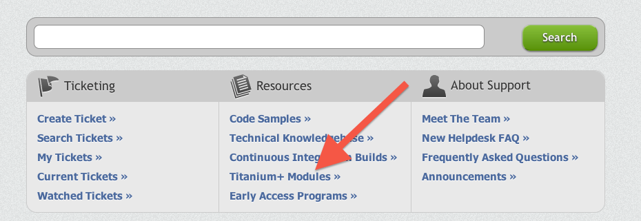

# Obtaining Modules

## Objective

In this section, you will learn about the various locations to which official and community-contributed modules are published.

## Contents

### Appcelerator Marketplace

The Appcelerator Marketplace was one location where Titanium modules were distributed. The Appcelerator Marketplace is no longer used.

::: tip 💡 Hint
Titanium artifacts are no longer available through the Marketplace in the **AMPLIFY Platform**. If you need access to a Titanium artifact, or if you have questions about artifacts that you have purchased through the Appcelerator Marketplace previously, please contact Axway at [marketplace-admin@axway.com](https://axway.jiveon.com/external-link.jspa?url=https%3A%2F%2Feur01.safelinks.protection.outlook.com%2F%3Furl%3Dhttp%253A%252F%252Fclick.axway.com%252FZDfeb0HT30000y04P30jVTh%26data%3D02%257C01%257Cbvandenberg%2540axway.com%257C3264da447c264d49144908d858c7b56f%257C300f59df78e6436f9b27b64973e34f7d%257C1%257C0%257C637356962044056122%26sdata%3DILggs9f%252Baq7cHg3Ve0DGccGw97Fd91ciBPynYEFX8SI%253D%26reserved%3D0).
:::

### Appcelerator Enterprise Extensions

Various modules are made available to Appcelerator subscribers. Plans vary, of course. At the time of this writing, the Enterprise Extensions modules are available with all paid subscriptions. These modules are published on the Support site available to Enterprise subscribers. Some modules require an on-going subscription. Titanium will check your eligibility to use the module at build time and will display an error message in your app if your license has expired.

At the time of this writing, these are some of the modules included in the TiPlus set:

* InAppBilling (for Android)

* StoreKit (for iOS in-app billing)

* Barcode (for iOS and Android)

* Compression (iOS and Android)

* OpenGL (iOS)

* AirPrint (iOS)

### Open-source Appcelerator modules

Appcelerator publishes a few modules on its GitHub account. Those modules are open source (check the individual licenses for full details) and are provided as-is without official support. You'll find these modules at [https://github.com/tidev/titanium\_modules](https://github.com/tidev/titanium_modules)

### Community-contributed modules

Various community members publish modules, generally via their blogs or GitHub accounts. Support and quality varies by developer. None of these are official Appcelerator modules, nor are they supported by Appcelerator. Contact the individual developers. A few "high-visibility" modules and developers include:

* gitTio! (maintained by Fokke Zandbergen[) lists all Titanium modules and Alloy widgets available on Github at](http://fokkezb.nl/) [http://gitt.io/](http://gitt.io/)

* ClearlyInnovative (Aaron Saunders) has published various modules at [http://www.clearlyinnovative.com/](http://www.clearlyinnovative.com/)

* Ben Bahrenburg publishes various iOS modules at [http://bencoding.com/](http://bencoding.com/) or [https://github.com/benbahrenburg](https://github.com/benbahrenburg)

* QuickTiGame2d is a 2D game engine module for Titanium [http://code.google.com/p/quicktigame2d/](http://code.google.com/p/quicktigame2d/)

(Apologies to the many high-caliber developers and projects left off this very short list!)

### Mobile Web modules

Mobile Web apps can use JavaScript modules (ones that don't include any native code, since the entire app runs within a browser instance). At the time of this writing, Mobile Web is too new to have inspired a selection of modules. We'll update this guide once good examples of Mobile Web-compatible modules become available.

## Summary

In this section, you learned that there are many ways to obtain modules. Some modules are free and open source. Others are available for purchase or to subscribers.
