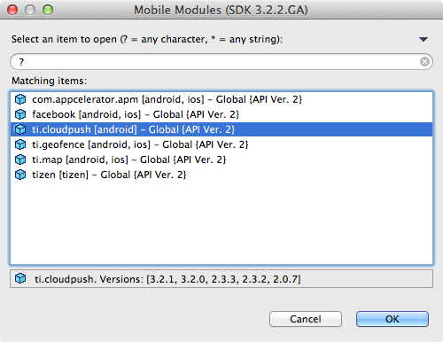

# Using a Module

## Objective

You can install a module so that it is available to a single project, or all projects you create. Then you will see how to use a module within your project.

### Installing modules

You can install a module for a single project. Once you've installed the module, you then configure it for use in your project (see [Configuring your app to use a module](#configuring-your-app-to-use-a-module)).

**To install a module**:

1. copy the module ZIP in to your app root folder
2. add the module into the `<modules>` section of your tiapp.xml file
3. build your project. The ZIP will be extracted and added into the correct folders.

#### Module install locations

When you install a module that's available to all projects, the module is installed to one of the following locations, depending on your platform.

| Operating System | Local Path |
| --- | --- |
| macOS | `~/Library/Application Support/Titanium` |
| Windows | `%ProgramData%\Titanium\mobilesdk\win32` |

::: tip 💡 Hint
On macOS, the `~/Library` folder is hidden by default. To permanently show it, run the following command from a terminal:

`chflags nohidden ~/Library/`

To open it once, run the following command from a terminal:

`open ~/Library`
:::

### Configuring your app to use a module

Once you have installed the module, you must configure your application to use it. This involves two steps:

* Add the module as a dependency in your application's `tiapp.xml` file.

* Call the `require()` method in your JavaScript code to load the module

#### Updating the tiapp.xml file

You can update your application's tiapp.xml file visually, or manually in a text editor.

**To add a module to your project**:

1. Open your project and double-click its tiapp.xml file.

2. Click the **Overview** tab in the bottom-left of the Editor window.

3. In the Modules section, click the green add ( **+** ) button.

    
4. Select the module you want to add and click **OK**.

    

    Note the version numbers listed at the bottom of the dialog. See [Selecting a module version](#selecting-a-module-version).

5. Save your changes to tiapp.xml.

To manually add a module to your project's tiapp.xml file, modify the `<modules/>` tag in the `<ti:app>` node as follows:

```xml
<!-- $MODULE_VERSION should be the same as "version" in the module manifest and directory number -->
<!-- $MODULE_PLATFORM should be the same as "platform" in the module manifest and directory number. One of "ios" or "android" -->

<modules>
  <module version="$MODULE_VERSION" platform="$MODULE_PLATFORM">$MODULE_ID</module>
  <!-- For example, if we were adding the Ti.Map module -->
  <module version="3.0.2" platform="ios">ti.map</module>
</modules>
```

#### Selecting a module version

A installed module may include one or more versions that your application can use, as well as versions for production, deployment and testing. By default the latest version of a module will be selected.

**To select a specific module version**:

1. In the Modules section of tiapp.xml, double-click on the module to opens the **Module Properties** dialog.

2. For each platform, select the version of the module you want to use.

3. Click the arrow next to the platform to expand it to select to use the module for specific build types.

    
4. Click **OK**.

5. Save tiapp.xml.

#### Using require() to load the module in the app's code in ES5

Within your app's JavaScript files, you'll instantiate the module via the `require()` function:

```javascript
var Module = require('$MODULE_ID');
// For example, to load the Map module:
var Map = require('ti.map');
```

#### Using import() to load the module in the app's code in ES6+

In addition to the ES5-styled `require()` function, you can also import modules using the `import()` statement:

```
import Module from '$MODULE_ID'
// For example, to load the Map module:
import Map from 'ti.map'
```

Finally, you'll use the module's object, properties, and methods to enable its features and functionality. Each module should include documentation and a sample app that demonstrates the basic use of the module. That information would be a great place to start with learning how to use a specific module.

## Example Module Use

The following section illustrates how you would use one of the modules included in the Titanium Plus set.

For this example we will be downloading the [AdMob](https://github.com/appcelerator-modules/ti.admob) module for iOS available on GitHub. While the example covers an iOS use case, the same general steps apply to an Android module. The ZIP file containing the module distribution can be downloaded [here](https://github.com/tidev/ti.admob/releases).

1. Install the module as described [above](#installing-modules).

2. Require the module in your project with the following code:

    ```javascript
    // ES5
    var Admob = require('ti.admob');

    // ES6+
    // import Admob from 'ti.admob';
    ```

3. You can now call methods on the admob singleton object:

    ```javascript
    var adview = Admob.createView({
        top: 0,
        testing: true,
        adBackgroundColor: 'black',
        primaryTextColor: 'blue',
        secondaryTextColor: 'green',
        publisherId: '<< your ID>>' // Replace this string with your own API key!
    });
    win.add(adview);
    ```

### Troubleshooting

#### Requested module could not be found

If you receive an error saying: "Requested module not found." Check the name and version number of the module in the `tiapp.xml` file. Make sure that the version of the module is installed either locally or globally. You can also remove the `version` attribute from the `module` element to use the most recent version of the module.

## Summary

In this section, you learned that you can install a module for use by a single project or by all projects that you develop on a computer. Once installed, you have to modify your app's tiapp.xml file to support the module. Then, you must require the module into your app's code before you can implement its functionality.
