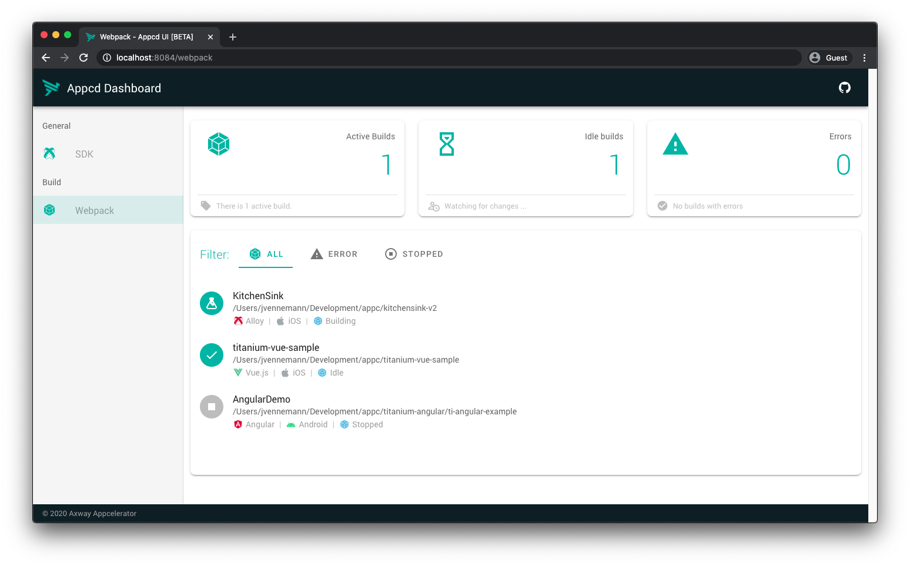

# Webpack Guide

Starting with Titanium 9.1.0, you can use [webpack](https://webpack.js.org/) as an alternative build pipeline for all your project's assets.

This guide walks you through the steps that are necessary to prepare your Titanium environment for development using webpack and quickly get started with the new webpack project template.

## Introduction

Using weback in Titanium enables a lot of great improvements, including:

* Significantly faster build times for both clean and incremental builds, especially for larger projects.

* Easily use your favorite modules from NPM. Just install them into the project root.

* Pre-configured for your Titanium project, no need to deal with webpack configuration files to get up and running.

* Highly customizable via a simple plugin API, which allows you to hook into the webpack configuration with [webpack-chain](https://github.com/neutrinojs/webpack-chain). Add new loaders and/or plugins to introduce new capabilites into your project.

* Web UI to view build results and analyze your app bundle assets.

All webpack builds in Titanium are managed via `@appcd/plugin-webpack`, a plugin for the [Appcelerator Daemon](https://github.com/tidev/appc-daemon) (or appcd for short), which starts them on demand and also makes sure to stop them after a certain amount of inactivity. This ensures fast build times while you are working on your project and automatically saves system resources when you stop and don't need the webpack build anymore.

## Prerequisites

Since webpack support is implemented as a plugin for appcd you need have it installed to use webpack with Titanium. For `appc` CLI versions 8.0.0+, appcd comes bundled with the CLI so you will already have it. If you use the `ti` CLI you need to install appcd globally on your machine.

**Install appcd**

```bash
npm i -g appcd
```

After appcd is installed you need to add the webpack plugin by running the following:

**Install @appcd/plugin-webpack**

```bash
npm i -g @appcd/plugin-webpack
```

Appcd will automatically detect the new plugin and start it on demand. Now that all the necessary tooling for webpack is installed you can create your first Titanium project with webpack support enabled.

::: tip 💡 Want to migrate an existing project?
Already have an existing Titanium project and want to opt-in to using webpack? No problem, just follow our [migration guide](https://github.com/tidev/appcd-plugin-webpack/blob/develop/migration.md#webpack-migration-guide).
:::

## Getting Started

There is a new template called `webpack-default` available in SDK 9.1.0+ which can be specified using the `--template` flag when you create a new Titanium project.

**Create new Titanium project with webpack**

```bash
# appc-cli
appc new --template webpack-default

# ti-cli
ti create --template webpack-default
```

This will create a new Titanium project and automatically install all required project dependencies. After this you can start working on your Titanium project (almost) as usual.

::: tip 💡 Alloy CLI
If you use the Alloy CLI to turn a new or existing Titanium classic project into an Alloy project you need to specify the webpack template here as well. Instead of `alloy new`, run `alloy new . webpack-default` inside the project folder.
:::

## Working with Webpack

When working with webpack in your Titanium project a few things are handled differently compared to a standard Titanium project. This section will go through the important changes and explain how things work with webpack. For more in-depth details visit the [code migration](https://github.com/tidev/appcd-plugin-webpack/blob/develop/migration.md#code-migration) section in our migration guide for existing projects.

### Module Resolution

Modules are resolved at build time on your local machine, not from the root directory of your final app bundle. This is the most notable difference to non-webpack builds, where all requires will be resolved at runtime.

Most of the time you won't notice this difference since webpack is configured to resolve modules just like it would be done in a standard Titanium project. However, there is one exception which is when you use absolute paths. Using absolute paths you can quickly reference files from the source root directory of your app. This is especially useful if you are deep inside a nested folder structure so you don't have to type `../` over and over again. But since webpack resolves modules at build time it will start looking at the root directory on your local machine, which obviously is not what you want. To solve this issue u se the `@` [alias](#aliases) instead to refer to the source directory of your project.

**Absolute module path**

```
// without webpack
// import '/utils/file';

// with webpack
import '@/utils/file';
```

### Aliases

To make your life easier when dealing with relative imports throughout your project there is a pre-defined alias.

* `@`: project source directory

    * Classic: `src`

    * Alloy: `app/lib`

    * Vue.js: `src`

    * Angular: `src`

### NPM Dependencies

You can install NPM modules directly into your project root directory and require them in your Titanium code. Webpack takes care of the rest and makes sure to properly resolve and bundle them into your app.

### Platform specific files

To use different platform specific files for a module just add the platform name between the actual file name and the file extension.

```javascript
// index.js
import { msg } from '@/utils';

// utils.ios.js
export const msg = 'This is used on iOS'

// utils.android.js
export const msg = 'This is used on Android'
```

### Web UI

The webpack build pipeline comes with a small web ui that lets you view general information, stats and all output of a webpack build task for each Titanium project. By default it is accessible at [http://localhost:1732/webpack/latest/web,](http://localhost:1732/webpack/latest/web,) which will redirect to the actual web ui server.



### Global Settings

You can change the global configuration settings for the webpack plugin in `~/.appcelerator/appcd/config.json` . The timeout for build tasks and options for the web ui server can be changed via these settings. Have a look at the default [`config.js`](https://github.com/tidev/appcd-plugin-webpack/blob/develop/config/config.js) file for detailed descriptions.

**config.json**

```json
{
  webpack: {
    inactivityTimeout: 600000,
    ui: {
      port: 8084
    }
  }
}
```

## Project Plugins

Titanium comes with pre-defined webpack configurations to quickly get you started . The plugin system lets you hook into the webpack build process and modify it to fit your needs of every Titanium project and add new features. Currently a plugin can:

* change the webpack config to add new loaders / plugins

* watch files for changes and automatically restart the webpack build

### Introduction

A plugin is an npm package or a local file that can add additional features to your project. You can author a new plugin by simply creating a file that exports a function. This function receives a plugin API object and an options object containing information about the current environment, build settings and other options.

The following is an example how you can register a project local plugin:

```javascript
// <project-root>/my-plugin.js

module.exports = (api, options) => {
  // your plugin code goes here
};
```

Local plugins need to be activated in the project's `package.json` so the webpack build knows about them :

```
{
  "appcdWebpackPlugins": [
    "my-plugin.js"
  ]
}
```

To easily share plugins they can be published as a module on NPM. Plugins installed from NPM will automatically be detected and activated if they follow the naming scheme for webpack plugins in Titanium.

### Name convention

For a plugin to be usable in a Titanium webpack project, it must follow the name convention `appcd-webpack` `-plugin-<name>` or `@scope/appcd-webpack-plugin-<name>` .

Official plugins use an alternative shortened name convention of `@appcd/webpack-plugin-<name>` or `@titanium-sdk/webpack-plugin-<name>`.

### Examples

The following examples demonstrate how to use the `chainWebpack` function to modify the webpack configuration. Also check out the extensive list of [examples from webpack-chain](https://github.com/neutrinojs/webpack-chain#getting-started) to see what else you can do with the `config` object.

#### Add Alias

```javascript
module.exports = (api, options) => {
  api.chainWebpack(config => {
    config.resolve
      .alias
        .set('~utils', api.resolve('app', 'src', 'utils'));
  });
}
```

#### Add loader

```javascript
module.exports = (api, options) => {
  api.chainWebpack(config => {
    config.module
      .rule('txt')
        .test(/\.txt$/i)
        .use('file-loader')
          .loader('file-loader')
          .options({
            name: '[path][name].[ext]'
          });
  });
}
```

#### Delete plugin

Delete a named plugin from the configuration. Refer to the bundled [configuration files](https://github.com/tidev/appcd-plugin-webpack/blob/develop/src/config) as well as the readme and code of the `@titanium-sdk/webpack-plugin-*` packages to see what named plugins are configured.

```javascript
module.exports = (api, options) => {
  api.chainWebpack(config => {
    config.plugins.delete('copy-assets');
  });
}
```

### Official Plugins

We maintain a couple of official plugins which provide the core configuration for Titanium apps.

* [@titanium-sdk/webpack-plugin-alloy](https://github.com/tidev/webpack-plugin-alloy)

* [@titanium-sdk/webpack-plugin-classic](https://github.com/tidev/webpack-plugin-classic)

* [@titanium-sdk/webpack-plugin-angular](https://github.com/tidev/webpack-plugin-angular)

* [@titanium-sdk/webpack-plugin-babel](https://github.com/tidev/webpack-plugin-babel)

* [@titanium-sdk/webpack-plugin-typescript](https://github.com/tidev/webpack-plugin-typescript)

## FAQ

::: tip 💡 Hint
For simplicity all CLI commands for the Appcelerator Daemon in the following section use the format of `appcd <command>`. However, this will only work when you have installed appcd globally. If you use the `appc` CLI, you will have to proxy all command through it by prefixing them with `appc`. For example, `appcd stop` would have to be run as `appc appcd stop`.
:::

### The webpack build is stuck, how can i restart it?

Building the app with the `--force` flag will restart the whole webpack build process for the current project. You can also start/stop the build via the Web UI in the detail view for a specific build.

If nothing else helps, try stopping the daemon with `appcd stop`, which will automatically stop all currently active webpack builds as well.

### How can I view log output?

All output of the current webpack build will be streamed from the background task directly to the console when you build your app. You can also see the complete console output of all previous builds in the detail view of a build task in the web ui.

If you are interested in the log output from the webpack plugin itself and not from a single build, you can also stream the log output from the daemon with `appcd logcat`. To display messages from the webpack plugin only you can filter them using `appcd logcat "*webpack*"`.

### The build errors with "Not found", what should i do now?

Make sure that you have the webpack plugin installed and loaded. You can check the status of all currently installed plugins with `appcd status`.

If the webpack plugin shows up in that list but you still see the error, you may have to restart the Daemon. There is a known bug in the configuration system which can prevent the plugin from loading the first time after it was installed. In that case simply stop the daemon with `appcd stop` and build your app again.

### How long will the webpack build run in the background?

To save system resources `@appcd/plugin-webpack` has a built-in timeout to automatically stop unused webpack build tasks. By default it will stop a webpack build if it didn't receive any activity for more than 10 minutes. After the last webpack build stopped, and the `@appcd/plugin-webpack` didn't receive any new requests for webpack build tasks for another 10 minutes, the plugin itself will also be deactivated by appcd.

## Known Issues

* Hyperloop is not yet compatible with Titanium projects that use webpack

* Alloy.jmk makefiles are not supported and will be ignored
