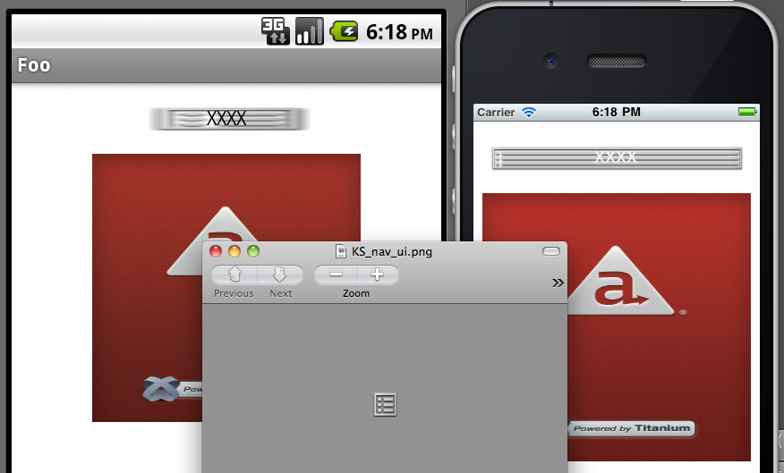

# Images and ImageView APIs

## Introduction

In this chapter, we'll dig a bit deeper into the ways you can add local and remote images to your apps as either background images or ImageViews.

You can display images in your apps in at least two ways: as instances of the ImageView object or as the background of another component. We'll look at both techniques as well as the options associated with each.

## Background Images

You can specify an image be used as the background of another component, such as a view or button. By default, image will be scaled (stretched or squeezed) to fit the dimensions of the component. Any other content of that component will appear in front of the background image. For example, button text will appear over the top of the background.

When the background image is larger than the component, it will be squeezed to fit the component's dimensions. Both platforms handle that in essentially the same way, as you can see in the red images in the graphic below. But iOS and Android handle background images differently when they're smaller than the component. Look carefully at the following image. Overlaid on top, you see the original small PNG image that is used as the background if the view with the four Xs. In that view, on Android the background image is stretched to fit the width of the component. On iOS, a small portion of the left and right of the image remain un-stretched while the remainder is stretched to fill the width.



On iOS, you can control this "small portion" that remains unstretched. You do so by setting the `backgroundLeftCap` property. It works like this: End caps specify the portion of an image that should not be resized when an image is stretched. Resizing occurs only in the middle of the button, in the region between the end caps. The end caps themselves keep their original size and appearance. The value of this property specifies the size of the left end cap. The middle (stretchable) portion is assumed to be 1 pixel wide. The right end cap is therefore computed by adding the size of the left end cap and the middle portion together and then subtracting that value from the width of the image.

You can control vertical stretching in this way with the `backgroundTopCap` property. Again, that works on only iOS.

Android supports remote images as background images. On Android, you can set the `backgroundImage` property equal to a URL and the image will be displayed (assuming a network connection is available). That's not the case on iOS.

## ImageView

The `ImageView` is Titanium's component for representing an image file. You create one with the `Ti.UI.createImageView()` method. With this component, you have full control over dimensions, positioning, opacity, and more. The `ImageView` has a number of interesting methods, such as `show()` and `hide()`, `start()` and `stop()`, and `toImage()`.

```javascript
var win = Ti.UI.createWindow({backgroundColor: 'white'});
var myImage = Ti.UI.createImageView({
  width: 100,
  height: 100
  image: 'foo.png' /* accepts URL, local path, or Ti.Filesystem.File */
});
/*
// this would work:
myImage.image = 'http://example.com/foo.png'
// set myImage.defaultImage = 'localFoo.png' to show an image while the remote one is loading

// as would
myImage.image = Ti.Filesystem.getFile(Ti.Filesystem.resourcesDirectory,'foo.png');
*/
win.add(myImage);
win.open();
```

If you specify a width and/or height property on the image, the image will be scaled to fit according to these considerations:

* If the `ImageView`'s `height` and `width` are specified, the images will be scaled unproportionally to fit the dimensions. The graphic's aspect ratio will NOT be maintained.

* If either the `ImageView`'s `height` or `width` are specified (not both), the image will be scaled to fit the specified dimension. The graphic's aspect ratio will be maintained.

### Flipbook animations

You can display flipbook-style animations with the `ImageView` by assigning an array of images to the `images` property.

```javascript
// from the Kitchen Sink, examples/image_view_animated.js

var images = [];
for (var i = 1; i < 18; i++) {
  images.push('../images/campFire' + ((i < 10) ? '0' + i:i)+'.gif');
}

var imageView = Titanium.UI.createImageView({
  images: images,
  duration: 100, // in milliseconds, the time before next frame is shown
  repeatCount: 0,  // 0 means animation repeats indefinitely, use > 1 to control repeat count
  top: 0
});
// imageView.stop() would stop the animation
// imageView.start() would start the animation again
```

### Density-specific images

Since the size and resolution of displays varies between devices, you may want to include density-specific images. Each platform has its own way to support density-specific images.

#### Android Platform

For Android, you can create density-specific image based on the device's resolution, screen sizes and orientation. To support these screen variations, Titanium uses a set of directories:


Put your resolution-specific files in the appropriate directories. Then, in code, simply refer to the image via the base name, as shown in the previous example. Titanium will take care of pulling in the correct image for the device in use. Use the sample images in those folders as a starting point for the correct size and resolution when creating your graphics.

If you don't want to worry about creating graphics for these various resolutions, delete the resolution-specific folders. If you don't, Android will use the stock images Titanium supplies, which might mean users will see the stock splash screen instead of yours.

For more details, see [Using density-specific resources on Android](/guide/Titanium_SDK/Titanium_SDK_How-tos/User_Interface_Deep_Dives/Android_UI_Components_and_Conventions/Using_density-specific_resources_on_Android/).

#### iOS Platform

iOS devices have different screen densities. Most devices either have a non-retina or retina display. The only exception is the iPhone 6 Plus, which has a higher screen density. You may also add the `~iphone` and `~ipad` suffixes for iPhone- and iPad-specific images, respectively. To support multiple screen densities, add the following suffixes to the image name:

| Suffix | Device | Example |
| --- | --- | --- |
| No suffix | Devices with non-retina displays (iPad 2 and first generation iPad mini) | foo.png |
| @2x | Devices with retina displays (most iPhones and iPads) | foo@2x.png |
| @3x | iPhone 6 Plus | foo@3x.png |
| ~iphone | iPhone-specific image | foo~iphone.png |
| ~ipad | iPad-specific image | foo~ipad.png |

To use both the display and device suffixes, add the display suffix first, followed by the device suffix, for example, `foo@2x~iphone.png`.

In your code, reference the image without the suffix:

```javascript
var img = Ti.UI.createImageView({
  image: 'foo.png'
  /* logo@2x.png will be used automatically if it exists with retina devices */
});
```

On iOS, you can retrieve density-specific images from a remote URL as well. You will have to use `Ti.Platform.displayCaps.logicalDensityFactor` to build the URL to fetch the right image for the device. Then add the `hires=true` property to your `ImageView` to specify that the remote URL is a high-resolution image. Optionally, Set the `img.defaultImage` property equal to a _local_ image and it will be displayed while your remote image is being downloaded.

::: tip 💡 Asset Catalog
Starting with Release 5.1.0, PNG and JPEG images following this naming convention will be added to an Asset Catalog to support App Thinning. When a user installs the application to their device, only the relevant images will be included. Note that you will not be able to access images added to the Asset Catalog from the filesystem, that is, you cannot use the `Ti.Filesystem` APIs or equivalent to access the files with a URL or path.
:::

#### Windows Platform

For the Windows Platform, add the scale qualifier to the filename. Place the qualifier in between the filename and extension, for example, `foo.scale-100.png`.

Use the qualifiers below to support devices with different DPIs or screen resolutions. The scaling is based on the logical density factor returned by the device. The Windows Phone DPI column is an approximate value.

| Qualifier | Logical Density Factor | Windows Phone DPI | Windows Store Resolution | Notes |
| --- | --- | --- | --- | --- |
| scale-100 | 1.0 | Up to ~96 | At least 1024x768 |  |
| scale-140 | 1.4 | Up to ~134 (WVGA emulator) | At least 1440x1080 |  |
| scale-180 | 1.8 | Up to ~172 (720p emulator) | At least 1920x1440 |  |
| scale-240 | 2.4 | Up to ~230 (WXGA and 1080p emulators) | N/A | Windows Phone OS 8.1 only |

For more details, see [Windows Asset Qualifiers](/guide/Titanium_SDK/Titanium_SDK_How-tos/User_Interface_Deep_Dives/Windows_UI_Components_and_Conventions/Windows_Asset_Qualifiers/).

::: danger ❗️ Warning
Support for Windows 8.1 and Windows Phone SDKs has been deprecated as of SDK 6.3.0.GA and has be removed in SDK 7.0.0.GA.
:::

In order to grant access to pictures library for Windows Phone, you need to provide appropriate Capabilities in your `tiapp.xml.` Windows Phone users are prompted to grant or deny permission when your application attempt to use it.

##### Grant access to pictures library

```xml
<ti:app>
  ...
  <windows>
    ...
    <Capabilities>
        <Capability Name="picturesLibrary" />
    </Capabilities>
    ...
  </windows>
  ...
</ti:app>
```

For more information about audio configuration in `tiapp.xml`, see [Windows-specific](/guide/Titanium_SDK/Titanium_SDK_Guide/Appendices/tiapp.xml_and_timodule.xml_Reference/#windows-specific) section in [tiapp.xml and timodule.xml Reference](/guide/Titanium_SDK/Titanium_SDK_Guide/Appendices/tiapp.xml_and_timodule.xml_Reference/).

### References

* API Docs - [ImageView object](http://developer.appcelerator.com/apidoc/mobile/latest/Titanium.UI.ImageView-object)

## Summary

In this chapter, you learned how to add local and remote images to your apps. You saw that you can display images as instances of the ImageView object or as the background of another component. You also learned how to handle density-specific images on iOS and Android.
